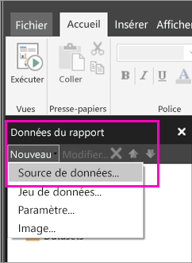

# Créer une source de données incorporée pour rapports paginés dans le service Power BI

Dans cet article, vous apprendrez à créer et à modifier une source de données incorporée dans un rapport paginé dans le service Power BI. Vous définissez une source de données incorporée dans un rapport unique et l’utilisez seulement dans ce rapport. Actuellement, les rapports paginés publiés sur le service Power BI requièrent des jeux de données incorporés et des sources de données incorporées, et peuvent se connecter à ces sources de données :

- Azure SQL Database et Data Warehouse
- SQL Server
- SQL Server Analysis Services
- Oracle 
- Teradata 

Pour les sources de données suivantes, utilisez l’option [Connexion SQL Server Analysis Services](service-premium-connect-tools.md) :

- Azure Analysis Services
- Jeux de données Power BI Premium

Les rapports paginés se connectent aux sources de données locales par le biais d’une [passerelle Power BI](service-gateway-getting-started.md). Vous configurez la passerelle après avoir publié le rapport sur le service Power BI.

Pour obtenir des informations plus détaillées, consultez [Données de rapport dans le Générateur de rapports Power BI](report-builder-data.md).

## Créer une source de données incorporée
  
1. Ouvrez le Générateur de rapports Power BI.

1. Dans la barre d’outils du volet des données du rapport, sélectionnez **Nouveau** > **Source de données**. La boîte de dialogue **Propriétés de la source de données** s’ouvre.

    
  
2.  Dans la zone de texte **Nom**, entrez le nom de la source de données ou acceptez la valeur par défaut.  
  
3.  Sélectionnez **Utiliser une connexion incorporée dans mon rapport**.  
  
1.  Dans la liste **Sélectionner un type de connexion**, sélectionnez un type de source de données. 

1.  Spécifiez une chaîne de connexion en utilisant l’une des méthodes suivantes :  
  
    -   Entrez la chaîne de connexion directement dans la zone de texte **Chaîne de connexion**. 
  
    -   Sélectionnez le bouton de l’expression (**fx)** pour créer une expression qui évalue une chaîne de connexion. Dans la boîte de dialogue **Expression**, entrez l’expression dans le volet Expression. Sélectionnez **OK**. 
  
    -   Sélectionnez **Build** pour ouvrir la boîte de dialogue **Propriétés de connexion** pour la source de données que vous avez choisie à l’étape 2.  
  
        Renseignez les champs de la boîte de dialogue **Propriétés de connexion** pour le type de source de données. Les propriétés de connexion incluent le type de source de données, le nom de la source de données et les informations d’identification à utiliser. Une fois que vous spécifiez des valeurs dans cette boîte de dialogue, sélectionnez **Tester la connexion** pour vérifier que la source de données est disponible et que les informations d’identification que vous avez spécifiées sont correctes.  
  
4.  Sélectionnez **Informations d'identification**.  
  
     Spécifiez les informations d’identification à utiliser pour cette source de données. Le propriétaire de la source de données choisit le type d’informations d’identification pris en charge. Pour plus d’informations, consultez [Spécifier les informations d’identification et les informations de connexion pour les sources de données du rapport](https://docs.microsoft.com/sql/reporting-services/report-data/specify-credential-and-connection-information-for-report-data-sources).
  
5.  Sélectionnez **OK**.  
  
     La source de données apparaît dans le volet des données de rapport.  

## Étapes suivantes

- [Créer un jeu de données incorporé pour un rapport paginé dans le service Power BI](paginated-reports-create-embedded-dataset.md)
- [Présentation des rapports paginés dans Power BI Premium](paginated-reports-report-builder-power-bi.md)
