# Tutoriel : Créer un rapport paginé et le charger dans le service Power BI (préversion)

Dans ce tutoriel, vous vous connectez à un exemple de base de données SQL Azure. Vous utilisez un assistant dans le Générateur de rapports pour créer un rapport paginé avec un tableau réparti sur plusieurs pages. Vous chargez ensuite le rapport paginé dans un espace de travail d’une capacité Premium dans le service Power BI. Les rapports paginés disponibles dans le service Power BI sont actuellement en préversion.

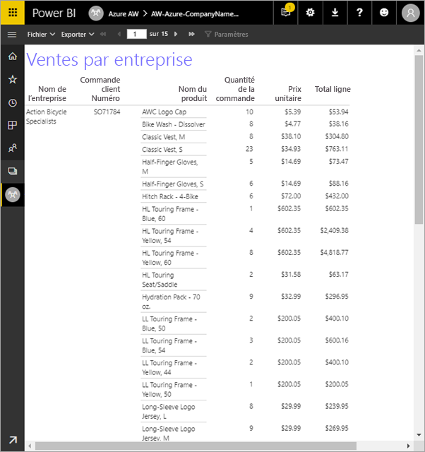

Voici les étapes effectuées dans le cadre de ce tutoriel :

> [!div class="checklist"]
> * Créer un exemple de base de données Azure.
> * Créer une matrice dans le Générateur de rapports à l’aide d’un assistant.
> * Mettre en forme le rapport avec un titre, des numéros de page et des en-têtes de colonne sur chaque page.
> * Mettre en forme la devise.
> * Charger le rapport dans le service Power BI.

Si vous n’avez pas d’abonnement Azure, créez un [compte gratuit](https://azure.microsoft.com/free/?WT.mc_id=A261C142F) avant de commencer.
 
## Conditions préalables  

Voici les conditions préalables pour la création du rapport paginé :

- Installer le [Générateur de rapports à partir du centre de téléchargement Microsoft](http://go.microsoft.com/fwlink/?LinkID=734968). 

- Suivre le Guide de démarrage rapide [Créer un exemple de base de données SQL Azure dans le portail Azure](https://docs.microsoft.com/azure/sql-database/sql-database-get-started-portal). Copier et enregistrer la valeur dans la zone **Nom du serveur** de l’onglet **Vue d’ensemble**. Mémorisez le nom d’utilisateur et le mot de passe créés dans Azure.

Voici les conditions préalables pour le chargement de votre rapport paginé dans le service Power BI :

- Vous avez besoin d’une [licence Power BI Pro](service-admin-power-bi-pro-in-your-organization.md).
- Vous avez besoin d’un espace de travail d’application sur le service dans une [capacité Power BI Premium](service-premium.md). Il affiche une icône en forme de losange  en regard du nom de l’espace de travail.

## Créer la matrice avec un assistant
  
1.  Démarrez le Générateur de rapports sur votre ordinateur.  
  
     La boîte de dialogue **Mise en route** s’ouvre.  
  
     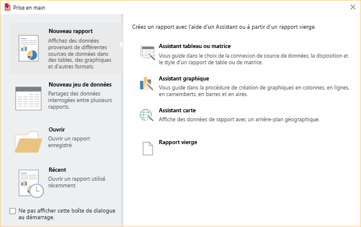
  
1.  Dans le volet gauche, vérifiez que l’option **Nouveau rapport** est sélectionnée, puis dans le volet droit, sélectionnez **Assistant Tableau ou matrice**.  
  
4.  Dans la page **Choisir un jeu de données**, sélectionnez **Créer un jeu de données** > **Suivant**.  

    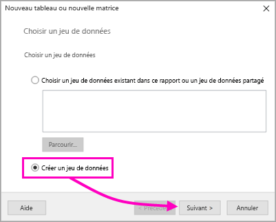
  
5.  Dans la page **Choisir une connexion à une source de données**, sélectionnez **Nouveau**. 

    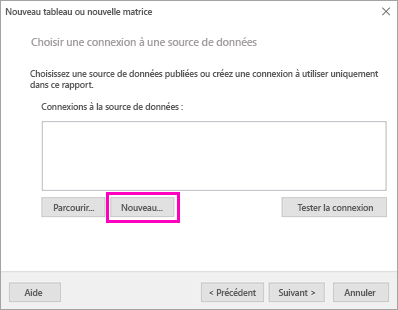
  
     La boîte de dialogue **Propriétés de la source de données** s’ouvre.  
  
6.  Vous pouvez nommer une source de données comme vous le souhaitez, en utilisant des caractères et des traits de soulignement. Pour ce tutoriel, dans la zone **Nom** , tapez **MyAzureDataSource**.  
  
7.  Dans la zone **Sélectionner un type de connexion**, sélectionnez **Microsoft Azure SQL Database**.  
  
8.  Sélectionnez **Build** en regard de la zone **Chaîne de connexion**. 

    

9. **Dans Azure :** Accédez au portail Azure, puis sélectionnez **Bases de données SQL**.

1. Sélectionnez la base de données SQL Azure que vous avez créée dans le Guide de démarrage rapide « Créer un exemple de base de données SQL Azure dans le portail Azure » dans la section **Conditions préalables** de cet article.

1. Dans l’onglet **Vue d’ensemble**, copiez la valeur dans la zone **Nom du serveur**.

2. **Dans le Générateur de rapports** : Dans la boîte de dialogue **Propriétés de connexion**, sous **Nom du serveur**, collez le nom du serveur que vous avez copié. 

1. Pour **Ouvrez une session sur le serveur**, assurez-vous que l’option **Utiliser l'authentification SQL Server** est sélectionnée, puis tapez le nom d’utilisateur et le mot de passe créés dans Azure pour l’exemple de base de données.

1. Sous **Se connecter à une base de données**, cliquez sur la flèche déroulante, puis sélectionnez le nom de la base de données que vous avez créé dans Azure.
 
    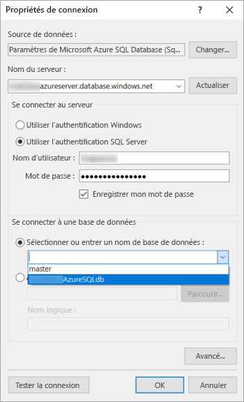

1. Sélectionnez **Tester la connexion**. Le message **Résultats du test** affiche **Le test de la connexion a réussi**.

1. Sélectionnez **OK** > **OK**. 

   Dans la zone **Chaîne de connexion**, le Générateur de rapports affiche à présent la chaîne de connexion que vous venez de créer. 

    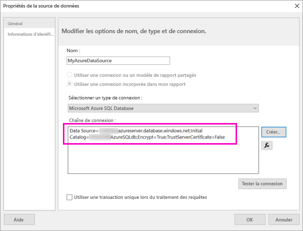

1. Sélectionnez **OK**.
  
9. Dans la page **Choisir une connexion à une source de données**, vous voyez le message « (dans ce rapport) » sous la connexion de la source de données que vous venez de créer. Sélectionnez cette source de données > **Suivant**.  

    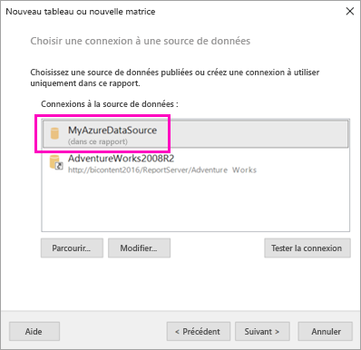

10. Tapez le même nom d’utilisateur et le même mot de passe dans la zone. 
  
10. Dans la page **Créer une requête**, développez SalesLT, développez Tables, puis sélectionnez ces tables :

    - Adresse
    - Customer
    - Produit
    - ProductCategory
    - SalesOrderDetail
    - SalesOrderHeader

     Étant donné que les options **Relations** > **Détection automatique** sont sélectionnées, le Générateur de rapports détecte les relations entre ces tables. 
    
    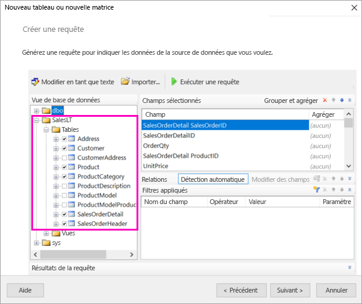
 
1.  Sélectionnez **Exécuter la requête**. Le Générateur de rapports affiche les **résultats de la requête**. 
 
     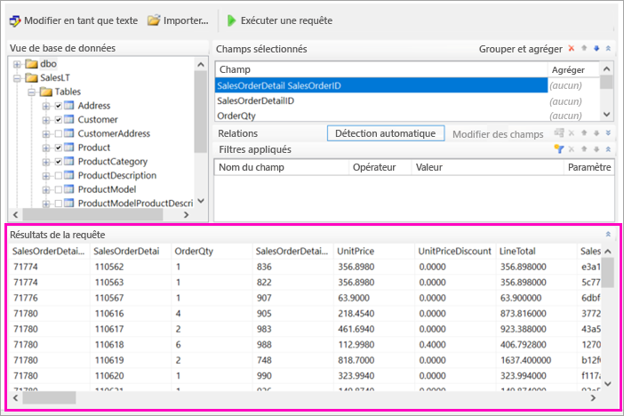

18. Sélectionnez **Suivant**. 

19. Dans la page **Choisir un jeu de données**, choisissez le jeu de données que vous venez de créer > **Suivant**.

    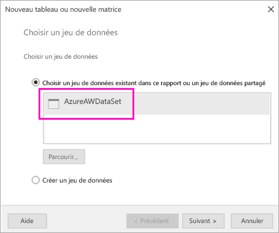

1. Dans la page **Organiser les champs**, faites glisser ces champs de la zone **Champs disponibles** vers la zone **Groupes de lignes** :

    - CompanyName
    - SalesOrderNumber
    - Product_Name

1. Faites glisser ces champs de la zone **Champs disponibles** vers la zone **Valeurs** :

    - OrderQty
    - UnitPrice
    - LineTotal

    Le Générateur de rapports a automatiquement calculé les sommes dans le champ **Valeurs**.

    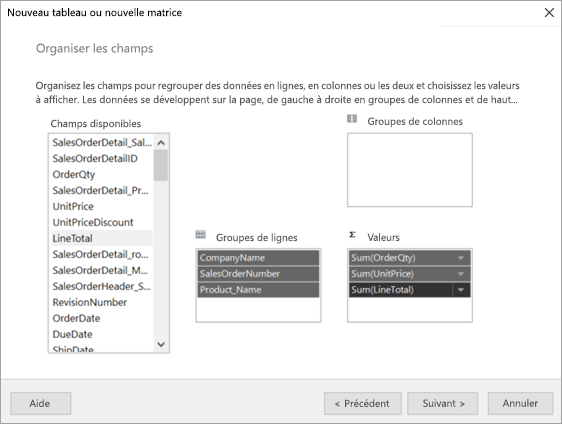

24. Dans la page **Choisir la disposition**, conservez tous les paramètres par défaut, mais désactivez **Développer/Réduire les groupes**. En règle générale, la fonctionnalité Développer/Réduire les groupes est très utile, mais cette fois vous voulez que la table couvre plusieurs pages.

1. Sélectionnez **Suivant** > **Terminer**. La table apparaît sur le canevas de conception.
 
## Ce que vous avez créé

Faisons une pause afin d’examiner les résultats de l’assistant.

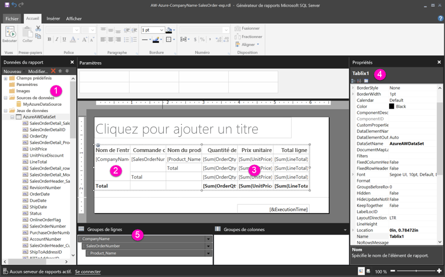

1. Dans le volet Données du rapport, vous voyez la source de données Azure incorporée et le jeu de données incorporé basé sur celle-ci, deux éléments que vous avez créés. 

2. Le canevas de conception mesure environ 6 pouces (15 cm) de large. Sur le canevas de conception, vous voyez la matrice, avec des en-têtes de colonnes et des valeurs d’espaces réservés. La matrice comporte six colonnes et cinq lignes seulement. 

3. Order Qty, Unit Price et Line Total représentent toutes les sommes, et chaque groupe de lignes affiche un sous-total. 

    Vous ne voyez toujours pas les valeurs de données réelles. Pour afficher ces valeurs, vous devez exécuter le rapport.

4. Dans le volet Propriétés, la matrice sélectionnée est appelée Tablix1. Une matrice *tablix* dans le Générateur de rapports est une région de données qui affiche les données en lignes et en colonnes. Il peut s’agir d’une table ou d’une matrice.

5. Le volet de regroupement contient les trois groupes de lignes que vous avez créés dans l’assistant : 

    - CompanyName
    - Commande client
    - Nom du produit

    Cette matrice ne comporte aucun groupe de colonnes.

### Exécuter le rapport

Pour afficher les valeurs réelles, vous devez exécuter le rapport.

1. Sélectionnez **Exécuter** dans la barre d’outils **Accueil**.

   Vous voyez maintenant les valeurs. La matrice comporte plus de lignes que ce que vous avez vu en mode Création ! Notez que le Générateur de rapports indique qu’il s’agit de la page **1** de **2 ?**. Le Générateur de rapports charge le rapport aussi rapidement que possible afin de récupérer suffisamment de données pour quelques pages à la fois. Le point d’interrogation indique que le Générateur de rapports n’a pas encore chargé toutes les données.

   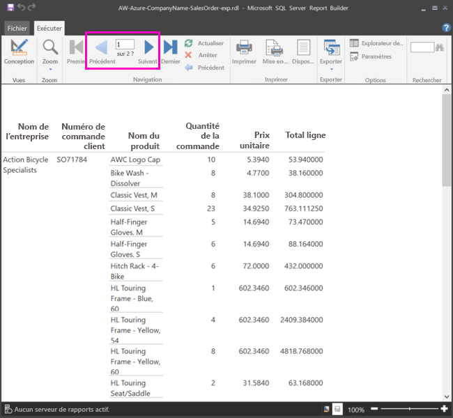

2. Sélectionnez **Mise en page**. Le rapport s’affichera dans ce format lors de l’impression. Le Générateur de rapports sait maintenant que le rapport comporte 33 pages et a ajouté automatiquement la date et l’heure dans le pied de page.

## Mettre en forme le rapport

Vous disposez maintenant d’un rapport avec une matrice couvrant 33 pages. Nous allons ajouter d’autres fonctionnalités et améliorer son apparence. Vous pouvez exécuter le rapport après chaque étape pour obtenir un aperçu.

- Dans l’onglet du ruban **Exécuter**, sélectionnez **Conception** pour pouvoir continuer à modifier le rapport.  

### Définir la largeur de page

En général, un rapport paginé est mise en forme pour l’impression, avec un format de page standard de 8 1/2 X 11 pouces. 

1. Faites glisser la règle pour obtenir un canevas de conception de 7 pouces de large. Comme les marges par défaut sont de 1 pouce de chaque côté, les marges latérales doivent être plus étroites.

1. Cliquez sur la zone grise autour du canevas de conception pour afficher les propriétés du **rapport**.

    Si vous ne voyez pas le volet Propriétés, cliquez sur l’onglet **Vue** > **propriétés**.

2. Développez **Marges** et modifiez les valeurs **Gauche** et **Droite** de 1 à 0,75 pouce. 

    
  
### Ajouter un titre de rapport  

1. Sélectionnez les mots **Cliquez pour ajouter un titre** en haut de la page, puis tapez **Ventes par entreprise**.  

2. Sélectionnez le texte du titre puis, dans le volet des propriétés sous **Police**, définissez la **couleur** sur **bleu**.
  
### Ajouter un numéro de page

Vous avez remarqué que le rapport affiche la date et l’heure dans le pied de page. Vous pouvez également y ajouter un numéro de page.

1. En bas du canevas de conception, vous voyez [&ExecutionTime] à droite du pied de page. 

2. Dans le volet des données du rapport, développez le dossier Champs prédéfinis. Faites glisser **Numéro de Page** vers le côté gauche du pied de page, à la même hauteur que [&ExecutionTime].

3. Faites glisser le côté droit de la zone [&PageNumber] pour la rendre carrée.

4. Dans l’onglet **Insertion**, sélectionnez **Zone de texte**.

5. Cliquez à droite de [&PageNumber], tapez « de », puis modifier la zone de texte pour la rendre carrée.

6. Faites glisser **Nombre total de pages** vers le pied de page, à droite de « de », puis faites glisser son côté droit pour rendre la zone de texte également carrée.

    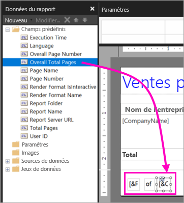

### Élargir la table  

Vous pouvez maintenant élargir suffisamment la matrice pour remplir la largeur de la page et élargir aussi les colonnes de texte pour que les noms ne défilent pas autant. 
 
1. Sélectionnez la matrice, puis choisissez la colonne Nom de la société.

3. Placez le curseur sur la barre grise située en haut de la matrice, sur le bord droit de la colonne Nom de la société. Faites glisser le bord vers la droite jusqu'à ce que la colonne se termine à 1 3/8 pouce. 

    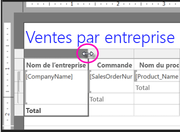

4. Faites glisser le bord droit du nom de produit jusqu'à ce que la colonne se termine à 3 3/4 pouces.   

Désormais, la matrice est presque aussi large que la zone d’impression.

### Mettre en forme la devise

Vous avez peut-être constaté, lors de l’exécution du rapport, que les montants en dollars n’apparaissaient pas encore sous forme de devises.

1. Sélectionnez la cellule [Sum(OrderQty)] en haut à gauche, maintenez la touche MAJ enfoncée, puis sélectionnez la cellule [Sum(LineTotal)] en bas à droite.

    

2. Dans l’onglet **Accueil**, choisissez le symbole de devise dollar (**$**), puis sélectionnez la flèche en regard de **Styles des espaces réservés** > **Valeurs d’aperçu**.
 
    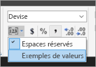

    Vous constatez à présent que les valeurs apparaissent sous forme de devises.

    

### Ajouter des en-têtes de colonne sur chaque page

Nous pouvons apporter une amélioration supplémentaire à la mise en forme avant de publier le rapport dans le service Power BI : afficher les en-têtes de colonnes sur chaque page dans le rapport.

1. Tout à droite de la barre supérieure dans le volet de regroupement, sélectionnez la flèche déroulante > **Mode avancé**.

    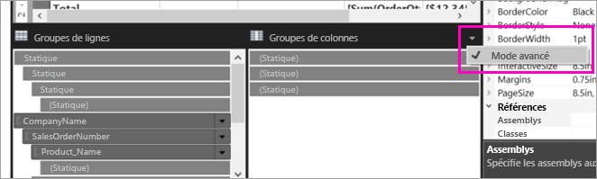

2. Sélectionnez la barre **Statique** supérieure dans les **groupes de lignes**. Vous constatez que la cellule Nom de la société dans la matrice est sélectionnée.

   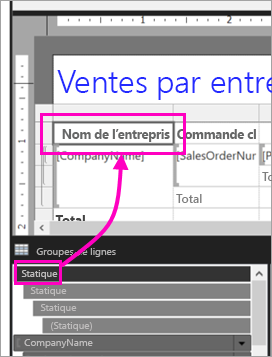

3. Dans le volet **Propriétés**, vous examinez les propriétés du champ**Membre du tableau matriciel**. Définissez **KeepWithGroup** sur **After** et **RepeatOnNewPage** sur **True**.

    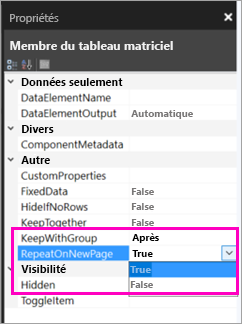

    Il est temps d’exécuter le rapport pour voir à quoi il ressemble maintenant.

5. Sélectionnez **Exécuter** dans l’onglet **Accueil**.

6. Sélectionnez **Mise en page**, le cas échéant. Le rapport comporte maintenant 29 pages. Faites défiler quelques pages. Vous voyez que la devise est mise en forme, que les colonnes comportent des en-têtes sur chaque page, et que le rapport affiche un pied de page avec des numéros de page ainsi que la date et l’heure sur chaque page.
 
    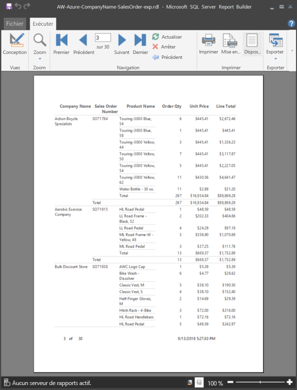

7. Enregistrez le rapport sur votre ordinateur.
 
##  Charger le rapport dans le service

Maintenant que vous avez créé ce rapport paginé, il est temps de le charger dans le service Power BI.

1. Dans le service Power BI (http://app.powerbi.com) dans le volet de navigation de gauche, sélectionnez **Espaces de travail** > **Créer un espace de travail d’application**.

2. Nommez votre espace de travail **Azure AW**, ou choisissez un autre nom unique. Vous êtes le seul membre pour l’instant. 

3. Sélectionnez la flèche en regard de l’option **Avancé** et activez **Capacité dédiée**. 

    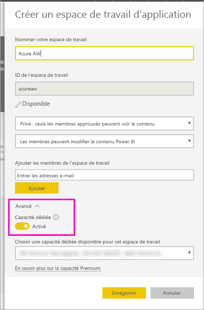

    Si vous ne pouvez pas activer cette option, vous devez demander à votre administrateur Power BI de vous donner l’autorisation d’ajouter l’espace de travail à la capacité Premium dédiée.

4. Choisissez une **capacité dédiée disponible pour cet espace de travail** et, si nécessaire, sélectionnez **Enregistrer**.
    
    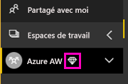

    Si l’espace de travail ne figure pas dans une capacité Premium, lorsque vous essayez de charger votre rapport, le message « Impossible de charger le rapport paginé » apparaît. Contactez votre administrateur Power BI pour déplacer l’espace de travail.

1. Dans votre nouvel espace de travail, sélectionnez **Obtenir les données**.

2. Dans la zone **Fichiers**, sélectionnez **Obtenir**.

3. Sélectionnez **Fichier local**, accédez au dossier où vous avez enregistré le fichier > **Ouvrir**.

   Power BI importe votre fichier, et vous le voyez sous **Rapports** dans la liste des applications.

    

4. Sélectionnez le rapport pour l’afficher.

5. Si vous obtenez une erreur, vous devrez éventuellement saisir à nouveau vos informations d'identification. Sélectionnez l’icône **Gérer**.

    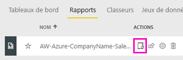

6. Sélectionnez **informations d'identification**, puis saisissez les informations d’identification que vous avez utilisées dans Azure lorsque vous avez créé la base de données Azure.

    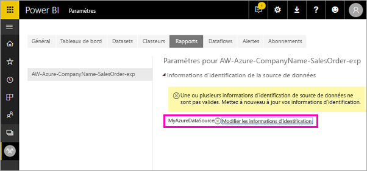

7. Vous pouvez à présent afficher votre rapport paginé dans le service Power BI.

    

## Étapes suivantes

[Présentation des rapports paginés dans Power BI Premium (préversion)](paginated-reports-report-builder-power-bi.md)

