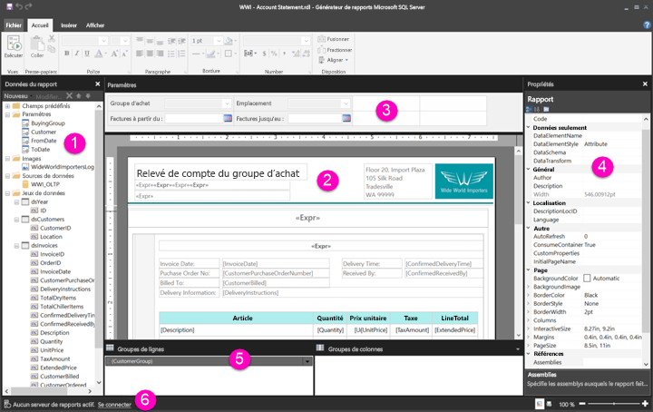

# Découverte du mode Création de rapport pour les rapports paginés - Power BI

Le mode Création de rapport du Générateur de rapports Power BI est l’espace de conception pour la création de rapports paginés que vous pouvez publier sur le service Power BI. Le canevas de conception se situe au centre du Générateur de rapports, entouré par le ruban et les volets. Le canevas de conception est l’endroit où vous ajoutez et organisez les éléments de votre rapport. Cet article présente les volets qui vous permettent d’ajouter et d’organiser vos ressources de rapport et de modifier les propriétés d’un élément du rapport.  

1. [Volet des données de rapport](#1-report-data-pane) 
2. [Canevas de conception du rapport](#2-report-design-surface)  
3. [Volet des paramètres](#3-parameters-pane) 
4. [Volet des propriétés](#4-properties-pane) 
5. [Volet de regroupement](#5-grouping-pane) 
6. [Barre d’état du rapport actif](#6-current-report-status-bar)  
  
## 1 Volet des données de rapport  
 Dans le volet des données du rapport, vous définissez les données et les ressources du rapport dont vous avez besoin avant de concevoir la disposition de votre rapport. Par exemple, vous pouvez y ajouter des sources de données, des jeux de données, des champs calculés, des paramètres de rapport et des images.  
  
 Après avoir ajouté des éléments au volet des données du rapport, faites glisser les champs vers les éléments du rapport sur le canevas de conception pour contrôler l’emplacement où apparaissent les données dans le rapport.  
  
> [!TIP]  
>  Si vous faites glisser un champ à partir du volet des données du rapport directement vers le canevas de conception au lieu de le placer dans une région de données comme un tableau ou un graphique, lorsque vous exécutez le rapport, vous verrez uniquement la première valeur des données dans ce champ.  
  
 Vous pouvez également faire glisser des champs prédéfinis du volet des données de rapport vers le canevas de conception du rapport. Lors du rendu, ces champs fournissent des informations sur le rapport, notamment le nom du rapport, le nombre total de pages du rapport et le numéro de la page en cours.  
  
 Certaines informations sont automatiquement ajoutées au volet des données du rapport lorsque vous ajoutez un élément au canevas de conception du rapport. Par exemple, si vous incorporez une image dans votre rapport, elle sera ajoutée au dossier Images dans le volet des données du rapport.  
  
> [!NOTE]  
>  Vous pouvez utiliser le bouton **Nouveau** pour ajouter un nouvel élément au volet des données du rapport. Vous pouvez ajouter au rapport plusieurs jeux de données à partir de la même source de données ou d’autres sources de données. Pour ajouter un nouveau jeu de données à partir de la même source de données, cliquez avec le bouton droit sur une source de données, puis sélectionnez **Ajouter un jeu de données**.  
  
## 2 Canevas de conception du rapport  
 Le canevas de conception du rapport du Générateur de rapports est la principale zone de travail pour concevoir vos rapports. Pour placer des éléments de rapport tels que des régions de données, des sous-rapports, des zones de texte, des images, des rectangles et des lignes dans votre rapport, ajoutez-les au canevas de conception à partir du ruban ou de la bibliothèque de parties de rapports. De là, vous pouvez ajouter des groupes, expressions, paramètres, filtres, actions, de la visibilité et une mise en forme à vos éléments de rapport.  
  
 Vous pouvez également modifier les éléments suivants :  
  
-   Les propriétés de corps du rapport, telles que la couleur de la bordure et le remplissage, en double-cliquant sur la zone blanche du canevas de conception, en dehors de tout élément de rapport et en sélectionnant **Propriétés du corps**.  
  
-   Les propriétés d’en-tête et de pied de page, telles que la couleur de la bordure et le remplissage, en double-cliquant sur la zone blanche du canevas de conception au niveau de l’en-tête ou du pied de page, en dehors de tout élément de rapport et en sélectionnant **Propriétés d’en-tête** ou **Propriétés de pied de page**.  
  
-   Les propriétés du rapport lui-même, telles que la mise en page, en double-cliquant sur la zone grise autour du canevas de conception et en sélectionnant **Propriétés du rapport**.  
  
-   Les propriétés des éléments du rapport en double-cliquant dessus et en sélectionnant **Propriétés**.  
  
### Taille du canevas de conception et zone d’impression  
La taille du canevas de conception peut être différente de la zone d’impression de la page que vous spécifiez pour imprimer le rapport. Modifier la taille du canevas de conception ne changera pas la zone d’impression de votre rapport. Quelle que soit la taille que vous définissez pour la zone d’impression de votre rapport, la taille du canevas de conception ne change pas. Pour plus d’informations, consultez la section Comportements de rendu. 
  
- Pour afficher la règle, dans l’onglet **Vue**, cochez la case **Règle**.  
  
## 3 Volet des paramètres  
 Les paramètres du rapport vous permettent de contrôler les données du rapport, de relier des rapports connexes et de modifier la présentation du rapport. Le volet des paramètres fournit une disposition flexible des paramètres du rapport.  
  
 En savoir plus sur les paramètres du rapport   
  
## 4 Volet des propriétés
 Chaque élément d’un rapport, y compris les régions de données, les images, les zones de texte et le corps du rapport lui-même, est associé à des propriétés. Par exemple, la propriété BorderColor d’une zone de texte affiche la valeur de la couleur de bordure de la zone de texte, et la propriété PageSize du rapport affiche la taille de la page du rapport.  
  
 Ces propriétés sont affichées dans le volet des propriétés. Les propriétés disponibles dans le volet varient selon l’élément de rapport que vous sélectionnez.  
  
- Pour afficher le volet des propriétés, dans l’onglet **Vue** du groupe **Afficher/masquer**, sélectionnez **Propriétés**.  
  
### Modification des valeurs de propriétés  
 Dans le Générateur de rapports, vous pouvez modifier les propriétés des éléments de rapport de plusieurs façons :  
  
-   En sélectionnant des boutons et des listes sur le ruban.  
  
-   En modifiant les paramètres dans des boîtes de dialogue.  
  
-   En modifiant les valeurs de propriétés dans le volet des propriétés.  
  
 Les propriétés couramment utilisées sont disponibles dans les boîtes de dialogue et dans le ruban.  
  
 Selon la propriété sélectionnée, vous pouvez définir une valeur de propriété dans la liste déroulante, taper la valeur ou sélectionner `<Expression>` pour créer une expression.  
  
### Modification de l’affichage du volet des propriétés  
 Par défaut, les propriétés affichées dans le volet des propriétés sont classées en catégories, par exemple Action, Bordure, Remplissage, Police et Général. Chaque catégorie est associée à un ensemble de propriétés. Par exemple, les propriétés suivantes sont répertoriées dans la catégorie Police : Color, FontFamily, FontSize, FontStyle, FontWeight, LineHeight, et TextDecoration. Si vous préférez, vous pouvez classer par ordre alphabétique toutes les propriétés répertoriées dans le volet. Cela supprime les catégories et classe toutes les propriétés par ordre alphabétique, quelle que soit la catégorie.  
  
 Le haut du volet Propriétés possède trois boutons : **Catégorie**, **Classer par ordre alphabétique** et **Page des propriétés**. Sélectionnez les boutons Catégorie et Alphabétiser pour basculer entre les affichages du volet des propriétés. Sélectionnez le bouton **Pages de propriétés** pour ouvrir la boîte de dialogue des propriétés d’un élément de rapport sélectionné.  
  
  
## 5 Volet de regroupement

 Les groupes permettent de classer les données de votre rapport selon une hiérarchie visuelle et de calculer des totaux. Vous pouvez afficher les groupes de lignes et de colonnes d’une région de données sur le canevas de conception, ainsi que dans le volet de regroupement. Le volet Regroupement comporte deux volets : Groupes de lignes et Groupes de colonnes. Lorsque vous sélectionnez une région de données, le volet de regroupement affiche tous les groupes au sein de cette région de données sous la forme d’une liste hiérarchique : les groupes enfants apparaissent en retrait, sous leurs groupes parents.  
  
 Vous pouvez créer des groupes en faisant glisser des champs dans le volet des données du rapport et en les déposant sur le canevas de conception ou dans le volet de regroupement. Dans le volet de regroupement, vous pouvez ajouter la page parente, adjacente, et les groupes enfants, modifier les propriétés de groupe et supprimer des groupes.  
  
 Le volet de regroupement s’affiche par défaut, mais vous pouvez le fermer en désactivant la case à cocher Volet de regroupement sous l’onglet Vue. Le volet de regroupement n’est pas disponible pour les régions de données Graphique ou Jauge.  
  
 Pour plus d’informations, consultez les sections Volet de regroupement et Présentation des groupes.  
  
## 6 Barre d’état du rapport actif

La barre d’état du rapport actif affiche le nom du serveur auquel le rapport est connecté, ou affiche le message « Aucun serveur de rapports actif. » Vous pouvez sélectionner **Se connecter** pour vous connecter à un serveur.

## Étapes suivantes

[Présentation des rapports paginés dans Power BI Premium](paginated-reports-report-builder-power-bi.md) 

  
  
