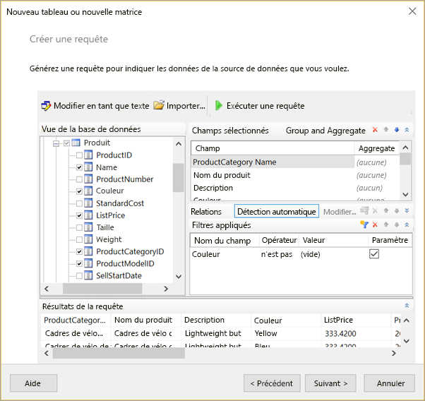
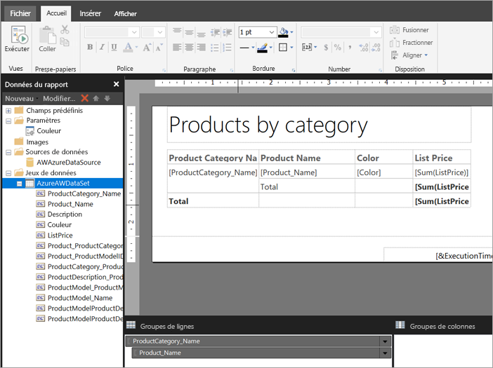

# Créer un jeu de données incorporé pour un rapport paginé dans le service Power BI

[!INCLUDE [applies-to](../includes/applies-to.md)] [!INCLUDE [yes-service](../includes/yes-service.md)] [!INCLUDE [yes-paginated](../includes/yes-paginated.md)] [!INCLUDE [yes-premium](../includes/yes-premium.md)] [!INCLUDE [no-desktop](../includes/no-desktop.md)] 

Dans cet article, vous apprendrez à créer un jeu de données incorporé, basé sur une source de données incorporée, pour un rapport paginé dans le service Power BI. Les jeux de données incorporés sont contenus dans un seul rapport paginé, pour une utilisation dans ce rapport. Actuellement, les rapports paginés publiés sur le service Power BI requièrent des jeux de données incorporés et des sources de données incorporées. Vous créez la source de données et le jeu de données incorporés dans le Générateur de rapports Power BI quand vous créez votre rapport. 

Avant de pouvoir créer le jeu de données, vous devez créer une source de données. Pour cela, consultez [Sources de données pour rapports paginés](paginated-reports-embedded-data-source.md) dans le service Power BI.
  
## Créer un jeu de données incorporé
  
1. Dans le volet Données du rapport du Générateur de rapports Power BI, sélectionnez **Nouveau** > **Jeu de données**.

1. Dans l’onglet **Requête** de la boîte de dialogue **propriétés du jeu de données** , nommez le jeu de données. La source de données incorporée figure déjà dans la boîte de dialogue **Source de données** , mais vous pouvez sélectionner **Nouveau** pour créer une autre source de données incorporée.
 
     

3. Sous **Type de requête** , sélectionnez le type de commande ou de requête à utiliser pour le jeu de données. 
    - **Texte** exécute une requête pour récupérer des données à partir de la base de données. Il s’agit de la valeur par défaut, utilisé pour la plupart des requêtes. Tapez une requête ou importez une requête existante en sélectionnant **Importer**. Pour générer la requête sous forme graphique, sélectionnez **Concepteur de requêtes**. Si vous utilisez le Concepteur de requêtes pour créer une requête, le texte de la requête s’affiche dans cette fenêtre. Sélectionnez le bouton **Expression** ( **fx** ) afin d’utiliser une expression pour générer dynamiquement la requête. 
    - **Tableau** sélectionne tous les champs d’un tableau. Entrez le nom de la table que vous souhaitez utiliser comme dataset.
    - **Procédure stockée** exécute une procédure stockée par nom.

4. Dans le Concepteur de requêtes, vous pouvez afficher et interagir avec les tableaux et les champs du jeu de données, importer une requête ou la modifier en tant que texte. Vous pouvez également ajouter des filtres et des paramètres ici. 

    

5. Dans le Concepteur de requêtes, sélectionnez **Exécuter la requête** pour la tester, puis sélectionnez **OK**.

1. Retournez dans la boîte de dialogue des propriétés du jeu de données, puis tapez le nombre de secondes avant l’expiration de la requête dans le champ **Délai d’expiration (en secondes)** . La valeur par défaut est 30 secondes. La valeur de **Délai dépassé** doit être vide ou supérieure à zéro. Si elle ne contient aucune valeur, la requête n'est soumise à aucun délai d'expiration.

7.  Vous pouvez définir d’autres propriétés pour le jeu de données dans les autres onglets :
    - Créez des champs calculés dans l’onglet **Champs**.
    - Définissez des options avancées dans l’onglet **Options**.
    - Ajoutez ou mettez à jour les champs **Filtres** et **Paramètres** dans leurs onglets respectifs.

8. Sélectionnez **OK**.
 
   Le rapport s’ouvre en mode Création de rapports. La source de données, le jeu de données et la collection de champs du jeu de données apparaissent dans le volet des données de rapport, et vous pouvez continuer à concevoir votre rapport paginé.  

     
 
## Étapes suivantes 

- [Présentation des rapports paginés dans Power BI Premium](paginated-reports-report-builder-power-bi.md)  
- [Tutoriel : Créer un rapport paginé et le charger dans le service Power BI](paginated-reports-quickstart-aw.md)
- [Publier un rapport paginé dans le service Power BI](paginated-reports-save-to-power-bi-service.md)

