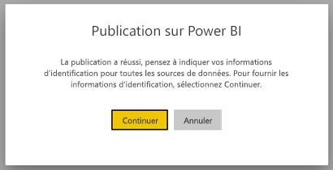
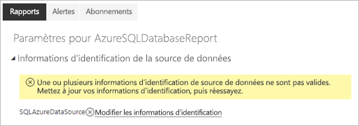
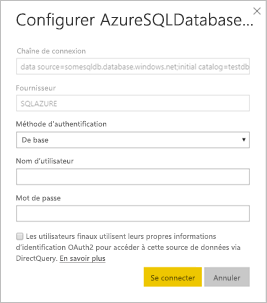

# Sources de données prises en charge pour les rapports paginés Power BI

[!INCLUDE [applies-to](../includes/applies-to.md)] [!INCLUDE [yes-service](../includes/yes-service.md)] [!INCLUDE [yes-paginated](../includes/yes-paginated.md)] [!INCLUDE [yes-premium](../includes/yes-premium.md)] [!INCLUDE [no-desktop](../includes/no-desktop.md)] 

Cet article présente les sources de données prises en charge pour les rapports paginés dans le service Power BI, et comment vous connecter à des sources de données Azure SQL Database. Certaines sources de données sont prises en charge en mode natif. Vous pouvez vous connecter à d’autres par le biais de passerelles de données.

## Sources de données prises en charge en mode natif

Les rapports paginés prennent en charge en mode natif la liste suivante de sources de données :

| Source de données | Authentification | Notes |
| --- | --- | --- |
| Azure SQL Database  Azure SQL Data Warehouse | De base, authentification unique (SSO), OAuth2 | Vous pouvez utiliser une passerelle Entreprise avec Azure SQL DB. Toutefois, vous ne pouvez pas utiliser l’authentification unique ou oAuth2 pour vous authentifier dans ces scénarios.   |
| Azure SQL Managed Instance | De base | via un point de terminaison public ou privé (le point de terminaison privé doit être routé via Enterprise Gateway)  |
| Azure Analysis Services | SSO, OAuth2 | Le pare-feu AAS doit être désactivé ou configuré pour autoriser toutes les plages d’adresses IP dans la région BlackForest. Cela s’applique uniquement dans la région BlackForest.  L’authentification unique à partir du locataire externe n’est pas prise en charge. |
| Jeu de données Power BI | SSO | Jeux de données Power BI Premium et non Premium. Nécessite une autorisation de lecture |
| Jeu de données Premium Power BI (XMLA) | SSO | Les jeux de données Power BI ne sont pas pris en charge comme source de données pour les rapports paginés incorporés dans des scénarios où l’application est propriétaire des données.  Pour garantir une connectivité appropriée dans Power BI Report Builder, assurez-vous que l’option « Ne pas utiliser les informations d’identification » est sélectionnée quand vous définissez votre source de données.   |
| Entrer des données | N/A | Les données sont incorporées dans le rapport. |

À l’exception d’Azure SQL Database, toutes les sources de données sont prêtes à être utilisées après le chargement du rapport dans le service Power BI. Par défaut, les sources de données utilisent l’authentification unique, le cas échéant. Pour Azure Analysis Services, vous pouvez changer le type d’authentification et choisir OAuth2. Toutefois, une fois que le type d’authentification pour une source de données donnée est changé en OAuth2, il ne peut pas revenir en arrière pour utiliser l’authentification unique.  En outre, cette modification s’applique à tous les rapports qui utilisent cette source de données dans tous les espaces de travail d’un abonné donné.  La sécurité au niveau des lignes dans les rapports paginés ne fonctionne pas, sauf si les utilisateurs choisissent l’authentification unique pour le type d’authentification.

Pour les sources de données Azure SQL Database, vous devez fournir plus d’informations, comme décrit dans la section [Authentification Azure SQL Database](#azure-sql-database-authentication).

## Autres sources de données

En plus des sources de données prises en charge en mode natif ci-dessus, les sources de données suivantes sont accessibles par le biais d’une [passerelle de données Power BI](../connect-data/service-gateway-onprem.md) :

- SQL Server
- SQL Server Analysis Services
- Oracle
- Teradata

Pour les rapports paginés, Azure SQL Database et Azure Analysis Services ne sont pas accessibles actuellement par le biais d’une passerelle de données Power BI.

## Authentification Azure SQL Database

Pour les sources de données Azure SQL Database, vous devez définir un type d’authentification avant d’exécuter le rapport. Cela s’applique uniquement quand vous utilisez une source de données pour la première fois dans un espace de travail. La première fois, le message suivant s’affiche :

Si vous ne fournissez pas d’informations d’identification, une erreur se produit quand vous exécutez le rapport. Sélectionnez **Continuer** pour accéder à la page **Informations d’identification de la source de données** du rapport que vous venez de charger :

Sélectionnez le lien **Modifier les informations d’identification** pour une source de données donnée afin d’afficher la boîte de dialogue **Configurer**  :

Pour les sources de données Azure SQL Database, voici les types d’authentification pris en charge :

- De base (nom d’utilisateur et mot de passe)
- Authentification unique (SSO)
- OAuth2 (jeton Azure Active Directory stocké)

Pour que l’authentification unique et OAuth2 fonctionnent correctement, la [prise en charge de l’authentification Azure Active Directory doit être activée](/azure/sql-database/sql-database-aad-authentication-configure) sur le serveur Azure SQL Database auquel la source de données se connecte. Pour la méthode d’authentification OAuth2, Azure Active Directory génère un jeton et le stocke en vue d’un accès ultérieur à la source de données. Pour utiliser la [méthode d’authentification SSO](../connect-data/service-azure-sql-database-with-direct-connect.md#single-sign-on) à la place, sélectionnez l’option SSO située juste en dessous, **Les utilisateurs finaux utilisent leurs propres informations d’identification OAuth2 pour accéder à cette source de données via DirectQuery**.
  
## Étapes suivantes

[Afficher un rapport paginé dans le service Power BI](../consumer/paginated-reports-view-power-bi-service.md)

D’autres questions ? [Posez vos questions à la communauté Power BI](https://community.powerbi.com/)