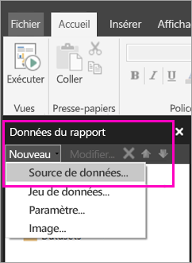

# Créer une source de données incorporée pour rapports paginés dans le service Power BI

[!INCLUDE [applies-to](../includes/applies-to.md)] [!INCLUDE [yes-service](../includes/yes-service.md)] [!INCLUDE [yes-paginated](../includes/yes-paginated.md)] [!INCLUDE [yes-premium](../includes/yes-premium.md)] [!INCLUDE [no-desktop](../includes/no-desktop.md)] 

Dans cet article, vous apprendrez à créer et à modifier une source de données incorporée dans un rapport paginé dans le service Power BI. Vous définissez une source de données incorporée dans un rapport unique et l’utilisez seulement dans ce rapport. Actuellement, les rapports paginés publiés sur le service Power BI requièrent des jeux de données incorporés et des sources de données incorporées, et peuvent se connecter à ces sources de données :

- Azure Analysis Services
- dans Azure SQL Database et 
- Azure SQL Data Warehouse.
- SQL Server
- SQL Server Analysis Services
- Oracle 
- Teradata 

Pour les sources de données suivantes, utilisez l’option [Connexion SQL Server Analysis Services](../admin/service-premium-connect-tools.md) :

- Jeux de données Power BI Premium

Les rapports paginés se connectent aux sources de données locales par le biais d’une [passerelle Power BI](../connect-data/service-gateway-onprem.md). Vous configurez la passerelle après avoir publié le rapport sur le service Power BI.

Pour obtenir des informations plus détaillées, consultez [Données de rapport dans le Générateur de rapports Power BI](report-builder-data.md).

## Créer une source de données incorporée
  
1. Ouvrez le Générateur de rapports Power BI.

1. Dans la barre d’outils du volet des données du rapport, sélectionnez **Nouveau** > **Source de données**. La boîte de dialogue **Propriétés de la source de données** s'ouvre.

   
  
1. Dans la zone de texte **Nom** , tapez un nom pour la source de données ou acceptez la valeur par défaut.  
  
1. Cliquez sur **Utiliser une connexion incorporée dans mon rapport**.  
  
1. Dans la liste **Sélectionner un type de connexion** , sélectionnez un type de source de données. 

1. Spécifiez une chaîne de connexion en utilisant l’une des méthodes suivantes :  
  
   - Tapez directement la chaîne de connexion dans la zone de texte **Chaîne de connexion** . 
  
   - Sélectionnez **Build** pour ouvrir la boîte de dialogue **Propriétés de connexion** pour la source de données que vous avez choisie à l’étape 2.  
  
     Renseignez les champs de la boîte de dialogue **Propriétés de connexion** comme il convient pour le type de source de données. Les propriétés de connexion incluent le type de la source de données, son nom, ainsi que les informations d'identification à utiliser. Une fois que vous spécifiez des valeurs dans cette boîte de dialogue, sélectionnez **Tester la connexion** pour vérifier que la source de données est disponible et que les informations d’identification que vous avez spécifiées sont correctes.  
  
1. Sélectionnez **Credentials (Informations d’identification)**.  
  
   Spécifiez les informations d'identification à utiliser pour cette source de données. Le propriétaire de la source de données choisit le type d'informations d'identification pris en charge. Pour plus d’informations, consultez [Spécifier des informations d’identification et de connexion pour les sources de données de rapport](/sql/reporting-services/report-data/specify-credential-and-connection-information-for-report-data-sources).
  
1. Sélectionnez **OK**.  
  
   La source de données apparaît dans le volet des données de rapport.

## Limitations et considérations

Les rapports paginés qui se connectent aux jeux de données Power BI suivent les règles pour les jeux de données partagés dans Power BI avec quelques changements mineurs.  Pour que les utilisateurs affichent correctement des rapports paginés à l’aide de jeux de données Power BI et pour garantir que la sécurité au niveau des lignes (RLS) soit activée et appliquée pour vos visionneuses, assurez-vous de suivre ces règles :

### Applications et espaces de travail classiques

- .rdl dans le même espace de travail en tant que jeu de données (même propriétaire) : Pris en charge
- .rdl dans un espace de travail différent en tant que jeu de données (même propriétaire) : Pris en charge
- .rdl partagé : Vous devez attribuer une autorisation de lecture à chaque utilisateur qui affiche le rapport au niveau du jeu de données
- Application partagée : Vous devez attribuer une autorisation de lecture à chaque utilisateur qui affiche le rapport au niveau du jeu de données
- .rdl dans le même espace de travail en tant que jeu de données (utilisateur différent) : Pris en charge
- .rdl dans un espace de travail différent en tant que jeu de données (utilisateur différent). Vous devez attribuer une autorisation de lecture à chaque utilisateur qui affiche le rapport au niveau du jeu de données
- Sécurité au niveau des rôles : Vous devez attribuer une autorisation de lecture à chaque utilisateur qui affiche le rapport au niveau du jeu de données pour qu’il soit appliqué.

### Nouveaux espaces de travail et applications d’expérience

- .rdl dans le même espace de travail en tant que jeu de données : Pris en charge
- .rdl dans un espace de travail différent en tant que jeu de données (même propriétaire) : Pris en charge
- .rdl partagé : Vous devez attribuer une autorisation de lecture à chaque utilisateur qui affiche le rapport au niveau du jeu de données
- Application partagée : Vous devez attribuer une autorisation de lecture à chaque utilisateur qui affiche le rapport au niveau du jeu de données
- .rdl dans le même espace de travail en tant que jeu de données (utilisateur différent) - Pris en charge
- .rdl dans un espace de travail différent en tant que jeu de données (utilisateur différent) : Vous devez attribuer une autorisation de lecture à chaque utilisateur qui affiche le rapport au niveau du jeu de données
- Sécurité au niveau des rôles : Vous devez attribuer une autorisation de lecture à chaque utilisateur qui affiche le rapport au niveau du jeu de données pour qu’il soit appliqué

## Étapes suivantes

- [Créer un jeu de données incorporé pour un rapport paginé dans le service Power BI](paginated-reports-create-embedded-dataset.md)
- [Présentation des rapports paginés dans Power BI Premium](paginated-reports-report-builder-power-bi.md)