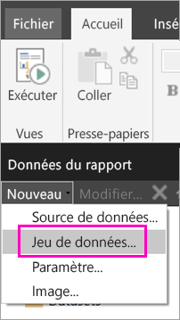
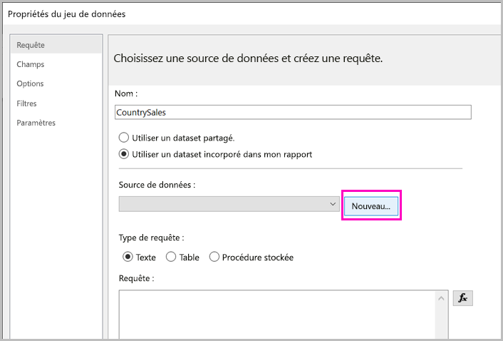
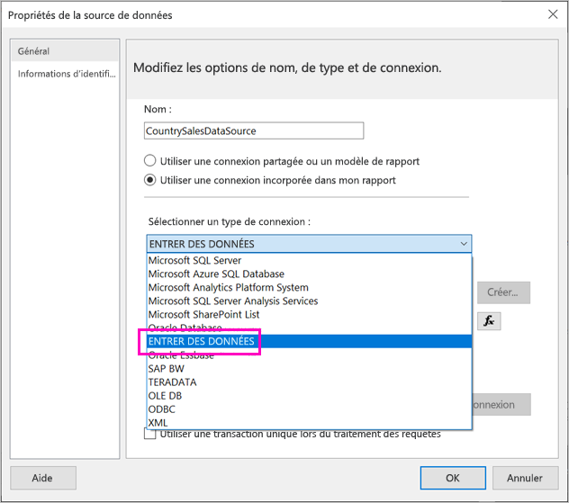
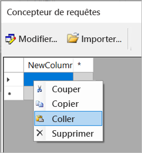
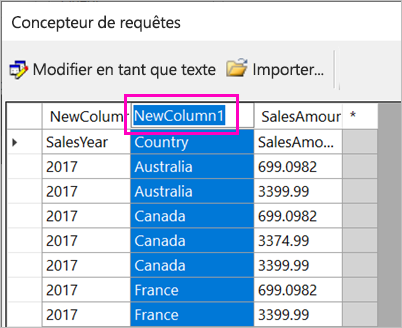
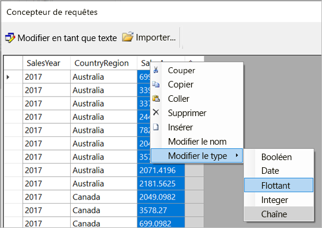
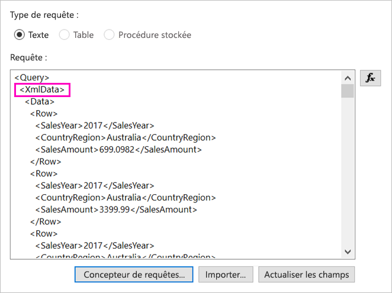
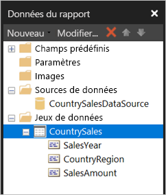

# <a name="enter-data-directly-in-a-paginated-report-in-report-builder---power-bi"></a>Entrer des données directement dans un rapport paginé dans le Générateur de rapports - Power BI

Cet article traite de la nouvelle version du Générateur de rapports SQL Server 2016, et plus particulièrement d’une fonctionnalité qui vous permet d’entrer des données directement dans un rapport RDL sous forme d’un jeu de données incorporé.  Cette fonctionnalité est similaire à Power BI Desktop. Vous pouvez taper des données directement dans un jeu de données dans votre rapport ou les coller dans un autre programme tel que Microsoft Excel. Si vous créez un jeu de données en entrant des données, vous pouvez l’utiliser comme n’importe quel autre jeu de données incorporé dont vous êtes l’auteur. Vous pouvez également ajouter plusieurs tables et en utiliser une comme filtre pour l’autre. Cette fonctionnalité est particulièrement utile pour les petits jeux de données statiques dont vous pouvez avoir besoin dans votre rapport, comme des paramètres de rapport.
 
## <a name="prerequisites"></a>Conditions préalables

- Pour entrer des données directement dans un rapport paginé, installez la nouvelle version du [Générateur de rapports à partir du Centre de téléchargement Microsoft](https://www.microsoft.com/download/details.aspx?id=53613). 
- Pour enregistrer votre rapport paginé dans le service Power BI, vous devez disposer d’un [compte Power BI Pro](../service-self-service-signup-for-power-bi.md) et avoir accès en écriture à un espace de travail accessible dans une [capacité Power BI Premium](../service-premium-what-is.md).
- Pour enregistrer votre rapport paginé sur un serveur de rapports, vous devez être autorisé à [modifier le fichier RsReportServer.config](#upload-the-paginated-report-to-a-report-server).

## <a name="get-started"></a>Mise en route

Après avoir téléchargé et installé le Générateur de rapports, procédez de la même façon que pour ajouter une source de données et un jeu de données incorporés à votre rapport. Dans la procédure suivante, sous **Sources de données** vous voyez une nouvelle option : **Entrer des données**.  Cette source de données ne doit être configurée qu’une seule fois dans un rapport. Après cela, vous pouvez créer plusieurs tables de données entrées sous forme de jeux de données distincts utilisant tous la même source de données.

1. Dans le volet **Données du rapport**, sélectionnez **Nouveau** > **Jeu de données**.

    

1. Dans la boîte de dialogue **Propriétés du dataset**, sélectionnez **Utiliser un dataset incorporé dans mon rapport**.

1. En regard de **Source de données**, sélectionnez **Nouveau**.

    

1. Dans la boîte de dialogue **Propriétés de la source de données**, sélectionnez **Utiliser une connexion incorporée dans mon rapport**.
2. Dans la zone **Sélectionner un type de connexion**, sélectionnez **ENTRER DES DONNÉES** > **OK**.

    

1. De retour dans la boîte de dialogue **Propriétés du dataset**, sélectionnez **Concepteur de requêtes**.
2. Dans le volet **Concepteur de requêtes**, cliquez avec le bouton droit et collez vos données dans la table.

    

1. Pour définir les noms des colonnes, double-cliquez sur chaque **NewColumn** et tapez le nom de la colonne.

    

1. Si la première ligne contient des en-têtes de colonne issus des données d’origine, cliquez avec le bouton droit et supprimez-les.
    
9. Par défaut, le type de données de chaque colonne est Chaîne. Pour changer le type de données, cliquez avec le bouton droit sur l’en-tête de colonne > **Modifier le type**, puis choisissez un autre type de données (comme Date ou Flottant).

    

1. Quand vous avez terminé de créer la table, sélectionnez **OK**.  

    La requête générée est la même que celle obtenue avec une source de données XML. En coulisses, nous utilisons XML comme fournisseur de données.  Nous l’avons transformé pour prendre également en charge ce scénario.

    

12. Dans la boîte de dialogue **Propriétés du dataset**, sélectionnez **OK**.

13. Votre source de données et votre jeu de données apparaissent dans le volet **Données du rapport**.

    

Vous pouvez utiliser votre jeu de données comme base pour les visualisations de données dans votre rapport. Vous pouvez également ajouter un autre jeu de données et utiliser la même source de données pour celui-ci.

## <a name="upload-the-paginated-report-to-the-power-bi-service"></a>Charger le rapport paginé sur le service Power BI

Les rapports paginés étant désormais pris en charge dans le service Power BI, vous pouvez charger votre rapport paginé sur une capacité Premium. Pour plus d’informations, consultez [Charger un rapport paginé](paginated-reports-save-to-power-bi-service.md).

## <a name="upload-the-paginated-report-to-a-report-server"></a>Charger le rapport paginé sur un serveur de rapports

Vous pouvez également charger votre rapport paginé sur un serveur de rapports Power BI Report Server ou SQL Server Reporting Services 2016 ou 2017. Avant de procéder, vous devez ajouter l’élément suivant à votre fichier RsReportServer.config comme extension de données supplémentaire. Sauvegardez votre fichier RsReportServer.config avant d’effectuer le changement, au cas où vous rencontriez des problèmes.

```xml
<Extension Name="ENTERDATA" Type="Microsoft.ReportingServices.DataExtensions.XmlDPConnection,Microsoft.ReportingServices.DataExtensions">
    <Configuration>
        <ConfigName>ENTERDATA</ConfigName>
    </Configuration>
</Extension>
```

Une fois le changement apporté, voici à quoi doit ressembler la liste des fournisseurs de données dans le fichier de configuration :


Voilà, vous pouvez désormais publier des rapports qui utilisent cette nouvelle fonctionnalité sur votre serveur de rapports.

## <a name="next-steps"></a>Étapes suivantes

- [Présentation des rapports paginés dans Power BI Premium](paginated-reports-report-builder-power-bi.md)
- [Présentation de Power BI Report Server](../report-server/get-started.md)
