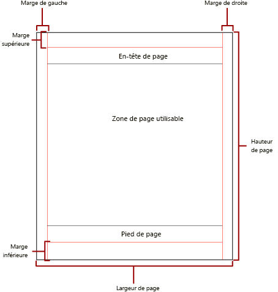
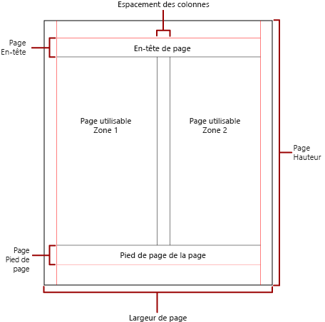

# Pagination des rapports Power BI

[!INCLUDE [applies-to](../includes/applies-to.md)] [!INCLUDE [yes-service](../includes/yes-service.md)] [!INCLUDE [yes-paginated](../includes/yes-paginated.md)] [!INCLUDE [yes-premium](../includes/yes-premium.md)] [!INCLUDE [no-desktop](../includes/no-desktop.md)] 

 La *pagination* fait référence au nombre de pages d’un rapport et à la disposition des éléments de rapport dans ces pages. Dans les rapports paginés Power BI, la pagination varie en fonction de l’extension de rendu que vous utilisez pour afficher et remettre le rapport. Lorsque vous exécutez un rapport sur le serveur de rapports, celui-ci utilise le convertisseur HTML. Le format HTML suit un ensemble spécifique de règles de pagination. Si vous exportez le même rapport au format PDF, par exemple, vous utilisez le convertisseur PDF, qui utilise un autre ensemble de règles. Par conséquent, le rapport est paginé différemment. Vous devez comprendre les règles utilisées pour contrôler la pagination dans les rapports paginés Power BI. Vous pouvez alors concevoir correctement un rapport facile à lire que vous optimisez pour le convertisseur que vous prévoyez d’utiliser pour distribuer votre rapport.  
  
 Cette rubrique décrit l’impact de la taille physique de la page et de la mise en page du rapport sur la manière dont les convertisseurs rendent les sauts de page manuels. Vous pouvez définir des propriétés afin de modifier la taille physique et les marges des pages, ainsi que diviser le rapport en colonnes par le biais du volet **Propriétés du rapport** , du volet **Propriétés** ou de la boîte de dialogue **Mise en page**. Accédez au volet **Propriétés du rapport** en cliquant sur la zone bleue en dehors du corps du rapport. Accédez à la boîte de dialogue **Mise en page** en cliquant sur **Exécuter** sous l’onglet Accueil, puis en cliquant sur **Mise en page** sous l’onglet Exécuter.  
  
> [!NOTE]  
>  Si vous avez conçu un rapport pour qu’il présente une largeur d’une page, mais soit rendu sur plusieurs pages, vérifiez que la largeur du corps du rapport, marges comprises, n’est pas supérieure à la largeur de la page physique. Pour empêcher l’ajout de pages vides à votre rapport, vous pouvez réduire la taille du conteneur en faisant glisser le coin de celui-ci vers la gauche.  

## Corps du rapport  
 Le corps du rapport est un conteneur rectangulaire affiché comme un espace vide sur l’aire de conception. Sa taille peut croître ou diminuer pour s’adapter aux éléments contenus dans le rapport. Le corps du rapport ne reflète pas la taille de page physique et peut même croître au-delà des limites de cette taille pour s’étendre sur plusieurs pages. Certains convertisseurs rendent des rapports dont le corps augmente ou diminue en taille en fonction du contenu de la page. Les rapports rendus dans ces formats sont optimisés pour l’affichage à l’écran, par exemple, dans un navigateur web. Ces convertisseurs, tels que Microsoft Excel, Word, HTML et MHTML, ajoutent des sauts de page verticaux lorsque c’est nécessaire.  
  
 Vous pouvez mettre en forme le corps du rapport avec une couleur, un style et une largeur de bordure. Vous pouvez également ajouter une couleur et une image d’arrière-plan.  
  
## Page physique  
 La taille de page physique correspond au format du papier. Le format de papier que vous spécifiez pour le rapport détermine le rendu de celui-ci. Les rapports rendus dans des formats avec sauts de page manuels insèrent les sauts de page horizontalement et verticalement en fonction de la taille physique de la page. Ces sauts de page assurent une expérience de lecture optimisée pour l’impression ou l’affichage dans un format de fichier avec sauts de page manuels. Les rapports rendus dans des formats avec sauts de page conditionnels insèrent les sauts de page horizontalement en fonction de la taille physique. Là encore, les sauts de page assurent une expérience de lecture optimisée lors d’un affichage dans un navigateur web.  
  
 Par défaut, la taille de la page est de 8,5 x 11 pouces. Vous pouvez toutefois la changer dans le volet **Propriétés du rapport** ou la boîte de dialogue **Mise en page** , ou en changeant les valeurs des propriétés HauteurPage et LargeurPage dans le volet **Propriétés**. La taille de la page ne s’ajuste pas en fonction du contenu du corps du rapport. Si vous souhaitez que le rapport s’affiche sur une seule page, tout le contenu du corps du rapport doit tenir sur la page physique. Si ce n’est pas le cas et si vous utilisez le format avec sauts de page manuels, le rapport nécessite des pages supplémentaires. Si le corps du rapport dépasse le bord droit de la page physique, un saut de page horizontal est inséré. Si le corps du rapport dépasse le bord inférieur de la page physique, un saut de page vertical est inséré.  
  
 Vous pouvez remplacer la taille de la page physique qui est définie dans le rapport. Spécifiez la taille de la page physique dans les paramètres Information sur l’appareil pour le convertisseur que vous utilisez afin d’exporter le rapport. Pour une liste complète, voir [Paramètres d’informations sur l’appareil pour les extensions de rendu](/sql/reporting-services/device-information-settings-for-rendering-extensions-reporting-services) dans la documentation de SQL Server Reporting Services.  
  
### Marges

Report Builder trace des marges à partir du bord des dimensions de la page physique vers l’intérieur, jusqu’au paramètre de marge spécifié. Si un élément de rapport s’étend dans la zone de marge, il est coupé de sorte que la zone qui chevauche n’est pas rendue. Si vous spécifiez des tailles de marge qui réduisent à zéro la dimension horizontale ou verticale de la page, la valeur par défaut des paramètres de marge est zéro. Vous spécifiez les marges dans le volet **Propriétés du rapport** ou la boîte de dialogue **Mise en page** , ou à l’aide des valeurs des propriétés MargeHaut, MargeBas, MargeGauche et MargeDroite dans le volet **Propriétés**. Pour remplacer la taille de marge définie dans le rapport, spécifiez une taille de marge dans les paramètres Information sur l’appareil correspondant au convertisseur que vous utilisez pour exporter le rapport.  
  
 La *zone de page utilisable* correspond à la zone de la page physique qui reste après l’allocation d’espace pour les marges, l’espacement des colonnes, ainsi que l’en-tête et le pied de page. Les marges sont appliquées uniquement lorsque vous affichez et imprimez des rapports dans des formats de convertisseur avec sauts de page manuels. L’image suivante présente la marge et la zone de page utilisable d’une page physique.  
  
 
  
### Colonnes de style Bulletin d’informations  

 Votre rapport peut être divisé en colonnes, comme dans un journal. Les colonnes sont traitées comme des pages *logiques* rendues sur la même page *physique*. Elles sont disposées de gauche à droite, et de haut en bas, et séparées par un espace blanc. Si le rapport est divisé en plusieurs colonnes, chaque page physique est divisée verticalement en colonnes. Chaque colonne est considérée comme une page logique. Par exemple, supposons que vous ayez deux colonnes sur une page physique. Le contenu de votre rapport remplit la première colonne, puis la deuxième. Si le rapport ne tient pas entièrement dans les deux premières colonnes, il remplit ensuite la première, puis la deuxième colonne de la page suivante. Les colonnes continuent ainsi d’être remplies, de gauche à droite et de haut en bas, jusqu’à ce que tous les éléments de rapport soient rendus. Si vous spécifiez des tailles de colonne qui ont pour effet de réduire à zéro les dimensions horizontale ou verticale, l’espacement des colonnes est défini par défaut sur zéro.  
  
 Vous spécifiez les colonnes dans le volet **Propriétés du rapport** ou la boîte de dialogue **Mise en page** , ou à l’aide des valeurs des propriétés MargeHaut, MargeBas, MargeGauche et MargeDroite dans le volet **Propriétés**. Pour utiliser une taille de marge non définie, spécifiez-la dans les paramètres Information sur l’appareil correspondant au convertisseur que vous utilisez pour exporter le rapport. Les colonnes sont appliquées uniquement lorsque vous rendez et imprimez des rapports aux formats PDF ou Image. L’image suivante montre la zone de page utilisable d’une page contenant des colonnes.  
  

  
## Sauts de page et noms de page

 Un rapport peut être plus lisible et ses données plus faciles à auditer et à exporter quand ses pages sont nommées. Report Builder fournit des propriétés pour ces éléments :

- reports
- Tableaux, matrices et régions de données de type liste
- groups
- Rectangles du rapport permettant de contrôler la pagination, réinitialiser les numéros de page et fournir de nouveaux noms de pages de rapport à chaque saut de page. 
 
Ces fonctionnalités peuvent améliorer les rapports, quel que soit leur format d’affichage. Elles sont particulièrement utiles lorsque vous exportez des rapports vers des classeurs Excel.

> [!NOTE]
> Les régions de données de tableau, de matrice et de liste sont toutes fondamentalement du même type, à savoir qu’il s’agit de *tableaux matriciels*. Vous risquez donc de rencontrer cette expression. 

 La propriété InitialPageName fournit le nom de page initial du rapport. Si votre rapport n’inclut pas de noms de page pour les sauts de page, le nom de page initial est utilisé pour toutes les nouvelles pages créées par les sauts de page. Vous n’êtes pas obligé d’utiliser un nom de page initial.  
  
 Un rapport rendu peut indiquer un nouveau nom de page pour la nouvelle page créée par un saut de page. Pour fournir le nom de la page, vous définissez la propriété PageName d’un tableau, d’une matrice, d’une liste, d’un groupe ou d’un rectangle. Vous ne devez pas nécessairement spécifier des noms de page sur les sauts de page. Dans ce cas, la valeur de la propriété InitialPageName est utilisée à la place. Si cette valeur est également vide, la nouvelle page n’a pas de nom.  
  
 Les régions de données de tableau, de matrice et de liste, ainsi que les groupes et rectangles prennent en charge les sauts de page.  
  
 Le saut de page comprend les propriétés suivantes :  
  
- **BreakLocation** indique l’emplacement du saut de page pour l’élément de rapport : au début, à la fin ou au début et à la fin. Sur des groupes, BreakLocation peut se trouver entre les groupes.  
  
- **Disabled** indique si un saut de page est appliqué à l’élément de rapport. Si cette propriété a la valeur True, le saut de page est ignoré. Cette propriété est utilisée pour désactiver de façon dynamique les sauts de page sur la base d’expressions lors de l’exécution du rapport.  
  
- **ResetPageNumber** indique si le numéro de page doit être réinitialisé à 1 quand un saut de page se produit. Si cette propriété a la valeur True, le numéro de page est réinitialisé.  
  
 Vous pouvez définir la propriété BreakLocation dans les boîtes de dialogue **Propriétés du tableau matriciel** , **Propriétés du rectangle** ou **Propriétés du groupe** , mais vous devez définir les propriétés Disabled, ResetPageNumber et PageName dans le volet Propriétés du Générateur de rapports. Si ces propriétés dans le volet Propriétés sont organisées par catégorie, elles figurent dans la catégorie **SautDePage**. Pour les groupes, la catégorie **SautDePage** est incluse dans la catégorie **Groupe**.  
  
 Vous pouvez utiliser des constantes et des expressions simples ou complexes pour définir la valeur des propriétés Disabled et ResetPageNumber. En revanche, vous ne pouvez pas utiliser d’expression avec la propriété BreakLocation. Pour plus d’informations sur l’écriture et l’utilisation d’expressions, voir [Expressions dans le Générateur de rapports Power BI](report-builder-expressions.md).  
  
 Dans votre rapport, vous pouvez écrire des expressions qui référencent les noms ou numéros de page actuels à l’aide de la collection **Globals**. Pour plus d’informations, voir [Références à des champs Globals et Users prédéfinis](/sql/reporting-services/report-design/built-in-collections-built-in-globals-and-users-references-report-builder) dans la documentation de Générateur de rapports et de Reporting Services.
  
### Attribution de noms aux onglets de feuille de calcul Excel

 Ces propriétés sont utiles lorsque vous exportez des rapports vers des classeurs Excel. Utilisez la propriété InitialPage pour spécifier un nom par défaut pour l’onglet de feuille de calcul lorsque vous exportez le rapport, et utilisez des sauts de page et la propriété PageName pour attribuer des noms différents à chaque feuille de calcul. Chaque nouvelle page de rapport définie par un saut de page est exportée vers une feuille de calcul distincte dont le nom est la valeur de la propriété PageName. Si la valeur de la propriété PageName est vide, mais que le rapport a un nom de page initial, toutes les feuilles de calcul dans le classeur Excel utilisent ce nom.  
  
 Pour plus d’informations sur le fonctionnement de ces propriétés lors de l’exportation de rapports vers Excel, voir [Exportation vers Microsoft Excel](/sql/reporting-services/report-builder/exporting-to-microsoft-excel-report-builder-and-ssrs) dans la documentation de Générateur de rapports et de Reporting Services.  
  
## Étapes suivantes

- [Afficher un rapport paginé dans le service Power BI](../consumer/paginated-reports-view-power-bi-service.md)
- [Éviter les pages vierges lors de l’impression de rapports paginés](../guidance/report-paginated-blank-page.md)
- D’autres questions ? [Posez vos questions à la communauté Power BI](https://community.powerbi.com/)
