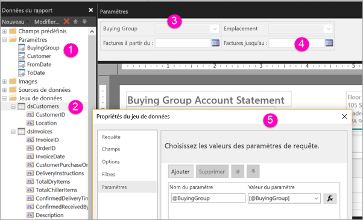

# Créer des paramètres de rapports paginés dans le service Power BI

Dans cet article, vous allez apprendre créer des paramètres de rapports paginés dans le service Power BI.  Un paramètre de rapport permet de choisir des données de rapport et de varier la présentation du rapport. Vous pouvez fournir une valeur par défaut et une liste de valeurs disponibles. Vos lecteurs de rapports peuvent modifier la sélection. Ils ont également la possibilité de taper dans les zones de texte des paramètres pour rechercher des valeurs. Consultez [Affichage des paramètres des rapports paginés](../consumer/paginated-reports-view-parameters.md) pour voir comment vos utilisateurs professionnels interagissent avec les paramètres dans le service Power BI.  

L’illustration suivante montre le mode Design dans le Générateur de rapports Power BI pour un rapport avec les paramètres @BuyingGroup, @Customer, @FromDate et @ToDate. 
  

  
1.  les paramètres du rapport dans le volet Données du rapport ;  
  
2.  La table avec l’un des paramètres du jeu de données.  
  
3.  le volet Paramètres ; Vous pouvez personnaliser la disposition des paramètres dans le volet Paramètres. 
  
4.  Les paramètres @FromDate et @ToDate ont le type de données **DateTime**. Lorsque vous affichez le rapport, vous pouvez taper une date dans la zone de texte ou choisir une date dans le contrôle calendrier. 

5.  L’un des paramètres dans la boîte de dialogue **Propriétés du jeu de données**.  

  
## Créer ou modifier un paramètre de rapport  
  
1.  Ouvrez votre rapport paginé dans le Générateur de rapports Power BI.

1. Dans le volet **Données de rapport**, cliquez avec le bouton droit le **Paramètres** nœud > **Ajouter un paramètre**. La boîte de dialogue **Propriétés du paramètre de rapport** s'ouvre.  
  
2.  Dans **Nom**, tapez un nom pour le paramètre ou acceptez le nom par défaut.  
  
3.  Dans **Invite**, tapez le texte devant apparaître en regard de la zone de texte du paramètre lorsque l’utilisateur exécute le rapport.  
  
4.  Dans **Type de données**, sélectionnez le type de données pour la valeur du paramètre.  
  
5.  Si le paramètre peut contenir une valeur vide, sélectionnez **Autoriser une valeur vide**.  
  
6.  Si le paramètre peut contenir une valeur Null, sélectionnez **Autoriser les valeurs de type NULL**.  
  
7.  Pour autoriser un utilisateur à sélectionner plusieurs valeurs pour le paramètre, sélectionnez **Autoriser les valeurs multiples**.  
  
8.  Définissez l'option de visibilité.  
  
    -   Pour afficher le paramètre dans la barre d'outils en haut du rapport, sélectionnez **Visible**.  
  
    -   Pour masquer le paramètre afin qu’il ne s’affiche pas dans la barre d’outils, sélectionnez **Masqué**.  
  
    -   Pour masquer le paramètre et empêcher sa modification sur le serveur de rapports une fois le rapport publié, sélectionnez **Interne**. Le paramètre de rapport ne peut alors être affiché que dans la définition du rapport. Pour cette option, vous devez définir une valeur par défaut ou autoriser le paramètre à accepter une valeur nulle.  
  
9. Sélectionnez **OK**. 

## Étapes suivantes

Consultez [Afficher les paramètres des rapports paginés](../consumer/paginated-reports-view-parameters.md) pour voir à quoi ressemblent les paramètres dans le service Power BI.

Pour obtenir des informations détaillées sur les paramètres dans les rapports paginés, consultez [Paramètres de rapport dans le Générateur de rapports Power BI](report-builder-parameters.md).
