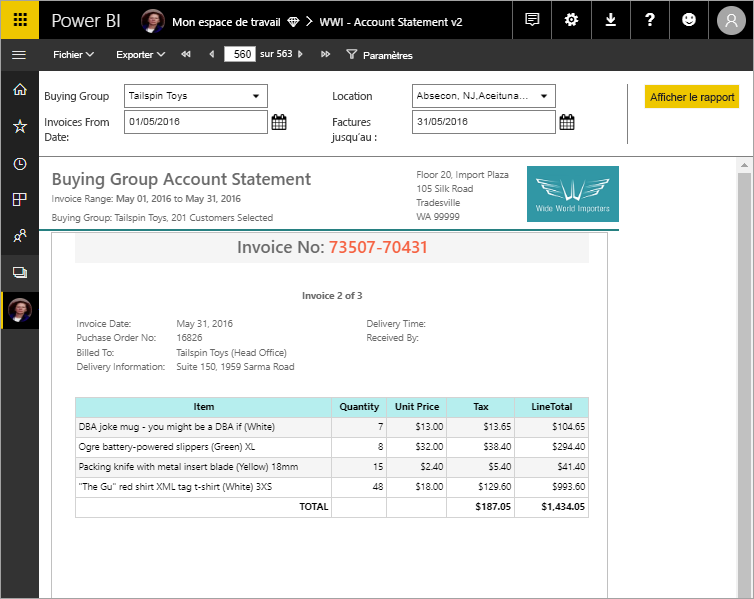

# Présentation des rapports paginés dans Power BI Premium

Les rapports paginés, depuis longtemps le format standard pour les rapports dans SQL Server Reporting Services, sont désormais disponibles dans le service Power BI. Ces rapports peuvent être imprimés ou partagés. Ils sont appelés « paginés », car ils sont mis en forme pour tenir sur une page. Ils affichent toutes les données dans une table, même si la table s’étend sur plusieurs pages. Ils sont parfois appelés « pixel parfait », car vous pouvez contrôler exactement leur mise en page. Les rapports paginés sont basés sur la technologie de rapport RDL dans SQL Server Reporting Services. Le Générateur de rapports est l’outil autonome pour la création de rapports paginés. 

Les rapports paginés peuvent avoir de nombreuses pages. Par exemple, ce rapport compte 563 pages. Chaque page est mise en page exactement, avec une page par facture et des en-têtes et pieds de page récurrents.

Essayez le [Labo pratique : Créer un rapport paginé Microsoft Power BI](https://www.microsoft.com/handsonlabs/selfpacedlabs/details/SQ00208).

Vous pouvez prévisualiser votre rapport dans le Générateur de rapports, puis le publier sur le service Power BI, `https://app.powerbi.com`. Vous avez besoin d’une licence Power BI Pro pour publier un rapport sur le service. Vous pouvez publier et partager des rapports paginés dans Mon espace de travail ou dans les espaces de travail, tant que l’espace de travail est dans une capacité Power BI Premium. Par ailleurs, un administrateur Power BI doit activer les rapports paginés dans la [section Fonctionnalités Premium](../service-admin-premium-workloads.md#paginated-reports) du portail d’administration Power BI. 

## Créer des rapports dans le Générateur de rapports Power BI

Les rapports paginés ont leur propre outil de conception : le Générateur de rapports Power BI. Il s’agit d’un nouvel outil qui partage les mêmes concepts fondamentaux que les outils que vous avez utilisés précédemment pour créer des rapports paginés pour Power BI Report Server ou SQL Server Reporting Services (SSRS). En fait, les rapports paginés que vous créez pour SSRS 2016 et 2017 ou localement pour Power BI Report Server sont compatibles avec le service Power BI. Le service Power BI assure la compatibilité descendante, de sorte que vous pouvez avancer vos rapports et mettre à niveau tous les rapports paginés avec une version précédente. Les fonctionnalités relatives aux rapports ne sont pas toutes disponibles au lancement. Pour plus d’informations, consultez [Considérations et limitations](#limitations-and-considerations) dans cet article.
     
## Rapport basé sur diverses sources de données

Un seul rapport paginé peut avoir un certain nombre de sources de données différentes. Il n’a pas de modèle de données sous-jacent, contrairement aux rapports Power BI. Pour obtenir la version initiale de rapports paginés dans le service Power BI, vous créez des sources de données incorporées et des jeux de données dans le rapport proprement dit. Pour l’instant, vous ne pouvez pas utiliser de sources de données partagées ni de jeux de données partagés. Vous créez des rapports dans le Générateur de rapports sur votre ordinateur local. Si un rapport se connecte à des données locales, après avoir chargé le rapport sur le service Power BI, vous devez créer une passerelle et rediriger la connexion de données. Voici les sources de données auxquelles vous pouvez vous connecter pour le moment :

- Azure SQL Database et Data Warehouse (via De base et OAuth)
- Azure Analysis Services (via SSO)
- SQL Server via une passerelle
- SQL Server Analysis Services via une passerelle
- Jeux de données Power BI
- Oracle
- Teradata

## Créer votre rapport  

### Créer des rapports paginés avec des mises en page matricielles, graphiques et de forme libre

Les rapports de tableaux fonctionnent bien pour les données en colonnes. Les rapports de matrices, comme des rapports d’analyse croisée ou de tableaux croisés dynamiques, conviennent pour les données résumées. Les rapports graphiques présentent les données graphiques et les *listes* de rapports en forme libre peuvent présenter presque tous les autres éléments, comme les factures. 
  
Vous pouvez démarrer avec un des Assistants du Générateur de rapports. Les Assistants Table, Matrice et Graphique vous guident lors de la création de la connexion de source de données incorporées et le jeu de données incorporé. Faites ensuite glisser-déplacer des champs pour créer une requête de jeu de données, sélectionnez une disposition et un style, et personnalisez votre rapport.  
  
Avec l’Assistant Carte, vous créez des rapports qui affichent des données agrégées sur un arrière-plan géographique ou géométrique. Les données cartographiques peuvent être des données spatiales issues d’une requête Transact-SQL ou un fichier de forme de l’Environmental Systems Research Institute, Inc. (ESRI). Vous pouvez également ajouter un arrière-plan de mosaïque Microsoft Bing.  

### Ajouter une page à votre rapport

Modifiez vos données par filtrage, regroupement et tri des données, ou en ajoutant des formules ou des expressions. Ajoutez des graphiques, des jauges, des graphiques sparkline et des indicateurs pour résumer les données dans un format visuel.  Utilisez des paramètres et des filtres pour filtrer les données et obtenir des vues personnalisées. Incorporez ou référencez des images et d’autres ressources, y compris du contenu externe.  

Tous les éléments d’un rapport paginé, du rapport proprement dit à chaque zone de texte, image, table et graphique, a un ensemble de propriétés que vous pouvez définir pour que le rapport ait exactement l’apparence souhaitée.

## Création d’une définition de rapport

Lorsque vous concevez un rapport paginé, vous créez vraiment une *définition de rapport*. Il ne contient pas les données. Il spécifie où obtenir les données, les données à obtenir et comment les afficher. Lorsque vous exécutez le rapport, le processeur de rapports prend la définition de rapport que vous avez spécifiée, récupère les données et les combine avec la disposition du rapport pour le générer. Vous chargez la définition de rapport sur le service Power BI, `https://app.powerbi.com`, sous Mon espace de travail ou dans un espace de travail partagé avec vos collègues. Si la source de données du rapport est locale, après avoir chargé le rapport, vous redirigez la connexion de la source de données à travers une passerelle. 

## Créer votre rapport paginé
Vous affichez votre rapport paginé dans le service Power BI dans un navigateur ainsi que dans les applications mobiles Power BI. À partir du service Power BI, vous pouvez exporter le rapport dans plusieurs formats, dont HTML, MHTML, PDF, XML, CSV, TIFF, Word et Excel. Vous pouvez également le partager avec d’autres utilisateurs.  

## Créer un abonnement à votre rapport

Vous pouvez maintenant configurer des abonnements par e-mail pour vous-même et d’autres personnes pour des rapports paginés dans le service Power BI. En règle générale, le processus est le même que pour les abonnements aux rapports et tableaux de bord dans le service Power BI. Lors de la configuration des abonnements, vous choisissez la fréquence à laquelle vous souhaitez recevoir des e-mails : quotidienne, hebdomadaire ou toutes les heures. L’abonnement contient une pièce jointe PDF avec la sortie de l’intégralité du rapport.

Pour plus d’informations, consultez l’article [Vous abonner vous-même et d’autres utilisateurs à des rapports paginés dans le service Power BI](../consumer/paginated-reports-subscriptions.md). 

## Considérations et limitations

Voici d’autres fonctionnalités qui ne sont pas prises en charge dans la version initiale :

- Épinglage des pages de rapport ou des visuels sur des tableaux de bord Power BI. Vous pouvez toujours épingler des visualisations à un tableau de bord Power BI à partir d’un rapport paginé local sur un serveur Power BI Report Server ou un serveur de rapports Reporting Services. Pour plus d’informations, consultez [Épingler les éléments Reporting Services aux tableaux de bord Power BI](https://docs.microsoft.com/sql/reporting-services/pin-reporting-services-items-to-power-bi-dashboards).
- Explorateurs de documents.
- Sous-rapports et rapports d’extraction.  Vous pouvez cependant envisager d’utiliser des paramètres d’URL avec des rapports paginés pour réaliser des scénarios d’extraction.
- Sources de données et jeux de données partagés.

 
## Étapes suivantes

- [Installer le Générateur de rapports Power BI à partir du Centre de téléchargement Microsoft](https://go.microsoft.com/fwlink/?linkid=2086513)
- [Tutoriel : Créer un rapport paginé](paginated-reports-quickstart-aw.md)
- [Entrer des données directement dans un rapport paginé](paginated-reports-enter-data.md)
- [Labo pratique : Créer un rapport paginé Microsoft Power BI](https://www.microsoft.com/handsonlabs/selfpacedlabs/details/SQ00208)
- [Tutoriel : Incorporer des rapports paginés Power BI dans une application pour vos clients](../developer/embed-paginated-reports-customers.md).