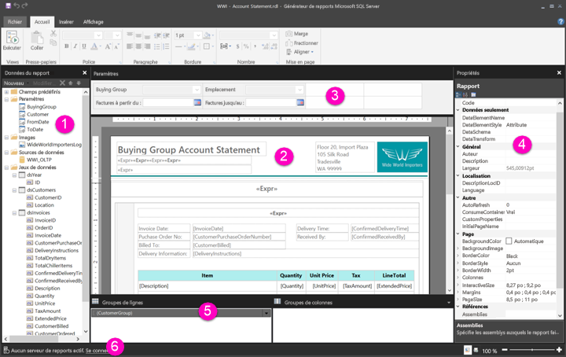

# Découverte du mode Création de rapport pour les rapports paginés - Power BI

[!INCLUDE [applies-to](../includes/applies-to.md)] [!INCLUDE [yes-service](../includes/yes-service.md)] [!INCLUDE [yes-paginated](../includes/yes-paginated.md)] [!INCLUDE [yes-premium](../includes/yes-premium.md)] [!INCLUDE [no-desktop](../includes/no-desktop.md)] 

Le mode Création de rapport du Générateur de rapports Power BI est l’espace de conception pour la création de rapports paginés que vous pouvez publier sur le service Power BI. Le canevas de conception se situe au centre du Générateur de rapports, entouré par le ruban et les volets. L'aire de conception est l'espace où vous ajoutez et organisez vos éléments de rapport. Cet article décrit les volets que vous utilisez pour ajouter, sélectionner et organiser vos ressources de rapport, ainsi que pour modifier les propriétés des éléments de rapport.  

1. [Volet des données de rapport](#1-report-data-pane) 
2. [Canevas de conception du rapport](#2-report-design-surface)  
3. [Volet des paramètres](#3-parameters-pane) 
4. [Propriétés, volet](#4-properties-pane) 
5. [Volet de regroupement](#5-grouping-pane) 
6. [Barre d’état du rapport actif](#6-current-report-status-bar)  
  
## 1 Volet des données de rapport  
 À partir du volet Données du rapport, vous définissez les données de rapport et les ressources de rapport dont vous avez besoin pour un rapport avant de concevoir la disposition de votre rapport. Vous pouvez, par exemple, y ajouter des sources de données, des datasets, des champs calculés, des paramètres de rapport et des images.  
  
 Après avoir ajouté des éléments dans le volet Données du rapport, faites glisser des champs vers des éléments de rapport dans l'aire de conception afin de déterminer où apparaissent les données dans le rapport.  
  
> [!TIP]  
>  Si vous faites glisser un champ du volet Données du rapport directement vers l'aire de conception de rapport au lieu de le placer dans une région de données telle qu'un tableau ou un graphique, lors de l'exécution du rapport, vous voyez s'afficher uniquement la première valeur des données dans ce champ.  
  
 Vous pouvez également faire glisser des champs prédéfinis du volet Données du rapport vers l'aire de conception de rapport. Une fois le rendu effectué, ces champs fournissent des informations sur les rapports, notamment le nom du rapport, le nombre total de pages qu'il contient et le numéro de la page affichée.  
  
 Certains éléments sont ajoutés automatiquement au volet Données du rapport lorsque vous effectuez un ajout dans l'aire de conception de rapport. Par exemple, si vous incorporez une image dans votre rapport, elle sera ajoutée au dossier Images dans le volet des données du rapport.  
  
> [!NOTE]  
>  Vous pouvez utiliser le bouton **Nouveau** pour ajouter un nouvel élément au volet Données du rapport. Vous pouvez ajouter au rapport plusieurs datasets issus d'une même source de données ou de différentes sources de données. Pour ajouter un nouveau jeu de données à partir de la même source de données, cliquez avec le bouton droit sur une source de données, puis sélectionnez **Ajouter un jeu de données**.  
  
## 2 Canevas de conception du rapport  
 L'aire de conception de rapport du Générateur de rapports est la principale zone de travail pour concevoir vos rapports. Pour placer des éléments de rapport, tels que des régions de données, des sous-rapports, des zones de texte, des images, des rectangles et des lignes dans votre rapport, vous devez les ajouter en les faisant glisser du ruban ou de la bibliothèque de parties de rapports vers l’aire de conception. À partir de là, vous pouvez ajouter des groupes, des expressions, des paramètres, des filtres, des actions, une visibilité et une mise en forme à vos éléments de rapport.  
  
 Vous pouvez également modifier les éléments suivants :  
  
-   Les propriétés de corps du rapport, telles que la couleur de la bordure et le remplissage, en double-cliquant sur la zone blanche du canevas de conception, en dehors de tout élément de rapport et en sélectionnant **Propriétés du corps**.  
  
-   Les propriétés d’en-tête et de pied de page, telles que la couleur de la bordure et le remplissage, en double-cliquant sur la zone blanche du canevas de conception au niveau de l’en-tête ou du pied de page, en dehors de tout élément de rapport et en sélectionnant **Propriétés d’en-tête** ou **Propriétés de pied de page**.  
  
-   Les propriétés du rapport lui-même, telles que la mise en page, en double-cliquant sur la zone grise autour du canevas de conception et en sélectionnant **Propriétés du rapport**.  
  
-   Les propriétés des éléments du rapport en double-cliquant dessus et en sélectionnant **Propriétés**.  
  
### Taille du canevas de conception et zone d’impression  
La taille de l'aire de conception peut être différente de la zone d'impression de taille de page que vous spécifiez pour imprimer le rapport. Le fait de modifier la taille de l'aire de conception ne modifie pas la zone d'impression de votre rapport. Quelle que soit la taille que vous définissez pour la zone d'impression de votre rapport, la taille globale de l'aire de conception ne change pas. Pour plus d’informations, consultez la section Comportements de rendu. 
  
- Pour afficher la règle, sous l’onglet **Affichage** , cochez la case **Règle**.  
  
## 3 Volet des paramètres  
 Avec les paramètres de rapport, vous pouvez contrôler les données du rapport, interconnecter des rapports associés et varier la présentation des rapports. Le volet Paramètres fournit une disposition souple pour les paramètres du rapport.  
  
 En savoir plus sur les paramètres du rapport   
  
## 4 Volet des propriétés
 Chaque élément d’un rapport, notamment les régions de données, les images, les zones de texte et le corps du rapport lui-même, est associé à des propriétés. Par exemple, la propriété BorderColor d'une zone de texte affiche la valeur de couleur de la bordure de la zone de texte et la propriété PageSize du rapport affiche la taille de page du rapport.  
  
 Ces propriétés sont affichées dans le volet Propriétés. Les propriétés du volet varient en fonction de l'élément de rapport que vous sélectionnez.  
  
- Pour afficher le volet des propriétés, dans l’onglet **Vue** du groupe **Afficher/masquer** , sélectionnez **Propriétés**.  
  
### Modification des valeurs de propriété  
 Dans le Générateur de rapports, vous pouvez modifier les propriétés des éléments de rapport de plusieurs façons :  
  
-   En sélectionnant des boutons et des listes sur le ruban.  
  
-   en modifiant les paramètres dans les boîtes de dialogue ;  
  
-   en modifiant les valeurs de propriété dans le volet Propriétés.  
  
 Les propriétés les plus couramment utilisées sont disponibles dans les boîtes de dialogue et dans le ruban.  
  
 Selon la propriété sélectionnée, vous pouvez définir une valeur de propriété dans la liste déroulante, taper la valeur ou sélectionner `<Expression>` pour créer une expression.  
  
### Modification de l'affichage du volet Propriétés  
 Par défaut, les propriétés affichées dans le volet Propriétés sont classées en grandes catégories, par exemple Action, Bordure, Remplissage, Police et Général. Un ensemble de propriétés est associé à chaque catégorie. Par exemple, les propriétés suivantes sont répertoriées dans la catégorie Police : Color, FontFamily, FontSize, FontStyle, FontWeight, LineHeight et TextDecoration. Si vous préférez, vous pouvez classer toutes les propriétés répertoriées dans le volet par ordre alphabétique. Les catégories sont ainsi supprimées et toutes les propriétés sont classées par ordre alphabétique, quelle que soit la catégorie.  
  
 Trois boutons apparaissent en haut du volet des propriétés : **Catégorie** , **Alphabétiser** et **Page de propriétés**. Sélectionnez les boutons Catégorie et Alphabétiser pour basculer entre les affichages du volet des propriétés. Sélectionnez le bouton **Pages de propriétés** pour ouvrir la boîte de dialogue des propriétés d’un élément de rapport sélectionné.  
  
  
## 5 Volet de regroupement

 Les groupes sont utilisés pour hiérarchiser vos données de rapport de façon visuelle et pour calculer des totaux. Vous pouvez afficher les groupes de lignes et de colonnes d'une région de données sur l'aire de conception et également dans le volet de regroupement. Le volet de regroupement comprend deux volets : Groupes de lignes et Groupes de colonnes. Lorsque vous sélectionnez une région de données, le volet de regroupement affiche tous les groupes de cette région de données sous forme de liste hiérarchique : les groupes enfants apparaissent en retrait sous leurs groupes parents.  
  
 Vous pouvez créer des groupes en faisant glisser des champs du volet Données du rapport et en les plaçant sur l'aire de conception ou dans le volet de regroupement. Dans le volet de regroupement, vous pouvez ajouter des groupes parents, enfants et adjacents, modifier les propriétés de groupe et supprimer des groupes.  
  
 Le volet de regroupement s’affiche par défaut, mais vous pouvez le fermer en désactivant la case à cocher Volet de regroupement sous l’onglet Vue. Le volet de regroupement n’est pas disponible pour les régions de données Graphique ou Jauge.  
  
 Pour plus d’informations, consultez les sections Volet de regroupement et Présentation des groupes.  
  
## 6 Barre d’état du rapport actif

La barre d’état du rapport actif affiche le nom du serveur auquel le rapport est connecté, ou affiche le message « Aucun serveur de rapports actif. » Vous pouvez sélectionner **Se connecter** pour vous connecter à un serveur.

## Étapes suivantes

[Présentation des rapports paginés dans Power BI Premium](paginated-reports-report-builder-power-bi.md) 

  
  
