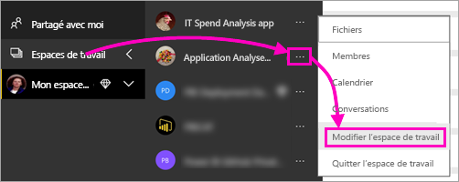
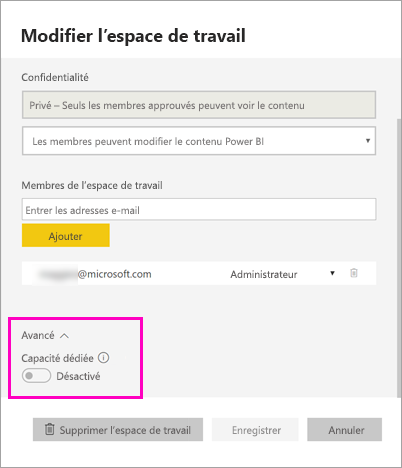
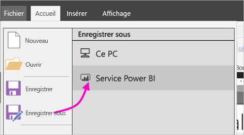
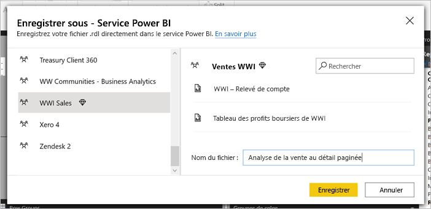
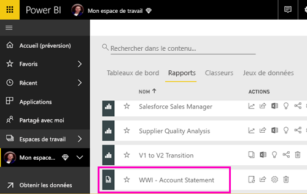
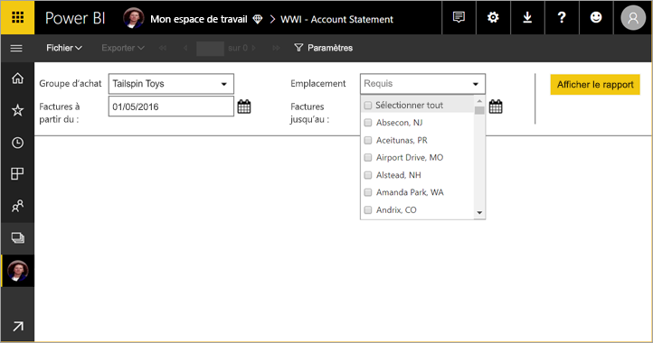
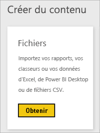
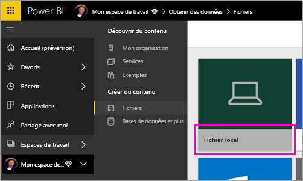
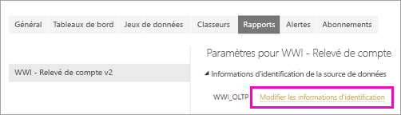
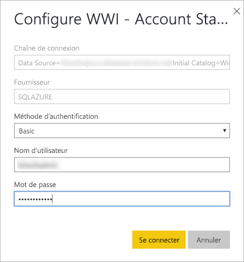

# Publier un rapport paginé dans le service Power BI

Dans cet article, vous apprendrez à publier un rapport paginé dans le service Power BI en le chargeant depuis votre ordinateur local. Vous pouvez charger des rapports paginés vers Mon espace de travail ou d’autres espaces de travail, tant que l’espace de travail figure dans une capacité Premium. Recherchez l’icône en forme de losange  en regard du nom de l'espace de travail. 

Si la source de données de votre rapport est locale, vous devez créer une passerelle après avoir chargé le rapport. Consultez la section [Créer une passerelle](#create-a-gateway) plus loin dans cet article.

## Ajouter un espace de travail à une capacité Premium

Si l’espace de travail n’affiche aucune icône en forme de losange  en regard du nom, vous devez ajouter l’espace de travail à une capacité Premium. 

1. Sélectionnez **Espaces de travail**, choisissez les points de suspension ( **…** ) en regard du nom de l’espace de travail, puis sélectionnez **Membres**.

    

1. Dans la boîte de dialogue **Modifier l’espace de travail**, développez **Avancé**, puis basculez le commutateur **Capacité dédiée** sur **On**.

    

   Vous ne pourrez peut-être pas modifier cette option. Dans ce cas, contactez votre administrateur de capacité Power BI Premium afin qu’il vous donne des droits d’attribution pour ajouter votre espace de travail à une capacité Premium.

## À partir de Report Builder, publier un rapport paginé

1. Créez votre rapport paginé dans le Générateur de rapports et enregistrez-le sur votre ordinateur local.

1. Dans le menu **Fichier** de Report Builder, sélectionnez **Enregistrer sous**.

    

    Si vous n’êtes pas encore connecté à Power BI, vous devez vous y connecter ou créer un compte dès maintenant. Dans l’angle supérieur droit de Report Builder, sélectionnez **Se connecter** et effectuez les étapes.

2. Dans la liste des espaces de travail à gauche, sélectionnez un espace de travail dont le nom est suivi de l’icône de diamant . Tapez un **nom de fichier** dans la zone > **Enregistrer**. 

    

4. Ouvrez le service Power BI dans un navigateur et accédez à l’espace de travail Premium dans lequel vous avez publié le rapport paginé. Sous l’onglet **Rapports**, vous voyez votre rapport.

    

5. Sélectionnez le rapport paginé pour l’ouvrir dans le service Power BI. S’il possède des paramètres, vous devez les sélectionner avant de pouvoir afficher le rapport.

    

6. Si la source de données de votre rapport est locale, découvrez comment [créer une passerelle](#create-a-gateway) dans cet article pour accéder à la source de données.

## À partir du service Power BI, charger un rapport paginé

Vous pouvez aussi charger un rapport paginé à partir du service Power BI.

1. Créez votre rapport paginé dans le Générateur de rapports et enregistrez-le sur votre ordinateur local.

1. Ouvrez le service Power BI dans un navigateur et accédez à l’espace de travail Premium où vous souhaitez publier le rapport. Notez l’icône en forme de losange  en regard du nom. 

1. Sélectionnez **Obtenir les données**.

    

1. Dans la zone **Fichiers** , sélectionnez **Obtenir**.

    

1. Sélectionnez **Fichier local** > naviguez jusqu’au rapport paginé > **Ouvrir**.

    

1. Sélectionnez **Continuer** > **Modifier les informations d'identification**.

    

1. Configurer vos informations d’identification > **Connexion**.

    

   Sous l’onglet **Rapports**, vous voyez votre rapport.

    

1. Sélectionnez-le pour l’ouvrir dans le service Power BI. S’il possède des paramètres, vous devez les sélectionner avant de pouvoir afficher le rapport.
 
    

6. Si la source de données de votre rapport est locale, découvrez comment [créer une passerelle](#create-a-gateway) dans cet article pour accéder à la source de données.

## Créer une passerelle

Comme tout autre rapport Power BI, si la source des données du rapport est locale, vous devez créer ou vous connecter à une passerelle pour accéder aux données.

1. En regard du nom du rapport, sélectionnez **Gérer**.

   

1. Consultez l’article du service Power BI [Qu’est-ce qu’une passerelle de données locale ?](../connect-data/service-gateway-onprem.md) pour plus d’informations et connaître les prochaines étapes.

## Étapes suivantes

- [Afficher un rapport paginé dans le service Power BI](../consumer/paginated-reports-view-power-bi-service.md)
- [Présentation des rapports paginés dans Power BI Premium](paginated-reports-report-builder-power-bi.md)
- [Tutoriel : Incorporer des rapports paginés Power BI dans une application pour vos clients](../developer/embedded/embed-paginated-reports-customers.md)
