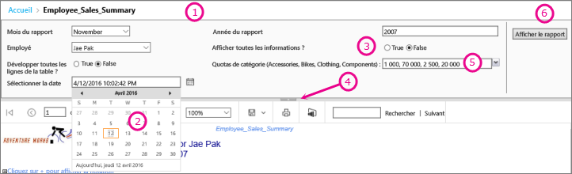
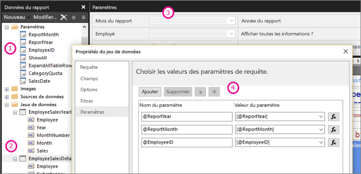

# Paramètres de rapport dans le Générateur de rapports Power BI

[!INCLUDE [applies-to](../includes/applies-to.md)] [!INCLUDE [yes-service](../includes/yes-service.md)] [!INCLUDE [yes-paginated](../includes/yes-paginated.md)] [!INCLUDE [yes-premium](../includes/yes-premium.md)] [!INCLUDE [no-desktop](../includes/no-desktop.md)] 

Cette rubrique décrit les utilisations courantes des paramètres des rapports Power BI Report Builder, les propriétés que l’on peut définir et plus encore. Les paramètres de rapport vous permettent de contrôler les données du rapport, d'interconnecter les rapports associés et de varier la présentation des rapports. Vous pouvez utiliser des paramètres de rapport dans les rapports paginés que vous créez dans le Générateur de rapports.

##  Utilisations courantes des paramètres

 Voici quelques-unes des utilisations les plus courantes des paramètres.  
  
**Contrôler les données des rapports paginés**
  
- Filtrez les données d’un rapport paginé au niveau de la source de données en écrivant des requêtes de jeu de données qui comportent des variables.  
  
- Permettez aux utilisateurs de spécifier des valeurs pour personnaliser les données d’un rapport paginé. Par exemple, fournissez deux paramètres pour la date de début et la date de fin des données de ventes.  
  
**Modifier la présentation du rapport**
  
- Permettez aux utilisateurs de spécifier des valeurs pour contribuer à la personnalisation de l'apparence d'un rapport. Par exemple, fournissez un paramètre booléen pour indiquer s'il faut développer ou réduire tous les groupes de lignes imbriqués dans une table.  
  
- Autorisez les utilisateurs à personnaliser les données et l'apparence des rapports en incluant des paramètres dans une expression.  
  
##  Affichage d’un rapport avec des paramètres

Quand vous visualisez un rapport qui comporte des paramètres, la barre d’outils de la visionneuse de rapports affiche chaque paramètre pour vous permettre de spécifier des valeurs de manière interactive. L’illustration suivante montre la zone de paramètres d’un rapport avec les paramètres @ReportMonth, @ReportYear, @EmployeeID, @ShowAll, @ExpandTableRows, @CategoryQuota et @SalesDate.  

  
1. **Volet Paramètres** : la barre d’outils de la visionneuse de rapports affiche une invite et une valeur par défaut pour chaque paramètre. Vous pouvez personnaliser la disposition des paramètres dans le volet Paramètres.  
  
2. **@SalesDate paramètre** le paramètre @SalesDate est de type de données **DateTime**. L’invite de sélection de date s’affiche en regard de la zone de texte. Pour modifier la date, tapez une nouvelle date dans la zone de texte ou utilisez le contrôle calendrier.  
  
3. **@ShowAll paramètre** le paramètre @ShowAll est de type de données **booléenne**. Utilisez les cases d'option pour spécifier **True** ou **False**.  
  
4. **Poignée Afficher ou masquer la zone de paramètres** : dans la barre d’outils de la visionneuse de rapports, cliquez sur cette flèche pour afficher ou masquer le volet Paramètres.  
  
5. **@CategoryQuota paramètre** le paramètre @CategoryQuota est de type de données **Float**, ce qui prend une valeur numérique.  @CategoryQuota est défini pour autoriser les valeurs multiples.  
  
6. **Afficher le rapport**  : après avoir entré les valeurs des paramètres, cliquez sur **Afficher le rapport** pour exécuter le rapport. Si tous les paramètres possèdent des valeurs par défaut, le rapport s'exécute automatiquement au premier affichage.  
  
##  Création de paramètres

Vous pouvez créer des paramètres de rapport de différentes façons :
  
> [!NOTE]
>  Toutes les sources de données ne prennent pas en charge les paramètres.
  
**Requête de dataset ou procédure stockée avec paramètres**
  
 Ajoutez une requête de dataset qui contient des variables ou une procédure stockée de dataset qui contient des paramètres d'entrée. Un paramètre de dataset est créé pour chaque variable ou paramètre d'entrée, et un paramètre de rapport est créé pour chaque paramètre de dataset.  
  

  
 Cette image du Générateur de rapports montre :  
  
1.  les paramètres du rapport dans le volet Données du rapport ;  
  
2.  le dataset avec les paramètres ;  
  
3.  le volet Paramètres ;  
  
4.  les paramètres répertoriés dans la boîte de dialogue Propriétés du dataset.  
  
**Créer manuellement un paramètre**
  
Créez manuellement un paramètre à partir du volet des données de rapport. Vous pouvez configurer des paramètres de rapport afin qu'un utilisateur puisse entrer de manière interactive des valeurs dans le but de personnaliser le contenu ou l'apparence d'un rapport. Vous pouvez également configurer des paramètres de rapport afin qu'un utilisateur ne puisse pas modifier les valeurs préconfigurées.  
  
> [!NOTE]  
>  Étant donné que les paramètres sont gérés indépendamment sur le serveur, si vous republiez un rapport principal avec de nouveaux paramètres, vous ne remplacez pas les paramètres existants sur le rapport.  

### Valeurs de paramètres

 Utilisez les options suivantes pour sélectionner les valeurs de paramètre dans le rapport.  
  
- Sélectionnez une valeur de paramètre dans la liste déroulante.  
  
- Sélectionnez plusieurs valeurs de paramètre dans la liste déroulante.  
  
- Sélectionnez une valeur dans la liste déroulante pour un paramètre, qui détermine les valeurs disponibles dans la liste déroulante pour un autre paramètre. Il s'agit de paramètres en cascade. Les paramètres en cascade vous permettent de filtrer successivement les valeurs de paramètres afin de passer de milliers de valeurs à un nombre plus gérable. Pour plus d’informations, voir [Utiliser des paramètres en cascade dans les rapports paginés](../guidance/paginated-report-cascading-parameter.md).
  
- Exécutez le rapport sans sélectionner une valeur de paramètre, car une valeur par défaut est créée pour le paramètre.  
  
##  Propriétés des paramètres de rapport

 Vous pouvez modifier les propriétés de paramètre de rapport en utilisant la boîte de dialogue Propriétés du rapport. Le tableau suivant récapitule les propriétés que vous pouvez définir pour chaque paramètre :  
  
|Property|Description|  
|--------------|-----------------|  
|Nom|Tapez un nom de paramètre qui respecte la casse. Le nom doit commencer par une lettre et contenir des lettres, des chiffres, un trait de soulignement (_). Le nom ne peut pas contenir d'espace. Le nom des paramètres générés automatiquement correspond au paramètre dans la requête du jeu de données. Par défaut, les paramètres créés manuellement sont similaires à ReportParameter1.|  
|Prompt|Texte qui apparaît en regard du paramètre dans la barre d'outils de la visionneuse de rapports.|  
|Type de données|Un paramètre de rapport doit avoir l'un des types de données suivants :   **Boolean**. L'utilisateur sélectionne True ou False à l'aide d'une case d'option.   **DateTime**. L'utilisateur sélectionne une date à l'aide d'un contrôle calendrier.   **Integer**. L'utilisateur tape des valeurs dans une zone de texte.   **Float**. L'utilisateur tape des valeurs dans une zone de texte.   **Text**. L'utilisateur tape des valeurs dans une zone de texte.   Lorsque des valeurs disponibles sont définies pour un paramètre, l'utilisateur peut les sélectionner dans une liste déroulante, même lorsque le type de données est **DateTime**.|  
|Autoriser une valeur vide|Sélectionnez cette option si la valeur du paramètre peut être une chaîne ou une valeur vide.   Si vous spécifiez les valeurs valides d'un paramètre et si vous souhaitez qu'une valeur vide soit l'une des valeurs valides, vous devez l'inclure dans les valeurs que vous spécifiez. La sélection de cette option n’inclut pas automatiquement une valeur vide pour les valeurs disponibles.|  
|Autoriser les valeurs de type NULL|Sélectionnez cette option si la valeur du paramètre peut être Null.   Si vous spécifiez les valeurs valides d'un paramètre et si vous souhaitez qu'une valeur Null soit l'une des valeurs valides, vous devez l'inclure dans les valeurs que vous spécifiez. La sélection de cette option n’inclut pas automatiquement une valeur null pour les valeurs disponibles.|  
|Autoriser les valeurs multiples|Fournissez les valeurs disponibles pour la création d'une liste déroulante dans laquelle vos utilisateurs peuvent effectuer des choix. Cela constitue une bonne méthode pour s'assurer que seules les valeurs valides sont envoyées dans la requête de dataset.   Sélectionnez cette option si la valeur pour le paramètre peut être plusieurs valeurs affichées dans une liste déroulante. Les valeurs NULL ne sont pas autorisées. Lorsque cette option est sélectionnée, les cases à cocher sont ajoutées à la liste de valeurs disponibles dans une liste déroulante de paramètre. Le haut de la liste comporte une case à cocher pour **Sélectionner tout**. Les utilisateurs peuvent activer les valeurs qu'ils souhaitent.   Si les données qui fournissent des valeurs changent rapidement, il est possible que la liste visible par l'utilisateur ne soit pas actualisée.|  
|Visible|Sélectionnez cette option pour afficher le paramètre de rapport en haut du rapport quand celui-ci est exécuté. Cette option permet aux utilisateurs de sélectionner des valeurs de paramètre au moment de l'exécution.|  
|Hidden|Sélectionnez cette option pour masquer le paramètre de rapport dans le rapport publié. Les valeurs de paramètre de rapport peuvent toujours être définies sur une URL de rapport, dans une définition d'abonnement ou sur le serveur de rapports.|  
|Interne|Sélectionnez cette option pour masquer le paramètre de rapport. Dans le rapport publié, le paramètre de rapport ne peut être affiché que dans la définition du rapport.|  
|Valeurs disponibles|Si vous avez spécifié les valeurs disponibles d'un paramètre, les valeurs valides s'affichent toujours sous forme de liste déroulante. Par exemple, si vous fournissez des valeurs disponibles pour un paramètre **DateTime** , une liste déroulante de dates s’affiche dans le volet des paramètres à la place d’un contrôle calendrier.   Pour vous assurer qu'une liste de valeurs est cohérente parmi un rapport et des sous-rapports, vous pouvez définir une option sur la source de données afin d'utiliser une transaction unique pour toutes les requêtes des datasets associés à une source de données.   **Note de sécurité** Dans un rapport qui contient un paramètre de type de données **Text**, veillez à utiliser une liste de valeurs disponibles (également appelée liste de valeurs valides) et vérifiez que l’utilisateur qui exécute le rapport dispose uniquement des autorisations nécessaires pour voir les données dans le rapport.|  
|Valeurs par défaut|Définissez les valeurs par défaut à partir d'une requête ou d'une liste statique.   Lorsque chaque paramètre a une valeur par défaut, le rapport s'exécute automatiquement au premier affichage.|  
|Avancé|Définissez l'attribut de définition de rapport **UsedInQuery**, valeur qui indique si ce paramètre affecte directement ou indirectement les données d'un rapport.   **Déterminer automatiquement le moment de l'actualisation**  Choisissez cette option lorsque vous souhaitez que le processeur de rapports détermine un paramètre pour cette valeur. La valeur est **True** si le processeur de rapports détecte une requête de dataset avec une référence directe ou indirecte à ce paramètre ou si le rapport possède des sous-rapports.   **Toujours actualiser**  Choisissez cette option lorsque le paramètre de rapport est utilisé directement ou indirectement dans une requête de dataset ou une expression de paramètre. Cette option affecte la valeur True à **UsedInQuery** .   **Ne jamais actualiser**  Choisissez cette option quand le paramètre de rapport n'est pas utilisé directement ou indirectement dans une requête de dataset ou une expression de paramètre. Cette option affecte la valeur False à **UsedInQuery** .   **Attention** Utilisez **Ne jamais actualiser** avec précaution. Sur le serveur de rapports, **UsedInQuery** permet de contrôler les options de cache pour les données de rapports et les rapports rendus, ainsi que les options de paramètres des rapports d'instantané. Si vous définissez l'option **Ne jamais actualiser** de manière incorrecte, vous risquez de provoquer la mise en cache incorrecte de rapports ou de données de rapports ou de provoquer la présence de données incohérentes dans un rapport d'instantané. |  
  
##   Requête de jeu de données  
 Pour filtrer les données dans la requête de dataset, vous pouvez inclure une clause de restriction qui limite les données récupérées en spécifiant les valeurs à inclure ou exclure dans le jeu de résultats.  
  
 Utilisez le concepteur de requêtes pour la source de données pour générer plus facilement une requête paramétrable.  
  
-   Pour les requêtes Transact-SQL, les différentes sources de données prennent en charge une syntaxe différente pour les paramètres. La prise en charge comprend les paramètres identifiés dans la requête par position ou par nom. Dans le concepteur de requêtes relationnelles, vous devez sélectionner l'option de paramètre pour un filtre afin de créer une requête paramétrable.   
  
-   Pour les requêtes qui sont basées sur une source de données multidimensionnelle telle que Microsoft SQL Server Analysis Services, vous pouvez spécifier s’il faut créer un paramètre basé sur un filtre que vous indiquez dans le Concepteur de requêtes. 
  
##   Gestion des paramètres pour un rapport publié  
 Lorsque vous concevez un rapport, les paramètres de rapport sont enregistrés dans la définition de rapport. Lorsque vous publiez un rapport, les paramètres de rapport sont enregistrés et gérés indépendamment de la définition de rapport.  
  
 Pour un rapport publié, vous pouvez utiliser les éléments suivants :  
  
-   **Propriétés des paramètres de rapport.** Modifiez des valeurs de paramètres du rapport directement sur le serveur de rapports, indépendamment de la définition de rapport.  
  
-   **Abonnements aux rapports.** Vous pouvez spécifier des valeurs de paramètres pour filtrer les données et remettre des rapports par le biais d’abonnements. 
  
 Les propriétés de paramètre que vous définissez pour un rapport publié sont conservées si vous republiez la définition de rapport. Si la définition du rapport est republiée dans le même rapport, et si les noms des paramètres et les types de données restent les mêmes, vos valeurs de propriétés sont conservées. Si vous ajoutez ou supprimez des paramètres dans la définition de rapport, ou si vous modifiez le type de données ou le nom d'un paramètre existant, il peut être nécessaire de modifier les propriétés des paramètres dans le rapport publié.  
  
 Tous les paramètres ne peuvent pas être modifiés dans tous les cas. Si un paramètre de rapport obtient une valeur par défaut d'une requête de dataset, cette valeur ne peut pas être modifiée pour un rapport publié et ne peut pas être modifiée sur le serveur de rapports. La valeur utilisée au moment de l'exécution est déterminée lorsque la requête est lancée ou, dans le cas des paramètres basés sur une expression, lorsque celle-ci est évaluée.  
  
 Les options d'exécution de rapport peuvent affecter le mode de traitement des paramètres. Un rapport qui s'exécute en tant qu'instantané ne peut pas utiliser les paramètres dérivés d'une requête sauf si cette requête inclut des valeurs par défaut pour les paramètres.  
  
##   Paramètres d’un abonnement  
 Vous pouvez définir un abonnement pour un rapport à la demande ou un rapport d'instantané et spécifier les valeurs de paramètres à utiliser lors du traitement de l'abonnement.  
  
-   **Rapports à la demande.**  Pour un rapport à la demande, vous pouvez spécifier une valeur de paramètre différente de la valeur publiée pour chaque paramètre listé pour le rapport. Prenons l'exemple d'un rapport Service d'appel qui utilise un paramètre *Période* pour retourner les demandes du service client de la journée, de la semaine ou du mois en cours. Si la valeur par défaut du paramètre du rapport est égale à **aujourd’hui**, votre abonnement peut utiliser une valeur de paramètre différente (par exemple, **semaine** ou **mois**) pour produire un rapport contenant des chiffres hebdomadaires ou mensuels.  
  
## Étapes suivantes

- [Présentation des rapports paginés dans Power BI Premium](paginated-reports-report-builder-power-bi.md)  
- [Utiliser des paramètres en cascade dans les rapports paginés](../guidance/paginated-report-cascading-parameter.md)
