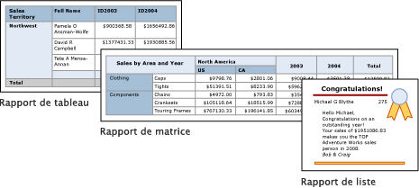

# Tableaux, matrices et listes dans le Générateur de rapports Power BI

[!INCLUDE [applies-to](../includes/applies-to.md)] [!INCLUDE [yes-service](../includes/yes-service.md)] [!INCLUDE [yes-paginated](../includes/yes-paginated.md)] [!INCLUDE [yes-premium](../includes/yes-premium.md)] [!INCLUDE [no-desktop](../includes/no-desktop.md)] 

Dans le Générateur de rapports, les tableaux, les matrices et les listes sont des *régions de données* qui montrent des données de rapports paginés dans des cellules organisées en lignes et en colonnes. Les cellules contiennent en général des données texte, telles que du texte, des dates et des nombres, mais elles peuvent également contenir des jauges, des graphiques ou des éléments de rapport, par exemple des images. Collectivement, les tableaux, les matrices et les listes sont fréquemment appelées des régions de données « *tableau matriciel* ».  
  
 Les modèles de table, de matrice et de liste sont basés sur la région de données de tableau matriciel, qui est une grille flexible pouvant afficher des données dans les cellules. Dans les modèles de table et de matrice, les cellules sont organisées en lignes et en colonnes. Étant donné que les modèles sont des variantes de la région de données de tableau matriciel générique sous-jacente, vous pouvez afficher des données dans une combinaison de formats de modèles et modifier la table, la matrice ou la liste pour inclure les fonctionnalités d’une autre région de données pendant que vous développez votre rapport. Par exemple, si vous ajoutez une table et trouvez qu'elle ne répond pas à vos besoins, vous pouvez ajouter des groupes de colonnes pour transformer la table en matrice.  
  
 Les régions de données « tableau » et « matrice » peuvent afficher des relations de données complexes en incluant des tableaux, des matrices, des listes, des graphiques et des jauges imbriquées. Les tableaux et les matrices ont une disposition tabulaire, et leurs données proviennent d’un même jeu de données, basé sur une même source de données. La principale différence entre les tableaux et les matrices est que les tableaux peuvent inclure seulement des groupes de lignes, tandis que les matrices ont des groupes de lignes et des groupes de colonnes.  
  
 Les listes sont un peu différentes. Elles prennent en charge une disposition libre qui peut inclure plusieurs tableaux ou matrices appairées, chacune utilisant des données provenant d’un jeu de données différent. Les listes peuvent également être utilisées pour des formulaires, tels que les factures.  
  
 Les images suivantes affichent des rapports simples avec une table, matrice ou liste.  

  
##   Tableaux  
 Utilisez une table pour afficher des données de détail, organiser les données dans des groupes de lignes, ou les deux. Le modèle Table comporte trois colonnes avec une ligne d'en-tête de table et une ligne de détails pour les données. L'illustration suivante montre le modèle de table initial sélectionné sur l'aire de conception :  

  
 Vous pouvez grouper des données selon un champ unique, selon plusieurs champs ou en écrivant votre propre expression. Vous pouvez créer des groupes imbriqués ou des groupes indépendants et adjacents, et afficher des valeurs agrégées pour les données groupées, ou ajouter des totaux aux groupes. Par exemple, si votre tableau a un groupe de lignes appelé **Catégorie**, vous pouvez ajouter un sous-total pour chaque groupe ainsi qu’un total général pour le rapport. Pour améliorer l'apparence de la table et mettre en surbrillance les données que vous souhaitez mettre en évidence, vous pouvez fusionner les cellules et appliquer une mise en forme aux données et titres de table.  
  
 Vous pouvez au départ masquer les données groupées ou les données de détail et inclure des bascules d'extraction pour permettre à un utilisateur de choisir de manière interactive les données à afficher.  
  
##   Matrices  
 Utilisez une matrice pour afficher des résumés de données agrégées, regroupés dans des lignes et des colonnes, et qui s'apparentent à un tableau croisé dynamique ou à une analyse croisée. Le nombre de lignes et de colonnes des groupes est déterminé par le nombre de valeurs uniques de chaque groupe de lignes et de colonnes. L'illustration suivante montre le modèle de matrice initial sélectionné sur l'aire de conception :  

 
 Vous pouvez regrouper des données en fonction de plusieurs champs ou expressions dans des groupes de lignes et de colonnes. Au moment de l'exécution, lorsque les régions de données et données de rapport sont combinées, une matrice se développe horizontalement et verticalement sur la page à mesure que des colonnes pour les groupes de colonnes et des lignes pour les groupes de lignes sont ajoutées. Les cellules de matrice affichent des valeurs d'agrégation limitées à l'intersection des groupes de lignes et de colonnes auxquels la cellule appartient. Par exemple, si votre matrice a un groupe de lignes (Category) et deux groupes de colonnes (Territory et Year) qui affichent la somme des ventes, le rapport affiche deux cellules avec les sommes des ventes pour chaque valeur dans le groupe Category. L’étendue des cellules aux deux intersections est : Category et Territory et Category et Year. La matrice peut inclure des groupes imbriqués et adjacents. Les groupes imbriqués ont une relation parent-enfant et les groupes adjacents ont une relation d'égal à égal. Vous pouvez ajouter des sous-totaux pour tous les niveaux de groupes de lignes et de colonnes imbriqués dans la matrice.  
  
 Pour rendre les données de matrice plus lisibles et mettre en surbrillance les données que vous souhaitez mettre en évidence, vous pouvez fusionner les cellules ou fractionner horizontalement et verticalement, et appliquer une mise en forme aux données et titres de table.  
  
 Vous pouvez également inclure des bascules d'extraction qui permettent initialement de masquer les données de détail ; l'utilisateur peut ensuite cliquer sur ces bascules pour afficher plus ou moins de détails, en fonction de ses besoins.  
  
##   Listes  
 Utilisez une liste pour créer une disposition de forme libre. Comme vous n'êtes pas limité à une disposition sous forme de grille, vous pouvez placer librement des champs à l'intérieur de la liste. Vous pouvez utiliser une liste pour concevoir un formulaire permettant d'afficher de nombreux champs du dataset ou en tant que conteneur permettant d'afficher côte à côte plusieurs régions de données pour les données groupées. Par exemple, vous pouvez définir un groupe pour une liste, ajouter une table, un graphique et une image, et afficher les valeurs sous forme de table et de graphique pour chaque valeur de groupe, comme vous le feriez pour un fichier d'employés ou de patients.  

  
##   Préparation des données  
 Les régions de données de table, de matrice et de liste affichent les données d'un dataset. Vous pouvez préparer les données dans la requête qui récupère les données pour le dataset ou en définissant des propriétés dans la table, matrice ou liste.  
  
 Les langages de requête comme Transact-SQL, que vous utilisez pour récupérer les données pour les jeux de données des rapports, peuvent préparer les données en appliquant des filtres pour inclure seulement un sous-ensemble des données, en remplaçant les valeurs null ou vides par des constantes qui rendent le rapport plus lisible, et en triant et en regroupant les données.  
  
 Si vous choisissez de préparer les données dans la région de données de table, matrice ou liste d'un rapport, vous définissez des propriétés sur la région de données ou les cellules dans la région de données. Si vous souhaitez filtrer ou trier les données, définissez les propriétés sur la région de données. Par exemple, pour trier les données, vous spécifiez les colonnes à trier et le sens du tri. Si vous souhaitez fournir une autre valeur pour un champ, vous définissez les valeurs du texte de cellule qui affiche le champ. Par exemple, pour afficher Vide lorsqu'un champ a une valeur vide ou Null, vous utilisez une expression pour définir la valeur.  
  
##   Création et configuration d’un tableau, d’une matrice ou d’une liste  
 Quand vous ajoutez des tableaux ou des matrices à votre rapport, vous pouvez utiliser l’Assistant Table et matrice, ou les créer manuellement à partir de modèles fournis par le Générateur de rapports. Les listes sont créées manuellement à partir du modèle de liste.  
  
 L'Assistant vous guide pendant la procédure pour générer et configurer rapidement une table ou matrice. Une fois l'Assistant terminé ou si vous créez les régions de données de tableau matriciel de bout en bout, vous pouvez les configurer et les améliorer davantage. Les boîtes de dialogue, disponibles dans les menus contextuels sur les régions de données, facilitent la définition des propriétés utilisées le plus souvent pour les sauts de page, la répétition et la visibilité des en-têtes et pieds de page, les options d'affichage, les filtres et le tri. En outre, la région de données de tableau matriciel fournit une multitude de propriétés supplémentaires, que vous pouvez définir uniquement dans le volet Propriétés du Générateur de rapports. Par exemple, si vous souhaitez afficher un message quand le dataset pour une table, matrice ou liste est vide, vous spécifiez le texte du message dans la propriété de tableau matriciel NoRowsMessage dans le volet Propriétés.  
  
##   Changement de modèle de tableau matriciel  
 Vous n'êtes pas tenu de rester à votre choix de modèle de tableau matriciel initial. À mesure que vous ajoutez des groupes, des totaux et des étiquettes, vous pouvez être amené à apporter des modifications à votre conception de tableau matriciel. Par exemple, vous pouvez commencer avec une table, puis supprimer la ligne de détails et ajouter des groupes de colonnes.  
  
 Vous pouvez poursuivre le développement d'une table, d'une matrice ou d'une liste en y ajoutant toute fonctionnalité de tableau matriciel. Les fonctionnalités de tableau matriciel assurent l'affichage de données de détail ou d'agrégats de données groupées dans des lignes et des colonnes. Vous pouvez créer des groupes imbriqués, des groupes adjacents indépendants ou des groupes récursifs. Vous pouvez filtrer et trier des données groupées et facilement associer des groupes en incluant plusieurs expressions de groupe dans une définition de groupe.  
  
 Vous pouvez également ajouter les totaux d'un groupe ou les totaux généraux de la région de données. Vous pouvez masquer des lignes ou des colonnes pour simplifier un rapport et permettre à l'utilisateur d'activer l'affichage de données masquées, comme dans un rapport d'extraction. 

## Étapes suivantes

- [Présentation des rapports paginés dans Power BI Premium](paginated-reports-report-builder-power-bi.md)
