# Changer la taille d’une page de rapport
Dans [l’article précédent et la vidéo qui l’accompagne](power-bi-report-display-settings.md), vous avez découvert deux paramètres permettant de contrôler l’affichage des pages dans les rapports Power BI : **Affichage** et **Taille de la page**. Les modes Affichage et Taille de la page sont disponibles dans le service Power BI et dans Power BI Desktop. Ils ont presque le même fonctionnement, mais dans ce didacticiel, nous utilisons le service Power BI.

### Conditions préalables
- Service Power BI   
- [Rapport Exemple Analyse de la vente au détail](sample-retail-analysis.md)

## Tout d’abord, nous allons modifier le paramètre d’affichage de la page.

1. Ouvrez le rapport en mode Lecture ou en mode Édition et sélectionnez l’onglet de rapport correspondant à **New Stores (Nouveaux magasins)**. Par défaut, cette page de rapport s’affiche avec le paramètre **Ajuster à la page**.  Dans ce cas, la page de rapport s’affiche sans barre de défilement, mais certains titres et détails sont difficilement lisibles car trop petits.

   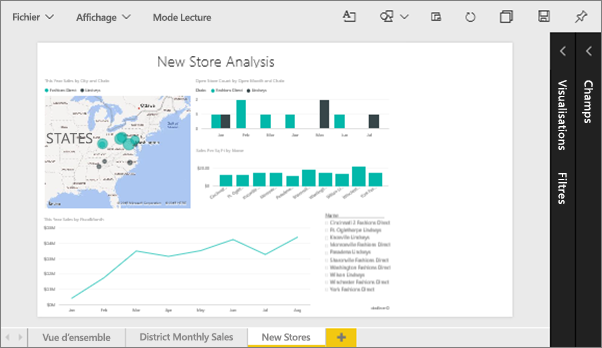
2. Assurez-vous qu’aucune visualisation n’est sélectionnée sur le canevas. Sélectionnez **Affichage** et passez en revue les options d’affichage.

    * En mode Lecture, vous verrez ceci.

     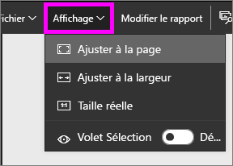
    * En mode Edition, vous verrez ceci.

    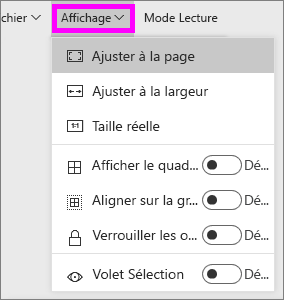

1. Voyons comment la page s’affiche avec le paramètre **Taille réelle**.

   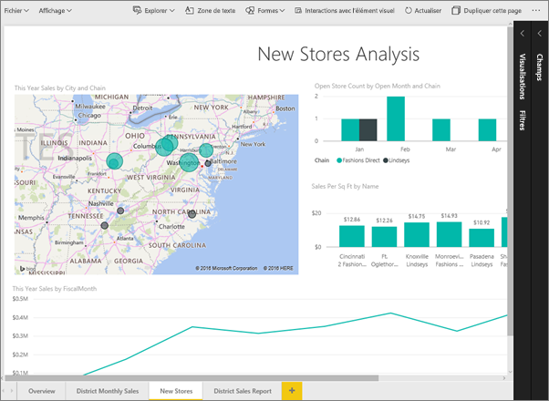

   Pas très bien. Le tableau de bord a maintenant deux barres de défilement.
2. Changez le paramètre en **Ajuster à la largeur**.

   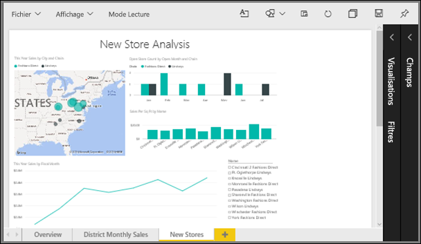

   L’affichage est meilleur. Nous avons maintenant des barres de défilement, mais les détails sont plus faciles à lire.

## Modifier l’affichage par défaut d’une page de rapport
Si vous êtes le *créateur* du rapport, vous pouvez modifier l’affichage par défaut de vos pages de rapport. Lorsque vous partagez votre rapport avec d’autres utilisateurs, les pages du rapport s’ouvrent avec l’affichage que vous avez défini. Les *consommateurs* du rapport sont en mesure de modifier l’affichage, mais ils ne peuvent pas enregistrer leurs modifications une fois qu’ils quittent le rapport.

1. Dans la page **New stores** (Nouveaux magasins) du rapport, revenez à l’affichage **Taille réelle**.

   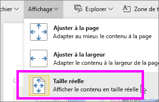

2. Sur la page de rapport **District Monthly Sales (Ventes mensuelles par région)**, définissez l’affichage sur **Ajuster à la largeur**.

3. Sur la page de rapport **Vue d’ensemble**, laissez le paramètre d’affichage par défaut.

4. Enregistrez maintenant le rapport en sélectionnant **Fichier > Enregistrer**. À la prochaine ouverture de ce rapport, les pages seront affichées avec les nouveaux paramètres d’affichage. Voyons ce que cela donne.

   
3. Sélectionnez le nom de l’espace de travail en cours dans la barre de navigation supérieure pour revenir à cet espace de travail.  

   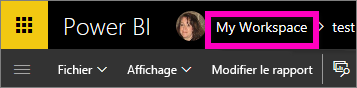
4. Sélectionnez l’onglet **Rapports** et choisissez le même rapport (Exemple Analyse de la vente au détail).

    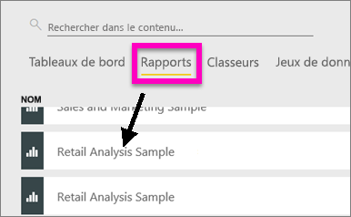
5. Ouvrez chaque page du rapport pour voir les nouveaux paramètres.

   

## Explorons maintenant le paramètre de *taille de la page*.
Les paramètres de taille de page sont disponibles uniquement en [mode Édition](service-interact-with-a-report-in-editing-view.md). Vous devez donc disposer d’autorisations de modification (*créateur*) sur le rapport pour modifier les paramètres de taille de page. Si vous vous êtes connecté à l’un de nos [exemples](sample-datasets.md), vous disposez des autorisations de *créateur* sur ces rapports.

1. Ouvrez la page « District Monthly Sales » (Ventes mensuelles par région) de l’[Exemple Analyse de la vente au détail](sample-retail-analysis.md) en mode Édition.
2. Assurez-vous qu’aucune visualisation n’est sélectionnée sur le canevas.  Dans le volet **Visualisations**, sélectionnez l’icône représentant un rouleau .
3. Sélectionnez **Taille de la page** &gt; **Type** pour afficher les options de taille de page.

   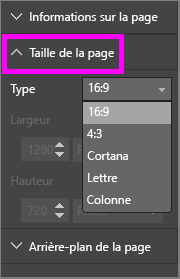
4. Sélectionnez **Lettre**.  Sur le canevas, seul le contenu qui s’ajuste au format lettre 816 x 1056 pixels reste affiché dans la partie blanche du canevas.

   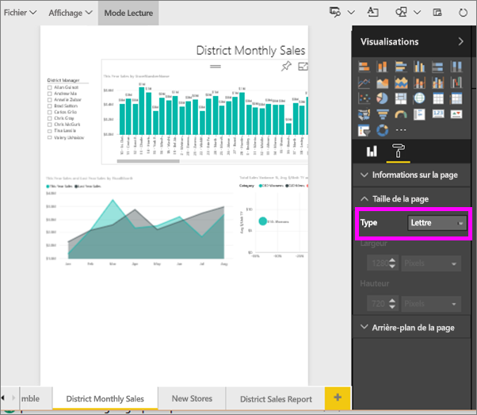
5. Sélectionnez **Taille de la page** **Ratio 16:9**.

   

   La page du rapport s’affiche dans les proportions suivantes : 16 en largeur par 9 en hauteur. La taille réelle, en pixels, actuellement utilisée est indiquée dans les champs grisés Largeur et Hauteur (1280 x 720). Il y a beaucoup d’espace vide autour du canevas du rapport, car nous avons précédemment défini le paramètre **Affichage** sur « Ajuster à la largeur ».
7. Explorez les autres options **Taille de la page** proposées.

## Utilisation conjointe des paramètres Affichage et Taille de la page
Utilisez les deux paramètres Affichage et Taille de la page pour créer un rapport optimisé lorsqu’il est partagé avec des collègues ou incorporé dans une autre application.

Dans cet exercice, vous allez créer une page de rapport qui s’affiche dans une application qui a de l’espace pour une taille de 500 pixels de large sur 750 pixels de haut.

L'étape précédente rappelle que notre page de rapport s’affiche actuellement en 1 280 x 720 pixels. Nous savons donc que nous allons devoir tout redimensionner et réorganiser si nous voulons que tous nos éléments visuels apparaissent.

1. Redimensionnez et déplacez les éléments visuels afin qu’ils occupent moins de la moitié de la zone de canevas en cours.

    
2. Sélectionnez **Taille de la page** &gt; **Personnalisé**.
3. Définissez la largeur sur 500 et la hauteur sur 750.

    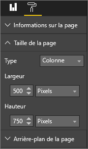
4. Ajustez la page de rapport afin qu’elle s’affiche de façon optimale. Passez du mode **Affichage > Taille réelle** au mode **Affichage > Ajuster à la page** pour effectuer quelques ajustements.

    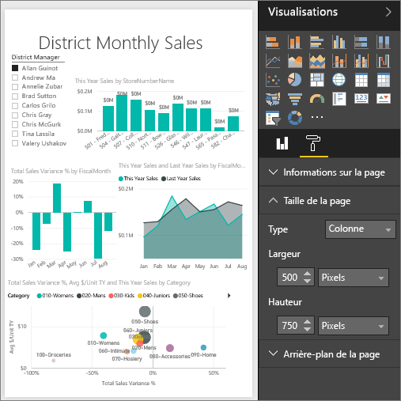

## Étapes suivantes
[Créer des rapports pour Cortana](service-cortana-answer-cards.md)

Revenir à [Paramètres d’affichage de page dans un rapport Power BI](power-bi-report-display-settings.md)

D’autres questions ? [Posez vos questions à la communauté Power BI](http://community.powerbi.com/)
