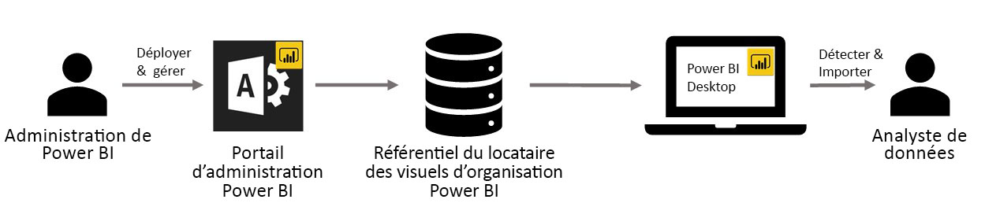

# Utiliser des visuels personnalisés d’une organisation dans Power BI

Vous pouvez utiliser des visuels personnalisés dans Power BI pour créer un type de visuel unique, spécialement adapté à vos besoins ou aux informations précises que vous souhaitez transmettre. Souvent, ces visuels personnalisés sont créés par des développeurs et lorsque la multitude de visuels inclus dans Power BI ne répond pas tout à fait à leurs attentes. 

Dans certaines organisations, des visuels personnalisés sont encore plus importants : ils peuvent être nécessaires pour transmettre des données spécifiques ou des informations précises propres à l’organisation, présenter des contraintes liées à des données spéciales, ou mettre en évidence des méthodes privées de l’entreprise. Ces organisations doivent développer des visuels personnalisés, les partager dans toute l’entreprise, et s’assurer que ces visuels sont gérés correctement. Les visuels personnalisés Power BI permettent à ces organisations d’atteindre ces objectifs.

L’image suivante montre le processus dans lequel des visuels personnalisés d’une organisation dans Power BI passent de l’administrateur à l’analyste de données via le développement et la maintenance.

Les visuels d’une organisation sont déployés et gérés par l’administrateur Power BI à partir du portail d’administration. Une fois ces visuels déployés dans le référentiel de l’organisation, les utilisateurs peuvent facilement les découvrir et les importer dans leurs rapports, directement depuis Power BI Desktop.

Pour en savoir plus sur l’utilisation des visuels personnalisés d’une organisation dans les rapports que vous avez créés, consultez l’article suivant : [En savoir plus sur l’importation de visuels d’une organisation dans vos rapports](power-bi-custom-visuals.md).

## Administrer les visuels personnalisés d’une organisation

Pour en savoir plus sur la façon de gérer, déployer et gérer des visuels personnalisés d’organisation dans votre organisation, consultez l’article suivant : [En savoir plus sur déploiement et la gestion des visuels personnalisés d’une organisation](https://go.microsoft.com/fwlink/?linkid=866790).

> [!WARNING]
> Un visuel personnalisé peut contenir du code présentant des risques en matière de sécurité ou de confidentialité. Assurez-vous que vous faites confiance à l’auteur et à la source d’un visuel personnalisé avant de le déployer dans le référentiel de l’organisation.

## Considérations et limitations

Il existe plusieurs considérations et limitations que vous devez connaître.

Admin :

* les visuels personnalisés hérités (par exemple les visuels personnalisés qui ne reposent pas sur les nouvelles API avec version gérée) ne sont pas pris en charge

* Si un visuel personnalisé est supprimé du référentiel, tous les rapports existants qui utilisent le visuel supprimé ne s’afficheront plus. L’opération de suppression du référentiel n’est pas réversible. Pour désactiver temporairement un élément visuel personnalisé, utilisez la fonctionnalité « Désactiver ».

Utilisateur final :

* Les visuels personnalisés d’une organisation sont des visuels privés importés à partir du référentiel de l’organisation. Comme tous les visuels privés, ils ne peuvent pas être [exportés vers PowerPoint](https://docs.microsoft.com/power-bi/consumer/end-user-powerpoint) ou affichées dans des e-mails reçus quand un utilisateur [s’abonne aux pages de rapport](https://docs.microsoft.com/power-bi/consumer/end-user-subscribe). Seuls les [visuels personnalisés certifiés](https://docs.microsoft.com/power-bi/power-bi-custom-visuals-certified) importés directement à partir de la place de marché prennent en charge ces fonctionnalités.

* Les visuels Visio, PowerApps, carte de texte et GlobeMap provenant de la place de marché AppSource ne s’affichent pas s’ils sont déployés via le référentiel de l’organisation.

## Résoudre les problèmes

Pour plus d’informations, visitez [Résolution des problèmes de vos visuels personnalisés Power BI](power-bi-custom-visuals-troubleshoot.md).

## FORUM AUX QUESTIONS

Pour plus d’informations et des réponses à vos questions, visitez [Questions fréquentes sur les visuels personnalisés Power BI](power-bi-custom-visuals-faq.md#organizational-custom-visuals).

D’autres questions ? [Posez vos questions à la Communauté Power BI](http://community.powerbi.com/).
