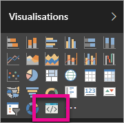

# Résoudre les problèmes de visuels personnalisés Power BI

## Déboguer

**Commande Pbiviz introuvable (ou erreurs similaires)**

Quand vous exécutez `pbiviz` dans la ligne de commande de votre terminal, vous devez voir l’écran d’aide. Si ce n’est pas le cas, cela signifie qu’il n’est pas installé correctement. Assurez-vous d’avoir au moins la version 4.0 de NodeJS installée.

**Impossible de trouver le visuel de débogage sous l’onglet Visualisations**

Le visuel de débogage ressemble à une icône d’invite sous l’onglet **Visualisations**.

Si vous ne le voyez pas, assurez-vous que vous l’avez activé dans les paramètres de Power BI.

> [!NOTE]
> Le visuel de débogage est actuellement disponible uniquement dans le service Power BI, pas dans Power BI Desktop ou dans l’application mobile. Le visuel empaqueté fonctionne partout.

**Impossible de contacter le serveur de visuels**

Exécutez le serveur de visuels avec la commande `pbiviz start` dans la ligne de commande de votre terminal à partir de la racine de votre projet de visuel. Si le serveur est en cours d’exécution, vos certificats SSL n’ont probablement pas été correctement installés.

## Étapes suivantes

Pour plus d’informations et des réponses à vos questions, visitez [Questions fréquentes sur les visuels personnalisés Power BI](power-bi-custom-visuals-faq.md#organizational-custom-visuals).