# Éléments visuels personnalisés dans Power BI
Lorsque vous créez ou modifiez un rapport Power BI, il existe plusieurs types de visuels que vous pouvez utiliser. Ces visuels s’affichent dans le volet **Visualisations**. Lorsque vous téléchargez Power BI Desktop ou que vous ouvrez le service Power BI (app.powerbi.com), cet ensemble de visuels est fourni par défaut.

Mais vous n’êtes pas limité à cet ensemble de visuels : la sélection des points de suspension a pour effet d’ouvrir une autre source de visuels de rapport : *les visuels personnalisés*.

Les visuels personnalisés sont créés par les développeurs à l’aide du Kit SDK correspondant, pour permettre aux utilisateurs professionnels d’afficher leurs données de la manière qui leur convient le mieux. Les auteurs de rapports peuvent ensuite importer les fichiers de visuels personnalisés dans leurs rapports et les utiliser comme n’importe quel autre visuel Power BI. Les visuels personnalisés sont des objets essentiels dans Power BI et ils peuvent être filtrés, mis en surbrillance, édités, partagés, etc.

Les visuels personnalisés se présentent sous la forme de 3 canaux de déploiement :
* Fichiers de visuels personnalisés
* Visuels de l’organisation
* Visuels de la Place de marché

## Fichiers de visuels personnalisés

Les visuels personnalisés sont des packages qui incluent du code pour afficher les données qu’ils reçoivent. Toute personne peut créer un visuel personnalisé et l’empaqueter dans un fichier .pbiviz unique, qui peut être importé dans un rapport Power BI.

> [!WARNING]
> Un visuel personnalisé est susceptible de contenir du code présentant des risques pour la sécurité ou la confidentialité ; vérifiez que vous faites confiance à son auteur et à sa source avant de l’importer dans votre rapport.
> 
> 

## Visuels de l’organisation (préversion)

Les administrateurs Power BI peuvent déployer des visuels personnalisés dans leur organisation et permettre ainsi aux auteurs de rapports d’explorer et d’utiliser facilement les visuels personnalisés que l’administrateur a approuvés pour une utilisation dans l’entreprise. L’administrateur peut donc choisir des visuels personnalisés spécifiques à déployer dans l’organisation, et il bénéficie d’une méthode simple pour gérer (par exemple, mettre à jour, désactiver/activer) ces visuels. Pour l’auteur du rapport, c’est un moyen simple de découvrir les visuels propres à l’organisation et de garantir la mise à jour de ces visuels.

Pour plus d’informations sur les visuels personnalisés d’une organisation, consultez [En savoir plus sur les visuels d’une organisation](power-bi-custom-visuals-organization.md).

## Visuels de la Place de marché

Les membres de la communauté, ainsi que Microsoft, ont mis à disposition du public leurs propres visuels sur la Place de marché [AppSource](https://appsource.microsoft.com/en-us/marketplace/apps?product=power-bi-visuals). Vous pouvez télécharger et ajouter ces visuels à des rapports Power BI. Tous ces visuels personnalisés ont été testés et approuvés par Microsoft en termes de fonctionnalité et de qualité.

Présentation d’AppSource Il s’agit simplement de l’endroit où vous pouvez rechercher des applications, des compléments et des extensions pour vos logiciels Microsoft. [AppSource](https://appsource.microsoft.com/en-us/) connecte des millions d’utilisateurs de produits Office 365, Azure, Dynamics 365, Cortana et Power BI à des solutions qui les aident à effectuer leur travail de façon plus efficace, intelligente et élaborée.

### Visuels certifiés

Les visuels certifiés Power BI sont des visuels de la Place de marché qui ont passé des tests de qualité rigoureux et qui sont pris en charge dans d’autres scénarios, notamment les [abonnements par e-mail](https://docs.microsoft.com/en-us/power-bi/service-report-subscribe) et l’[exportation vers PowerPoint](https://docs.microsoft.com/en-us/power-bi/service-publish-to-powerpoint).
Pour afficher la liste des visuels personnalisés certifiés ou pour soumettre les vôtres, voir [Visuels personnalisés certifiés](https://docs.microsoft.com/en-us/power-bi/power-bi-custom-visuals-certified).

Vous êtes un développeur web et souhaitez créer vos propres visualisations et les ajouter à AppSource ? Visitez la page de [prise en main des outils de développement](https://docs.microsoft.com/en-us/power-bi/service-custom-visuals-getting-started-with-developer-tools) et découvrez comment [publier des visuels personnalisés dans AppSource](https://appsource.microsoft.com/en-us/marketplace/apps?product=power-bi-visuals).

### Importer des visuels personnalisés à partir d'un fichier

1. En bas du volet Visualisations, sélectionnez les points de suspension.

    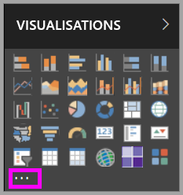

2. Dans la liste déroulante, sélectionnez **Importer à partir d'un fichier**.

    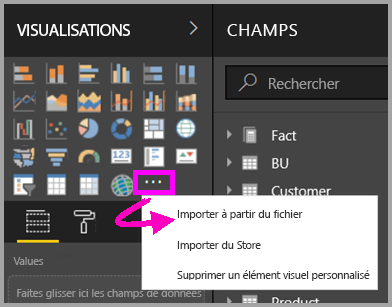

3. Dans le menu Ouvrir un fichier, sélectionnez le fichier .pbiviz que vous souhaitez importer, puis choisissez Ouvrir. L’icône du visuel personnalisé est ajoutée au bas du volet Visualisations et est ensuite disponible pour une utilisation dans votre rapport.

    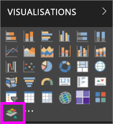

### Importer des visuels d’organisation

1. En bas du volet Visualisations, sélectionnez les points de suspension.

    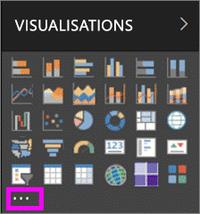

2. Dans la liste déroulante, sélectionnez Importer à partir de la Place de marché.

    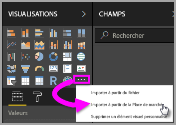

3. Sélectionnez **MON ORGANISATION** dans le menu de l’onglet supérieur.

    

4. Faites défiler la liste pour rechercher le visuel à importer.
    
    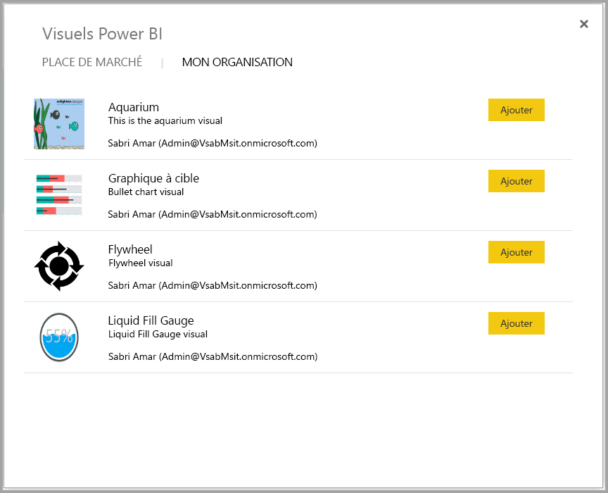

5. Importez le visuel personnalisé en sélectionnant **Ajouter**. L’icône du visuel personnalisé est ajoutée au bas du volet Visualisations et est ensuite disponible pour une utilisation dans votre rapport.

    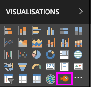
 
## Télécharger ou importer des visuels personnalisés à partir de Microsoft AppSource
Vous avez deux options pour le téléchargement et l’importation de visuels personnalisés : à partir de Power BI et du site web AppSource.

### Importer des visuels personnalisés à partir de Power BI

1. En bas du volet Visualisations, sélectionnez les points de suspension.

    

2. Dans la liste déroulante, sélectionnez **Importer à partir de la Place de marché**.

    

3. Faites défiler la liste pour rechercher le visuel à importer.

    

4. Pour en savoir plus sur un des visuels, mettez-le en surbrillance et sélectionnez-le.

    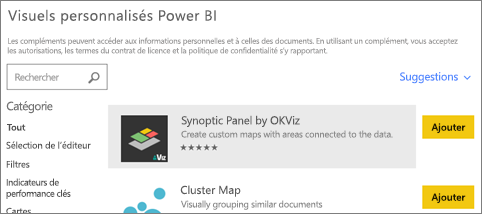

5. Sur la page de détails, vous pouvez voir des captures d’écran, des vidéos, une description détaillée et bien plus encore.

    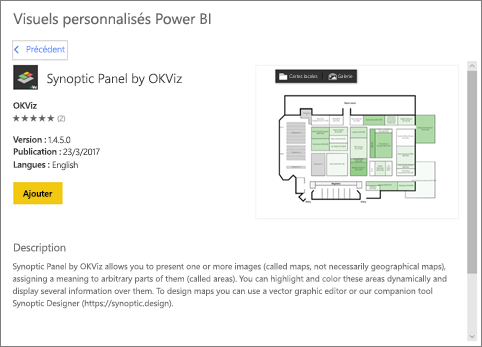

6. Faites défiler vers le bas pour voir les avis.

    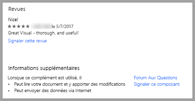

7. Importez le visuel personnalisé en sélectionnant Ajouter. L’icône du visuel personnalisé est ajoutée au bas du volet Visualisations et est ensuite disponible pour une utilisation dans votre rapport.

    

### Télécharger et importer des visuels personnalisés à partir de Microsoft AppSource

1. Ouvrez [Microsoft AppSource](https://appsource.microsoft.com) et sélectionnez l’onglet **Applications**. 

    

2. Vous accédez alors à la [page de résultats d’applications](https://appsource.microsoft.com/en-us/marketplace/apps) dans laquelle vous pouvez afficher les principales applications dans chaque catégorie, y compris des *applications Power BI*. Toutefois, comme vous recherchez des visuels personnalisés, limitez les résultats en sélectionnant **Visuels Power BI** dans la liste de navigation gauche.

    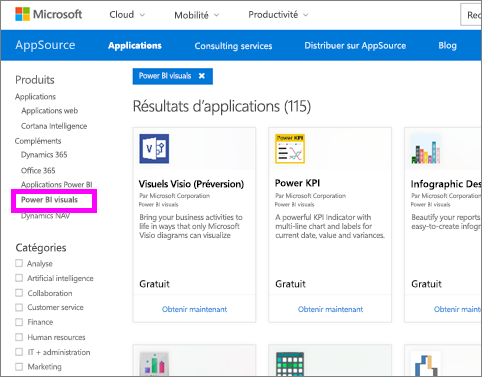

3. AppSource affiche une vignette pour chaque visuel personnalisé.  Chaque vignette a un instantané du visuel personnalisé et donne une brève description et un lien de téléchargement. Pour afficher plus de détails, sélectionnez la vignette. 

    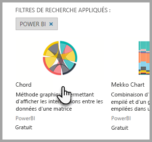

4. Sur la page de détails, vous pouvez voir des captures d’écran, des vidéos, une description détaillée et bien plus encore. Pour télécharger le visuel personnalisé, sélectionnez **Obtenir maintenant**, puis acceptez les conditions d’utilisation. 

    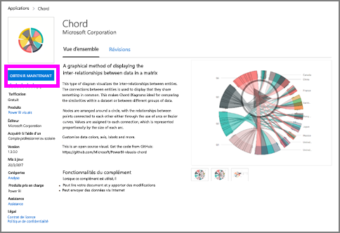

5. Sélectionnez le lien pour télécharger le visuel personnalisé.

    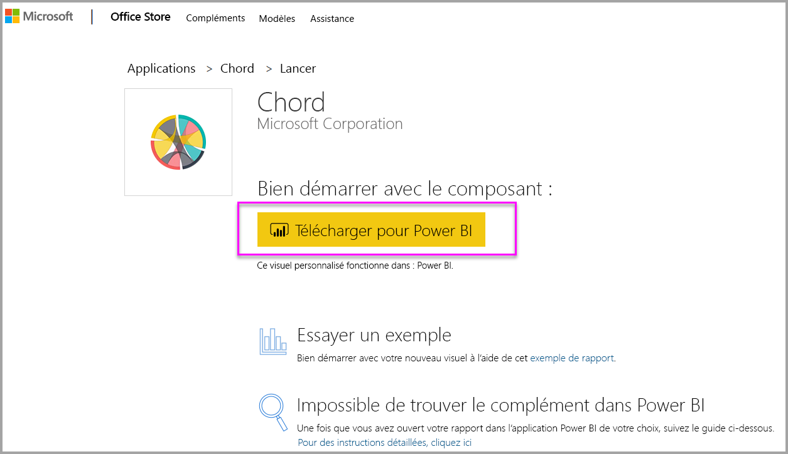

    La page de téléchargement inclut également des instructions sur l’importation du visuel personnalisé dans Power BI Desktop et le service Power BI.

    Vous pouvez également télécharger un exemple de rapport incluant le visuel personnalisé et présentant ses fonctionnalités.

    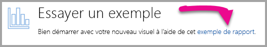

6. Enregistrez le fichier .pbiviz, puis ouvrez Power BI.

7. Importer le fichier .pbiviz dans votre rapport (consultez la section [Importer un visuel personnalisé à partir d’un fichier ](#import-a-custom-visuals-from-a-file) ci-dessus)

## Considérations et résolution des problèmes

- Un élément visuel personnalisé est ajouté à un rapport spécifique lors son importation. Si vous souhaitez utiliser l’élément visuel dans un autre rapport, vous devez l’y importer. Quand un rapport comportant un élément visuel personnalisé est enregistré à l’aide de l’option **Enregistrer sous** , une copie de l’élément visuel personnalisé est enregistrée avec le nouveau rapport.

- Si vous ne voyez pas le volet **Visualisations**, cela signifie que vous n’avez pas l’autorisation de modifier le rapport.  Vous pouvez uniquement ajouter des visuels personnalisés aux rapports que vous pouvez modifier, et non à ceux qui ont été partagés avec vous.

D’autres questions ? [Posez vos questions à la communauté Power BI](http://community.powerbi.com/)