# Découvrir le volet Filtres de rapport
Cet article présente en détail le volet Filtres de rapport. Vous le trouverez dans le [Mode Lecture et Édition du service Power BI](service-reading-view-and-editing-view.md) et dans [l’Affichage Rapport de Power BI Desktop](desktop-report-view.md).

Il existe de nombreuses façons de filtrer des données dans Power BI. Nous vous recommandons de commencer par lire l’article [À propos des filtres et de la mise en évidence](power-bi-reports-filters-and-highlighting.md).

## Utilisation des filtres
Les rapports peuvent être ouverts en [mode Édition ou en mode Lecture](service-reading-view-and-editing-view.md). En mode Édition, les propriétaires de rapports [peuvent ajouter des filtres](power-bi-report-add-filter.md) et les enregistrer dans leurs rapports. Les utilisateurs qui consultent le rapport en mode Lecture peuvent interagir avec les filtres, mais ne peuvent pas enregistrer les modifications de filtres apportées au rapport.

## Filtres en mode Lecture
Quand un rapport est ouvert en Mode Lecture, le volet Filtres s’affiche sur le côté droit du canevas de rapport. Si vous ne voyez pas le volet, sélectionnez la flèche dans le coin supérieur droit pour le développer.

Dans cet exemple, nous avons sélectionné un élément visuel contenant 6 filtres. La page de rapport dispose également de filtres qui sont répertoriés sous le titre **Filtres au niveau de la page**. Il y a un [filtre Extraction](power-bi-report-add-filter.md), et le rapport entier a également un filtre, **AnnéeFiscale**, défini sur 2013 ou 2014.

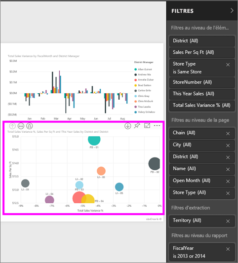

Certains des filtres sont accompagnés du mot **Tout**, ce qui signifie que toutes les valeurs sont incluses dans le filtre.  Par exemple, dans la capture d’écran ci-dessous, **Chain(Tout)** indique que cette page de rapport inclut des données sur toutes les chaînes de magasin.  En revanche, le filtre au niveau du rapport **AnnéeFiscale est 2013 ou 2014** indique que le rapport inclut des données uniquement pour les années fiscales 2013 et 2014.

Toute personne qui consulte ce rapport peut interagir avec ces filtres comme suit :

* afficher les détails du filtre en sélectionnant la flèche en regard du filtre ;
  
   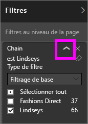
* modifier le filtre, par exemple remplacer **Lindseys** par **Fashions Direct**.
  
     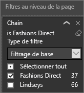
* supprimer le filtre en sélectionnant la croix **x** en regard de son nom.
  
  La suppression d’un filtre le supprime de la liste, mais ne supprime pas les données du rapport.  Par exemple, si vous supprimez le filtre **AnnéeFiscale est 2013 ou 2014**, les données relatives à l’année fiscale figurent toujours dans le rapport, mais elles ne sont plus filtrées pour afficher uniquement les années 2013 et 2014 ; elles affichent toutes les années fiscales contenues dans les données.  Néanmoins, une fois que vous supprimez le filtre, vous ne pouvez pas le modifier à nouveau, car il est supprimé de la liste. Une meilleure option consiste à effacer le filtre en sélectionnant l’icône représentant une gomme .
  
  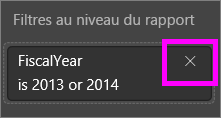

## Filtres en mode Édition
Quand un rapport est ouvert en mode Édition, le volet Filtres s’affiche sur le côté droit du canevas de rapport, dans la moitié inférieure du **volet Visualisation**. Si vous ne voyez pas le volet, sélectionnez la flèche dans le coin supérieur droit pour le développer.

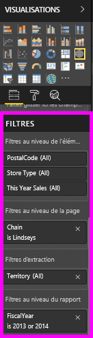.  

Si aucun visuel n’est sélectionné dans le canevas, le volet Filtres affiche uniquement les filtres qui s’appliquent à la totalité du rapport ou de la page de rapport, ainsi que tous les filtres d’extraction (le cas échéant). Dans l’exemple ci-dessous, aucun élément visuel n’est sélectionné, aucun filtre de niveau page ou filtre d’extraction ne s’affiche, mais il existe un filtre de niveau rapport.  

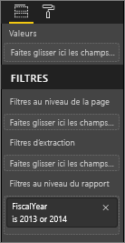  

Si un élément visuel est sélectionné dans le canevas, vous voyez également les filtres qui s’appliquent uniquement à cet élément visuel :   

Pour afficher les options d’un filtre donné, sélectionnez la flèche vers le bas en regard du nom du filtre.  Dans l’exemple ci-dessous, le filtre de rapport est défini sur 2013 et 2014. Et c’est un exemple de **filtrage de base**.  Pour afficher les options avancées, sélectionnez **Filtrage avancé**.

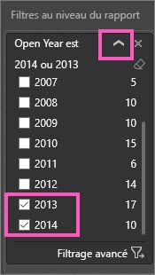

## Supprimer un filtre
 En mode Filtrage de base ou avancé, sélectionnez l’icône en forme de gomme  pour réinitialiser le filtre. 

## Ajouter un filtre
* En Mode Édition, ajoutez un filtre à un visuel, à une page, à une extraction ou à un rapport en sélectionnant un champ dans le volet Champs, puis en le faisant glisser vers le puits de filtre correspondant, à l’endroit où apparaissent les mots **Faites glisser les champs ici**. Une fois que vous avez ajouté un champ en tant que filtre, affinez-le à l’aide des commandes des filtrages de base et avancé (décrites ci-dessous).

- **Faire glisser un nouveau champ dans la zone de filtre au niveau Visuel n’a pas pour effet de l’ajouter au visuel**, mais cela permet de l’utiliser pour filtrer le visuel. Dans l’exemple ci-dessous, **Chain** est ajouté en tant que nouveau filtre à l’élément visuel. Notez que l’ajout de **Chain** en tant que filtre ne modifie pas l’élément visuel jusqu’à ce que vous utilisiez les commandes des filtrages de base et avancé.

    

* Tous les champs utilisés pour créer une visualisation sont également disponibles en tant que filtres. Tout d’abord, sélectionnez un élément visuel pour l’activer. Les champs utilisés dans le visuel sont répertoriés dans le volet Visualisations (si vous êtes en mode Edition) et dans le volet Filtres sous le titre **Filtres au niveau de l’élément visuel**.
  
   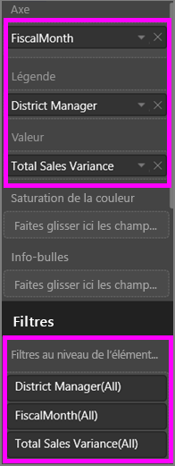  
  
   Ajustez ces champs à l’aide des commandes des filtrages de base et avancé (décrites ci-dessous).

## Types de filtres : filtres de champ de texte
### Mode Liste
Le fait de cocher une case sélectionne ou désélectionne la valeur. La case **Tout** peut être utilisée pour activer ou désactiver l’ensemble des cases à cocher. Les cases à cocher représentent toutes les valeurs disponibles pour ce champ.  Quand vous ajustez le filtre, la reformulation est mise à jour pour refléter vos choix. 

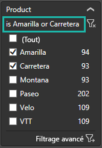

Notez que la reformulation est à présent « est Amarilla ou Carretera ».

### Mode Avancé
Sélectionnez **Filtrage avancé** pour basculer en mode Avancé. Utilisez les contrôles de liste déroulante et les zones de texte pour identifier les champs à inclure. En choisissant **Et** ou **Ou**, vous pouvez créer des expressions de filtre complexes. Cliquez sur le bouton **Appliquer le filtre** une fois que vous avez défini les valeurs souhaitées.  

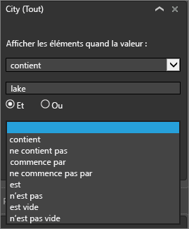

## Types de filtres : filtres de champ numérique
### Mode Liste
Si les valeurs sont limitées, le fait de sélectionner le nom du champ affichera une liste.  Consultez **Filtres de champ de texte** &gt; **Mode Liste** ci-dessus pour plus d’informations sur l’utilisation des cases à cocher.   

### Mode Avancé
Si les valeurs sont infinies ou représentent une plage, le fait de sélectionner le nom du champ ouvrira le mode Filtre avancé. Utilisez la liste déroulante et les zones de texte pour spécifier la plage de valeurs que vous voulez afficher. 

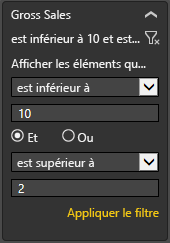

En choisissant **Et** ou **Ou**, vous pouvez créer des expressions de filtre complexes. Cliquez sur le bouton **Appliquer le filtre** une fois que vous avez défini les valeurs souhaitées.

## Types de filtres : date et heure
### Mode Liste
Si les valeurs sont limitées, le fait de sélectionner le nom du champ affichera une liste.  Consultez **Filtres de champ de texte** &gt; **Mode Liste** ci-dessus pour plus d’informations sur l’utilisation des cases à cocher.   

### Mode Avancé
Si les valeurs de champ représentent une date ou une heure, vous pouvez spécifier une heure de début et une heure de fin avec les filtres Date/Heure.  

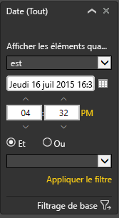

## Étapes suivantes
[Filtres et mise en évidence dans les rapports](power-bi-reports-filters-and-highlighting.md)  
[Interagir avec les filtres et la mise en évidence dans les rapports en mode Lecture](service-reading-view-and-editing-view.md)  
[Créer des filtres en mode Edition de rapports](power-bi-report-add-filter.md)  
[Modifier la façon dont le filtrage croisé et la mise en évidence croisée affectent les visuels d’un rapport](service-reports-visual-interactions.md)

En savoir plus sur les [rapports dans Power BI](service-reports.md)  
[Power BI – Concepts de base](service-basic-concepts.md)

D’autres questions ? [Posez vos questions à la communauté Power BI](http://community.powerbi.com/)

