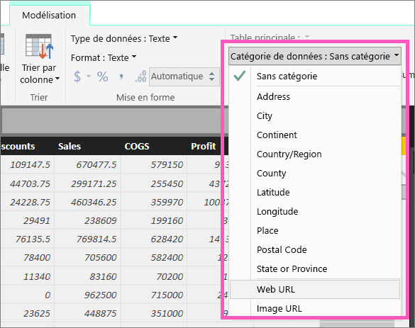
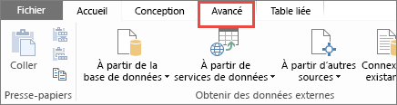

# Ajouter des liens hypertexte (URL) à une table
Cette rubrique explique comment ajouter des liens hypertexte (URL) à une table. Vous utilisez Power BI Desktop pour ajouter des liens hypertexte (URL) à une table ou matrice. Ensuite, vous pouvez utiliser Power BI Desktop ou le service Power BI pour ajouter des liens hypertexte à vos matrices et tables de rapports. 

> [!NOTE]
> Vous pouvez créer facilement des liens hypertexte dans des [vignettes de tableaux de bord](service-dashboard-edit-tile.md) et dans des [zones de texte de tableaux de bord](service-dashboard-add-widget.md) à l’aide du service Power BI. Vous pouvez créer facilement des liens hypertexte dans des [zones de texte de rapport](service-add-hyperlink-to-text-box.md) dans le service Power BI et Power BI Desktop.
> 

## Pour créer un lien hypertexte dans une table ou une matrice à l’aide de Power BI Desktop
Vous pouvez créer des liens hypertexte dans les tableaux et matrices avec Power BI Desktop, mais pas avec le service Power BI. Vous pouvez également créer des liens hypertexte dans PowerPivot pour Excel avant d’importer le classeur dans Power BI. Les deux méthodes sont décrites ci-dessous.

## Créer un lien hypertexte de tableau ou matrice dans Power BI Desktop
La procédure d’ajout d’un lien hypertexte varie selon que vous avez importé les données ou que vous vous y êtes connecté à l’aide de DirectQuery. Les deux scénarios sont décrits ci-dessous.

### Pour les données importées dans Power BI
1. Si le lien hypertexte n’existe pas déjà en tant que champ dans votre jeu de données, utilisez Power BI Desktop pour l’ajouter en tant que [colonne personnalisée](desktop-common-query-tasks.md).
2. Dans la Vue de données, sélectionnez la colonne, puis, sous l’onglet **Modélisation**, choisissez la liste déroulante **Catégorie de données**.
   
    
3. Sélectionnez **URL web**.
4. Passez au mode Rapport et créez un tableau ou une matrice à l’aide du champ classé comme URL web. Les liens hypertexte sont en bleu et soulignés.

    

    > [!NOTE]
    > Les URL doivent commencer par **http:// , https://** ou **www**.
    >
   
1. Si vous ne souhaitez pas afficher une URL longue dans une table, vous pouvez afficher une icône de lien hypertexte   à la place. Notez que vous ne pouvez pas afficher d’icônes dans une matrice.
   
    Sélectionnez le graphique pour l’activer.

    Sélectionner l’icône Format  pour ouvrir l’onglet Mise en forme.

    Développez **Valeurs**, recherchez **Icône d’URL** et **activez-la**.

    

1. (Facultatif) [Publiez le rapport de Power BI Desktop vers le service Power BI](guided-learning/publishingandsharing.yml?tutorial-step=2) et ouvrez-le dans le service Power BI. Les liens hypertexte fonctionnent ici également.

### Pour les données connectées avec DirectQuery
Vous ne pouvez pas créer de colonne en mode DirectQuery.  Mais si vos données contiennent déjà des URL, vous pouvez les convertir en liens hypertexte.

1. En mode Rapport, créez un tableau à l’aide d’un champ qui contient des URL.
2. Sélectionnez la colonne puis, sous l’onglet **Modélisation**, choisissez la liste déroulante **Catégorie de données**.
3. Sélectionnez **URL web**. Les liens hypertexte sont en bleu et soulignés.
4. (Facultatif) [Publiez le rapport de Power BI Desktop vers le service Power BI](guided-learning/publishingandsharing.yml?tutorial-step=2) et ouvrez-le dans le service Power BI. Les liens hypertexte fonctionnent ici également.

## Créer un lien hypertexte de tableau ou matrice dans Excel PowerPivot
Une autre méthode pour ajouter des liens hypertexte à vos tableaux et matrices Power BI consiste à créer des liens hypertexte dans le jeu de données avant d’importer ce dernier ou de vous y connecter à partir de Power BI. Cet exemple utilise un classeur Excel.

1. Ouvrez le classeur dans Excel.
2. Sélectionnez l’onglet **PowerPivot**, puis choisissez **Gérer**.
   
   
1. Quand PowerPivot s’ouvre, sélectionnez l’onglet **Avancé**.
   
   
4. Placez votre curseur dans la colonne qui contient les URL que vous voulez transformer en liens hypertexte dans les tables Power BI.
   
   > [!NOTE]
   > Les URL doivent commencer par **http:// , https://** ou **www**.
   > 
5. Dans le groupe **Propriétés de rapport**, sélectionnez la liste déroulante **Catégorie des données**, puis choisissez **URL web**. 
   
   

6. Depuis le service Power BI ou Power BI Desktop, connectez-vous à ce classeur ou importez-le.
7. Créez une visualisation de table comprenant le champ d’URL.
   
   

## Considérations et résolution des problèmes
Q : Peut-on utiliser une URL personnalisée comme lien hypertexte dans un tableau ou dans une matrice ?    
R : Non. Il est possible d’utiliser une icône de lien. Si vous avez besoin d’un texte personnalisé pour vos liens hypertextes et que votre liste d’URL est courte, vous pouvez utiliser une zone de texte à la place.

## Étapes suivantes
[Visualisations dans des rapports Power BI](visuals/power-bi-report-visualizations.md)

[Fondamentaux pour les concepteurs dans le service Power BI](service-basic-concepts.md)

D’autres questions ? [Posez vos questions à la communauté Power BI](http://community.powerbi.com/)

