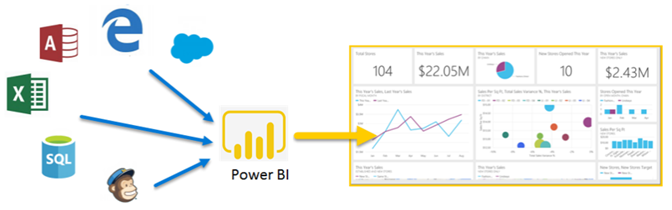

# Qu’est-ce que Power BI ?
**Power BI** est un ensemble de services logiciels, d’applications et de connecteurs qui œuvrent ensemble pour transformer des sources de données disparates en informations visuelles immersives et interactives. Vos données peuvent être sous forme de feuille de calcul Excel ou de collection d’entrepôts de données hybrides locaux ou sur le cloud. Power BI vous permet de vous connecter à vos sources de données, visualiser et découvrir ce qui est important et qui partager avec tout le monde ou tout le monde que vous souhaitez.

Power BI peut être simple et rapide, capable de créer des informations rapides à partir d’une feuille de calcul Excel ou une base de données locale. Mais Power BI est également robuste et de qualité professionnelle, prête pour modélisation complète et analytique en temps réel, ainsi qu’un développement personnalisé. Il peut être votre rapport personnel et un outil de visualisation et servent également le moteur analytique et de décision pour les projets de groupe, des divisions ou des grandes entreprises.

## Composants de Power BI
Power BI se compose de : 
- Une application de bureau Windows appelée **Power BI Desktop**
- Un SaaS en ligne (*logiciel en tant que Service*) service appelé le **service Power BI** 
- Power BI **des applications mobiles** pour Windows, iOS et les appareils Android

Ces trois éléments&mdash;Power BI Desktop, le service et les applications mobiles&mdash;sont conçus pour permettre aux utilisateurs de créer, partager et consommer des informations métier de la façon qui sert de, ou que leur rôle, plus efficacement.

Un quatrième élément, **Power BI Report Server**, vous permet de publier des rapports Power BI sur un serveur de rapports local, après les avoir créés dans Power BI Desktop. En savoir plus sur [Power BI Report Server](#on-premises-reporting-with-power-bi-report-server).

## À chacun son Power BI
La façon dont vous utilisez Power BI peut varier selon la fonction que vous occupez dans un projet ou une équipe. Autres personnes, dans d’autres rôles, peuvent utiliser Power BI différemment.

Par exemple, vous pouvez utiliser principalement le **service Power BI**. En revanche, votre collègue spécialiste des chiffres et de la création de rapports d’entreprise préférera utiliser **Power BI Desktop** pour créer des rapports, avant de les publier dans le service Power BI, où vous pouvez ensuite les consulter. Un autre collègue, Sales, peut principalement utiliser leur **application de téléphone Power BI** pour surveiller la progression sur leurs quotas de ventes et explorez les détails du nouveau prospect.

Si vous êtes un développeur, vous pouvez utiliser les API de Power BI pour transmettre des données à des jeux de données ou pour incorporer des tableaux de bord et des rapports dans vos propres applications personnalisées. Vous souhaitez créer un élément visuel ? Faites-le vous-même et partagez-le avec d’autres utilisateurs.  

Vous pouvez également utiliser chaque élément de Power BI à des moments différents, selon ce que vous essayez d’atteindre ou de votre rôle pour un projet donné.

Votre utilisation de Power BI dépend de la fonctionnalité ou du service de Power BI qui correspond à l’outil le plus adapté à votre situation. Par exemple, vous pouvez utiliser Power BI Desktop pour créer des rapports pour votre équipe sur les statistiques d’engagement client, et vous pouvez afficher l’inventaire et la fabrication de progression dans un tableau de bord en temps réel dans le service Power BI. Chaque partie de Power BI est disponible, ce qui explique sa flexibilité et son attrait.

Pour explorer les documents relatifs à votre rôle :
- Power BI pour les [***développeurs***](desktop-what-is-desktop.md)
- Power BI pour les [***consommateurs***](consumer/end-user-consumer.md)
- Power BI pour les [***développeurs***](developer/what-can-you-do.md)
- Power BI pour les [***administrateurs***](service-admin-administering-power-bi-in-your-organization.md)

## Flux de travail dans Power BI
Un flux de travail dans Power BI classique commence en vous connectant aux sources de données et création de rapports dans Power BI Desktop. Vous puis publiez ce rapport à partir de Power BI Desktop pour le service Power BI et les partager pour les utilisateurs finaux dans le service Power BI et les appareils mobiles peuvent afficher et interagir avec le rapport.
Ce workflow est courant et montre la complémentarité entre les trois éléments principaux de Power BI.

Voici une [comparaison détaillée de Power BI Desktop et du service Power BI](service-service-vs-desktop.md).

Mais que se passe-t-il si vous n’êtes pas prêt à migrer vers le cloud et souhaitez conserver vos rapports derrière un pare-feu d’entreprise ?  Lisez la suite.

## Création de rapports avec Power BI Report Server sur site
Créer, déployer et gérer des rapports paginés et mobiles de Power BI en local avec la gamme d’outils de prêts à l’emploi et des services fournis par Power BI Report Server.

Power BI Report Server est une solution que vous déployez derrière votre pare-feu. Vous distribuez ensuite vos rapports aux utilisateurs appropriés de différentes façons afin de les afficher dans un navigateur web, sur un appareil mobile, ou sous forme d’e-mail. Et comme Power BI Report Server est compatible avec Power BI dans le cloud, vous pouvez migrer vers le cloud quand vous êtes prêt. 

En savoir plus sur [Power BI Report Server](report-server/get-started.md).

## Étapes suivantes
- [Démarrage rapide : Découvrez le service Power BI à votre rythme](service-the-new-power-bi-experience.md)   
- [Tutoriel : Prise en main le service Power BI](service-get-started.md)
- [Démarrage rapide : Se connecter aux données dans Power BI Desktop](desktop-quickstart-connect-to-data.md)
