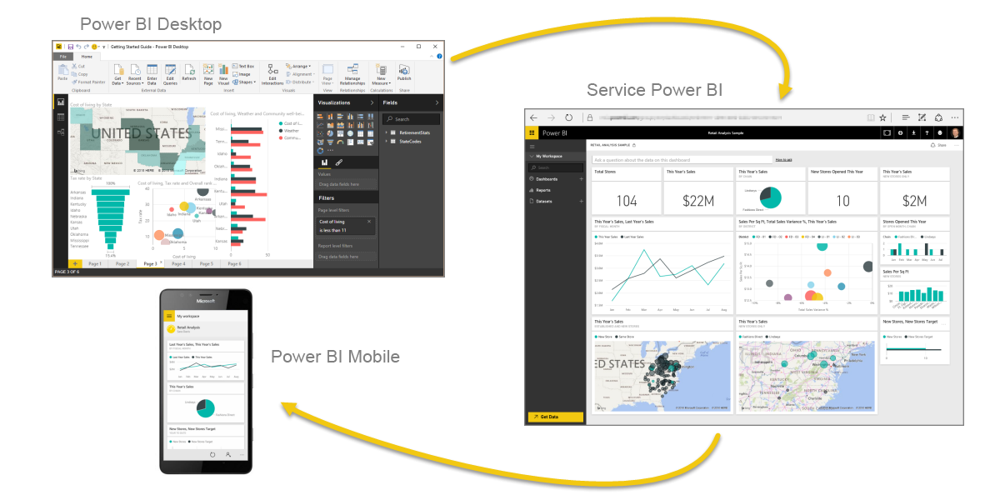
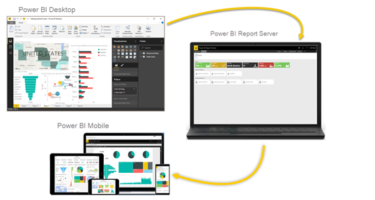

# Qu’est-ce que Power BI ?
**Power BI** est un ensemble de services logiciels, d’applications et de connecteurs qui œuvrent ensemble pour transformer des sources de données disparates en informations visuelles immersives et interactives. Quelle que soit la nature de vos données (une simple feuille de calcul Excel ou plusieurs entrepôts de données hybrides dans le cloud et en local), **Power BI** vous permet de vous connecter facilement à vos sources de données, de visualiser (ou découvrir) les informations importantes et de les partager avec les personnes de votre choix.

**Power BI** est simple et rapide. Il peut révéler des informations à partir d’une feuille de calcul Excel ou d’une base de données locale en un tour de main. **Power BI** se veut aussi une solution d’entreprise robuste, parée pour une modélisation complète, une analyse en temps réel, ainsi qu’un développement personnalisé. Power BI peut servir aussi bien d’outil de rapport et de visualisation personnel que de moteur d’analyse et de décision pour des projets de groupe, des divisions ou des grandes entreprises.

## Composants de Power BI
Power BI se compose d’une application de bureau Windows appelée **Power BI Desktop**, d’un service SaaS (*Software as a Service*) en ligne appelé **service Power BI**, ainsi que d’**applications** Power BI mobiles disponible sur téléphones et tablettes Windows mais aussi sur les appareils iOS et Android.

Ces trois éléments (**Desktop**, le **service** et les applications **mobiles**) ont été conçus pour permettre à leurs utilisateurs de créer, partager et consommer de façon optimale les données d’entreprise en fonction de leurs besoins ou de leur fonction.

## À chacun son Power BI
La façon dont vous utilisez Power BI peut varier selon la fonction que vous occupez dans un projet ou une équipe. D’autres personnes, qui occupent d’autres fonctions, peuvent tout aussi bien utiliser Power BI d’une autre manière.

Par exemple, vous pouvez très bien utiliser le **service Power BI** tandis que votre collègue spécialiste des chiffres et de la création de rapports d’entreprise préférera utiliser **Power BI Desktop** (et publier les rapports Desktop dans le service Power BI, que vous pouvez ensuite consulter). De son côté, votre collègue du service commercial pourra, quant à lui, utiliser principalement son application mobile Power BI pour suivre l’évolution de ses ventes et examiner les détails concernant les nouveaux prospects.

Si vous êtes un développeur, vous pouvez utiliser les API de Power BI pour transmettre des données à des jeux de données ou pour incorporer des tableaux de bord et des rapports dans vos propres applications personnalisées. Vous souhaitez créer un élément visuel ? Faites-le vous-même et partagez-le avec d’autres utilisateurs.  

Vous pouvez aussi être amené à utiliser chaque élément de **Power BI** à des moments différents, selon ce que vous voulez faire ou selon votre rôle dans un projet ou une mission donnés.

Vous pouvez par exemple visualiser l’évolution des stocks et de la production dans un tableau de bord en temps réel du service et vous servir aussi de **Power BI Desktop** pour créer des rapports statistiques pour les besoins de votre équipe sur l’implication des clients. La façon dont vous utilisez Power BI peut dépendre des fonctionnalités et du service Power BI qui répondent le mieux aux besoins du moment. Cependant, chaque composant de Power BI reste accessible, ce qui fait tout l’intérêt et la souplesse de cet outil.

## Flux de travail dans Power BI
Un flux de travail standard dans Power BI commence par la connexion à des sources de données et la création d’un rapport **Power BI Desktop**. Ce rapport est ensuite publié à partir de **Desktop** vers **Service Power BI**, puis partagé pour permettre aux utilisateurs de **service** et **mobile** de *consommer* (afficher et interagir avec) ce rapport.
Vous pouvez être amené à accorder des droits d’accès similaires à vos collègues (autorisations *créateur*) afin qu’ils puissent utiliser **service** pour modifier des rapports, créer des tableaux de bord et partager leur travail.

Cela ne se déroule pas toujours de cette façon, même s’il s’agit d’un workflows les plus courants et qu’il indique comment les trois principaux éléments de Power BI se complètent mutuellement.

Mais que se passe-t-il si vous n’êtes pas prêt à migrer vers le cloud et souhaitez conserver vos rapports derrière un pare-feu d’entreprise ?  Lisez la suite.

## Rapports locaux avec Power BI Report Server
Créez, déployez et gérez localement des rapports Power BI mobiles et paginés avec la gamme d’outils et services prêts à l’emploi de Power BI Report Server.

Power BI Report Server est une solution que vous déployez derrière votre pare-feu. Vous distribuez ensuite vos rapports aux utilisateurs appropriés de différentes façons afin de les afficher dans un navigateur web, sur un appareil mobile, ou sous forme d’e-mail. Et comme Power BI Report Server est compatible avec Power BI dans le cloud, vous pouvez migrer vers le cloud quand vous êtes prêt.

## Étapes suivantes
[Se connecter, obtenir des données et découvrir le service Power BI](service-the-new-power-bi-experience.md)
