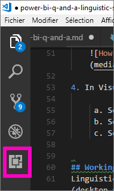
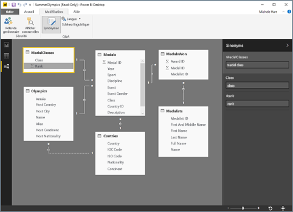

# <a name="language-modeling-and-the-linguistic-schema"></a>Modélisation du langage et schéma linguistique 
Utiliser des phrases courantes et un langage naturel pour poser des questions sur vos données, c’est fort. Et quand vos données y répondent, c’est encore plus efficace. C’est ce que vous permet de faire Questions et réponses dans Power BI. Quand vous posez une question dans Questions et réponses, cet outil essaie de vous donner la meilleure réponse possible. 

Toutefois, pour optimiser les interactions avec Questions et réponses, il existe des moyens d’obtenir des réponses encore plus pertinentes. La modification du schéma linguistique est l’un de ces moyens. 

Tout commence par vos données d’entreprise.  La qualité du modèle de données et la qualité des réponses obtenues par les utilisateurs sont étroitement liées. Un moyen d’améliorer le modèle est d’ajouter un schéma linguistique qui définit et catégorise la terminologie ainsi que les relations entre les noms de table et de colonne dans votre jeu de données. Vous gérez vos schémas linguistiques dans Power BI Desktop. 

## <a name="what-is-a-linguistic-schema"></a>Présentation d’un schéma linguistique
Un schéma linguistique décrit les termes et phrases que l’outil Questions et réponses doit comprendre pour reconnaître les objets dans un jeu de données, y compris les catégories grammaticales, les synonymes et les formulations qui se rapportent à ce jeu de données. Quand vous importez un jeu de données ou que vous vous y connectez, Power BI crée un schéma linguistique basé sur la structure du jeu de données. Lorsque vous posez une question à l’aide de l’outil Questions et réponses, celui-ci recherche les correspondances et les relations dans les données pour déterminer l’intention de votre question. Par exemple, il recherche les substantifs, verbes, adjectifs, formulations et autres éléments en rapport avec la question. Il regarde également les relations existantes entre ces éléments, par exemple, quelles colonnes sont définies comme objets d’un verbe. 

Vous connaissez déjà probablement les différentes catégories grammaticales (si ce n’est pas le cas, lisez la section correspondante ci-dessous), mais les formulations sont peut-être un nouveau concept pour vous.  Une formulation est la façon dont vous décrivez (ou « formulez ») les relations entre des éléments. Par exemple, pour décrire la relation entre les clients et les produits, vous pouvez dire « les clients achètent des produits ». Ou, pour décrire la relation entre les clients et l’âge, vous pouvez dire « l’âge indique l’ancienneté des clients ». Ou encore, pour décrire la relation entre les clients et des numéros de téléphone, vous pouvez simplement dire « les clients ont des numéros de téléphone ».

Ces formulations se présentent dans diverses formes et tailles. Certaines correspondent directement à des relations décrites dans le modèle de données. Certaines lient les colonnes avec les tables qui les contiennent. D’autres lient plusieurs tables et colonnes entre elles dans des relations complexes. Dans tous les cas, les formulations décrivent les relations entre les éléments à l’aide de termes courants.

Les schémas linguistiques sont enregistrés au format YAML. Ce format est similaire au très répandu format JSON, mais sa syntaxe est plus flexible et plus facilement lisible. Les schémas linguistiques peuvent être modifiés, exportés et importés dans Power BI Desktop.

## <a name="prerequisites"></a>Conditions préalables
- Si vous n’avez pas encore lu l’article expliquant comment [améliorer votre modèle de données pour Questions et réponses](desktop-qna-in-reports.md), vous voudrez peut-être le faire maintenant. Cet article fournit de nombreux conseils pour vous aider à créer et améliorer votre modèle de données. Il comporte aussi une section importante sur l’ajout des synonymes.  

- Le processus Questions et réponses a deux facettes.  La première est la préparation, c’est-à-dire la « modélisation ».  La seconde est la « consommation », qui consiste à poser des questions et à explorer les données. Dans certaines entreprises, ce sont les modélisateurs de données ou les administrateurs informatiques qui assemblent les jeux de données, créent les modèles de données et publient les jeux de données sur Power BI.  Les autres employés utilisent, ou « consomment », les données en ligne.  Dans d’autres entreprises, les employés peuvent combiner tous ces rôles. 

    Cette rubrique s’adresse aux modélisateurs de données, auxquels il incombe d’obtenir des jeux de données et de les optimiser pour fournir les meilleures réponses possibles aux questions posées par les utilisateurs. 

- [Exemples de fichiers .yaml et .pbix](https://go.microsoft.com/fwlink/?linkid=871858)    
- Nous vous recommandons d’utiliser [Visual Studio Code](https://code.visualstudio.com/) comme éditeur de fichiers YAML


### <a name="set-up-an-editor-for-yaml-files"></a>Installer un éditeur de fichiers YAML
Nous vous recommandons d’utiliser Visual Studio Code pour modifier des fichiers de schéma linguistique au format YAML. Visual Studio Code offre une prise en charge directe des fichiers YAML et peut être installé avec une extension de validation spécifique du format des schémas linguistiques Power BI.
1. Installez [Visual Studio Code](https://code.visualstudio.com/).    

2. Sélectionnez l’exemple de schéma linguistique que vous avez précédemment enregistré : [fichier YAML](https://go.microsoft.com/fwlink/?linkid=871858) (SummerOlympics.lsdl.yaml).    
4. Sélectionnez **Visual Studio Code** et **Toujours utiliser cette application pour ouvrir les fichiers .yaml**.

    

4. Dans Visual Studio Code, installez l’extension YAML Support by Red Hat.    
    a. Sélectionnez l’onglet **Extensions** (dernier onglet à gauche) ou Ctrl+Maj+X.    
        
    b. Recherchez « yaml » et sélectionnez **YAML Support by Red Hat** dans la liste.    
    c. Sélectionnez **Installer > Recharger**.


## <a name="working-with-linguistic-schemas"></a>Utilisation des schémas linguistiques
Vous pouvez modifier, importer et exporter les schémas linguistiques à partir de la [vue Relations](desktop-relationship-view.md) dans Power BI Desktop. L’une des méthodes pour modifier un schéma linguistique consiste à [ajouter des synonymes dans le volet **Synonymes**](desktop-qna-in-reports.md). Pour cela, vous n’avez pas besoin d’ouvrir le fichier YAML.




 L’autre moyen de modifier un schéma linguistique est d’exporter et de modifier le fichier YAML directement.  Quand vous modifiez le fichier YAML d’un schéma linguistique, vous marquez les colonnes de la table en tant qu’éléments grammaticaux différents, et vous définissez les mots qu’un collègue est susceptible d’employer pour formuler une question. Par exemple, vous désignez les colonnes qui correspondent au sujet et à l’objet du verbe, puis vous ajoutez d’autres mots que vos collègues peuvent utiliser pour faire référence aux tables, colonnes et mesures dans votre modèle. 


Avant de pouvoir modifier un schéma linguistique, vous devez l’ouvrir (l’exporter) à partir de Desktop. Quand vous réenregistrez le fichier YAML au même emplacement, cette opération est considérée comme une importation.  Vous pouvez également importer d’autres fichiers YAML à la place.  C’est utile si, par exemple, vous avez un jeu de données similaire pour lequel vous avez déjà passé beaucoup de temps à ajouter des catégories grammaticales, identifier les différentes relations, créer des formulations et ajouter des synonymes. 

Questions et réponses combine toutes ces informations et les éventuelles améliorations apportées afin de fournir une meilleure réponse, des suggestions automatiques et un récapitulatif des questions.


## <a name="edit-a-linguistic-schema"></a>Modifier un schéma linguistique
Quand vous exportez un schéma linguistique pour la première fois à partir de Desktop, la plus grande partie ou la totalité du contenu du fichier est automatiquement générée par le moteur Questions et réponses. Ces entités, mots (synonymes), relations et formulations générés sont marqués avec une balise **State: Generated** (État : Généré). Ils sont inclus dans le fichier à titre d’information principalement, mais ils peuvent servir de base de travail pour vos propres modifications. 

> [!NOTE]
> L’exemple de fichier YAML fourni dans ce tutoriel ne contient pas de balises **State:Generated** (État : Généré) ou **State:Deleted** (État : Supprimé), car il a été spécialement préparé pour les besoins du tutoriel. Pour voir ces balises, ouvrez un fichier .pbix non modifié dans la vue Relations et exportez le schéma linguistique.


Quand vous réimportez le fichier de schéma linguistique dans Power BI Desktop, tous les éléments marqués avec la balise **State:Generated** sont ignorés (ils seront regénérés plus tard). Si vous souhaitez modifier un contenu généré, vous devez donc aussi supprimer la balise **State: Generated** correspondante. De la même façon, pour supprimer un contenu généré, vous devez changer la balise **State:Generated** en **State: Deleted** afin d’empêcher la regénération du contenu au moment de l’importation du fichier de schéma linguistique.

1. Ouvrez le jeu de données dans la *vue Relations* dans Power BI Desktop. 
2. Sélectionnez l’onglet **Modélisation** et choisissez **Exporter un schéma linguistique**.
3. Sélectionnez Visual Code (ou un autre éditeur de votre choix).
4. Effectuez les modifications voulues, puis enregistrez le fichier YAML.
5. À partir de Desktop, sélectionnez **Vue Relations > Onglet Modélisation > Schéma linguistique > Importer un schéma linguistique**.
6. Accédez à l’emplacement où vous avez enregistré le fichier YAML modifié et sélectionnez ce fichier. Un message de réussite s’affiche pour confirmer l’importation du fichier YAML de schéma linguistique.

    

### <a name="add-phrasings-to-the-linguistic-schema"></a>Ajouter des formulations au schéma linguistique
Une formulation est la façon dont vous décrivez (ou « formulez ») les relations entre des éléments. Par exemple, pour décrire la relation entre les clients et les produits, vous pouvez dire « les clients achètent des produits ». Ou, pour décrire la relation entre les clients et l’âge, vous pouvez dire « l’âge indique l’ancienneté des clients ». Ou encore, pour décrire la relation entre les athlètes et les médailles, vous pouvez simplement dire « les athlètes gagnent des médailles ».

Ces formulations se présentent dans diverses formes et tailles. Certaines correspondent directement à des relations décrites dans le modèle sémantique. Certaines lient les colonnes avec les tables qui les contiennent. D’autres lient plusieurs tables et colonnes entre elles dans des relations complexes. Dans tous les cas, les formulations décrivent les relations entre les éléments à l’aide de termes courants.

## <a name="where-do-phrasings-come-from"></a>D’où les formulations proviennent-elles ?
Beaucoup de formulations simples sont automatiquement ajoutées au schéma linguistique sur la base de la structure du modèle et de certaines suggestions devinées d’après les noms de colonnes. Par exemple :
- La plupart des colonnes sont liées à leur table contenante avec une formulation simple telle que « les produits ont des descriptions ».
- Les relations du modèle sont à l’origine de formulations par défaut pour les deux sens de la relation telles que « les commandes ont des produits » et « les produits ont des commandes ».
- Certaines relations du modèle peuvent, d’après leurs noms de colonnes, générer une formulation par défaut plus complexe comme « les commandes sont livrées dans des villes ».

Toutefois, les utilisateurs peuvent décrire les éléments de multiples façons qui ne sont pas toujours compréhensibles par l’outil Questions et réponses. Pour tous ces cas, vous pouvez ajouter manuellement vos propres formulations.


## <a name="why-should-i-add-phrasings"></a>Pourquoi dois-je ajouter des formulations ?
En premier lieu, vous ajoutez une formulation quand vous avez besoin de définir un nouveau terme. Par exemple, si vous souhaitez pouvoir demander la « liste des clients les plus anciens », vous devez d’abord apprendre la signification du terme « ancien » à l’outil Questions et réponses. Pour cela, vous ajoutez une formulation comme « l’âge indique l’ancienneté des clients ».

En deuxième lieu, l’ajout d’une formulation vous permet de lever une ambiguïté. La recherche par mot clé simple fonctionne uniquement quand les mots n’ont qu’une seule signification. Par exemple, « vols vers Toulouse » n’a pas le même sens que « vols à partir de Toulouse », mais Questions et réponses ne fait pas la distinction entre les deux formulations, sauf si vous ajoutez les formulations « les vols sont vers les villes d’arrivée » et « les vols sont à partir des villes de départ ». De la même façon, Questions et réponses peut faire la distinction entre « voitures vendues à Marie par David » et « voitures achetées à Marie par David » uniquement si vous ajoutez les formulations « les clients achètent des voitures aux employés » et « les employés vendent des voitures aux clients ».

La dernière raison qui justifie l’ajout d’une formulation est l’amélioration des reformulations. Si vous posez la question « Afficher les clients et leurs produits », il serait plus juste que l’outil Questions et réponses lise cette question comme « Afficher les clients et les produits qu’ils ont achetés » ou « Afficher les clients et les produits qu’ils ont essayés », selon le sens que Questions et réponses a donné à la question. L’ajout de formulations personnalisées permet de rendre les reformulations plus explicites et sans ambiguïté.


## <a name="what-kinds-of-phrasings-are-there"></a>Quels sont les types de formulations possibles ?
Pour vous aider à comprendre les différents types de formulations, voici un rappel de quelques notions grammaticales très simples :
- Un *substantif* (ou nom) désigne une personne, un lieu ou une chose. 
    - Exemples : voiture, adolescent, Coralie, condensateur
- Un *verbe* désigne une action ou un état. 
    - Exemples : éclore, éclaté, dévorer, éjecter
- Un *adjectif* est un mot descriptif qui modifie un substantif. 
    - Exemples : puissant, magique, doré, volé
- Une *préposition* est un mot placé avant un substantif qui se rapporte à un substantif, verbe ou adjectif précédent 
    - Exemples : de, pour, proche de, à partir de
-  Un *attribut* qualifie ou caractérise quelque chose.
-  Un *nom* est un mot ou groupe de mots par lequel une personne, un animal, un lieu ou une chose est connu ou appelé.   


## <a name="attribute-phrasings"></a>Formulations attributives (Attribute)
Les formulations attributives sont les plus importantes pour l’outil Questions et réponses. Elles sont utilisées quand un élément agit en tant qu’attribut d’un autre élément. Simples et précises, elles font le plus gros du travail quand aucune formulation plus précise et détaillée n’a été définie. Les formulations attributives emploient la base verbale « avoir » (« les produits ont des catégories » et « les pays hôtes ont des villes hôtes »). Elles permettent aussi automatiquement de poser des questions contenant les prépositions « de » et « pour » (« catégories de produits », « commandes pour des produits ») ainsi que des pronoms possessifs (« commandes de David »). Les formulations attributives sont utilisées dans le genre de questions suivantes :
- Quels clients ont passé des commandes ?
- Répertorier les villes hôtes par ordre croissant du pays
- Afficher les commandes avec du chai
- Répertorier les clients avec des commandes
- Quelle est la catégorie de chaque produit ?
- Afficher le nombre de commandes de Gilbert Bonsaint    

La grande majorité des formulations attributives nécessaires dans votre modèle est automatiquement générée sur la base des relations contenant-contenu (table-colonne) et des relations du modèle. En général, vous n’avez donc pas à créer ces formulations vous-même.
Voici un exemple de formulation attributive dans un schéma linguistique :

```json
product_has_category:
  Binding: {Table: Products}
  Phrasings:
  - Attribute: {Subject: product, Object: product.category}
```
 
## <a name="name-phrasings"></a>Formulations Nom
Les formulations nominales sont utiles si votre modèle de données comporte une table qui contient des objets nommés (par exemple, des noms d’athlètes et de clients). Par exemple, la formulation « les noms de produits sont les noms donnés aux produits » est essentielle pour pouvoir utiliser des noms de produits dans les questions. Une formulation nominale permet également d’utiliser « nommé » comme un verbe (par exemple, « Répertorier les clients nommés Christophe Beaulieu »), mais il est très important, quand elle est utilisée conjointement avec d’autres formulations, d’autoriser l’emploi d’une valeur nominale pour référencer une ligne spécifique de la table. Par exemple, dans la formulation « Clients qui ont acheté du chai », l’outil Questions et réponses comprend que la valeur « chai » fait référence à la ligne entière dans la table des produits, et pas seulement à une valeur particulière dans la colonne de nom de produit. Les formulations nominales sont utilisées dans le genre de questions suivantes :    
- Quels employés sont nommés Gilbert Bonsaint ?
- Qui est la personne nommée Thomas Margand ?
- Sports Fernand De Montigny
- Nombre d’athlètes nommées Marie
- Qu’a acheté Gilbert Bonsaint ?

Si vous avez utilisé une convention d’affectation de noms claire pour les colonnes de noms dans votre modèle (par exemple, « Nom » ou « NomProduit » plutôt que « NmPrd »), la majorité des formulations nominales nécessaires dans votre modèle est automatiquement générée. En général, vous n’avez donc pas à créer ces formulations vous-même.

Voici un exemple de formulation nominale dans un schéma linguistique :

```json
employee_has_name:
  Binding: {Table: Employees}
  Phrasings:
  - Name:
      Subject: employee
      Name: employee.name
```

 
## <a name="adjective-phrasings"></a>Formulations Adjectif
Les formulations adjectivales définissent de nouveaux adjectifs utilisés pour décrire des éléments dans votre modèle. Par exemple, la formulation « les clients satisfaits sont les clients avec une évaluation > 6 » est nécessaire pour pouvoir poser des questions comme « répertorier les clients satisfaits à Bordeaux ». Il existe plusieurs formes de formulations adjectivales, destinées à différentes situations.

Les *formulations adjectivales simples* définissent un nouvel adjectif basé sur une condition, par exemple, « les produits qui ne sont plus disponibles sont les produits avec l’état = D ». Les formulations adjectivales simples sont utilisées dans le genre de questions suivantes :
- Quels produits ne sont plus disponibles ?
- Liste des produits qui ne sont plus disponibles
- Répertorier les médaillés d’or
- Produits en cours de réapprovisionnement

Voici un exemple de formulation adjectivale simple dans le schéma linguistique product_is_discontinued :

```json
Binding: {Table: Products}
  Conditions:
  - Target: product.discontinued
    Operator: Equals
    Value: true
  Phrasings:
  - Adjective:
      Subject: product
      Adjectives: [discontinued]
```

Les *formulations adjectivales de mesure* définissent un nouvel adjectif basé sur une valeur numérique qui indique l’étendue d’application de l’adjectif, comme dans « les longueurs indiquent de combien les rivières sont longues » et « les petites régions ont une petite superficie ». Les formulations adjectivales de mesure sont utilisées dans le genre de questions suivantes :
- Répertorier les rivières longues
- Quelles sont les rivières les plus longues ?
- Répertorier les plus petites régions qui ont gagné une médaille d’or au basket
- Quelle est la longueur de la Loire ?

Voici un exemple de formulation adjectivale de mesure dans le schéma linguistique river_has_length :

 ```json
Binding: {Table: Rivers}
  Phrasings:
  - Adjective:
      Subject: river
      Adjectives: [long]
      Antonyms: [short]
      Measurement: river.length
```

Les *formulations adjectivales dynamiques* définissent un ensemble de nouveaux adjectifs basés sur les valeurs d’une colonne dans le modèle, comme « les couleurs caractérisent les produits » et « les événements ont une catégorie de genre ». Les formulations adjectivales dynamiques sont utilisées dans le genre de questions suivantes :
- Répertorier les produits rouges
- Quels produits sont verts ?
- Afficher les événements de patinage féminin
- Dénombrer les problèmes actifs

Voici un exemple de formulation adjectivale dynamique dans le schéma linguistique product_has_color :
```json
Binding: {Table: Products}
  Phrasings:
  - DynamicAdjective:
      Subject: product
      Adjective: product.color
```

 
## <a name="noun-phrasings"></a>Formulations substantivales (Noun)
Les formulations substantivales définissent de nouveaux substantifs qui décrivent des sous-ensembles d’éléments dans votre modèle. Elles incluent souvent un type de mesure ou condition propre au modèle. Par exemple, dans notre modèle Olympics, nous pourrions ajouter des formulations qui différencient les champions et les médaillés, les sports de ballon et les sports aquatiques, les équipes et les individuels, les catégories d’âge des athlètes (juniors, adultes, seniors), etc. Dans notre base de données de films, nous pourrions ajouter des formulations substantivales comme « les échecs sont les films avec un bénéfice < 0 » afin de pouvoir poser des questions telles que « dénombrer les échecs par an ». Il existe deux formes de formulations substantivales, destinées à différentes situations.

Les *formulations substantivales simples* définissent un nouveau nom basé sur une condition, comme « les contractuels sont des employés où la valeur temps complet = false » et « un champion est un athlète ayant un nombre de médailles > 5 ». Les formulations substantivales simples sont utilisées dans le genre de questions suivantes :

- Quels sont les employés qui sont contractuels ?
- Dénombrer les contractuels à Strasbourg
- Nombre de champions en 2016

Voici un exemple de formulation substantivale simple dans le schéma linguistique employee_is_contractor :

```json
Binding: {Table: Employees}
  Conditions:
  - Target: employee.full_time
    Operator: Equals
    Value: false
  Phrasings:
  - Noun:
      Subject: employee
      Nouns: [contractor]
```

Les *formulations substantivales dynamiques* définissent un ensemble de nouveaux substantifs basés sur les valeurs d’une colonne dans le modèle, comme « les postes définissent les groupes d’employés ». Les formulations substantivales dynamiques sont utilisées dans le genre de questions suivantes :

- Répertorier les caissiers à Toulouse
- Quels employés sont serveurs ?
- Répertorier les arbitres en 1992

Voici un exemple de formulation substantivale dynamique dans le schéma linguistique employee_has_job :

 ```json
Binding: {Table: Employees}
  Phrasings:
  - DynamicNoun:
      Subject: employee
      Noun: employee.job
```

## <a name="preposition-phrasings"></a>Formulations prépositionnelles (Preposition)
Les formulations prépositionnelles servent à décrire de quelle manière les éléments dans votre modèle sont liés entre eux par des prépositions. Par exemple, la formulation « les villes sont dans des régions » améliore la compréhension de questions telles que « dénombrer les villes en Occitanie ». Certaines formulations prépositionnelles sont créées automatiquement quand une colonne est reconnue comme entité géographique. Les formulations prépositionnelles sont utilisées dans le genre de questions suivantes :

- Dénombrer les clients à Paris
- Répertorier les livres de linguistique
- De quelle ville est John Galt ?
- Combien de livres Stephen Pinker a-t-il écrit ?
 
Voici un exemple de formulation prépositionnelle dans le schéma linguistique customers_are_in_cities :

 ```json
Binding: {Table: Customers}
  Phrasings:
  - Preposition:
      Subject: customer
      Prepositions: [in]
      Object: customer.city
```

 
## <a name="verb-phrasings"></a>Formulations Verbe
Les formulations verbales servent à décrire de quelle manière les éléments dans votre modèle sont liés entre eux par des verbes. Par exemple, la formulation « les clients achètent des produits » améliore la compréhension de questions telles que « qui a acheté du fromage ? » et « qu’a acheté Christophe ? » Les formulations verbales sont les plus flexibles de tous les types de formulations. Elles relient souvent plus de deux éléments entre eux, comme dans « les employés vendent des produits clients ». Les formulations verbales sont utilisées dans le genre de questions suivantes :

- Qui a vendu quoi à qui ?
- Quel employé a vendu du chai à Christophe ?
- Combien de clients ont acheté du chai à Marie ?
- Liste des produits que Marie a vendus à Christophe.
- Quels produits qui ne sont plus disponibles ont été vendus par les employés de Lyon aux clients de Toulouse ?

Les formulations verbales peuvent également contenir des formulations prépositionnelles, ce qui les rend plus flexibles, comme dans « les athlètes gagnent des médailles lors de compétitions » ou « les clients obtiennent des remboursements pour les produits ». Les formulations verbales contenant des formulations prépositionnelles sont utilisées dans le genre de questions suivantes :

- Combien d’athlètes ont gagné une médaille d’or au championnat Visa ?
- Quels clients ont obtenu un remboursement pour du fromage ?
- À quelle compétition Danell Leyva a gagné une médaille de bronze ?

Certaines formulations verbales sont créées automatiquement quand une colonne est reconnue comme contenant à la fois un verbe et une préposition.

Voici un exemple de formulation verbale dans le schéma linguistique customers_buy_products_from_salespeople :

```json
Binding: {Table: Orders}
  Phrasings:
  - Verb:
      Subject: customer
      Verbs: [buy, purchase]
      Object: product
      PrepositionalPhrases:
      - Prepositions: [from]
        Object: salesperson
```

## <a name="relationships-with-multiple-phrasings"></a>Relations avec plusieurs formulations
Une relation peut fréquemment être décrite de plusieurs manières. Dans ce cas, une relation peut donc avoir plusieurs formulations. Il est assez courant de définir une relation entre une entité de table et une entité de colonne avec une formulation attributive et un autre type de formulation. Par exemple, dans la relation entre le client et le nom du client, vous pouvez avoir à la fois une formulation attributive (comme « les clients ont des noms ») et une formulation nominale (comme « les noms de clients sont les noms donnés aux clients »), ce qui vous permet de poser les deux types de questions.

Voici un exemple de relation avec deux formulations dans le schéma linguistique customer_has_name :

  ```json
Binding: {Table: Customers}
  Phrasings:
    - Attribute: {Subject: customer, Object: customer.name}
    - Name:
        Subject: customer
        Object: customer.name
```

Un autre exemple serait d’ajouter une autre formulation, « les employés vendent des produits clients », à la relation « les clients achètent des produits aux employés ». Notez que vous n’avez pas besoin d’ajouter des variantes telles que « les employés vendent des produits **aux clients** » ou « les produits sont vendus aux clients **par les employés** », car les variantes « par » et « aux » du sujet et de l’objet indirect sont déduites automatiquement par l’outil Questions et réponses.

## <a name="considerations-and-troubleshooting"></a>Considérations et résolution des problèmes
Si vous apportez une modification à un fichier .lsdl.yaml qui n’est pas conforme au format du schéma linguistique, vous voyez maintenant s’afficher des lignes ondulées de validation pour signaler les problèmes : 


D’autres questions ? [Posez vos questions à la communauté Power BI](http://community.powerbi.com/)
