# Ajouter un filtre à un rapport en mode Édition

Cet article explique comment ajouter un filtre de page, de visualisation, de rapport ou d’extraction à un rapport dans Power BI. Vous trouverez les exemples mentionnés dans cet article dans le service Power BI. Les étapes sont quasiment identiques dans Power BI Desktop.

**Le saviez-vous ?** Power BI a une nouvelle expérience de filtre, actuellement en préversion. En savoir plus sur [la nouvelle expérience de filtre dans les rapports Power BI](power-bi-report-filter-preview.md).

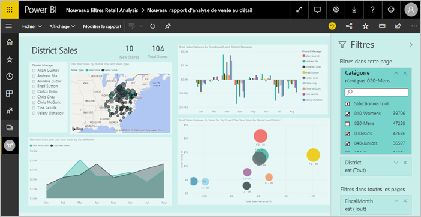

## Filtres en mode Édition ou en mode Lecture
Vous pouvez interagir avec les rapports dans deux modes différents : le mode Lecture et le mode Édition. Les fonctionnalités de filtrage disponibles varient en fonction du mode dans lequel vous êtes. Lisez tout [à propos des filtres et de la mise en surbrillance dans les rapports Power BI](power-bi-reports-filters-and-highlighting.md) pour plus de détails.

Cet article explique comment créer des filtres de rapport en **mode Edition**.  Pour plus d’informations sur les filtres en mode Lecture, consultez [Interaction avec les filtres de rapport en mode Lecture](consumer/end-user-report-filter.md).

## Types de filtres dans le volet Filtres
Que vous utilisiez la version Desktop ou le service Power BI, le volet Filtres s’affiche du côté droit du canevas du rapport. Si vous ne voyez pas le volet Filtres, sélectionnez l’icône « > » dans le coin supérieur droit pour le développer.

Il existe quatre types de filtres : **filtre de page**, **filtre de visuel**, **filtre d’extraction**, et **filtre de rapport**.

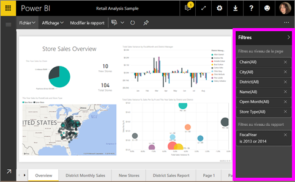

Comme les filtres *sont enregistrés*, quand vous quittez le rapport, Power BI conserve le filtre, le segment et les autres modifications que vous avez apportées à l’affichage des données. Vous pouvez ainsi reprendre là où vous vous étiez arrêté lorsque vous revenez au rapport. Si vous ne voulez pas que vos modifications du filtre soient enregistrées, sélectionnez **Rétablir les valeurs par défaut** dans de la barre de menus du haut.

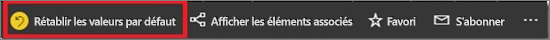

## Ajouter un filtre à un visuel
Vous pouvez ajouter un filtre au niveau du visuel à un visuel spécifique de deux manières différentes. 

* Filtrez un champ qui est déjà utilisé par la visualisation.
* Identifiez un champ qui n’est pas encore utilisé par la visualisation et ajoutez ce champ directement au compartiment **Filtres au niveau du visuel**.

D'ailleurs, cette procédure utilise l'exemple de l'analyse de la vente au détail, si vous souhaitez la télécharger et la suivre. Téléchargez l’[exemple d’analyse de la vente au détail](sample-retail-analysis.md).

### Filtrer les champs dans le visuel

1. Sélectionnez **modifier le rapport** pour ouvrir votre rapport en mode édition.
   
   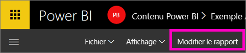

2. Ouvrez le volet Visualisations et filtres et le volet Champs (si ce n’est pas déjà fait).
   
   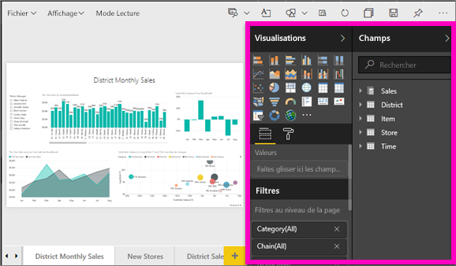
3. Sélectionnez un élément visuel pour l’activer. Tous les champs utilisés par le visuel se trouvent dans le volet **Champs** et sont également répertoriés dans le volet **Filtres**, sous l’en-tête **Filtres au niveau du visuel**.
   
   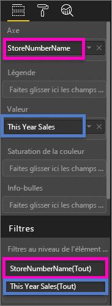
4. À ce stade, nous allons ajouter un filtre à un champ déjà utilisé par la visualisation. 
   
    Faites défiler jusqu’à la zone **Filtres au niveau de l’élément visuel**, puis sélectionnez la flèche pour développer le champ que vous souhaitez filtrer. Dans cet exemple, nous filtrons **StoreNumberName**.
     
    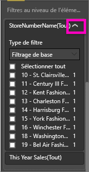 
    
    Définissez des contrôles de filtrage **De base** **Avancés** ou **Top N**. Dans cet exemple, nous allons effectuer une recherche dans le filtrage de base pour **cha** et sélectionner ces cinq magasins.
     
    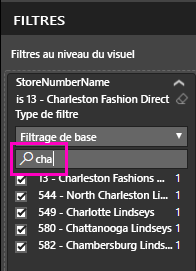 
   
    L’élément visuel change en fonction du nouveau filtre. Si vous enregistrez votre rapport avec le filtre, les personnes qui le consultent voient le visuel filtré par lequel commencer et peuvent interagir avec le filtre en mode Lecture en sélectionnant ou en effaçant les valeurs.
     
    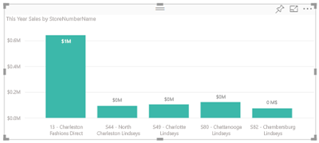

### Filtrer avec un champ qui n’est pas dans le visuel

Ajoutons à présent un nouveau champ comme un filtre au niveau du visuel à notre visualisation.
   
1. Dans le volet Champs, sélectionnez le champ que vous voulez ajouter en tant que nouveau filtre au niveau du visuel, puis faites-le glisser vers la zone **Filtres au niveau du visuel**.  Dans cet exemple, nous allons faire glisser **District Manager** (Responsable de district) vers le compartiment **Filtres au niveau du visuel**, rechercher **an**, puis sélectionner ces trois responsables. 
     
    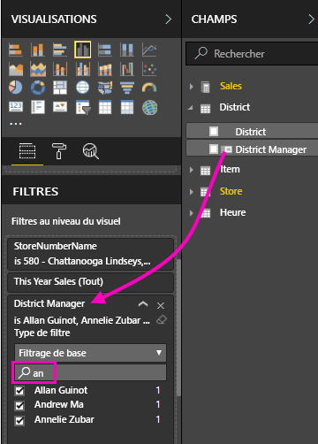

    Notez que **District Manager** (Responsable de district) n’est *pas* ajouté à la visualisation proprement dite. La visualisation est toujours composée de **StoreNumberName** en temps qu’Axe et de **This Year Sales** (Ventes de cette année) en tant que valeur.  
     
    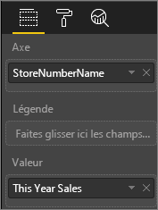

    Et la visualisation proprement dite est désormais filtrée pour afficher uniquement les ventes de ces responsables cette année pour les magasins spécifiés.
     
    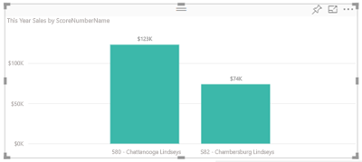

    Si vous enregistrez votre rapport avec ce filtre, les personnes qui le consultent peuvent interagir avec le filtre **District Manager** (Responsable de district) en mode Lecture en sélectionnant ou en effaçant des valeurs.

## Ajouter un filtre à une page entière

Vous pouvez également ajouter un niveau de la page de filtrer une page entière.

1. Sélectionnez **modifier le rapport** pour ouvrir votre rapport en mode édition.
   
   
2. Ouvrez le volet Visualisations et filtres et le volet Champs (si ce n’est pas déjà fait).
3. Dans le volet Champs, sélectionnez le champ que vous voulez ajouter en tant que nouveau filtre au niveau de la page, puis faites-le glisser vers la zone **Filtres au niveau de la page**.  
4. Sélectionnez les valeurs à filtrer et définissez des contrôles de filtrage **De base** ou **Avancés**.
   
   Toutes les visualisations sur la page sont redessinées pour refléter la modification.
   
   

    Si vous enregistrez votre rapport avec le filtre, les personnes qui le consultent peuvent interagir avec le filtre en mode Lecture en sélectionnant ou en effaçant des valeurs.

## Ajouter un filtre d’extraction
Une extraction dans le service Power BI et Power BI Desktop vous permet de créer une page de rapport de *destination*, qui se concentre sur une entité spécifique, telle qu’un fournisseur, un client ou un fabricant. Maintenant, dans les autres pages de rapport, les utilisateurs peuvent cliquer avec le bouton droit sur un point de données pour cette l’entité, et extraire vers la page sur laquelle le focus est positionné.

### Créer un filtre d’extraction
Pour suivre la procédure, téléchargez le [exemple rentabilité des clients](sample-customer-profitability.md). Supposons que vous souhaitiez une page qui se concentre sur les secteurs d’activité Executive (Exécutif).

1. Sélectionnez **Modifier le rapport** pour ouvrir le rapport en Mode Édition.
   
   

1. Ajoutez une nouvelle page au rapport et nommez-la **Team Executive** (Équipe exécutive). Il s’agira de la page de *destination* de l’extraction.
2. Ajoutez des visualisations qui suivent des mesures clés pour les secteurs d’activité des équipes exécutives.    
3. Ajoutez **Executive > Executive Name** (Exécutif > Nom de l’exécutif) au puits Filtres d’extraction.    
   
    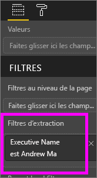
   
    Notez que Power BI ajoute une flèche Précédent à la page de rapport.  La sélection de la flèche Précédent a pour effet de renvoyer les utilisateurs à la page de rapport *d’origine*, où ils étaient lorsqu’ils ont choisi d’opérer l’extraction. La flèche Précédent fonctionne uniquement en mode lecture.
   
     

### Utiliser le filtre d’extraction
Voyons comment fonctionne le filtre d’extraction.

1. Démarrez sur la page de rapport **Team Scorecard** (Tableau de bord de l’équipe).    
2. Supposons que vous soyez Andrew Ma et que vous souhaitiez afficher la page de rapport Team Executive (Équipe exécutive) filtrée uniquement sur vos données.  À partir du graphique en aires en haut à gauche, cliquez avec le bouton droit sur n’importe quel point de données de couleur verte pour ouvrir l’option de menu Extraction.
   
    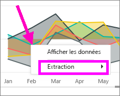
3. Sélectionnez **Extraction > Team Executive** pour extraire vers la page de rapport nommée **Team Executive** (Équipe exécutive). La page est filtrée pour afficher les informations relatives au point de données sur lequel vous avez cliqué avec le bouton droit, en l’occurrence Andrew Ma. Seul le champ figurant dans le puits Filtres d’extraction est transmis à la page du rapport d’extraction.  
   
    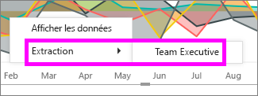

## Ajouter un rapport au niveau de filtrer un rapport entier

1. Sélectionnez **Modifier le rapport** pour ouvrir le rapport en Mode Édition.
   
   

2. Ouvrez le volet visualisations et filtres et le volet champs, s’ils ne sont pas déjà ouverts.
3. Dans le volet Champs, sélectionnez le champ que vous voulez ajouter en tant que nouveau filtre au niveau du rapport, puis faites-le glisser vers la zone **Filtres au niveau du rapport**.  
4. Sélectionnez les valeurs que vous voulez filtrer.

    Les éléments visuels sur la page active et toutes les pages du rapport changent en fonction du nouveau filtre. Si vous enregistrez votre rapport avec le filtre, les personnes qui le consultent peuvent interagir avec le filtre en mode Lecture en sélectionnant ou en effaçant des valeurs.

1. Sélectionnez la flèche Précédent pour revenir à la page précédente du rapport.

## Considérations et résolution des problèmes

- Dans certaines situations, un filtre au niveau du visuel et un filtre au niveau de la page peuvent renvoyer des résultats différents.  Par exemple, quand vous ajoutez un filtre au niveau du visuel, Power BI filtre sur les résultats agrégés.  L’agrégation par défaut est Somme, mais vous pouvez en [modifier le type](service-aggregates.md).  

    Ensuite, quand vous ajoutez un filtre au niveau de la page, Power BI filtre sans agréger.  Il n’y a pas d’agrégation, car une page peut avoir de nombreux visuels pouvant chacun utiliser différents types d’agrégation.  Par conséquent, le filtre est appliqué sur chaque ligne de données.

- Si vous ne voyez pas le volet Champs, vérifiez que vous êtes en [mode Édition](service-interact-with-a-report-in-editing-view.md) de rapport.    
- Si vous avez apporté un grand nombre de modifications aux filtres et que vous voulez rétablir les paramètres par défaut de l’auteur du rapport, sélectionnez **Rétablir les valeurs par défaut** dans la barre de menus du haut.

## Étapes suivantes
[Découvrir le volet Filtres du rapport](consumer/end-user-report-filter.md)

[Filtres et mise en évidence dans les rapports](power-bi-reports-filters-and-highlighting.md)

[Interagir avec les filtres et la mise en surbrillance dans les rapports en mode Lecture](consumer/end-user-reading-view.md)

[Modifier la façon dont le filtrage croisé et la mise en évidence croisée affectent les visuels d’un rapport](consumer/end-user-interactions.md)

D’autres questions ? [Posez vos questions à la communauté Power BI](http://community.powerbi.com/)

