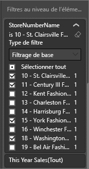
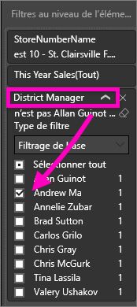

# Ajouter un filtre à un rapport du service Power BI (en mode Édition)
> [!TIP]
> Nous vous recommandons de commencer par lire [À propos des filtres et de la mise en évidence dans les rapports Power BI](power-bi-reports-filters-and-highlighting.md).

Les exemples de cet article montrent le service Power BI. La procédure est presque la même dans Power BI Desktop.
> 
> 

## Différence entre les filtres de rapport en mode Lecture et en mode Édition
Il existe deux modes d’interaction avec les rapports : le [mode Lecture](consumer/end-user-reading-view.md) et le [mode Edition](service-interact-with-a-report-in-editing-view.md).  Et les fonctionnalités de filtrage disponibles varient en fonction du mode dans lequel vous êtes.

* En mode Édition, vous pouvez ajouter des filtres de rapport, de page et d’élément visuel. Les filtres sont enregistrés en même temps que le rapport. Les personnes qui examinent le rapport en mode Lecture peuvent interagir avec les filtres que vous avez ajoutés.
* En mode Lecture, vous pouvez interagir avec les filtres de rapport, d’exploration, de page et de visuel qui existent déjà dans le rapport, mais vous ne pouvez pas ajouter de nouveaux filtres. Cependant, les modifications apportées dans le volet Filtres sont enregistrées avec le rapport, même si vous consultez le rapport dans une application mobile, et même si vous quittez le rapport et que vous y revenez ultérieurement.  

> [!NOTE]
> Cet article explique comment créer des filtres de rapport en **mode Edition**.  Pour plus d’informations sur les filtres en mode Lecture, consultez [Interaction avec les filtres de rapport en mode Lecture](consumer/end-user-reading-view.md).

## Filtres disponibles dans le volet *Filtres* de Power BI
Que vous utilisiez la version Desktop ou le service Power BI, le volet Filtres s’affiche du côté droit du canevas du rapport. Si vous ne voyez pas le volet Filtres, sélectionnez l’icône « > » dans le coin supérieur droit pour le développer.

Il existe quatre types de filtres.

- Un **filtre de page** s’applique à tous les visuels d’une page de rapport.     
- Un **filtre visuel** s’applique à un seul visuel d’une page de rapport.    
- Un **filtre d’extraction** s’applique à une seule entité dans un rapport.    
- Un **filtre de rapport** s’applique à toutes les pages du rapport.    

    

Comme les filtres *sont enregistrés*, quand vous quittez le rapport, Power BI conserve le filtre, le sélecteur et les autres modifications que vous avez apportées aux vues de données. Vous pouvez ainsi reprendre là où vous l’aviez quitté quand vous revenez au rapport. Si vous ne voulez pas que vos modifications du filtre soient enregistrées, sélectionnez **Rétablir les valeurs par défaut** dans de la barre de menus du haut.

## Ajouter un filtre à une visualisation spécifique (également appelé filtre visuel)
Il existe 2 manières de procéder : 

* en filtrant un champ qui est déjà utilisé par la visualisation ;
* en identifiant un champ qui n’est pas encore utilisé par la visualisation et en ajoutant ce champ directement au compartiment **Filtres au niveau de l’élément visuel** ;

### en filtrant les champs déjà présents dans la visualisation.
1. Ouvrez votre [rapport en mode Edition](consumer/end-user-reading-view.md).
   
   
2. Ouvrez le volet Visualisations et filtres et le volet Champs (si ce n’est pas déjà fait).
   
   
3. Sélectionnez un élément visuel pour l’activer. Tous les champs utilisés par le visuel sont identifiés dans le volet **Champs** et répertoriés dans le volet **Filtres**, sous l’en-tête **Filtres au niveau de l’élément visuel**.
   
   
4. À ce stade, nous allons ajouter un filtre à un champ déjà utilisé par la visualisation. 
   
   * Faites défiler jusqu’à la zone **Filtres au niveau de l’élément visuel**, puis sélectionnez la flèche pour développer le champ que vous souhaitez filtrer. Dans cet exemple, nous filtrons **StoreNumberName**.
     
       
   * Définissez des contrôles de filtrage **De base** **Avancé** ou **N premiers** (voir [Utilisation des filtres de rapport](consumer/end-user-report-filter.md)). Dans cet exemple, nous allons sélectionner le filtrage De base et cocher 10, 11, 15 et 18.
     
       
   * L’élément visuel change en fonction du nouveau filtre. Si vous enregistrez votre rapport avec le filtre, les personnes qui le consultent peuvent interagir avec le filtre en mode Lecture en sélectionnant ou en effaçant les valeurs.
     
      
5. Nous allons à présent ajouter à la visualisation un tout nouveau champ, tel que Filtres au niveau de l’élément visuel.
   
   * Dans le volet Champs, sélectionnez le champ que vous voulez ajouter en tant que nouveau filtre au niveau du visuel, puis faites-le glisser vers la zone **Filtres au niveau de l’élément visuel**.  Dans cet exemple, nous allons faire glisser **District Manager** (Responsable de district) vers le compartiment **Filtres au niveau de l’élément visuel**, puis sélectionner uniquement Andrew Ma. 
     
      
   * Notez que **District Manager** (Responsable de district) n’est *pas* ajouté à la visualisation proprement dite. La visualisation est toujours composée de **StoreNumberName** en temps qu’Axe et de **This Year Sales** (Ventes de cette année) en tant que valeur.  
     
      
   * Et la visualisation proprement dite est désormais filtrée pour afficher uniquement les ventes d’Andrew cette année pour les magasins spécifiés.
     
     

## Ajouter un filtre à une page entière (également appelé filtre du mode Page)
1. Ouvrez votre [rapport en mode Edition](consumer/end-user-reading-view.md).
2. Ouvrez le volet Visualisations et filtres et le volet Champs (si ce n’est pas déjà fait).
3. Dans le volet Champs, sélectionnez le champ que vous voulez ajouter en tant que nouveau filtre au niveau page, puis faites-le glisser vers la zone **Filtres au niveau de la page**.  
4. Sélectionnez les valeurs à filtrer et définissez des contrôles de filtrage **De base** ou **Avancé** (consultez [Utilisation des filtres de rapport](consumer/end-user-report-filter.md)).
   
   Tous les visualisations sur la page qui sont affectées par ce filtre sont redessinées pour refléter la modification. 
   
   

Si vous enregistrez votre rapport avec le filtre, les personnes qui le consultent peuvent interagir avec le filtre en mode Lecture en sélectionnant ou en effaçant les valeurs.

## Ajouter un filtre d’extraction
Une extraction dans le service Power BI et Power BI Desktop vous permet de créer une page de rapport de *destination*, qui se concentre sur une entité spécifique, telle qu’un fournisseur, un client ou un fabricant. Maintenant, dans les autres pages de rapport, les utilisateurs peuvent cliquer avec le bouton droit sur un point de données pour cette l’entité, et extraire vers la page sur laquelle le focus est positionné.

### Créer un filtre d’extraction
Pour suivre, ouvrez l’exemple Rentabilité des clients en mode édition. Supposons que vous souhaitiez une page qui se concentre sur les secteurs d’activité Executive (Exécutif).   

1. Ajoutez une nouvelle page au rapport et nommez-la **Team Executive** (Équipe exécutive). Il s’agira de la page de *destination* de l’extraction.
2. Ajoutez des visualisations qui suivent des mesures clés pour les secteurs d’activité des équipes exécutives.    
3. Ajoutez **Executive > Executive Name** (Exécutif > Nom de l’exécutif) au puits Filtres d’extraction.    
   
    
   
    Notez que Power BI ajoute une flèche Précédent à la page de rapport.  La sélection de la flèche Précédent a pour effet de renvoyer les utilisateurs à la page de rapport *d’origine*, où ils étaient lorsqu’ils ont choisi d’opérer l’extraction. La flèche Précédent fonctionne uniquement en mode lecture.
   
     

### Utiliser le filtre d’extraction
Voyons comment fonctionne le filtre d’extraction.

1. Démarrez sur la page de rapport **Team Scorecard** (Tableau de bord de l’équipe).    
2. Supposons que vous soyez Andrew Ma et que vous souhaitiez afficher la page de rapport Team Executive (Équipe exécutive) filtrée uniquement sur vos données.  À partir du graphique en aires en haut à gauche, cliquez avec le bouton droit sur n’importe quel point de données de couleur verte pour ouvrir l’option de menu Extraction.
   
    
3. Sélectionnez **Extraction > Team Executive** pour extraire vers la page de rapport nommée **Team Executive** (Équipe exécutive). La page est filtrée pour afficher les informations relatives au point de données sur lequel vous avez cliqué avec le bouton droit, en l’occurrence Andrew Ma. Seul le champ figurant dans le puits Filtres d’extraction est transmis à la page du rapport d’extraction.  
   
    

## Ajouter un filtre à un rapport entier (filtre de rapport)
1. Ouvrez votre [rapport en mode Edition](consumer/end-user-reading-view.md).
2. Ouvrez le volet Visualisations et filtres et le volet Champs (si ce n’est pas déjà fait).
3. Dans le volet Champs, sélectionnez le champ que vous voulez ajouter en tant que nouveau filtre au niveau élément visuel, puis faites-le glisser vers la zone **Filtres au niveau du rapport**.  
4. Sélectionnez les valeurs que vous voulez filtrer (consultez [Utilisation des filtres de rapport](consumer/end-user-report-filter.md)).

    Les éléments visuels sur la page active et toutes les pages du rapport changent en fonction du nouveau filtre. Si vous enregistrez votre rapport avec le filtre, les personnes qui le consultent peuvent interagir avec le filtre en mode Lecture en sélectionnant ou en effaçant les valeurs.

1. Sélectionnez la flèche Précédent pour revenir à la page précédente du rapport.

## Considérations et résolution des problèmes

- Dans certains situations, un filtre au niveau du visuel et un filtre au niveau de la page peuvent renvoyer des résultats différents.  Par exemple, quand vous ajoutez un filtre au niveau du visuel, Power BI filtre sur les résultats agrégés.  L’agrégation par défaut est Somme, mais vous pouvez en [modifier le type](service-aggregates.md).  

    Ensuite, quand vous ajoutez un filtre au niveau de la page, Power BI filtre sans agréger.  Cela s’explique par le fait qu’une page peut avoir de nombreux éléments visuels pouvant chacun utiliser différents types d’agrégation.  Par conséquent, le filtre est appliqué sur chaque ligne de données.

- Si vous ne voyez pas le volet Champs, vérifiez que vous êtes en [mode Édition](service-interact-with-a-report-in-editing-view.md) de rapport.    
- Si vous avez apporté un grand nombre de modifications aux filtres et que vous voulez rétablir les paramètres par défaut de l’auteur du rapport, sélectionnez **Rétablir les valeurs par défaut** dans la barre de menus du haut.

## Étapes suivantes
 [Utilisation des filtres de rapport](consumer/end-user-report-filter.md)

  [Filtres et mise en évidence dans les rapports](power-bi-reports-filters-and-highlighting.md)

[Interagir avec les filtres et la mise en évidence dans les rapports en mode Lecture](consumer/end-user-reading-view.md)

[Modifier la façon dont le filtrage croisé et la mise en évidence croisée affectent les visuels d’un rapport](consumer/end-user-interactions.md)

D’autres questions ? [Posez vos questions à la communauté Power BI](http://community.powerbi.com/)

