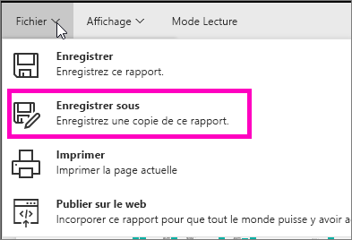
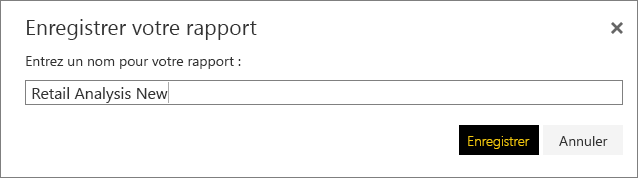
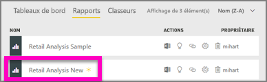

# Créer un rapport à partir d’un rapport existant
Vous disposez peut-être déjà d’un rapport qui se connecte à votre jeu de données et possède certains éléments visuels que vous souhaitez réutiliser ou modifier.  Pourquoi ne pas simplement copier ce rapport comme base pour créer un nouveau rapport ?  Pour ce faire :

1. [Ouvrez un rapport](service-report-open-in-reading-view.md).
2. Dans le menu **Fichier** , sélectionnez **Enregistrer sous**.
   
   
3. Tapez un nom pour le nouveau rapport et sélectionnez **Enregistrer**.
   
   
   
   Un message de réussite vous indique que le nouveau rapport a été enregistré dans votre espace de travail actuel dans Power BI.
   
   
4. Ouvrez l’onglet **Rapports** de votre espace de travail, puis sélectionnez le nouveau rapport pour l’ouvrir. Si vous le souhaitez, supprimez les éléments visuels que vous ne souhaitez pas conserver, modifiez d’autres éléments visuels et ajoutez-en de nouveaux.
   
   
5. Amusez-vous à mettre à jour et à modifier votre nouveau rapport.

## Étapes suivantes :
[Créer des visualisations](power-bi-report-add-visualizations-ii.md)

[Supprimer des visualisations](service-delete.md) dont vous n’avez pas besoin
