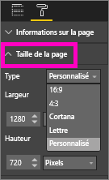

# Paramètres d’affichage de page dans un rapport Power BI
Nous sommes conscients qu’il est essentiel de préserver la qualité de présentation de vos rapports. Cela n’est pas toujours évident, car vous et vos collègues consultez ces rapports sur des écrans de taille et de proportions différentes. 

L’affichage par défaut est **Ajuster à la page** et la taille d’affichage par défaut est **16:9**. Si vous voulez verrouiller des proportions différentes ou présenter votre rapport d’une autre façon, deux outils peuvent vous y aider : les paramètres du ***mode Page*** et les paramètres ***Taille de la page***.

<iframe width="560" height="315" src="https://www.youtube.com/embed/5tg-OXzxe2g" frameborder="0" allowfullscreen></iframe>

## Emplacement des paramètres de mode Page dans le service Power BI et Power BI Desktop
Les paramètres de mode Page sont disponibles aussi bien dans le service Power BI que dans Power BI Desktop, mais l’interface est un peu différente. Les deux sections suivantes expliquent où vous pouvez trouver des paramètres d’affichage dans chaque outil Power BI.

### Dans Power BI Desktop
En mode Rapport, sélectionnez l’onglet **Affichage** pour ouvrir les paramètres de mode Page, ainsi que les paramètres du mode téléphone.

  

### Dans le service Power BI (app.powerbi.com)
Dans le service Power BI, ouvrez un rapport, puis sélectionnez **Affichage** à partir de la barre de menus supérieure gauche.

Les paramètres du mode Page sont disponibles à la fois en [mode Lecture et en mode Édition](service-reading-view-and-editing-view.md). En mode Édition, le propriétaire d’un rapport peut affecter un paramètre de mode Page à certaines pages d’un rapport. Ces paramètres sont alors enregistrés avec le rapport. Quand un collègue ouvre ce rapport en mode Lecture, il voit les pages du rapport s’afficher avec les paramètres du propriétaire.  En mode Lecture, les collègues peuvent modifier *certains* des paramètres de mode Page, mais les modifications ne sont pas enregistrées lorsqu’ils quittent le rapport.

##    Paramètres de mode Page
Le premier ensemble de paramètres du *mode Page* contrôle l’affichage de votre page de rapport dans la fenêtre du navigateur.  Choisissez parmi les options suivantes :

* **Ajuster à la page** (valeur par défaut) : le contenu est ajusté en fonction de la page
* **Ajuster à la largeur**: le contenu est ajusté en fonction de la largeur de la page
* **Taille réelle**: le contenu est affiché dans sa taille réelle

Le deuxième ensemble de paramètres du *mode Page* contrôle le positionnement des objets sur le canevas de rapport

* **Afficher le quadrillage** : activez le quadrillage pour aider à positionner les objets sur le canevas de rapport
* **Aligner sur la grille** : utilisez cette option avec **Afficher le quadrillage** pour positionner et aligner précisément les objets sur le canevas de rapport 
* **Verrouiller les objets** : verrouillez tous les objets sur le canevas afin qu’ils ne puissent pas être déplacés ni redimensionnés
* **Volet Sélection** : ce volet répertorie tous les objets sur le canevas et vous pouvez décider lesquels afficher et masquer

    

## Paramètres Taille de la page

Les paramètres de *taille de page* sont uniquement disponibles pour les propriétaires de rapport. Dans le service Power BI (app.powerbi.com), vous devez donc ouvrir le rapport en [mode Édition](service-reading-view-and-editing-view.md). Ces paramètres permettent de contrôler les proportions et la taille réelle (en pixels) d’affichage du canevas de rapport.   

* Proportions 4:3
* Proportions 16:9 (par défaut)
* Cortana
* Lettre
* Personnalisé (hauteur et largeur en pixels)

## Étapes suivantes
[Découvrez comment utiliser les paramètres Mode Page et Taille de la page dans vos propres rapports Power BI](power-bi-change-report-display-settings.md).

En savoir plus sur les [rapports dans Power BI](service-reports.md)

[Power BI – Concepts de base](service-basic-concepts.md)

D’autres questions ? [Posez vos questions à la communauté Power BI](http://community.powerbi.com/)

