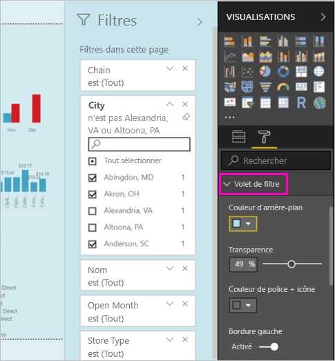
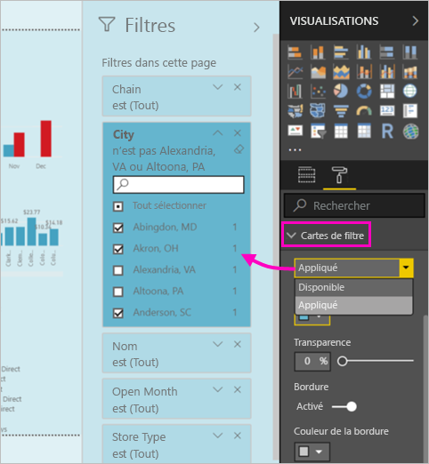

# La nouvelle expérience de filtre dans les rapports Power BI (préversion)

Cet article décrit la nouvelle expérience de filtre : Les filtres dans Power BI bénéficient de nouvelles fonctionnalités et d’une nouvelle conception. Lorsque vous concevez des rapports dans Power BI Desktop ou dans le service Power BI, vous pouvez faire en sorte que le volet Filtres ressemble à l’ensemble du rapport et interagisse avec celui-ci. Dans la nouvelle expérience, l’ancien volet Filtres agit en tant que volet d’édition de filtre et le nouveau volet Filtre est le seul que vos consommateurs de rapports peuvent afficher. 
 

En tant que concepteur de rapports, voici ce que vous pouvez faire avec les nouveaux filtres :

- Affichez une vue en lecture seule des filtres dans l’en-tête du visuel, afin que les consommateurs sachent exactement quels filtres ou segments ont un impact sur un visuel donné.
- Mettez en forme et personnalisez le volet de filtre afin qu’il fasse partie de votre rapport.
- Définissez si le volet Filtres est ouvert ou réduit par défaut lorsqu’un consommateur ouvre le rapport.
- Masquez la totalité du volet de filtre ou des filtres spécifiques que vous ne souhaitez pas afficher pour les lecteurs du rapport.
- Contrôlez et créez même un signet de l’état de visibilité, ouvert et réduit du nouveau volet de filtre.
- Verrouillez les filtres que vous ne souhaitez pas que les consommateurs modifient.

## Activer la nouvelle expérience de filtre 

Vous activez la nouvelle expérience dans Power BI Desktop. Ensuite, vous pouvez modifier les filtres à cet emplacement ou dans le service Power BI (https://app.powerbi.com). Étant donné que cette nouvelle expérience de filtre est disponible en préversion, vous devez tout d’abord l’activer dans Power BI Desktop. Si vous commencez par créer un rapport dans le service Power BI, celui-ci ne peut pas avoir les nouveaux filtres.

### Activer de nouveaux filtres pour tous les nouveaux rapports

1. Dans Power BI Desktop, sélectionnez **Fichier** > **Options et paramètres** > **Options** > **Fonctionnalités en préversion**, puis cochez la case **Nouvelle expérience de filtre**. 
2. Redémarrez Power BI Desktop pour afficher la nouvelle expérience de filtre dans tous les nouveaux rapports.

Une fois que vous redémarrez Power BI Desktop, la nouvelle expérience est activée par défaut pour tous les nouveaux rapports que vous créez.  

### Activer de nouveaux filtres pour un rapport existant

Vous pouvez également activer les nouveaux filtres pour les rapports existants.

1. Dans Power BI Desktop, dans un rapport existant, sélectionnez **Fichier** > **Options et paramètres** > **Options**
2. Sous **Paramètres du rapport**, sélectionnez **Activer le volet de filtre mis à jour et afficher les filtres dans l'en-tête du visuel de ce rapport**.

## Générer le nouveau volet de filtre

Après avoir activé le nouveau volet de filtre, il s’affiche à droite de la page du rapport, mis en forme par défaut en fonction de vos paramètres de rapport actuels. L’ancien volet de filtre joue maintenant le rôle du volet de modification de filtre. Le nouveau volet de filtre affiche ce que les lecteurs de votre rapport voient lorsque vous publiez votre rapport. Vous pouvez mettre à jour des filtres existants dans le nouveau volet, mais vous utilisez l’ancien volet de filtre pour configurer les filtres à inclure.

1. Vous devez tout d’abord décider si les consommateurs de votre rapport peuvent voir le volet de filtre. Si vous qu’ils le voient, sélectionnez l’icône représentant un œil  en regard de Filtres.

2. Pour commencer à créer votre nouveau volet de filtre, faites glisser les champs d’intérêt dans le volet d’édition de filtre en tant que filtres au niveau du visuel, de la page ou du rapport. Ceux-ci s’affichent dans le nouveau volet Filtres.

    

Lorsque vous ajoutez un visuel à un canevas de rapport, Power BI ajoute automatiquement un filtre pour chaque champ dans le visuel. Power BI n’ajoute ces filtres automatiques dans le volet de filtre en lecture seule. Vous devez sélectionner l’icône représentant un œil pour les ajouter de manière explicite.

 
## Verrouiller ou masquer des filtres

Vous pouvez verrouiller ou masquer des cartes de filtre individuelles. Si vous verrouillez un filtre, vos consommateurs de rapports peuvent l’afficher, mais pas le modifier. Si vous le masquez, ils ne peuvent pas l’afficher. Le masquage des cartes de filtre est généralement utile si vous avez besoin de masquer des filtres de nettoyage de données qui excluent les valeurs NULL ou des valeurs inattendues. 

- Dans le volet d’édition de filtre, sélectionnez ou désélectionnez les icônes **Verrouiller le filtre** ou **Masquer le filtre** dans une carte de filtre.

   

Lorsque vous activez et désactivez ces paramètres dans le volet d’édition de filtre, les modifications sont répercutées dans le nouveau volet de filtre. Les filtres masqués ne s’affichent pas dans la fenêtre contextuelle de filtre pour un visuel.

Vous pouvez également configurer l’état de votre volet de filtre pour qu’il s’accorde aux signets de votre rapport. L’état ouvert, fermé et la visibilité du volet peuvent être configurés comme signets.
 
## Mettre en forme le nouveau volet Filtres

Une grande partie de cette nouvelle expérience est que vous pouvez désormais mettre en forme le volet de filtre pour qu’il corresponde à l’apparence de votre rapport. Vous pouvez mettre en forme le volet de filtre différemment pour chaque page du rapport. Voici les éléments que vous pouvez mettre en forme : 

- Couleur d'arrière-plan
- Transparence d’arrière-plan
- Bordure du volet de filtre activée ou désactivée
- Couleur de bordure du volet de filtre

Vous pouvez également mettre en forme ces éléments pour les cartes de filtre, selon qu’elles sont appliquées (définies sur quelque chose) ou disponibles (désactivées) : 

- Couleur d'arrière-plan
- Transparence d’arrière-plan
- Bordure : activée ou désactivée
- Couleur de la bordure

### Définir le format pour les cartes et le volet Filtres

1. Dans le rapport, cliquez sur le rapport lui-même, ou l’arrière-plan (*papier peint*), puis dans le volet **Visualisations**, sélectionnez **Format**. 
    Les options de mise en forme de la page du rapport, du papier peint et également du volet Filtre et des cartes de filtre s’affichent.

        

1. Développez le **volet Filtre** pour définir la couleur de l’arrière-plan, l’icône et la bordure gauche de la page du rapport.

    

1. Développez **Cartes de filtre** pour définir la couleur et la bordure des options **Disponible** et **Appliqué**. Si les cartes disponibles et appliquées sont de différentes couleurs, les filtres appliqués deviennent évidents. 
  
    

## Afficher les filtre pour un visuel en mode Lecture

En mode Lecture, vous pouvez pointer sur un visuel et afficher une fenêtre contextuelle avec tous les filtres, les segments et ainsi de suite, qui affectent ce visuel. La mise en forme de la fenêtre contextuelle est identique à la mise en forme du volet de filtre. 

Voici les types de filtres affichés par cette vue : 
- Filtres de base
- Segments
- Mise en surbrillance croisée 
- Filtrage croisé
- Filtres avancés
- N filtres principaux
- Filtres de date relative
- Segments synchronisés
- Filtres Inclure/Exclure
- Filtres transmis via une URL

## Bientôt disponible

Dans les prochains mois, nous prévoyons d’incorporer les améliorations suivantes :
- Possibilité de modifier l’ordre des cartes de filtre
- Expérience de volet de filtre unique pour les créateurs de rapports 
- Plus d’options de mise en forme

Essayez la nouvelle expérience de filtre. Faites-nous part de vos commentaires pour cette fonctionnalité et de la façon dont nous pouvons continuer à améliorer cette expérience. 

## Étapes suivantes
[Utilisation des filtres de rapport](consumer/end-user-report-filter.md)

[Filtres et mise en évidence dans les rapports](power-bi-reports-filters-and-highlighting.md)

[Interagir avec les filtres et la mise en évidence dans les rapports en mode Lecture](consumer/end-user-reading-view.md)

[Modifier la façon dont le filtrage croisé et la mise en évidence croisée affectent les visuels d’un rapport](consumer/end-user-interactions.md)

D’autres questions ? [Posez vos questions à la communauté Power BI](http://community.powerbi.com/)

