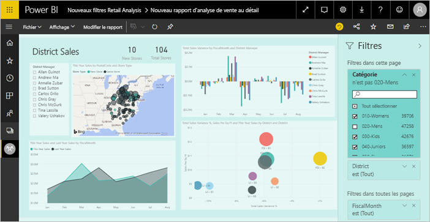
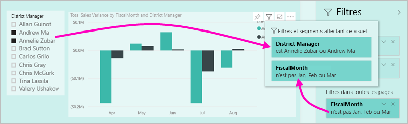
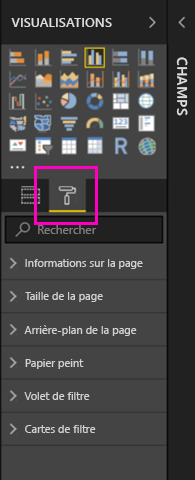
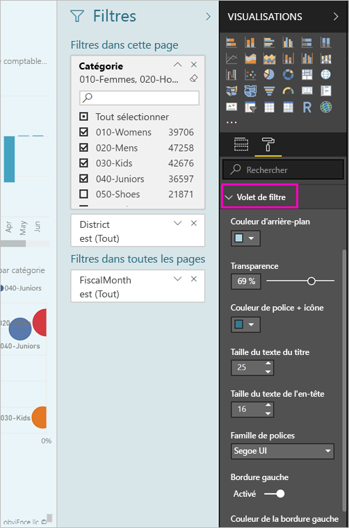
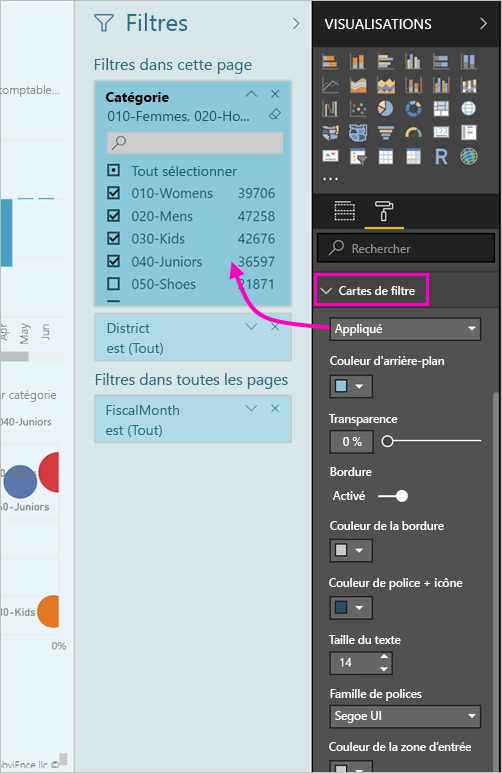

# <a name="the-new-filter-experience-in-power-bi-reports-preview"></a>La nouvelle expérience de filtre dans les rapports Power BI (préversion)

Filtres dans Power BI ont de nouvelles fonctionnalités et une nouvelle conception. Lorsque vous optez pour la nouvelle expérience de filtre, vous pouvez mettre en forme le volet filtres à se présenter comme le reste du rapport. Vous pouvez verrouiller et masquer les filtres de même. Lorsque vous concevez votre rapport, vous ne voyez plus le volet filtres ancien tout dans le volet visualisations. Procéder à votre filtre tout modification et mise en forme dans un seul volet filtres. 



> [!NOTE]
> La nouvelle expérience de filtres est en préversion. Les nouvelles builds peuvent écraser la mise en forme que vous avez déjà définie.

Un concepteur de rapports, voici ce que vous pouvez faire dans le nouveau volet filtres unique :

- Ajouter et supprimer des champs à filtrer. 
- Modifier l’état du filtre.
- Mettre en forme et de personnaliser le volet filtres afin qu’ils estiment être la partie de votre rapport.
- Définissez si le volet Filtres est ouvert ou réduit par défaut lorsqu’un consommateur ouvre le rapport.
- Masquer l’intégralité volet filtres ou des filtres spécifiques que vous ne souhaitez pas aux lecteurs du rapport pour voir.
- Contrôle même signet la visibilité, ouvrir et état du nouveau volet filtres réduit.
- Verrouillez les filtres que vous ne souhaitez pas que les consommateurs modifient.

Avec la nouvelle expérience de filtre, aux lecteurs du rapport peuvent également pointer vers n’importe quel visuel pour afficher la liste en lecture seule de tous les filtres ou segments affectant cet élément visuel.


## <a name="turn-on-the-new-filter-experience"></a>Activer la nouvelle expérience de filtre 

Vous activez la nouvelle expérience dans Power BI Desktop. Ensuite, vous pouvez modifier les filtres à cet emplacement ou dans le service Power BI (https://app.powerbi.com). Étant donné que cette nouvelle expérience de filtre est disponible en préversion, vous devez tout d’abord l’activer dans Power BI Desktop. Si vous commencez par créer un rapport dans le service Power BI, celui-ci ne peut pas avoir les nouveaux filtres.

### <a name="turn-on-new-filters-for-all-new-reports"></a>Activer de nouveaux filtres pour tous les nouveaux rapports

1. Dans Power BI Desktop, sélectionnez **Fichier** > **Options et paramètres** > **Options** > **Fonctionnalités en préversion**, puis cochez la case **Nouvelle expérience de filtre**. 
2. Redémarrez Power BI Desktop pour afficher la nouvelle expérience de filtre dans tous les nouveaux rapports.

Une fois que vous redémarrez Power BI Desktop, la nouvelle expérience est activée par défaut pour tous les nouveaux rapports que vous créez.  

### <a name="turn-on-new-filters-for-an-existing-report"></a>Activer de nouveaux filtres pour un rapport existant

Vous pouvez également activer les nouveaux filtres pour les rapports existants.

1. Dans Power BI Desktop, dans un rapport existant, sélectionnez **Fichier** > **Options et paramètres** > **Options**
2. Dans la barre de navigation gauche, sous **fichier actuel**, sélectionnez **paramètres de rapport**.
3. Sous **filtrage expérience**, sélectionnez **activer le volet de filtre mis à jour et afficher les filtres dans l’en-tête du visuel pour ce rapport**.

## <a name="view-filters-for-a-visual-in-reading-mode"></a>Afficher les filtre pour un visuel en mode Lecture

En mode Lecture, pointez sur l’icône de filtre d’un visuel pour voir une fenêtre contextuelle avec tous les filtres, les segments et ainsi de suite, qui affectent ce visuel. La mise en forme de la fenêtre contextuelle est identique à la mise en forme du volet filtres. 



Voici les types de filtres affichés par cette vue : 
- Filtres de base
- Segments
- Mise en surbrillance croisée 
- Filtrage croisé
- Filtres avancés
- N filtres principaux
- Filtres de date relative
- Segments synchronisés
- Filtres Inclure/Exclure
- Filtres transmis via une URL

## <a name="build-the-new-filters-pane"></a>Générer le nouveau volet filtres

Après avoir activé le nouveau volet filtres, il affiche à droite de la page de rapport, mise en forme par défaut en fonction de vos paramètres de rapport actuel. Le nouveau volet filtres vous permet de configurer les filtres à inclure et mettre à jour des filtres existants dans le nouveau volet. Le nouveau volet filtres montre les lecteurs de votre rapport seront affiche lorsque vous publiez votre rapport. 

1. Par défaut, les lecteurs de votre rapport peuvent voir le volet filtres. Si vous ne souhaitez pas les voir, sélectionnez l’icône représentant un œil à côté **filtres**.

    

2. Pour commencer à créer votre nouveau volet filtres, faire glisser des champs d’intérêt dans le nouveau volet filtres en tant que page visual, ou des filtres au niveau du rapport.

Lorsque vous ajoutez un élément visuel à un canevas de rapport, Power BI ajoute automatiquement un filtre au volet filtres pour chaque champ dans le visuel. 

## <a name="lock-or-hide-filters"></a>Verrouiller ou masquer des filtres

Vous pouvez verrouiller ou masquer des cartes de filtre individuelles. Si vous verrouillez un filtre, vos consommateurs de rapports peuvent l’afficher, mais pas le modifier. Si vous le masquez, ils ne peuvent pas l’afficher. Le masquage des cartes de filtre est généralement utile si vous avez besoin de masquer des filtres de nettoyage de données qui excluent les valeurs NULL ou des valeurs inattendues. 

- Dans le nouveau volet filtres, activez ou désactivez le **Zamknout filtr** ou **masquer le filtre** icônes dans une carte de filtre.

   

Comme vous activez ces paramètres et désactiver dans le nouveau volet filtres, vous consultez les modifications soient répercutées dans le rapport. Les filtres masqués ne s’affichent pas dans la fenêtre contextuelle de filtre pour un visuel.

Vous pouvez également configurer le nouvel état du volet des filtres pour transmettre avec vos signets du rapport. L’état ouvert, fermé et la visibilité du volet peuvent être configurés comme signets.
 
## <a name="format-the-new-filters-pane"></a>Mettre en forme le nouveau volet Filtres

Une grande partie de cette nouvelle expérience est que vous pouvez mettre en forme le volet filtres pour correspondre à l’apparence de votre rapport. Vous pouvez mettre en forme le volet filtres différemment pour chaque page du rapport. Voici les éléments que vous pouvez mettre en forme : 

- Couleur d’arrière-plan
- Transparence d’arrière-plan
- Activé ou désactivé de la bordure
- Couleur de la bordure
- Taille de police, de couleur et de texte Titre et en-tête

Vous pouvez également mettre en forme ces éléments pour les cartes de filtre, selon qu’elles sont appliquées (définies sur quelque chose) ou disponibles (désactivées) : 

- Couleur d’arrière-plan
- Transparence d’arrière-plan
- Bordure : activée ou désactivée
- Couleur de la bordure
- Police, couleur et taille de texte
- Couleur de la zone d’entrée

### <a name="format-the-filters-pane-and-cards"></a>Mettre en forme le volet filtres et les cartes

1. Dans le rapport, cliquez sur le rapport lui-même, ou l’arrière-plan (*papier peint*), puis dans le volet **Visualisations**, sélectionnez **Format**. 
    Vous voyez les options de mise en forme de la page de rapport, le papier peint et également le volet filtres et des cartes de filtre.

        

1. Développez le **volet Filtre** pour définir la couleur de l’arrière-plan, l’icône et la bordure gauche de la page du rapport.

    

1. Développez **Cartes de filtre** pour définir la couleur et la bordure des options **Disponible** et **Appliqué**. Si les cartes disponibles et appliquées sont de différentes couleurs, les filtres appliqués deviennent évidents. 
  
    

## <a name="theming-for-filter-pane"></a>Thèmes pour le volet de filtre
Vous pouvez maintenant modifier les paramètres par défaut du volet filtre avec le fichier de thème. Voici un exemple d’extrait de thème pour bien commencer :

 
```
"outspacePane": [{ 

"backgroundColor": {"solid": {"color": "#0000ff"}}, 

"foregroundColor": {"solid": {"color": "#00ff00"}}, 

"transparency": 50, 

"titleSize": 35, 

"headerSize": 8, 

"fontFamily": "Georgia", 

"border": true, 

"borderColor": {"solid": {"color": "#ff0000"}} 

}], 

"filterCard": [ 

{ 

"$id": "Applied", 

"transparency": 0, 

"backgroundColor": {"solid": {"color": "#ff0000"}}, 

"foregroundColor": {"solid": {"color": "#45f442"}}, 

"textSize": 30, 

"fontFamily": "Arial", 

"border": true, 

"borderColor": {"solid": {"color": "#ffffff"}}, 

"inputBoxColor": {"solid": {"color": "#C8C8C8"}} 

}, 

{ 

"$id": "Available", 

"transparency": 40, 

"backgroundColor": {"solid": {"color": "#00ff00"}}, 

"foregroundColor": {"solid": {"color": "#ffffff"}}, 

"textSize": 10, 

"fontFamily": "Times New Roman", 

"border": true, 

"borderColor": {"solid": {"color": "#123456"}}, 

"inputBoxColor": {"solid": {"color": "#777777"}} 

}] 
```

## <a name="sort-the-filter-pane"></a>Trier le volet de filtre

Fonctionnalité de tri personnalisé fait partie de la nouvelle expérience de volet de filtre. Créateurs de rapports glisser- déposer des filtres pour les réorganiser dans l’ordre de que leur choix.


L’ordre de tri par défaut est l’ordre alphabétique pour les filtres. Pour démarrer le mode de tri personnalisé, faites glisser n’importe quel filtre à une nouvelle position. Vous pouvez trier uniquement les filtres dans le niveau, qu'elles s’appliquent à--par exemple, un filtre au niveau du visuel, de niveau page ou au niveau du rapport.

## <a name="filters-pane-scaling"></a>Mise à l’échelle du volet des filtres

Le nouveau volet filtres s’adapte à la page de rapport et les éléments visuels, par conséquent, la page de rapport et des filtres de rester volet dans la proportion entre eux.

## <a name="improved-filters-pane-accessibility"></a>Amélioration de l’accessibilité volet filtres

Nous avons amélioré la navigation au clavier pour le nouveau volet filtres. Vous pouvez passer en revue chaque partie du volet filtres et utiliser la touche de contexte sur votre clavier ou sur MAJ + F10 pour ouvrir le menu contextuel.


## <a name="rename-filters"></a>Renommer des filtres
Lorsque vous modifiez le volet filtres, vous pouvez double-cliquer sur le titre pour le modifier. Changement de nom est utile si vous souhaitez mettre à jour de la carte de filtre pour être plus judicieux pour vos utilisateurs finaux. N’oubliez pas de la modification du nom de la carte de filtre est *pas* renommer le nom complet du champ dans la liste de champs. Il modifie uniquement le nom complet utilisé dans la carte de filtre.


## <a name="restrict-changes-to-filter-type"></a>Limiter les modifications pour le type de filtre

Dans le filtrage rencontrer la section des paramètres de rapport que vous avez la possibilité de contrôler si les utilisateurs peuvent modifier le type de filtre.


## <a name="next-steps"></a>Étapes suivantes

Essayez la nouvelle expérience de filtre. Envoyez-nous vos commentaires pour cette fonctionnalité, et comment nous pouvons encore améliorer, dans le [site de Power BI Ideas](https://ideas.powerbi.com/forums/265200-power-bi). 

- [Utilisation des filtres de rapport](consumer/end-user-report-filter.md)
- [Filtres et mise en évidence dans les rapports](power-bi-reports-filters-and-highlighting.md)

D’autres questions ? [Posez vos questions à la communauté Power BI](http://community.powerbi.com/)

