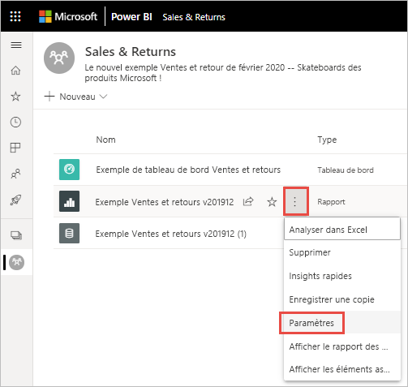
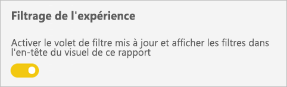
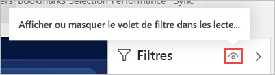
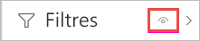
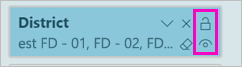
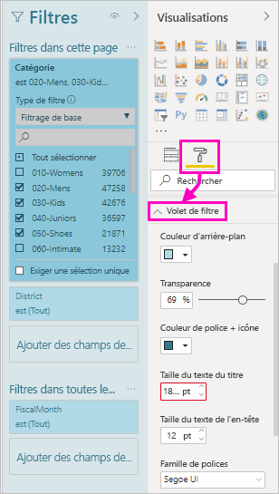
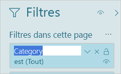

# <a name="work-with-filters-in-power-bi-reports"></a>Utiliser des filtres dans les rapports Power BI

[!INCLUDE [applies-to](includes/applies-to.md)] [!INCLUDE [yes-desktop](includes/yes-desktop.md)] [!INCLUDE [yes-service](includes/yes-service.md)]

Les filtres dans Power BI bénéficient de nouvelles fonctionnalités et d’une nouvelle conception. Lorsque vous optez pour la nouvelle expérience de filtre, vous pouvez mettre en forme le volet Filtres afin qu’il apparaisse comme le reste du rapport. Vous pouvez verrouiller et même masquer les filtres. Lorsque vous concevez votre rapport, l’ancien volet Filtres n’apparaît plus dans volet Visualisations. Toutes les opérations d’édition et de mise en forme sont réalisées dans un même volet Filtres. 


En tant que concepteur de rapports, voici quelques-unes des tâches que vous pouvez effectuer dans le nouveau volet Filtres :

- Ajoutez et supprimez des champs à filtrer. 
- Modifiez l’état du filtre.
- Mettez en forme et personnalisez le volet Filtres afin qu’il fasse partie de votre rapport.
- Définissez si le volet Filtres est ouvert ou réduit par défaut lorsqu’un consommateur ouvre le rapport.
- Masquez la totalité du volet Filtres ou des filtres spécifiques que vous ne souhaitez pas afficher pour les consommateurs du rapport.
- Contrôlez et créez même un signet de l’état de visibilité, ouvert et réduit du nouveau volet Filtres.
- Verrouillez les filtres que vous ne souhaitez pas que les consommateurs modifient.

Avec la nouvelle expérience de filtre, les consommateurs du rapport peuvent également pointer sur n’importe quel visuel pour afficher la liste en lecture seule de tous les filtres ou segments affectant ce visuel.


## <a name="turn-on-the-new-filter-experience"></a>Activer la nouvelle expérience de filtre 

La nouvelle expérience de filtre est activée par défaut pour les nouveaux rapports. Vous pouvez activer la nouvelle expérience pour les rapports existants dans Power BI Desktop ou le service Power BI.

### <a name="turn-on-new-filters-for-an-existing-report-in-power-bi-desktop"></a>Activer les nouveaux filtres pour un rapport existant dans Power BI Desktop

1. Dans Power BI Desktop, dans un rapport existant, sélectionnez **Fichier** > **Options et paramètres** > **Options**
2. Dans le volet de navigation, sous **Fichier actuel**, sélectionnez **Paramètres du rapport**.
3. Sous **Expérience de filtrage**, sélectionnez **Activer le volet de filtre mis à jour et afficher les filtres dans l’en-tête du visuel de ce rapport**.

### <a name="turn-on-new-filters-for-an-existing-report-in-the-service"></a>Activer de nouveaux filtres pour un rapport existant dans le service

Si vous avez activé **Nouvelle apparence** dans le service Power BI , la nouvelle expérience de filtre est activée automatiquement. Découvrez plus en détail la [nouvelle apparence dans le service Power BI](service-new-look.md).

Si vous n’avez pas activé la nouvelle apparence, vous pouvez toujours voir la nouvelle expérience de filtre en procédant comme suit.

1. Dans le service Power BI, ouvrez la liste de contenu pour un espace de travail.
2. Recherchez le rapport que vous souhaitez activer, sélectionnez **Plus d’options (...)** , puis sélectionnez **Paramètres** pour ce rapport.

    

3. Sous **Expérience de filtrage**, sélectionnez **Activer le volet de filtre mis à jour et afficher les filtres dans l’en-tête du visuel de ce rapport**.

    

## <a name="view-filters-for-a-visual-in-reading-mode"></a>Afficher les filtre pour un visuel en mode Lecture

En mode Lecture, pointez sur l’icône de filtre d’un visuel pour voir une fenêtre contextuelle avec tous les filtres, les segments et ainsi de suite, qui affectent ce visuel. La mise en forme de la liste de filtres est identique à celle du volet Filtres. 


Voici les types de filtres affichés par cette vue : 
- Filtres de base
- Segments
- Mise en surbrillance croisée 
- Filtrage croisé
- Filtres avancés
- N filtres principaux
- Filtres de date relative
- Segments synchronisés
- Filtres Inclure/Exclure
- Filtres transmis via une URL

## <a name="build-the-new-filters-pane"></a>Générer le nouveau volet Filtres

Après avoir activé le nouveau volet Filtres, il s’affiche à droite de la page du rapport, mis en forme par défaut en fonction de vos paramètres de rapport actuels. Vous utilisez le nouveau volet Filtres pour configurer les filtres à inclure et mettre à jour des filtres existants dans le nouveau volet. Le nouveau volet Filtres affiche ce que les lecteurs de votre rapport voient lorsque vous publiez votre rapport. 

1. Par défaut, les consommateurs de votre rapport peuvent voir le volet Filtres. Si vous ne souhaitez pas que ces consommateurs voient le volet, sélectionnez l’icône représentant un œil en regard de **Filtres**.

    

2. Pour commencer à créer votre nouveau volet Filtres, faites glisser les champs d’intérêt dans le nouveau volet Filtres en tant que filtres au niveau du visuel, de la page ou du rapport.

Quand vous ajoutez un visuel à un canevas de rapport, Power BI ajoute automatiquement un filtre au volet Filtres pour chaque champ dans le visuel. 

## <a name="hide-the-filters-pane-while-editing"></a>Masquer le volet de filtres lors de la modification

Power BI Desktop a un nouveau ruban en préversion. Sous l’onglet **Affichage**, le bouton bascule **Filtres** vous permet d’afficher ou de masquer le volet Filtres. Cette fonctionnalité est utile lorsque vous n’utilisez pas le volet Filtres et que vous avez besoin d’espace supplémentaire sur l’écran. Cet ajout aligne le volet Filtres avec les autres volets que vous pouvez ouvrir et fermer, tels que les volets Signets et Sélection. 


Ce paramètre masque uniquement le volet Filtres dans Power BI Desktop. Si vous souhaitez masquer le volet Filtres pour vos utilisateurs finaux, sélectionnez à la place l’icône représentant un **œil** en regard de **Filtres**.

 

## <a name="lock-or-hide-filters"></a>Verrouiller ou masquer des filtres

Vous pouvez verrouiller ou masquer des cartes de filtre individuelles. Si vous verrouillez un filtre, vos consommateurs de rapports peuvent l’afficher, mais pas le modifier. Si vous le masquez, ils ne peuvent pas l’afficher. Le masquage des cartes de filtre est généralement utile si vous avez besoin de masquer des filtres de nettoyage de données qui excluent les valeurs NULL ou des valeurs inattendues. 

- Dans le nouveau volet Filtres, sélectionnez ou désélectionnez les icônes **Verrouiller le filtre** ou **Masquer le filtre** dans une carte de filtre.

   

Lorsque vous activez et désactivez ces paramètres dans le nouveau volet Filtres, les modifications sont répercutées dans le rapport. Les filtres masqués ne s’affichent pas dans la fenêtre contextuelle de liste de filtres pour un visuel.

Vous pouvez également configurer l’état de votre nouveau volet Filtres pour qu’il s’accorde aux signets de votre rapport. L’état ouvert, fermé et la visibilité du volet peuvent être configurés comme signets.
 
## <a name="format-the-new-filters-pane"></a>Mettre en forme le nouveau volet Filtres

Une grande partie de cette nouvelle expérience est que vous pouvez mettre en forme le volet Filtres pour qu’il corresponde à l’apparence de votre rapport. Vous pouvez mettre en forme le volet Filtres différemment pour chaque page du rapport. Voici les éléments que vous pouvez mettre en forme : 

- Couleur d'arrière-plan
- Transparence d’arrière-plan
- Bordure activée ou désactivée
- Couleur de la bordure
- Police du titre et de l’en-tête, couleur et taille du texte

Vous pouvez également mettre en forme ces éléments pour les cartes de filtre, selon qu’elles sont appliquées (définies sur quelque chose) ou disponibles (désactivées) : 

- Couleur d'arrière-plan
- Transparence d’arrière-plan
- Bordure : activée ou désactivée
- Couleur de la bordure
- Police, couleur et taille de texte
- Couleur de la zone d’entrée

### <a name="format-the-filters-pane-and-cards"></a>Mettre en forme le volet Filtres et les cartes

1. Dans le rapport, cliquez sur le rapport lui-même, ou l’arrière-plan (*papier peint*), puis dans le volet **Visualisations**, sélectionnez **Format**. 
    Les options de mise en forme de la page du rapport, du papier peint et également du volet Filtres et des cartes de filtre s’affichent.

1. Développez le **volet Filtres** pour définir la couleur de l’arrière-plan, l’icône et la bordure gauche de la page du rapport.

    

1. Développez **Cartes de filtre** pour définir la couleur et la bordure des options **Disponible** et **Appliqué**. Si les cartes disponibles et appliquées sont de différentes couleurs, les filtres appliqués deviennent évidents. 
  
    

## <a name="theming-for-filters-pane"></a>Choix des thèmes du volet Filtres
Vous pouvez maintenant modifier les paramètres par défaut du volet Filtres avec le fichier de thèmes. Voici un exemple d’extrait de thème pour bien commencer :

 
```
"outspacePane": [{ 

"backgroundColor": {"solid": {"color": "#0000ff"}}, 

"foregroundColor": {"solid": {"color": "#00ff00"}}, 

"transparency": 50, 

"titleSize": 35, 

"headerSize": 8, 

"fontFamily": "Georgia", 

"border": true, 

"borderColor": {"solid": {"color": "#ff0000"}} 

}], 

"filterCard": [ 

{ 

"$id": "Applied", 

"transparency": 0, 

"backgroundColor": {"solid": {"color": "#ff0000"}}, 

"foregroundColor": {"solid": {"color": "#45f442"}}, 

"textSize": 30, 

"fontFamily": "Arial", 

"border": true, 

"borderColor": {"solid": {"color": "#ffffff"}}, 

"inputBoxColor": {"solid": {"color": "#C8C8C8"}} 

}, 

{ 

"$id": "Available", 

"transparency": 40, 

"backgroundColor": {"solid": {"color": "#00ff00"}}, 

"foregroundColor": {"solid": {"color": "#ffffff"}}, 

"textSize": 10, 

"fontFamily": "Times New Roman", 

"border": true, 

"borderColor": {"solid": {"color": "#123456"}}, 

"inputBoxColor": {"solid": {"color": "#777777"}} 

}] 
```

## <a name="sort-the-filters-pane"></a>Trier le volet Filtres

La fonctionnalité de tri personnalisé fait partie de la nouvelle expérience du volet Filtres. Les créateurs de rapports peuvent glisser-déposer des filtres pour les réorganiser dans l’ordre de leur choix.


Pour les filtres, l’ordre de tri par défaut est l’ordre alphabétique. Pour démarrer le mode de tri personnalisé, faites glisser n’importe quel filtre vers une nouvelle position. Vous pouvez uniquement trier les filtres d’un même niveau, par exemple un filtre au niveau du visuel, de la page ou du rapport.

## <a name="improved-filters-pane-accessibility"></a>Amélioration de l’accessibilité du volet Filtres

Nous avons amélioré la navigation au clavier dans le nouveau volet Filtres. Vous pouvez faire défiler chaque partie du volet Filtres et utiliser la touche de contexte sur votre clavier ou les touches MAJ+F10 pour ouvrir le menu contextuel.


## <a name="rename-filters"></a>Renommer des filtres
Lorsque vous modifiez le volet Filtres, vous pouvez double-cliquer sur le titre pour le modifier. Changer de nom est utile si vous souhaitez mettre à jour la carte du filtre afin de la rendre plus visible pour les utilisateurs finaux. N’oubliez pas que la modification du nom de la carte du filtre ne renomme *pas* le nom complet du champ dans la liste des champs. Elle modifie uniquement le nom complet utilisé dans la carte du filtre.



## <a name="filters-pane-search"></a>Recherche dans le volet Filtres

La fonctionnalité de recherche dans le volet Filtres vous permet d’effectuer une recherche par titre dans vos cartes de filtre. Cette fonctionnalité est utile si vous avez plusieurs cartes de filtre dans le volet Filtres et que vous avez besoin d’aide pour trouver celles qui vous intéressent.


Vous pouvez aussi mettre en forme la zone de recherche, de la même façon que vous pouvez mettre en forme les autres éléments du volet Filtres.


La fonctionnalité de recherche dans le volet Filtres est activée par défaut, mais vous pouvez également choisir de l’activer ou de la désactiver en sélectionnant **Activer la recherche pour le volet Filtres** dans les Paramètres de rapport de la boîte de dialogue Options.


## <a name="restrict-changes-to-filter-type"></a>Limiter les modifications au type de filtre

Sous la section Expérience de filtrage des paramètres du rapport, vous avez la possibilité de contrôler si les utilisateurs peuvent modifier le type de filtre.


## <a name="considerations-and-limitations"></a>Considérations et limitations

La publication sur le web n’affiche pas le volet Filtres. Si vous envisagez de publier un rapport sur le web, envisagez d’ajouter des sélecteurs pour le filtrage.

## <a name="next-steps"></a>Étapes suivantes

Essayez la nouvelle expérience de filtre. Faites-nous part de vos commentaires pour cette fonctionnalité et de la façon dont nous pouvons continuer à améliorer cette expérience, sur le [site Power BI Ideas](https://ideas.powerbi.com/forums/265200-power-bi). 

- [Utilisation des filtres de rapport](consumer/end-user-report-filter.md)
- [Filtres et mise en évidence dans les rapports](power-bi-reports-filters-and-highlighting.md)
- [Différents types de filtres dans Power BI](power-bi-report-filter-types.md)

D’autres questions ? [Posez vos questions à la communauté Power BI](https://community.powerbi.com/)

