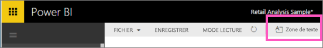
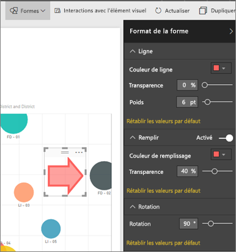

# Zones de texte et formes dans les rapports Power BI
Vous pouvez ajouter des zones de texte et formes aux rapports à l’aide du service Power BI et Power BI Desktop. Dans les deux cas, vous devez disposer d’autorisations de modification du rapport. Si un rapport a été partagé avec vous dans le service Power BI, vous n’aurez d’autorisations de modification. 

Regardez comment Will utilise Power BI Desktop de [ajouter des images statiques à un rapport](guided-learning/visualizations.yml?tutorial-step=11), puis suivez les étapes ci-dessous pour essayer par vous-même en utilisant le service Power BI à la place.
> 
> <iframe width="560" height="315" src="https://www.youtube.com/embed/_3q6VEBhGew" frameborder="0" allowfullscreen></iframe>
> 

## Ajouter une zone de texte à un rapport
1. Ouvrez un rapport en Mode Édition.

2. Placez votre curseur dans une zone vide du canevas de rapport et sélectionnez **zone de texte** dans le menu supérieur.
   
   
3. Tapez votre texte dans la zone de texte et, si vous le souhaitez, définir l’alignement de texte, la couleur et la police du format. 
   
   
4. Pour positionner la zone de texte, sélectionnez la zone grise située sur le dessus, puis faites-la glisser. Pour redimensionner la zone de texte, sélectionnez et faites glisser l’une des poignées de contour. 
   
   

5. La zone de texte étant toujours sélectionnée, d’ajouter la mise en forme supplémentaires dans le **visualisations** volet. Dans cet exemple, nous avons mis en forme l’arrière-plan et la bordure. Vous pouvez également attribuer une taille et une position exactes à une zone de texte.  

   

6. Pour fermer la zone de texte, sélectionnez une zone vide du canevas de rapport. 

7. Sélectionnez l’icône en forme d’épingle   Pour épingler la zone de texte à un tableau de bord. 

## Ajouter une forme à un rapport
1. Positionnez le curseur n’importe où dans le canevas de rapport, puis sélectionnez **Formes**.
   
   
2. Dans la liste déroulante, sélectionnez une forme pour l’ajouter à votre canevas de rapport. Pour cet exemple, ajoutez une flèche pour attirer l’attention sur la bulle avec l’écart des ventes totales le plus élevé. 
   
   Dans le volet **Format de la forme**, personnalisez votre forme. Dans cet exemple, nous avons créé une flèche rouge avec une bordure rouge foncé, pivotée de 90 degrés.
   
   
3. Pour positionner la forme, sélectionnez la zone grise située sur le dessus, puis faites-la glisser. Pour redimensionner la forme, sélectionnez et faites glisser l’une des poignées de contour. Comme avec la zone de texte, vous pouvez également attribuer une taille et une position exactes à une forme.

   > [!NOTE]
   > Il n’est pas possible d’épingler des formes à un tableau de bord, sauf en tant que visuels en [épinglant une page dynamique](service-dashboard-pin-live-tile-from-report.md). 
   > 
   > 

## Étapes suivantes
[Ajouter un lien hypertexte à une zone de texte](service-add-hyperlink-to-text-box.md)

[Concepts de base pour les consommateurs du service Power BI](consumer/end-user-basic-concepts.md)

D’autres questions ? [Posez vos questions à la communauté Power BI](http://community.powerbi.com/)
