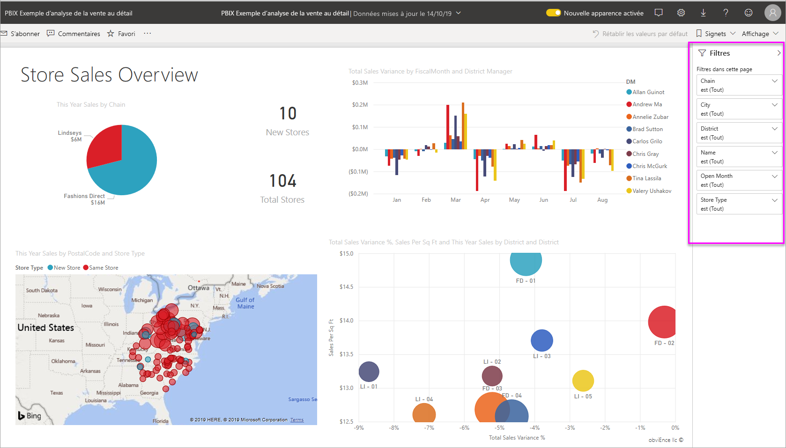
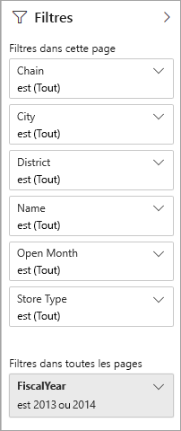
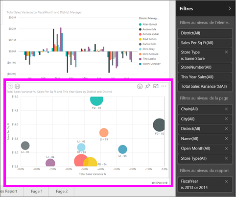
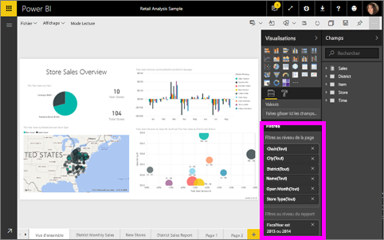

# À propos des filtres et de la mise en évidence dans les rapports Power BI
Les ***filtres*** masquent tout, sauf les données qui vous intéressent.  Contrairement au filtrage, qui masque les données, la ***mise en évidence*** met en évidence un sous-ensemble des données visibles ; les données qui ne sont pas mises en évidence restent visibles, mais sont estompées.

Il existe de nombreuses façons de filtrer et de mettre en évidence des rapports dans Power BI. Expliquer ces méthodes dans un seul article serait déroutant. Nous les avons donc réparties comme suit :

* Présentation des filtres et de la mise en évidence (cet article)
* Méthodes permettant de [créer et d’utiliser des filtres et la mise en évidence dans des rapports en mode Édition dont vous êtes propriétaire](power-bi-report-add-filter.md). Quand vous disposez d’autorisations de modification d’un rapport, vous pouvez créer, modifier et supprimer les filtres et la mise en évidence dans ce rapport.
* Méthodes permettant d’[utiliser des filtres et la mise en évidence dans un rapport partagé avec vous ou en mode Lecture](consumer/end-user-reading-view.md). Ce que vous pouvez faire est plus limité, mais Power BI vous donne toujours un large éventail d’options de filtrage et de mise en évidence.  
* [Visite guidée détaillée des commandes de filtrage et de mise en évidence disponibles en mode Édition](consumer/end-user-report-filter.md), y compris une présentation détaillée des types de filtre (date et heure, numérique, texte, etc.) et la différence entre les options de base et avancée.
* Maintenant que vous connaissez le fonctionnement par défaut des filtres et de la mise en évidence, [découvrez comment modifier l’affichage des visualisations sur un filtre au niveau de la page et effectuer une mise en évidence](consumer/end-user-interactions.md)

> [!TIP]
> Comment Power BI peut savoir la façon dont les données sont liées ?  Power BI utilise les relations entre les différentes tables et les différents champs du [modèle de données](https://support.office.com/article/Create-a-Data-Model-in-Excel-87e7a54c-87dc-488e-9410-5c75dbcb0f7b?ui=en-US&rs=en-US&ad=US) sous-jacent pour que les éléments d’une page de rapport interagissent les uns avec les autres.
> 
> 

## Présentation des filtres et de la mise en évidence dans les rapports à l’aide du volet Filtres
 Cet article vous présente le filtrage et la mise en évidence dans le service Power BI.  Mais l’expérience est presque la même dans Power BI Desktop.  

Les filtres et la mise en évidence peuvent être appliqués à l’aide du volet **Filtres** ou en effectuant des sélections directement sur le rapport lui-même (ad hoc, voir en bas de page). Le volet Filtres montre les tables et les champs utilisés dans le rapport et les filtres qui ont été appliqués, le cas échéant. Les filtres sont répartis comme suit : **Niveau page**, **Niveau rapport**, **Exploration**  et **Niveau visuel**.  Les filtres au niveau de l’élément visuel s’affichent uniquement si vous avez sélectionné une visualisation sur le canevas de rapport.

> [!TIP]
> Si le filtre est accompagné du mot **Tout**, cela signifie que le champ entier est inclus en tant que filtre.  Par exemple, dans la capture d’écran ci-dessous, **Chain(Tout)** indique que cette page de rapport inclut des données sur toutes les chaînes de magasin.  En revanche, le filtre au niveau du rapport **AnnéeFiscale est 2013 ou 2014** indique que le rapport inclut des données uniquement pour les années fiscales 2013 et 2014.
> 
> 

## Filtres en mode Lecture et en mode Édition
Il existe deux modes d’interaction avec les rapports : le [mode Lecture et le mode Édition](consumer/end-user-reading-view.md).  Et les fonctionnalités de filtrage disponibles varient en fonction du mode dans lequel vous êtes.

* En mode Édition, vous pouvez ajouter des filtres de rapport, de page, d’exploration et de visuel. Quand vous enregistrez le rapport, les filtres sont enregistrés avec le rapport, même si vous l’ouvrez dans une application mobile. Les personnes qui consultent le rapport en mode Lecture peuvent interagir avec les filtres que vous avez ajoutés, mais elles ne peuvent pas ajouter de nouveaux filtres.
* En mode Lecture, vous pouvez interagir avec les filtres qui déjà existent dans le rapport et enregistrer la sélection que vous effectuez.  Vous ne pouvez cependant pas ajouter de nouveaux filtres.

### Volet Filtres en mode Lecture
Si vous avez uniquement accès à un rapport en mode Lecture, le volet Filtres a l’aspect suivant :

Par conséquent, cette page de rapport a 6 filtres au niveau de la page et 1 filtre au niveau du rapport.

Pour voir si des filtres au niveau de l’élément visuel existent, sélectionnez un élément visuel. Dans l’image ci-dessous, 6 filtres ont été appliqués au graphique en bulles.

En mode Lecture, explorez les données en modifiant les filtres existants. Les modifications que vous avez apportées sont enregistrées avec le rapport, même si vous ouvrez le rapport dans une application mobile. Découvrez plus d’informations dans [Mode Lecture et mode Édition dans le service Power BI](consumer/end-user-reading-view.md)

### Volet Filtres en mode Édition
Quand vous disposez des autorisations de propriétaire sur un rapport et que vous ouvrez celui-ci en mode Édition, **Filtres** est l’un des volets d’édition disponibles.

En mode Lecture (ci-dessus), cette page de rapport a 6 filtres au niveau de la page et 1 filtre au niveau du rapport. Quand vous sélectionnez le graphique en bulles, vous voyez que 6 filtres au niveau de l’élément visuel s’appliquent.

Toutefois, en mode Édition, les filtres et la mise en évidence permettent d’effectuer de nombreuses autres opérations. La principale différence est que nous pouvons ajouter de nouveaux filtres. Découvrez comment et bien plus encore dans l’article [Ajouter un filtre à un rapport](power-bi-report-add-filter.md)

## Filtrage et mise en évidence ad hoc
Sélectionnez un champ sur le canevas de rapport pour filtrer et mettre en évidence le reste de la page. Sélectionnez un espace vide dans ce même élément visuel pour le supprimer. Ce type de filtrage et de mise en évidence est un moyen facile d’explorer rapidement l’impact des données. Pour plus d’informations sur le filtrage croisé et la mise en évidence croisée, consultez [Interactions avec les visualisations](consumer/end-user-interactions.md).

Quand vous quittez le rapport, vos modifications sont enregistrées. Pour annuler votre filtrage et revenir au filtrage, à la segmentation, à l’extraction et au tri définis par défaut par l’auteur du rapport, sélectionnez **Rétablir les valeurs par défaut** dans la barre de menus du haut.

## Étapes suivantes
[Interagir avec les filtres et la mise en évidence (en mode Lecture)](consumer/end-user-reading-view.md)

[Ajouter un filtre à un rapport (en mode Édition)](power-bi-report-add-filter.md)

[Découvrir les filtres de rapport](consumer/end-user-report-filter.md)

[Modifier la façon dont le filtrage croisé et la mise en évidence croisée affectent les visuels d’un rapport](consumer/end-user-interactions.md)

En savoir plus sur les [rapports dans Power BI](consumer/end-user-reports.md)

D’autres questions ? [Posez vos questions à la communauté Power BI](http://community.powerbi.com/)

