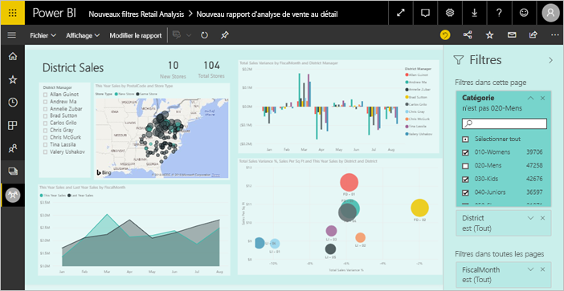

# Filtres et mise en évidence dans les rapports Power BI
 Cet article vous présente le filtrage et la mise en évidence dans le service Power BI. L’expérience est presque la même dans Power BI Desktop. Les *filtres* masquent tout, sauf les données qui vous intéressent. La *mise en évidence* n’est pas du filtrage. Elle ne supprime pas des données, mais elle met en évidence une partie des données visibles ; les données qui ne sont pas mises en évidence restent visibles, mais elles sont estompées.

Il existe de nombreuses façons de filtrer et de mettre en évidence des rapports dans Power BI. Expliquer ces méthodes dans un seul article serait déroutant. Nous les avons donc réparties comme suit :

* Présentation des filtres et de la mise en évidence, l’article que vous lisez en ce moment.
* Comment [créer et utiliser des filtres en mode Édition](power-bi-report-add-filter.md) dans des rapports dans Power BI Desktop et le service Power BI. Quand vous disposez d’autorisations de modification d’un rapport, vous pouvez créer, modifier et supprimer les filtres dans ces rapports.
* Comment les visuels [filtrent et mettent en évidence dans un rapport partagé avec vous](consumer/end-user-interactions.md) en mode Lecture d’un rapport, dans le service Power BI. Ce que vous pouvez faire est plus limité, mais vous disposez toujours d’un large éventail d’options de filtrage et de mise en surbrillance.  
* Présentation détaillée des [contrôles de filtre et de mise en évidence en mode Édition](power-bi-report-add-filter.md) dans Power BI Desktop et le service Power BI. L’article examine en détail les types de filtres, notamment date et heure, numérique et texte. Il couvre également les différences entre les options de base et les options avancées.
* Après avoir découvert le fonctionnement par défaut des filtres et de la mise en surbrillance, découvrez comment [modifier l’affichage des visualisations sur un filtre au niveau de la page et effectuer une mise en surbrillance](service-reports-visual-interactions.md)

**Le saviez-vous ?** Power BI a une nouvelle expérience de filtre, actuellement en préversion. En savoir plus sur [la nouvelle expérience de filtre dans les rapports Power BI](power-bi-report-filter.md).

## Présentation du volet Filtres

Vous pouvez appliquer des filtres dans le volet **Filtres** ou en [effectuant des sélections dans des segments](visuals/power-bi-visualization-slicers.md) directement dans le rapport. Le volet Filtres montre les tables et les champs utilisés dans le rapport et les filtres qui ont été appliqués, le cas échéant. 

Il existe quatre types de filtres.

- Un **filtre de page** s’applique à tous les visuels d’une page de rapport.     
- Un **filtre visuel** s’applique à un seul visuel d’une page de rapport. Les filtres au niveau du visuel s’affichent uniquement si vous avez sélectionné un visuel sur le canevas de rapport.    
- Un **filtre de rapport** s’applique à toutes les pages du rapport.    
- Un **filtre d’extraction** s’applique à une seule entité dans un rapport.    

Vous pouvez exécuter une recherche dans la page, le visuel et les filtres de rapport, en mode Lecture ou Édition, pour rechercher et sélectionner la valeur souhaitée. 

Si le mot **Tout** s’affiche en regard du filtre, cela signifie que toutes les valeurs dans le champ sont incluses dans le filtre.  Par exemple, dans la capture d’écran ci-dessous, **Chain(Tout)** indique que cette page de rapport inclut des données sur toutes les chaînes de magasin.  En revanche, le filtre au niveau du rapport **AnnéeFiscale est 2013 ou 2014** indique que le rapport inclut des données uniquement pour les années fiscales 2013 et 2014.

## Filtres en mode Lecture ou Édition
Il existe deux modes d’interaction avec les rapports : le [mode Lecture](consumer/end-user-reading-view.md) et le mode Édition. Les fonctionnalités de filtrage disponibles varient en fonction du mode dans lequel vous êtes.

* En mode Édition, vous pouvez ajouter des filtres de rapport, de page, d’exploration et de visuel. Quand vous enregistrez le rapport, les filtres sont enregistrés avec le rapport, même si vous l’ouvrez dans une application mobile. Les personnes qui consultent le rapport en mode Lecture peuvent interagir avec les filtres que vous avez ajoutés, mais elles ne peuvent pas ajouter de nouveaux filtres.
* En mode Lecture, vous pouvez interagir avec les filtres qui déjà existent dans le rapport et enregistrer les sélections que vous effectuez. Vous ne pouvez pas ajouter de nouveaux filtres.

### Filtres en mode Lecture
Si vous avez uniquement accès à un rapport en mode Lecture, le volet Filtres a l’aspect suivant :

Par conséquent, cette page de rapport a 6 filtres au niveau de la page et 1 filtre au niveau du rapport.

Chaque visuel peut avoir des filtres pour tous les champs dans le visuel et un auteur de rapport peut en ajouter d’autres. Dans l’image ci-dessous, 6 filtres ont été appliqués au graphique en bulles.

En mode Lecture, explorez les données en modifiant les filtres existants. Les modifications que vous avez apportées sont enregistrées avec le rapport, même si vous ouvrez le rapport dans une application mobile. Découvrez comment en [explorant le volet Filtres de rapport](consumer/end-user-report-filter.md)

Quand vous quittez le rapport, vos filtres sont enregistrés. Pour annuler votre filtrage et revenir au filtrage, à la segmentation, à l’extraction et au tri définis par défaut par l’auteur du rapport, sélectionnez **Rétablir les valeurs par défaut** dans la barre de menus du haut.

### Filtres en mode Édition
Quand vous disposez des autorisations de propriétaire sur un rapport et que vous ouvrez celui-ci en mode Édition, **Filtres** est l’un des volets d’édition disponibles.

Comme en mode Lecture, cette page de rapport a 6 filtres au niveau de la page et 1 filtre au niveau du rapport. Quand vous sélectionnez le graphique en bulles, vous voyez que 6 filtres au niveau du visuel s’appliquent.

Il est possible d’en faire plus avec les filtres et la mise en surbrillance en mode Édition. Principalement, nous pouvons ajouter de nouveaux filtres. Découvrez comment [ajouter un filtre à un rapport](power-bi-report-add-filter.md) et bien plus encore.

## Mise en évidence ad hoc
Sélectionnez une valeur ou une étiquette d’axe dans un visuel pour mettre en évidence les autres visuels de la page. Pour supprimer la mise en évidence, resélectionnez la valeur ou sélectionnez un endroit vide dans le même visuel. Ce type de mise en évidence est un moyen facile d’explorer rapidement l’impact des données. Pour plus d’informations sur la mise en surbrillance croisée, consultez [Interactions entre les visuels](service-reports-visual-interactions.md).

## Étapes suivantes

[La nouvelle expérience des filtres dans les rapports Power BI](power-bi-report-filter.md)

[Ajouter un filtre à un rapport (en mode Édition)](power-bi-report-add-filter.md)

[Découvrir les filtres de rapport](consumer/end-user-report-filter.md)

[Modifier la façon dont le filtrage croisé et la mise en évidence croisée affectent les visuels d’un rapport](consumer/end-user-interactions.md)

D’autres questions ? [Posez vos questions à la communauté Power BI](http://community.powerbi.com/)

