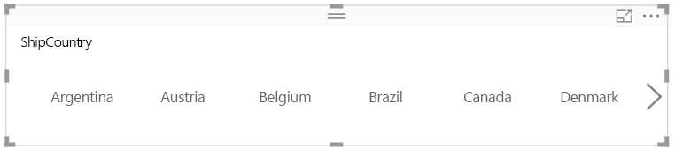
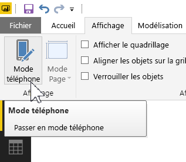
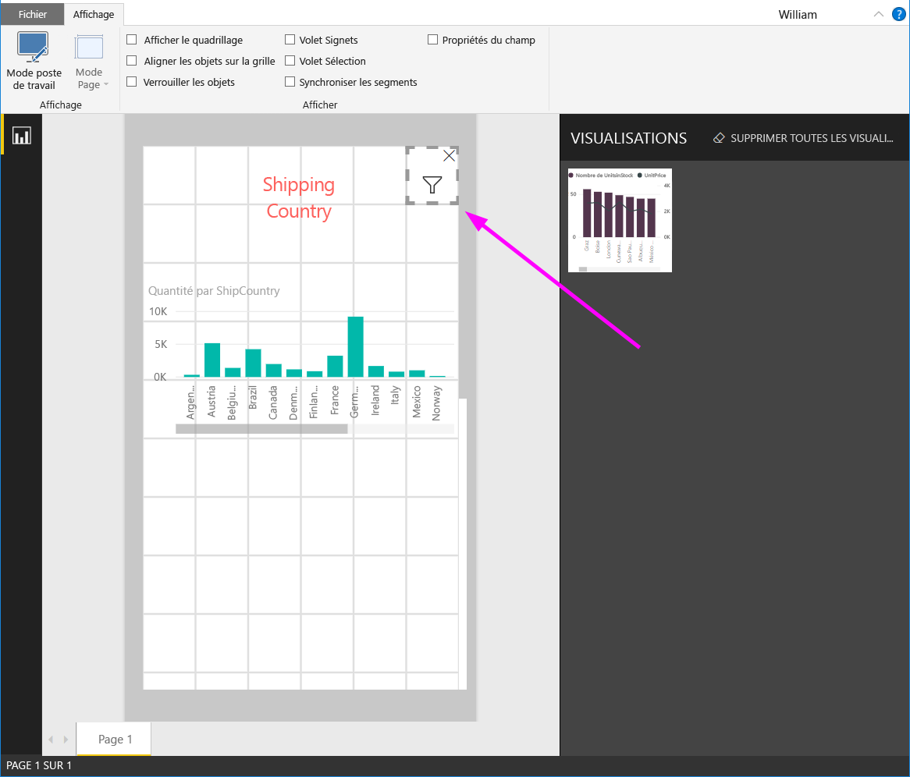

# Créer un segment réactif que vous pouvez redimensionner dans Power BI

Les segments réactifs peuvent être redimensionnés de manière à s’ajuster à n’importe quel emplacement de votre rapport. Vous pouvez redimensionner les segments réactifs à la taille et la forme de votre choix (horizontal, carré, vertical). Les valeurs qu’ils contiennent sont réorganisées au fur et à mesure. Dans Power BI Desktop et dans le service Power BI, vous pouvez rendre réactifs des segments horizontaux et des segments date/plage. L’amélioration des zones tactiles des segments de date/plage permet de les modifier rapidement. Vous pouvez choisir la taille des segments réactifs. Ils se redimensionnent également de manière automatique sur les rapports du service Power BI ainsi que dans les applications mobiles Power BI. 

## Création d’un segment

Pour créer un segment dynamique, la première étape consiste à créer un segment de base. 

1. Dans le volet **Visualisations**, sélectionnez l’icône  **icône Segment**.
2. Faites glisser le champ sur lequel effectuer le filtrage vers la zone **Champ**.

    

## Convertir en segment horizontal

1. Une fois le segment sélectionné, dans le volet **Visualisations**, sélectionnez l’onglet **Format**.
2. Développez la section **Général**, puis pour **Orientation**, sélectionnez **Horizontal**.

     

1.  Vous pouvez l’agrandir de manière à afficher plus de valeurs.

     

## Rendre un segment réactif et le tester

Cette étape est facile. 

1. Juste en dessous de l’option **Orientation**, dans la section **Général** de l’onglet **Format**, définissez **Réactif** sur **Activé**.  

    

1. Vous pouvez ensuite faire quelques essais. Faites glisser les angles pour modifier la taille et la largeur. S’il est suffisamment petit, il se transforme en simple icône de filtre.

    

## Ajouter le segment à une disposition de rapport sur téléphone

Dans Power BI Desktop, vous pouvez créer une disposition de téléphone pour chaque page d’un rapport. Si une page possède une disposition de téléphone, elle s’affiche sur un téléphone mobile en mode portrait. Sinon, vous devez la consulter en mode paysage. 

1. Dans le menu **Affichage**, sélectionnez **Mode téléphone**.

     
    
1. Faites glisser les éléments visuels à inclure dans le rapport de téléphone vers la grille. Lorsque vous faites glisser le segment réactif, donnez-lui la taille souhaitée (dans cet exemple, une simple icône de filtre).

    

Consultez davantage d’informations sur la création de [rapports optimisés pour les applications mobiles Power BI](desktop-create-phone-report.md).

## Rendre réactif un segment d’heure ou de plage

Vous pouvez suivre la même procédure pour rendre un segment d’heure ou de plage réactif. Après avoir défini **Réactif** sur **Activé**, vous allez remarquer les modifications suivantes :

- Les éléments visuels optimisent l’ordre des zones d’entrée en fonction de la taille autorisée sur le canevas. 
- L’affichage des éléments de données est modifié de manière à optimiser l’utilisation du segment, en fonction de la taille qui lui est réservée sur le canevas. 
- De nouvelles poignées rondes sur les curseurs permettent d’optimiser les interactions tactiles. 
- Lorsqu’un élément visuel devient trop petit pour être utile, il se transforme en icône représentant le type d’élément visuel. Il suffit d’un double-clic pour l’ouvrir en mode focus et interagir avec lui. Vous réalisez ainsi un précieux gain de place sur la page de rapport, sans perdre la fonctionnalité.

## Étapes suivantes

- [Segments dans le service Power BI](visuals/power-bi-visualization-slicers.md)
- D’autres questions ? [Essayez d’interroger la communauté Power BI](http://community.powerbi.com/)