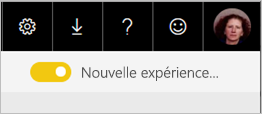

# Utiliser Power BI Q & r pour Explorer vos données et créer des éléments visuels

Il est parfois plus rapide d’obtenir des informations à partir de vos données en posant une question dans un langage naturel. La fonctionnalité Q & r dans Power BI vous permet d’Explorer vos données avec vos propres mots.  La première partie de cet article montre comment utiliser les questions et réponses dans les tableaux de bord dans le service Power BI. La deuxième partie montre ce que vous pouvez faire avec Q & r lors de la création de rapports dans le service Power BI ou Power BI Desktop. Pour plus d’informations, consultez le [Q & r pour les consommateurs](consumer/end-user-q-and-a.md) article. 

[Questions et réponses dans les applications mobiles Power BI](consumer/mobile/mobile-apps-ios-qna.md) et [Q & r avec Power BI Embedded](developer/qanda.md) sont traités dans différents articles. 

Q & r est interactif et même amusant. Souvent, une question conduit à d’autres personnes comme les visualisations révèlent des voies intéressantes à poursuivre. Regardez Amanda illustrer l’utilisation de Questions et réponses pour créer des visualisations, les explorer et les épingler à des tableaux de bord.

<iframe width="560" height="315" src="https://www.youtube.com/embed/qMf7OLJfCz8?list=PL1N57mwBHtN0JFoKSR0n-tBkUJHeMP2cP" frameborder="0" allowfullscreen></iframe>

## Partie 1 : Utiliser Q & r sur un tableau de bord dans le service Power BI

Dans le service Power BI (app.powerbi.com), un tableau de bord contient des vignettes épinglées à partir d’un ou plusieurs datasets, donc vous pouvez poser des questions sur les données contenues dans un de ces jeux de données. Pour afficher les rapports et les jeux de données utilisés pour créer le tableau de bord, sélectionnez **afficher les éléments associés** à partir de la barre de menus.

La zone de question Q & r se trouve dans le coin supérieur gauche de votre tableau de bord, où vous tapez votre question à l’aide du langage naturel. Ne pas voir le Forum aux questions une zone ? Consultez [considérations et résolution des problèmes](consumer/end-user-q-and-a.md#considerations-and-troubleshooting) dans le **Q & r pour les consommateurs** article.  Q & r reconnaît les mots que vous tapez et cherche l’emplacement (dans le jeu de données) pour trouver la réponse. Q&R vous aide également à formuler votre question grâce à la saisie semi-automatique, à la reformulation, ainsi qu’à d’autres aides textuelles et visuelles.

La réponse à votre question s’affiche comme une visualisation interactive et change quand vous modifiez votre question.

1. Ouvrez un tableau de bord et placez votre curseur dans la zone de questions. Dans le coin supérieur droit, sélectionnez **nouveau forum aux questions une expérience**.

    

1. Avant même que vous commenciez à taper votre question, Q&R affiche dans un nouvel écran des suggestions de formulation de votre question. Vous consultez des expressions et des questions complètes contenant les noms des tables dans les jeux de données sous-jacente et peuvent même voir les questions complètes répertoriées si le propriétaire du jeu de données a créé [questions proposées](service-q-and-a-create-featured-questions.md),

   

   Vous pouvez choisir une de ces questions comme point de départ et continuer à affiner la question pour trouver une réponse spécifique. Ou utilisez un nom de table pour vous aider à une nouvelle question de mot.

2. Sélectionnez dans la liste de questions, ou commencez à taper votre question, puis sélectionnez à partir des liste déroulante suggestions.

   

3. Lorsque vous tapez une question, Q & r choisit la meilleure visualisation pour afficher votre réponse.

   

4. La visualisation change dynamiquement en tant que vous modifiez la question.

   

1. Quand vous tapez une question, Power BI recherche la meilleure réponse dans les jeux de données ayant une vignette sur ce tableau de bord.  Si toutes les vignettes proviennent du *jeu_de_données_A*, votre réponse proviendra du *jeu_de_données_A*.  S’il existe des vignettes à partir de *Jeu_de_données_a* et *Jeu_de_données_b*, Q & r recherchant la meilleure réponse dans ces 2 jeux de données.

   > [!TIP]
   > Attention : si vous disposez d’une seule vignette provenant du *jeu_de_données_A* et que vous la supprimez de votre tableau de bord, Questions et réponses n’a plus accès au *jeu_de_données_A*.
   >

5. Lorsque vous êtes satisfait du résultat, épinglez la visualisation à un tableau de bord en sélectionnant l’icône d’épingle dans le coin supérieur droit. Si le tableau de bord a été partagé avec vous, ou fait partie d’une application, vous ne pouvez pas l’épingler.

   

## Partie 2 : Utiliser Questions et réponses dans un rapport dans le service Power BI ou dans Power BI Desktop

Utilisez Questions et réponses pour explorer votre jeu de données et pour ajouter des visualisations au rapport et aux tableaux de bord. Un rapport est basé sur un seul jeu de données et peut être entièrement vide ou contenir des pages avec nombreuses visualisations. Toutefois, ce n’est pas parce qu’un rapport est vide que vous n’avez pas de données à explorer : le jeu de données est lié au rapport et vous n’avez plus qu’à explorer et créer des visualisations.  Pour afficher le jeu de données utilisé pour créer un rapport, ouvrez le rapport en mode Lecture dans le service Power BI et sélectionnez **Afficher les éléments associés** à partir de la barre de menus.

Pour utiliser les questions et réponses dans les rapports, vous devez disposer des autorisations de modification pour le rapport et un jeu de données sous-jacent. Dans le [Q & r pour les consommateurs](consumer/end-user-q-and-a.md) article, nous désignez-le en tant qu’un *créateur* scénario. Si vous êtes à la place *consommation* un rapport qui a été partagé avec vous, questions et réponses n’est pas disponible.

1. Ouvrir un rapport en mode édition (service Power BI) ou une vue de rapport (Power BI Desktop) et sélectionnez **poser une question** à partir de la barre de menus.

    **Power BI Desktop**    
    

    **Service**    
    

2. Une zone de question Questions et réponses s’affiche sur le canevas de rapport. Dans l’exemple ci-dessous, la zone de question s’affiche sur une autre visualisation. C’est un fonctionnement correct, mais il peut être préférable d’ajouter une page vierge au rapport avant de poser une question.

    

3. Placez votre curseur dans la zone de question. À mesure que vous tapez, Questions et réponses affiche des suggestions de formulation de votre question.

   

4. Quand vous tapez votre question, Questions et réponses sélectionne la meilleure [visualisation](visuals/power-bi-visualization-types-for-reports-and-q-and-a.md) pour répondre à la question, et change la visualisation de manière dynamique à mesure que vous modifiez la question.

   

5. Lorsque vous disposez de la visualisation voulue, appuyez sur Entrée. Pour enregistrer la visualisation avec le rapport, sélectionnez **Fichier > Enregistrer**.

6. Interagissez avec la nouvelle visualisation. Peu importe la façon dont vous avez créé la visualisation, les mêmes fonctionnalités de mise en forme et d’interactivité sont disponibles.

   

   Si vous avez créé la visualisation dans le service Power BI, vous pouvez même [l’épingler à un tableau de bord](service-dashboard-pin-tile-from-q-and-a.md).

## Indiquer dans Questions et réponses la visualisation à utiliser
Grâce à Questions et réponses, non seulement vous pouvez demander à vos données de parler d’elles-mêmes, mais vous pouvez également indiquer à Power BI comment afficher la réponse. Il suffit d’ajouter « sous forme de <visualization type> » à la fin de votre question.  Par exemple, « afficher le volume du stock par site sous la forme d’une carte » et « afficher le stock total sous la forme d’une carte ».  Essayez ces requêtes.

## Considérations et résolution des problèmes
- Si vous vous êtes connecté à un jeu de données à l’aide d’une connexion active ou d’une passerelle, Questions et réponses doit être [activé pour ce jeu de données](service-q-and-a-direct-query.md).

- Vous avez ouvert un rapport et vous ne voyez pas l’option Questions et réponses. Si vous utilisez le service Power BI, veillez à ouvrir le rapport en mode Édition. Si vous ne pouvez pas ouvrir en mode édition cela signifie que vous n’avez pas les autorisations de modification de ce rapport et vous pouvez utiliser Q & r avec ce rapport.

## Étapes suivantes

- [Questions et réponses pour les consommateurs](consumer/end-user-q-and-a.md)   
- [Conseils de formulation des questions dans Q&R](consumer/end-user-q-and-a-tips.md)   
- [Préparer un classeur pour Q&R](service-prepare-data-for-q-and-a.md)  
- [Préparer un jeu de données en local pour Q & A](service-q-and-a-direct-query.md)   
- [Épingler une vignette au tableau de bord à partir de Questions et réponses](service-dashboard-pin-tile-from-q-and-a.md)
