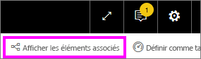
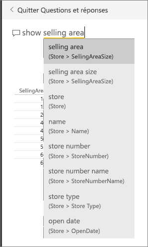
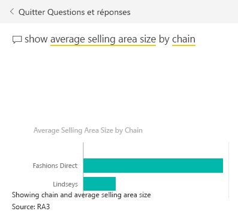
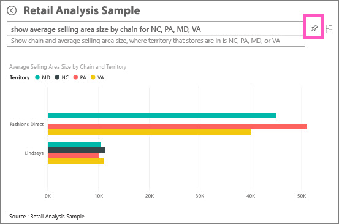
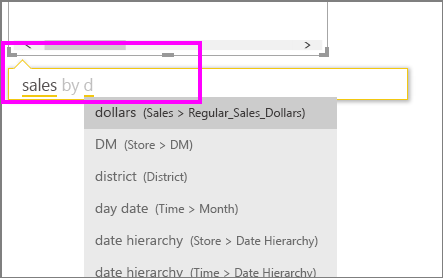

# Didacticiel : Utiliser Questions et réponses pour créer des visualisations et générer des rapports
La [vue d’ensemble de Questions et réponses](consumer/end-user-q-and-a.md) vous a présenté le moteur Questions et réponses de Power BI et a différentié les *consommateurs* (qui ont des tableaux de bord et rapports partagés avec eux) et les *créateurs* (qui possèdent les rapports et jeux de données sous-jacents). La première partie de ce didacticiel est principalement destinée aux utilisateurs consommant des tableaux de bord à l’aide du service Power BI. La deuxième partie est conçue pour les personnes qui créent des rapports à l’aide du service Power BI ou de Power BI Desktop. [Questions et réponses et Power BI Mobile](consumer/mobile/mobile-apps-ios-qna.md) et [Questions et réponses avec Power BI Embedded](developer/qanda.md) sont traités dans différents articles.

Q&R est interactif et même amusant, car une question en entraîne beaucoup d’autres au fur et à mesure que les visualisations révèlent des voies intéressantes à explorer. Regardez Amanda illustrer l’utilisation de Questions et réponses pour créer des visualisations, les explorer et les épingler à des tableaux de bord.

<iframe width="560" height="315" src="https://www.youtube.com/embed/qMf7OLJfCz8?list=PL1N57mwBHtN0JFoKSR0n-tBkUJHeMP2cP" frameborder="0" allowfullscreen></iframe>

## Partie 1 : Utiliser Questions et réponses dans un tableau de bord dans le service Power BI (app.powerbi.com)
Un tableau de bord contient des vignettes épinglées à partir d’un ou plusieurs jeux de données. Vous pouvez donc poser des questions sur les données contenues dans un de ces jeux de données. Pour afficher les rapports et jeux de données utilisées pour créer le tableau de bord, sélectionnez **Afficher les éléments associés** à partir de la barre de menus.

La zone de questions Questions et réponses située en haut à gauche de votre tableau de bord vous permet de taper votre question à l’aide d’un langage naturel. Q&R reconnaît les mots que vous tapez et cherche l’emplacement (le jeu de données) où se trouve la réponse. Q&R vous aide également à formuler votre question grâce à la saisie semi-automatique, à la reformulation, ainsi qu’à d’autres aides textuelles et visuelles.

La réponse à votre question s’affiche comme une visualisation interactive et change quand vous modifiez votre question.

1. Ouvrez un tableau de bord et placez votre curseur dans la zone de questions. Avant même que vous commenciez à taper votre question, Q&R affiche dans un nouvel écran des suggestions de formulation de votre question. Vous voyez le nom des tables dans [le ou les jeux de données sous-jacents](service-get-data.md) et vous pouvez également voir des questions complètes répertoriées si le propriétaire du jeu de données a créé des [questions proposées](service-q-and-a-create-featured-questions.md).

   

   Vous pouvez choisir l’une de ces questions comme point de départ et continuer à affiner la question pour trouver la réponse que vous recherchez. Sinon, vous pouvez aussi utiliser un nom de table pour formuler une nouvelle question.

2. Effectuez une sélection dans les options du jeu de données ou tapez votre propre question et sélectionnez une option dans les suggestions de la liste déroulante.

   

3. Quand vous tapez votre question, Questions et réponses sélectionne la meilleure [visualisation](visuals/power-bi-visualization-types-for-reports-and-q-and-a.md) pour répondre à la question, et change la visualisation de manière dynamique à mesure que vous modifiez la question.

   

4. Quand vous tapez une question, Power BI recherche la meilleure réponse dans les jeux de données ayant une vignette sur ce tableau de bord.  Si toutes les vignettes proviennent du *jeu_de_données_A*, votre réponse proviendra du *jeu_de_données_A*.  S’il existe des vignettes provenant du *jeu_de_données_A* et du *jeu_de_données_B*, Questions et réponses recherche la meilleure réponse dans ces 2 jeux de données.

   > [!TIP]
   > Attention : si vous disposez d’une seule vignette provenant du *jeu_de_données_A* et que vous la supprimez de votre tableau de bord, Questions et réponses n’a plus accès au *jeu_de_données_A*.
   >
   >
5. Quand vous êtes satisfait du résultat, [épinglez la visualisation à un tableau de bord](service-dashboard-pin-tile-from-q-and-a.md) en sélectionnant l’icône d’épingle dans l’angle supérieur droit. Si le tableau de bord a été partagé avec vous, ou fait partie d’une application, vous ne pouvez pas l’épingler.

   

##    Partie 2 : Utiliser Questions et réponses dans un rapport dans le service Power BI ou dans Power BI Desktop

Utilisez Questions et réponses pour explorer votre jeu de données et pour ajouter des visualisations au rapport et aux tableaux de bord. Un rapport est basé sur un seul jeu de données et peut être entièrement vide ou contenir des pages avec nombreuses visualisations. Toutefois, ce n’est pas parce qu’un rapport est vide que vous n’avez pas de données à explorer : le jeu de données est lié au rapport et vous n’avez plus qu’à explorer et créer des visualisations.  Pour afficher le jeu de données utilisé pour créer un rapport, ouvrez le rapport en mode Lecture dans le service Power BI et sélectionnez **Afficher les éléments associés** à partir de la barre de menus.

Pour pouvoir utiliser Questions et réponses dans des rapports, vous devez disposer d’autorisations de modification du rapport et du jeu de données sous-jacent. Dans la [rubrique présentant Questions et réponses](consumer/end-user-q-and-a.md), nous avons fait référence à ce comportement par le terme de *créateur*. Par conséquent, si vous *consommez* à la place un rapport qui a été partagé avec vous, Questions et réponses n’est pas disponible.

1. Ouvrez un rapport en mode Édition (service Power BI) ou Rapport (Power BI Desktop) et sélectionnez **Poser une question** dans la barre de menus.

    **Desktop**    
    

    **Service**    
    

2. Une zone de question Questions et réponses s’affiche sur le canevas de rapport. Dans l’exemple ci-dessous, la zone de question s’affiche sur une autre visualisation. C’est un fonctionnement correct, mais il peut être préférable d’[ajouter une page vierge au rapport](power-bi-report-add-page.md) avant de poser une question.

    

3. Placez votre curseur dans la zone de question. À mesure que vous tapez, Questions et réponses affiche des suggestions de formulation de votre question.

   

4. Quand vous tapez votre question, Questions et réponses sélectionne la meilleure [visualisation](visuals/power-bi-visualization-types-for-reports-and-q-and-a.md) pour répondre à la question, et change la visualisation de manière dynamique à mesure que vous modifiez la question.

   

5. Lorsque vous disposez de la visualisation voulue, appuyez sur Entrée. Pour enregistrer la visualisation avec le rapport, sélectionnez **Fichier > Enregistrer**.

6. Interagissez avec la nouvelle visualisation. Peu importe la façon dont vous avez créé la visualisation, les mêmes fonctionnalités de mise en forme et d’interactivité sont disponibles.

   

   Si vous avez créé la visualisation dans le service Power BI, vous pouvez même [l’épingler à un tableau de bord](service-dashboard-pin-tile-from-q-and-a.md).

## Indiquer à Q&R la visualisation à utiliser
Grâce à Questions et réponses, non seulement vous pouvez demander à vos données de parler d’elles-mêmes, mais vous pouvez également indiquer à Power BI comment afficher la réponse. Il suffit d’ajouter « sous forme de <visualization type> » à la fin de votre question.  Par exemple, « afficher le volume du stock par site sous la forme d’une carte » et « afficher le stock total sous la forme d’une carte ».  Essayez ces requêtes.

##  Considérations et résolution des problèmes
- Si vous vous êtes connecté à un jeu de données à l’aide d’une connexion active ou d’une passerelle, Questions et réponses doit être [activé pour ce jeu de données](consumer/end-user-q-and-a-direct-query.md).

- Vous avez ouvert un rapport et vous ne voyez pas l’option Questions et réponses. Si vous utilisez le service Power BI, veillez à ouvrir le rapport en mode Édition. Si vous ne pouvez pas ouvrir le mode Édition, cela signifie que vous n’avez pas les autorisations de modification pour ce rapport et que vous ne pouvez pas utiliser Questions et réponses avec celui-ci.

## Étapes suivantes
Revenir à [Questions et réponses dans Power BI](consumer/end-user-q-and-a.md)   
[Didacticiel : Utiliser Questions et réponses avec l’exemple Analyse de la vente au détail](power-bi-visualization-introduction-to-q-and-a.md)   
[Conseils de formulation des questions dans Questions et réponses](consumer/end-user-q-and-a-tips.md)   
[Préparer un classeur pour Q&R](service-prepare-data-for-q-and-a.md)  
[Préparer un jeu de données local pour Questions et réponses](consumer/end-user-q-and-a-direct-query.md)
[Épingler une vignette au tableau de bord à partir de Questions et réponses](service-dashboard-pin-tile-from-q-and-a.md)
