# Meilleures pratiques en matière de conception de visuels et de rapports
<!-- Shared newnav Include -->
[!INCLUDE [newnavbydefault](./includes/newnavbydefault.md)]

## Introduction
Ce document fournit les meilleures pratiques en matière de conception de rapports dans Power BI. En commençant par la planification, il présente les principes de conception que vous pouvez appliquer à vos rapports et aux pages et visuels qui composent ces derniers.  Bon nombre de ces meilleures pratiques s’appliquent également à la conception de tableaux de bord.

Nous espérons que ce document vous servira de point de départ, que vous allez appliquer les connaissances acquises à vos propres rapports et visualisations et que vous allez continuer la conversation sur community.powerbi.com. La conception et la visualisation de rapports décisionnels est un vrai sujet d’actualité. De nombreux leaders d’opinion, blogueurs et sites web évoquent ce sujet en long et en large. Nous en avons répertorié quelques-uns à la fin de ce document.   

> [!NOTE]
> Vous pouvez appliquer les recommandations formulées dans ce livre blanc quand et où cela est bénéfique. Pour chaque principe décrit ci-dessous, il existe des raisons généralement valables d’enfreindre les règles.
> 
> 

*Nous sommes submergés d’informations, non pas parce qu’elles sont en trop grande quantité, mais parce que nous ne savons pas comment les maîtriser.*
-- Stephen Few

## Présentation du contexte et de la terminologie
Dans Power BI, un rapport peut avoir une ou plusieurs pages et toutes ces pages regroupées sont désignées collectivement sous le terme « rapport ». Les éléments de base du rapport sont les visuels (également appelés visualisations), les images autonomes et les zones de texte. Des points de données individuels aux éléments de rapport et aux pages de rapport elles-mêmes, il existe un nombre illimité d’options de mise en forme.

Voici les points que nous allons aborder dans ce document : planification du rapport, principes de base liés à la conception de rapports, principes de conception visuelle et enfin description des meilleures pratiques en fonction des types de visuel.

Pour obtenir des conseils et des instructions complètes pour créer et utiliser les rapports Power BI, consultez la page **powerbi.com > Apprendre**.

## Avant de créer votre première visualisation, concentrez-vous sur la configuration requise.
La création d’un rapport commence avant même de créer le premier visuel, car une planification est nécessaire à la production d’un rapport bien constitué.  Déterminez avec quelles données vous devez travailler et écrivez les conditions requises associées au rapport. Demandez-vous ceci : « Quel est le besoin de l’entreprise, comment les données vont-elles être utilisées et par qui ? ». « Quelles décisions le lecteur souhaite-t-il être en mesure de prendre en fonction de ce rapport ? » est une question clé que vous devez vous poser.

La réponse à ces questions va déterminer votre conception. Chaque rapport raconte une histoire. Assurez-vous que cette histoire correspond aux besoins de l’entreprise. Il peut être tentant d’ajouter des visuels qui montrent des insights spectaculaires, mais si ces insights ne correspondent pas aux besoins de l’entreprise, le rapport sera inutile et les utilisateurs risquent d’être distraits par ces visuels. En outre, il se peut que les informations nécessaires à la prise de décision ne puissent pas être extraites de ces données. Ce rapport peut-il être utilisé pour mesurer ce qui est nécessaire ?

Les rapports peuvent être utilisés pour surveiller, découvrir, suivre, prévoir, mesurer, gérer, tester et bien plus encore. Si, par exemple, l’entreprise a besoin d’un rapport de ventes qui mesure les performances, vous pouvez concevoir un rapport qui examine les ventes actuelles, les compare aux ventes précédentes, effectue une comparaison avec celles des concurrents et inclut des indicateurs de performance clés qui déclenchent des alertes.  Les lecteurs peuvent peut-être explorer en détail les chiffres liés aux ventes pour voir les fermetures de magasin ou les problèmes de chaîne d’approvisionnement qui peuvent avoir un impact sur les ventes.  Ou ils peuvent examiner les ventes par magasin, région, produit, saison et bien plus encore.

Sachez à l’avance les clients auxquels le rapport est destiné et concevez un rapport qui utilise une terminologie familière et fournit des données à un niveau de détail et de complexité compréhensible par les clients. Vous avez plusieurs types de client ? Une seule taille ne convient pas pour tout ; concevez des pages de rapport distinctes en fonction de l’expertise et veillez à étiqueter chaque page clairement afin que les clients puissent s’identifier. Une autre option consiste à utiliser des segments afin que les clients puissent adapter la page à leur convenance. Impliquez le client dans la phase de planification et évitez de générer un rapport en vous basant sur ce que vous pensez savoir de ses besoins.  Soyez prêt à recommencer encore et encore.

Une fois que vous avez identifié les besoins de l’entreprise, les clients et les mesures que vous souhaitez inclure, l’étape suivante consiste à choisir les bons visuels permettant de raconter l’histoire et de les présenter de la manière la plus efficace possible. Le sujet est vaste. Commençons par quelques principes fondamentaux liés à la conception de rapports.

## Principes de la conception de rapports
Une page de rapport est un espace limité et le plus difficile est d’intégrer tous les éléments dans cet espace, tout en gardant ces informations compréhensibles. Ne sous-estimez pas la valeur que peut avoir un rapport bien fait. La clé est de trouver un équilibre entre convivialité et utilité.

Jetons un coup d’œil à la disposition, à la clarté et à l’esthétique.

### La disposition : le canevas de rapport
Le canevas de rapport dispose d’une quantité limitée d’espace.  Si tous les éléments ne tiennent pas sur une seule page, scindez le rapport en plusieurs pages.  Une page de rapport peut être adaptée à une audience spécifique (par exemple, les ressources humaines, le service informatique, les ventes, etc.) ou à une question métier spécifique (par exemple, « quel est l’impact des défauts sur notre temps d’activité ? », « quel est l’impact de nos campagnes marketing sur les émotions ? ») ou sous forme d’histoire progressive (par exemple, première page de vue d’ensemble ou servant à susciter l’intérêt, 2e page contenant le récit, 3e page qui approfondit le récit, etc.).  Si votre rapport entier tient sur une seule page, c’est parfait. Si ce n’est pas le cas, créez des pages de rapport distinctes qui segmentent le contenu de façon logique.  Et n’oubliez pas de donner des noms pertinents et utiles aux pages.

Imaginez que vous deviez aménager une galerie d’art. Vous ne placeriez pas 50 œuvres dans un petit espace, rempli de chaises et dont chaque mur est peint d’une couleur différente. En tant que conservateur, vous choisiriez simplement les œuvres qui ont un thème commun, vous ajusteriez leur disposition autour de la pièce afin que les visiteurs aient suffisamment d’espace pour se déplacer et réfléchir et placeriez des fiches d’information décrivant ces œuvres. Il y a bien une raison pour laquelle les galeries les plus modernes ont des murs nus !
Pour cet article, nous allons commencer par un exemple de rapport nécessitant beaucoup de travail.  Nous allons ensuite améliorer ce rapport en appliquant nos meilleures pratiques et principes de conception.

**Figure 1 : cette horrible page de rapport nécessite beaucoup de travail**

L’exemple ci-dessus présente plusieurs problèmes de conception (disposition) liés à l’espace dont nous allons discuter ci-dessous :

* alignement, ordre et utilisation de la proximité
* mauvaise utilisation de l’espace et du tri
* encombrement

### Alignement, ordre et proximité
La disposition de vos éléments de rapport a un impact sur la compréhension et guide le lecteur dans la lecture de la page de rapport. La façon dont vous placez et positionnez les éléments raconte une histoire,  par exemple « Démarrez ici puis dirigez-vous ici » ou « ces 3 éléments sont liés entre eux ».

* Dans la plupart des cultures, les personnes lisent de gauche à droite et de haut en bas. Placez l’élément le plus important dans le coin supérieur gauche de votre rapport. Puis organisez le reste des visuels d’une manière qui aboutit à une navigation logique et à la compréhension des informations.
* Positionnez les éléments qui nécessitent un choix de la part du lecteur à gauche des visualisations sur lesquelles le choix aura un impact : par exemple les segments.
* Positionnez les éléments à proximité les uns des autres ; la proximité implique que les éléments sont associés.
* Un autre moyen de traduire les relations consiste à ajouter une bordure ou un arrière-plan en couleur autour des éléments liés. À l’inverse, ajoutez un séparateur pour distinguer les différentes sections d’un rapport.
* Utilisez un espace blanc pour segmenter visuellement des sections de la page de rapport.
* Remplissez la page de rapport. Si vous constatez que vous avez beaucoup d’espace blanc, agrandissez vos visualisations ou diminuez la taille du canevas.
* Suivez une intention précise lorsque vous redimensionnez vos éléments de rapport. Ne laissez pas l’espace disponible déterminer la taille d’une visualisation.
* Agrandissez les éléments importants ou ajoutez un visuel, par exemple une flèche, pour attirer l’attention.
* Alignez les éléments sur la page de rapport, soit de manière symétrique soit intentionnellement de façon asymétrique.

Examinons plus en détail l’alignement.

#### Alignement
L’alignement ne signifie pas que les différents composants doivent être de la même taille ou que vous devez disposer du même nombre de composants sur chaque ligne du rapport. Cela signifie simplement que la page a une structure qui facilite la navigation et la lisibilité.

Nous pouvons voir dans notre rapport mis à jour ci-dessous que les composants du rapport sont maintenant alignés sur les bords gauche et droit et que chaque ligne de rapport est alignée horizontalement et verticalement. Nos segments sont à gauche des visuels sur lesquels ils ont un impact.

**Figure 2 : notre horrible exemple de rapport s’est amélioré avec les modifications apportées à la disposition**

Power BI inclut des outils qui vous permettent d’aligner vos visuels. Dans Power BI Desktop, lorsque plusieurs visuels sont sélectionnés, vous pouvez utiliser les options **Aligner et répartir** sous l’onglet **Éléments visuels** pour harmoniser la position des visuels.

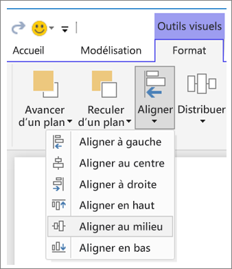

**Figure 3 : aligner les visuels dans Power BI Desktop**

Dans Power BI en ligne et Power BI Desktop, vous pouvez contrôler avec précision la taille et la position des visuels via l’onglet **Général** dans le volet Mise en forme pour tous les visuels :

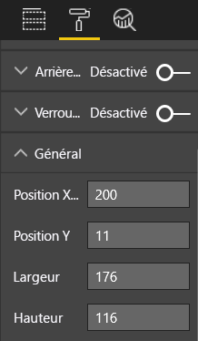

**Figure 4 : définir la position exacte de votre visuel**

Dans notre exemple de page de rapport (Figure 2), les 2 cartes et la bordure épaisse sont alignées sur la **Position X** à 200.

#### Ajuster à l’espace
Tirez le meilleur parti de l’espace dont vous disposez.  Si vous savez de quelle manière le rapport va être affiché/consulté, gardez cela à l’esprit. Réduisez l’espace vide pour remplir le canevas.  Faites votre possible pour éliminer les barres de défilement sur des visuels spécifiques.  Remplissez l’espace sans que les visuels semblent collés les uns aux autres.

##### Ajuster la taille de la page
En réduisant la taille de la page, des éléments spécifiques deviennent plus volumineux par rapport à la page entière. Pour ce faire, désélectionnez des visuels sur la page et utilisez l’onglet **Taille de la page** dans le volet Mise en forme.  

Voici une page de rapport qui utilise la taille de page 4:3, puis 16:9. Notez à quel point la disposition est mieux adaptée au format 16:9. Il y a même suffisamment de place pour supprimer la barre de défilement du deuxième visuel.

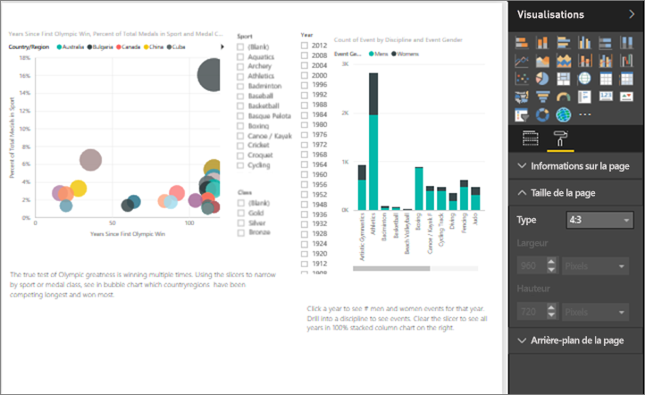

**Figure 5a : Rapport à la taille de page 4:3**

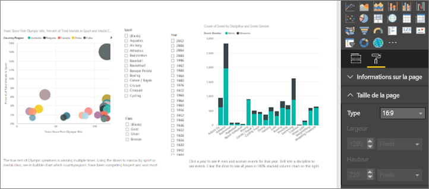

**Figure 5b : Rapport à la taille de page 16:9**

Votre rapport va-t-il être consulté au format 4:3, 16:9 ou autre ? Sur petit ou grand écran ? Sur toutes les tailles et proportions d’écran possibles ?  Posez-vous ces questions lors de la conception.

Notre exemple de page de rapport semble quelque peu illisible. Sans sélectionner de visuel, ouvrez le volet de mise en forme en sélectionnant l’icône en forme de rouleau à peinture. Développez **Taille de la page** et définissez la **hauteur** sur 900.

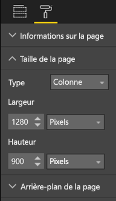

**Figure 6 : augmenter la hauteur de page**

#### Réduire l’encombrement
Une page de rapport encombrée est difficile à comprendre en un clin d’œil et peut inciter les lecteurs à stopper leur lecture.  Supprimez tous les éléments de rapport inutiles. N’ajoutez pas de fonctionnalités qui ne facilitent pas la compréhension ou la navigation. La page de rapport doit transmettre les informations clairement et de façon aussi cohésive et rapide que possible.

Edward Tufte y fait référence sous le terme « data to ink ratio » (proportion entre la place utilisée par les visuels et l’espace total) dans son livre *The Visual Display of Quantitative Information*.  Pour faire simple, supprimez tout ce qui n’est pas indispensable.

L’encombrement que vous supprimez augmente l’espace blanc sur votre page de rapport. Vous avez ainsi davantage de place pour appliquer les meilleures pratiques abordées plus haut dans la section « Alignement, ordre et proximité ».

Notre exemple semble déjà mieux conçu. Nous avons supprimé une grande partie de l’encombrement et ajouté des formes pour regrouper les éléments.  L’image d’arrière-plan a disparu, la flèche et la zone de texte inutiles ont disparu, un visuel a été déplacé sur une autre page du rapport, etc. Nous avons augmenté la taille de la page afin d’augmenter l’espace blanc (jaune en l’occurrence ici).

**Figure 7 : notre horrible exemple de rapport désencombré**

### Raconter une histoire en un clin d’œil
Comme preuve que cela fonctionne, une personne sans connaissances préalables doit pouvoir rapidement comprendre le rapport sans qu’une autre personne lui donne des explications. En un coup d’œil, les lecteurs doivent voir rapidement le sujet traité dans chaque page, graphique ou tableau.   

Lorsque les lecteurs consultent votre rapport, leurs yeux doivent être attirés par l’élément que vous souhaitez les voir regarder en premier, puis continuer de gauche à droite et de haut en bas.  Pour modifier ce comportement, ajoutez des signaux visuels tels que des étiquettes de zone de texte, des formes, des bordures, différentes tailles et couleurs.  

#### Zones de texte
Parfois, les titres des visualisations ne suffisent pas à raconter l’histoire.  Ajoutez des zones de texte pour communiquer avec les personnes qui consultent vos rapports.  Les zones de texte peuvent décrire la page de rapport, un regroupement de visuels ou un visuel spécifique. Elles peuvent expliquer des résultats ou mieux définir un visuel, les composants du visuel ou les relations entre les visuels. Elles peuvent être utilisées pour attirer l’attention selon différents critères appelés dans la zone de texte.

Dans la barre de menus supérieure du service Power BI, sélectionnez **Zone de texte**. Dans Power BI Desktop, sélectionnez **Zone de texte** à partir de la zone **Insérer** du ruban.

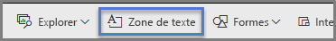

**Figure 8 : ajouter une zone de texte**

Tapez dans la zone vide, puis utilisez les contrôles en bas pour définir le type de police, la taille, l’alignement et bien plus encore. Utilisez les poignées pour redimensionner la zone.

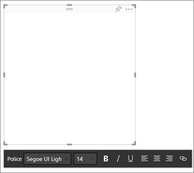

**Figure 9 : mettre en forme la zone de texte**

N’en abusez pas ! Trop de texte sur un rapport peut distraire l’attention des visuels. Si vous réalisez que votre page de rapport a besoin d’une tonne de texte pour être plus compréhensible, recommencez depuis le début.  Pouvez-vous choisir un visuel différent qui présente par lui-même des informations plus pertinentes ? Pouvez-vous ajuster les titres natifs du visuel pour le rendre plus intelligible ?   

#### Texte
Créez un guide de style de texte et appliquez-le à toutes les pages de votre rapport. Choisissez un petit nombre de polices, tailles de texte et couleurs.  Appliquez ce guide de style non seulement aux éléments textuels, mais aussi aux options de police de vos visualisations (voir la section Titres et étiquettes qui font partie des visualisations, ci-dessous). Définissez des règles pour l’utilisation du gras, de l’italique, de grandes tailles de police, de certaines couleurs, etc.  Évitez de tout mettre en majuscules ou souligner.

#### Formes
Les formes peuvent également faciliter la navigation et la compréhension. Utilisez des formes pour regrouper des informations connexes, mettez en surbrillance les données importantes et utilisez les flèches pour guider le regard. Les formes permettent aux lecteurs de comprendre où commencer et comment interpréter vos rapports. En termes de conception, on parle souvent de *contraste*.

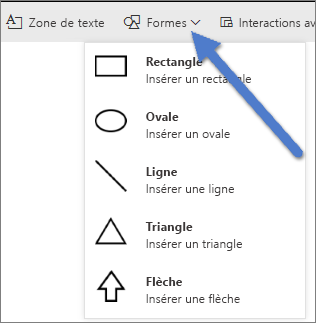

**Figure 10a : formes dans le service Power BI**

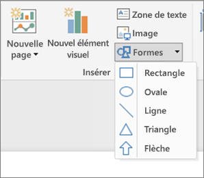

**Figure 10a : formes dans Power BI Desktop**

À quoi ressemble notre exemple de page maintenant ?  La figure 11 montre une page plus propre et moins encombrée avec une utilisation cohérente de la direction, des polices et des couleurs du texte.  Notre titre de page dans le coin supérieur gauche indique de quoi parle la page.

**Figure 11 : Notre exemple de rapport où un titre a été ajouté et le guide de style de texte a été appliqué**

Dans notre exemple, un titre de page de rapport a été ajouté dans le coin supérieur gauche, là où le regard des lecteurs se pose en premier. Le texte utilise une taille de police de 28 et la police Segoe Bold pour le faire ressortir du reste de la page.  Notre guide de style de texte indique de ne pas utiliser d’arrière-plans, de titres en noir, de légendes et d’étiquettes. Cette instruction a été appliquée à tous les visuels de la page dans la mesure du possible (les axes et étiquettes du graphique combiné ne sont pas modifiables).  Voici quelques ajustements supplémentaires :

* Cartes : **Étiquette de la catégorie** est défini sur Désactivé, le **Titre** est activé et défini sur une police noire centrée de 12 points.
* Titres de visuel : si activés, ils sont définis sur 12 points et alignés à gauche.
* Segments : **En-tête** est défini sur Désactivé, **Titre** est activé. Laissez **Éléments** > **Texte** en gris et à 10 points.
* Graphiques à nuages de points et histogrammes : police noire pour les axes X et Y, et leurs titres le cas échéant.

#### Couleur
Utilisez la couleur à des fins de cohérence.  Nous parlerons plus en détail des couleurs dans les principes liés à la conception de visuels (voir ci-dessous). Ici, nous vous conseillons de sélectionner une couleur qui n’empêche pas vos lecteurs de comprendre rapidement votre rapport.  Un trop grand nombre de couleurs vives fait barrage aux sens. Cette section vous présente plutôt ce qu’il est déconseillé de faire avec les couleurs.

#### Arrière-plans
Lorsque vous définissez les arrière-plans des pages de rapport, choisissez des couleurs qui n’assombrissent pas le rapport, qui ne sont pas en conflit avec d’autres couleurs sur la page ou qui ont un impact négatif visuellement. Notez que certaines couleurs ont une signification intrinsèque.  Par exemple, aux États-Unis, le rouge dans un rapport est généralement interprété comme quelque chose de « mauvais ».

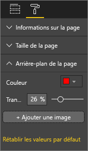

**Figure 12 : Définir l’arrière-plan du rapport**

Vous ne créez pas une œuvre d’art, mais un rapport fonctionnel. Choisissez une couleur qui améliore la lisibilité et la visibilité des éléments du rapport.  

Une étude sur l’utilisation des couleurs et des visualisations dans les pages web a démontré qu’un contraste plus élevé entre les couleurs augmente la vitesse de compréhension (voir *The effect of text and background colour on visual search of Web pages** et **Determining Users’ Perception of Web Page Visual Complexity and Aesthetic Characteristics*).

Nous avons appliqué quelques pratiques recommandées en matière de couleurs à notre exemple de rapport (Figures 20 et 21) ci-dessous. Le plus évident, c’est que nous avons modifié la couleur d’arrière-plan qui est à présent le noir.  Le jaune était trop clair et nous faisait mal aux yeux.  En outre, sur le graphique « Count of athlete name by year and class » (Nombre d’athlètes par année et par classe), la partie jaune des barres se confond avec l’arrière-plan jaune.  L’utilisation d’un arrière-plan noir (ou blanc) apporte un contraste maximal et permet de centrer l’attention sur les visuels.

Voici les étapes supplémentaires que nous avons effectuées pour améliorer l’exemple de rapport :

**Titre de la page**

Lorsque nous avons configuré l’arrière-plan en noir, notre titre a disparu, car le champ de zone de texte permet uniquement une police noire.   Pour résoudre ce problème, ajoutez un titre de zone de texte à la place.  Sélectionnez la zone de texte, effacez le texte, puis sous l’onglet Visualisations, sélectionnez l’option **Titre** et activez-la. Sélectionnez la flèche pour développer les options **Titre**, tapez **Jeux Olympiques d’été** dans le champ **Texte du titre**, puis sélectionnez le blanc comme **couleur de police**.

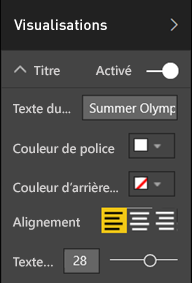

**Figure 13 : Ajouter un titre de page**

**Cartes**

Pour les visuels de carte, ouvrez le volet Mise en forme (icône en forme de rouleau de peinture) et activez l’option **Arrière-plan**. Sélectionnez le blanc avec une transparence de 0 %. Activez **Titre**, sélectionnez le blanc comme **couleur de police** et le noir comme **couleur d’arrière-plan**.

**Segments**

Jusqu’à présent, les deux segments avaient une mise en forme différente, ce qui n’avait aucun sens. Définissez la couleur d’arrière-plan des deux segments sur « cyan».  La couleur Cyan est un bon choix, car elle fait partie de la palette de couleurs de la page : vous la retrouvez notamment dans la carte choroplèthe, le compartimentage et l’histogramme.

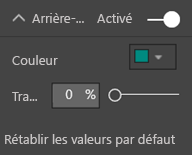

**Figure 14 : Modifier la couleur d’arrière-plan des segments**

Ajoutez une fine bordure blanche.

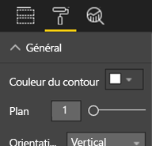

**Figure 15 : Ajouter une bordure au segment**

La police grise est difficile à voir à côté du cyan, par conséquent, utilisez du blanc pour la couleur des **éléments**.

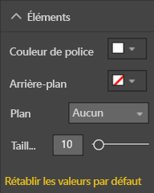

**Figure 16 : Modifier la couleur de police des segments**

Pour terminer, sous **Titre**, utilisez le blanc comme **couleur de police** et le noir comme **couleur d’arrière-plan**.

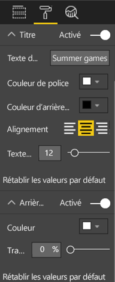

**Figure 17 : Mettre en forme le titre du segment**

**Forme de rectangle**

Le rectangle a également disparu dans le fond noir.  Pour résoudre ce problème, sélectionnez la forme, puis dans le volet **Format de la forme**, activez l’option **Arrière-plan**.

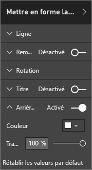

**Figure 18 : Mettre en forme la forme**

**Histogrammes, graphique en bulles, carte choroplèthe et arborescence**

Ajoutez un arrière-plan blanc aux visuels restants sur la page de rapport. Dans le volet Mise en forme, développez l’option **Ligne** et définissez la **Couleur de ligne** sur blanc et l’**Épaisseur** sur 3.

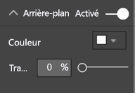

**Figure 19: Ajouter un arrière-plan blanc aux visualisations restantes**

**Figure 20 : Exemple de rapport auquel les meilleures pratiques en matière de couleurs ont été appliquées (arrière-plan noir)**

**Figure 21 : Exemple de rapport auquel les meilleures pratiques en matière de couleurs ont été appliquées (arrière-plan blanc)**
 

### Esthétique
Nous avons déjà parlé plus haut des éléments jouant sur l’esthétique : l’alignement, les couleurs, les polices, l’encombrement.  Mais il existe d’autres meilleures pratiques que nous souhaitons aborder concernant la conception d’un rapport : elles ont trait à l’apparence générale du rapport.  

N’oubliez pas que la fonction de votre rapport est de répondre aux besoins de l’entreprise, pas d’être joli.  Mais il est quand même nécessaire de proposer quelque chose de beau, surtout pour faire une première bonne impression. Le consultant Tony Bodoh de Nashville explique « L’émotion se déclenche une demi-seconde avant que la logique entre en action. »  Les lecteurs réagissent d’abord au niveau émotionnel avant de prendre le temps de mieux regarder votre page de rapport. Si votre page semble désorganisée, confuse, non professionnelle, votre lecteur risque de ne jamais découvrir la puissance des informations que vous présentez.

Le blogueur et analyste Wayne Eckerson utilise une excellente analogie.  La conception d’un rapport est comme la décoration d’une pièce.  Au fil du temps, vous achetez un vase, un canapé, une table et une peinture.  Vous aimez chacun de ces éléments. Mais bien que chaque sélection individuelle fasse sens, collectivement, les objets sont en conflit ou attirent plus ou moins l’attention.

Concentrez-vous sur les éléments suivants :

* Créez une apparence ou un thème que vous appliquez à toutes les pages du rapport.
* Utilisez des images autonomes et d’autres graphiques pour soutenir l’histoire et non la distraire.
* Et appliquez toutes les meilleures pratiques décrites jusqu’à présent dans cet article.

## Principes liés à la conception de visuels
Nous avons examiné les principes en matière de conception de rapports, à savoir comment organiser les éléments d’un rapport pour que ce dernier soit facile à comprendre.  Nous allons maintenant examiner les principes de conception relatifs aux visuels eux-mêmes.  Dans la section suivante, nous allons détailler des visuels spécifiques et présenter les meilleures pratiques pour certains types souvent utilisés.

Dans cette section, nous allons provisoirement laisser notre exemple de page de rapport de côté et voir d’autres exemples.  Une fois que nous aurons vu les principes liés à la conception de visuels, nous reviendrons à notre exemple de page de rapport et vous appliquerez ce que vous aurez appris (avec des instructions pas à pas).  

### Planification - Choisir le bon visuel
Il est tout aussi important de planifier chaque visuel que de réfléchir à la conception du rapport avant même de commencer à le créer.  Posez-vous la question suivante : « Quelles informations veux-je présenter à l’aide de ce visuel ? ». Déterminez ensuite le type de visuel qui présentera le mieux ces informations. Vous pouvez afficher la progression d’un cycle de vente sous forme d’histogramme, mais un graphique en entonnoir ou en cascade ne conviendrait-il pas mieux ? Pour vous aider, consultez la dernière section de ce livre blanc « Types de visuel et meilleures pratiques » qui décrit les meilleures pratiques pour certains types les plus courants.  Ne soyez pas surpris si le premier type de visuel que vous choisissez n’est pas au final la meilleure option.  Essayez plusieurs types de visuel pour voir lequel est le plus adapté à votre message.

Sachez reconnaître les différences entre les données catégorielles et quantitatives et quels types de visuel fonctionnent le mieux avec un type de données spécifique. Les données quantitatives sont souvent appelées « mesures » et sont généralement au format numérique. Les données catégoriques sont souvent appelées « dimensions » et peuvent être classées. Ce sujet est traité plus en détail dans la section « Choisir la mesure adéquate » ci-après.

Évitez d’utiliser des types de visuel fantaisistes ou plus complexes sous prétexte que vous voulez rendre votre rapport plus impressionnant. Vous voulez l’option la plus simple pour transmettre votre message. Les graphiques à barres horizontales et les graphiques en courbes peuvent transmettre des informations rapidement.  Ils sont familiers et pratiques et la plupart des lecteurs peuvent les interpréter facilement.  Un autre avantage est que la plupart des gens lisent de gauche à droite et de haut en bas et que ces deux types de graphique peuvent donc être analysés et compris rapidement.

Est-il nécessaire d’avoir un défilement dans votre visuel pour présenter les informations ? Évitez le défilement dans la mesure du possible.  Essayez d’appliquer des filtres et d’utiliser des hiérarchies/explorations. Si ces derniers ne sont pas suffisants pour éviter d’utiliser une barre de défilement, optez pour un autre type de visuel. Si un défilement est indispensable, le défilement horizontal est mieux toléré que le défilement vertical.

Même si vous choisissez le meilleur visuel pour présenter les informations, vous aurez peut-être encore besoin d’aide pour faire passer le message.  C’est là que les étiquettes, titres, menus, couleurs et tailles entrent en jeu. Nous aborderons ces éléments de conception plus loin dans la section intitulée « Éléments de conception ».

### Choisir la mesure adéquate
Les informations présentées par votre visuel sont-elles intéressantes ? Ont-elles de l’importance ?  Ne créez pas de visuels pour le simple plaisir d’en créer. Peut-être avez-vous pensé que les données présenteraient les informations de façon intéressante, mais ce n’est pas le cas dans les faits. N’hésitez pas à recommencer et à chercher une histoire plus intéressante. Ou peut-être que l’histoire est la bonne, mais qu’elle doit être mesurée d’une façon différente.

Par exemple, disons que vous souhaitez mesurer la réussite de vos responsables des ventes. Quelles mesures allez-vous utiliser pour cela ?  Allez-vous examiner les ventes totales ou le bénéfice total, la croissance par rapport à l’année précédente ou les performances par rapport à un objectif cible ? Si la vendeuse Catherine a généré le bénéfice le plus élevé et que vous montrez le bénéfice total par vendeur dans un histogramme, cette vendeuse semblera la meilleure par rapport aux autres vendeurs.  Mais si Catherine a un coût des ventes élevé (frais de déplacements, frais d’expédition, coûts de fabrication, etc.), se contenter de regarder les ventes n’est pas la meilleure option.

#### Reflétez la réalité/ne la faussez pas
Il est possible de créer un visuel qui déforme la vérité. Il existe un site web où les passionnés partagent les visuels utilisés à « mauvais escient ». Le dénominateur commun des commentaires est la déception par rapport à la société qui a créé et distribué le visuel en question.  Celui-ci envoie un message qu’ils ne peuvent pas approuver.

Par conséquent, créez des visuels qui ne déforment pas la réalité de façon intentionnelle et qui ne sont pas manipulés afin de raconter l’histoire que vous aurez choisie.  Voici un exemple :

**Figure 22 : Graphique présentant une réalité déformée**

Dans cet exemple, il semble qu’il existe une grande différence entre les 4 sociétés et que CorpB est beaucoup plus efficace que les 3 autres.  Mais notez que l’axe X ne commence pas à zéro et que les différences entre les sociétés sont probablement dans la marge d’erreur.  Voici les mêmes données avec un axe X qui commence à zéro.

**Figure 23 : Graphique réaliste**

Les lecteurs supposent souvent que l’axe X commence à partir de zéro. Si vous décidez de ne pas démarrer à zéro, faites-le d’une manière qui ne fausse pas les résultats et pensez à ajouter un indicateur visuel ou une zone de texte qui souligne l’écart par rapport à la norme.  

### Éléments de conception
Une fois que vous avez sélectionné un type et une mesure et créé le visuel, il est temps d’affiner l’affichage pour une efficacité optimale.  Cette section couvre les aspects suivants :

* Disposition, espace et taille
* Éléments de texte : étiquettes, annotations, menus, titres
* Tri
* Interaction avec le visuel
* Couleur

#### Ajustement des visuels pour une utilisation optimale de l’espace
Si vous tentez de faire tenir plusieurs graphiques dans un rapport, optimisez les proportions entre les graphiques et le contenu écrit pour faire ressortir l’histoire racontée par vos données. Comme mentionné plus haut, Edward Tufte a inventé le terme « data-ink ratio » : l’objectif est de supprimer autant de marques que possible dans un graphique sans altérer la capacité du lecteur à interpréter les données.

Dans le premier groupe de graphiques ci-dessous, il existe des étiquettes (janvier 2014, avril 2014, etc.) et des titres (« par date ») redondants pour les axes. Les titres de chaque graphique requièrent également un espace horizontal dédié sur chaque graphique. En supprimant les titres de graphique et en activant les étiquettes d’axes spécifiques, nous supprimons du contenu texte et utilisons l’espace global de façon optimale. Nous pouvons supprimer les étiquettes d’axe des deux graphiques du haut pour réduire le contenu texte et octroyer plus d’espace aux données.

S’il existe des périodes spécifiques que vous souhaitez faire ressortir, vous pouvez dessiner des lignes ou des rectangles derrière tous les graphiques pour attirer l’attention en haut et en et ainsi faciliter la comparaison.

**Figure 24 : Avant**

**Figure 25 : Après**

**Pour activer et désactiver les titres des axes**

Sélectionnez le visuel pour l’activer et ouvrez le volet Mise en forme. Développez les options pour l’**axe X** ou l’**axe Y** et faites glisser le curseur de l’option **Titre** sur Activé ou Désactivé.

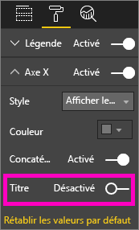

**Figure 26 : Activer et désactiver les titres des axes**

**Pour activer et désactiver les étiquettes des axes**

Sélectionnez le visuel pour l’activer et ouvrez le volet Mise en forme. Des curseurs sont disponibles en regard de l’**axe X** et de l’**axe Y**.  Faites glisser le curseur pour activer ou désactiver les étiquettes des axes.

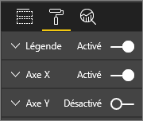

**Figure 27 : Activer et désactiver les étiquettes des axes**

> [!TIP]
> Vous pouvez par exemple désactiver les étiquettes de l’axe Y si les **étiquettes de données** sont activées.
> 
> 

**Pour supprimer les titres des visuels**

Sélectionnez le visuel pour l’activer et ouvrez le volet Mise en forme. Faites glisser le curseur de l’option **Titre** sur Désactivé.

**Figure 28 : Supprimer les titres des visuels**

Pensez à la façon dont vos lecteurs vont consulter le rapport et vérifiez que vos visuels et votre texte sont suffisamment grands et lisibles. Si vous avez un visuel proportionnellement plus grand sur la page, les lecteurs peuvent supposer qu’il est le plus important. Placez suffisamment d’espace entre les visuels pour que votre rapport ne soit ni encombré ni déroutant.  Alignez vos visuels de façon à diriger les yeux de vos lecteurs.

**Pour redimensionner un visuel**

Sélectionnez le visuel pour l’activer. Saisissez et faites glisser l’une des poignées pour ajuster la taille.

**Figure 29 : Redimensionner un visuel**

**Pour déplacer un visuel**

Sélectionnez le visuel pour l’activer. Sélectionnez et maintenez la barre de redimensionnement en haut au centre du visuel, puis faites glisser le visuel vers son nouvel emplacement.

**Figure 30 : Déplacer un visuel**

#### Titres et étiquettes qui font partie des visualisations
Vérifiez que les titres et les étiquettes sont lisibles et explicites. Le texte des titres et des étiquettes doit avoir une taille optimale avec des couleurs qui ressortent (par exemple, le noir au lieu du gris par défaut). Vous vous souvenez de notre guide de style (voir « Texte » ci-dessus) ? Limitez le nombre de couleurs et de tailles : des tailles et couleurs trop nombreuses encombrent la page et la rendent peu claire.  Envisagez d’utiliser les mêmes couleur et taille de police pour tous les visuels d’une page de rapport et choisissez le même alignement pour tous les titres d’une page de rapport.  

**Volet de mise en forme**

Pour chacun des ajustements de mise en forme répertoriés ci-dessous, sélectionnez l’icône en forme de rouleau de peinture pour ouvrir le volet Mise en forme.

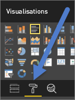

**Figure 31 : Ouvrir le volet Mise en forme**

Sélectionnez ensuite l’élément visuel pour l’ajuster et vérifiez qu’il est activé. Voici des exemples d’éléments visuels : **Axe X**, **Axe Y**, **Titre**, **Étiquettes de données** et **Légende**. L’exemple suivant montre l’élément **Titre**.

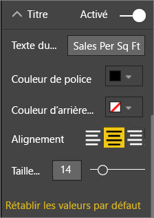

**Figure 32 : Mettre en forme le titre d’un visuel**

**Définir la taille du texte**

La taille du texte peut être ajustée pour les titres et les étiquettes de données, mais pas pour les axes X ou Y ni les légendes.  Pour les étiquettes de données en particulier, jouez avec les **unités d’affichage** et le nombre de **décimales** jusqu’à ce que vous trouviez le niveau de détail optimal pour l’affichage de votre rapport.   

**Définir l’alignement du texte**

Les choix disponibles pour l’alignement du titre sont à gauche, à droite et centré.  Faites votre choix et appliquez ce même paramètre à tous les visuels de la page.  

**Définir la position du texte**

La position du texte peut être ajustée pour certains axes Y et la légende.   Selon ce que vous choisissez, procédez de même pour les autres axes Y et légendes sur la page.

**Définir la longueur du titre et de l’étiquette**

Ajustez la longueur des titres, des titres d’axe, des étiquettes de données et des légendes. Si vous décidez d’afficher un de ces éléments, ajustez la longueur (ainsi que la taille du texte) pour vous assurer que rien n’est tronqué. Pour **Titre** et **Légende**, le paramètre est **Texte du titre** et c’est ici que vous tapez le titre qui apparaît sur le visuel. Pour **Axe X** et **Axe Y**, le paramètre est le **Style** que vous sélectionnez dans une liste déroulante. Pour **Étiquettes de données**, les paramètres sont **Affichage** et **Décimal**. Utilisez la liste déroulante **Affichage** pour sélectionner les unités de mesure : millions, milliers, aucun, automatique, etc. Utilisez le champ **Décimal** pour indiquer à Power BI le nombre de décimales à afficher.

**Définir la couleur du texte**

La couleur du texte peut être ajustée pour les titres, les axes et les étiquettes de données.  

#### Titres et étiquettes qui ne font pas partie des visualisations
Plus haut dans ce document, nous avons évoqué l’ajout de zones de texte aux pages de rapport. Parfois, les titres des visualisations ne suffisent pas à raconter l’histoire.  Ajoutez des zones de texte pour communiquer des informations supplémentaires aux lecteurs de vos rapports.  
Pour éviter que la page de rapport soit trop encombrée ou peu claire, soyez cohérent dans l’utilisation de l’alignement, de la taille, de la couleur et de la police des zones de texte. Pour ajuster le texte dans une zone de texte, sélectionnez celle-ci pour faire apparaître le menu de mise en forme.

**Figure 33 : Mettre en forme la police utilisée dans une zone de texte**

#### Tri
Pour présenter des informations plus rapidement, il est possible de définir l’ordre des visuels. Par exemple, le tri des graphiques à barres dans l’ordre croissant ou décroissant selon la valeur des barres vous permet d’afficher rapidement des informations importantes sans utiliser davantage de place.

Pour trier un graphique, sélectionnez les points de suspension (...) en haut à droite du graphique, sélectionnez **Tri** et choisissez le champ que vous souhaitez trier et le sens du tri. Pour plus d’informations, consultez [Modifier l’ordre de tri d’un visuel](power-bi-report-change-sort.md).

#### Interaction avec et entre les graphiques
Une des fonctions les plus remarquables de Power BI est la possibilité de modifier la façon dont les graphiques interagissent entre eux.  Par défaut, les graphiques bénéficient de la sélection croisée : quand vous sélectionnez un point de données, les données associées des autres graphiques deviennent plus claires et les données non liées s’estompent. Vous pouvez modifier ce comportement et utiliser n’importe quel graphique comme filtre, ce qui vous fait gagner de la place sur votre page. Pour ce faire, sélectionnez **Interactions avec l’élément visuel** dans la barre de menus.

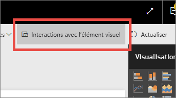

**Figure 34 : Interactions avec des éléments visuels**

Ensuite, pour chaque visuel de la page, décidez si vous souhaitez que le visuel sélectionné soit utilisé pour filtrer, mettre en surbrillance ou ne rien faire. Aucun contrôle de mise en évidence n’est disponible pour les visuels qui ne peuvent pas être mis en évidence. Pour plus d’informations, consultez [Interactions avec un élément visuel dans Power BI](service-reports-visual-interactions.md).

> [!TIP]
> Il se peut que les lecteurs qui ne connaissent pas Power BI ne se rendent pas compte immédiatement qu’il est possible de cliquer sur les rapports et d’interagir avec eux. Ajoutez des zones de texte pour les aider à comprendre les éléments sur lesquels ils peuvent cliquer pour accéder à d’autres informations.
> 
> 

#### Utilisation des couleurs dans les visuels
Plus haut dans ce document, nous avons vu qu’il est important de prévoir la façon dont vous allez utiliser les couleurs dans un rapport. Cette section aura pour principal sujet l’utilisation de couleurs dans des visuels spécifiques. Les mêmes principes s’appliquent : utilisez des couleurs pour unifier le rapport, accentuer les données importantes et améliorer la compréhension du visuel par le lecteur. Un trop grand nombre de couleurs est gênant et empêche le lecteur de savoir où regarder. Ne sacrifiez pas la compréhension à l’élégance. Ajoutez uniquement des couleurs qui facilitent la compréhension.

> [!TIP]
> Vous devez connaître votre audience et les règles de couleur suivies.  Par exemple, aux États-Unis, le vert signifie généralement « bien » et le rouge généralement « pas bien ».
> 
> 

Cette rubrique est divisée en paragraphes couvrant les éléments suivants :

1. Couleur des données
2. Couleur des étiquettes de données
3. Couleur des valeurs de catégorie
4. Couleur des valeurs numériques

**Utiliser des couleurs pour mettre en surbrillance les données intéressantes**

Le plus simple consiste à modifier la couleur d’au moins un point de données pour attirer l’attention sur elle. Dans cet exemple, la couleur change lorsque les jeux Olympiques sont passés d’un cycle de 4 ans à un cycle de 2 ans lors de l’alternance entre les jeux d’été et d’hiver.

**Figure 35 : Utiliser une couleur pour raconter une histoire**

Vous pouvez modifier les couleurs de point de données à partir de l’onglet **Couleurs des données** du volet Mise en forme. Pour personnaliser individuellement chaque point de données, vérifiez que **Afficher tout** est activé.

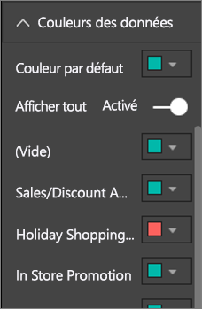

**Figure 36 : Définir les couleurs des point de données**

> [!NOTE]
> Power BI applique un thème par défaut aux visuels de votre rapport.  Les couleurs de thème ont été choisies de façon à proposer diversité et contraste. Pour changer la palette de thèmes par défaut, sélectionnez **Couleur personnalisée**.
> 
> 

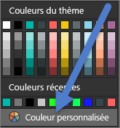

**Figure 37 : Choisir une couleur personnalisée**

Dans Power BI Desktop, vous pouvez même mettre en surbrillance les valeurs hors norme ou la section d’une ligne à l’aide d’une deuxième série :

**Figure 38 : Utilisation de Power BI Desktop pour tracer des valeurs hors normes**

Ici, les valeurs de la série « Valeurs hors normes » existent uniquement où la température moyenne en août descend en dessous de 60. Pour cela, une colonne calculée DAX a été créée à l’aide de cette formule :

Valeurs hors normes = if(Editions[Temp]<60, Editions[Temp], BLANK())

Dans notre exemple, il existait 3 valeurs hors normes : 1952, 1956 et 2000.

**Couleurs des étiquettes et des titres**

Parmi toutes les options de mise en forme disponibles, plusieurs endroits permettent d’ajouter une couleur aux titres et légendes. Par exemple, vous pouvez modifier la couleur des titres des axes et des étiquettes de données. Agissez avec précaution.  Vous utilisez en général une même couleur pour tous les titres de visuel.  Comme c’est le cas pour toutes les recommandations présentées de ce document, il existe toujours des situations et des raisons pour lesquelles vous allez vouloir « enfreindre les règles ». Dans ces cas-là, faites-le pour une bonne raison.

**Couleurs des valeurs de catégorie**

Les graphiques avec une série ont généralement une valeur de catégorie dans la légende. Par exemple, chaque couleur de légende ci-dessous représente une catégorie différente de Pays/Région.

**Figure 39 : Couleurs par défaut appliquées**

Les couleurs que Power BI utilise par défaut ont été choisies pour différencier facilement les valeurs de catégorie. Certaines personnes modifient parfois ces couleurs en fonction de la charte de leur entreprise, etc., mais cela peut entraîner des problèmes.

**Figure 40 : Couleur appliquée en tant que teintes d’une même couleur**

Comme une seule teinte a été utilisée et que l’intensité de la couleur varie, ce visuel donne un faux sentiment d’ordre entre les catégories. Il implique que les bulles plus sombres sont supérieures ou inférieures à une certaine échelle par rapport aux teintes plus claires. Pour ce type de valeur de catégorie, il n’existe normalement pas d’autre choix que l’application d’un ordre alphabétique.
Pour modifier les couleurs par défaut, ouvrez le volet Mise en forme, puis sélectionnez **Couleurs des données**.

**Couleurs des valeurs numériques**

Pour les champs qui présentent un certain ordre inhérent et une valeur numérique, vous pouvez également donner une couleur aux points de données en fonction de la valeur. Cela peut être utile pour afficher la répartition des valeurs sur les données et également pour afficher deux variables sur un même graphique. Par exemple dans ce graphique, il est clair que, bien que la Chine ait gagné le plus grand nombre de médailles, le Japon et la Thaïlande ont participé à un plus grand nombre de jeux Olympiques.

**Figure 41 : Couleur des points de données en fonction de la valeur**

Pour créer ce graphique, ajoutez une valeur au champ Saturation de la couleur, puis ajustez les couleurs dans le volet Mise en forme.

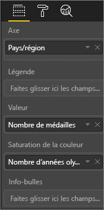

**Figure 42 : Ajouter un champ de saturation de la couleur**

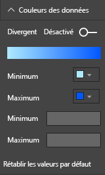

**Figure 43 : Ajuster les couleurs utilisées pour la saturation**

La couleur peut également servir à mettre en évidence l’écart par rapport à une valeur centrale. Par exemple, mettre les valeurs positives en vert et les valeurs négatives en rouge. Tenez compte des différences culturelles lors de l’attribution de couleurs aux valeurs positives ou négatives ; toutes les cultures n’utilisent pas le rouge pour ce qui est mauvais et le vert pour ce qui est bien.

**Figure 44 : Couleur pour mettre en évidence l’écart par rapport à une valeur centrale**
 

### Les principes de la conception de visuels appliqués à l’exemple de page de rapport
Nous allons maintenant reprendre les principes de conception des visuels décrits ci-dessus et les appliquer à notre exemple de rapport.

Avant

**Figure 45 : Notre exemple de rapport (avant)**

Après

**Figure 46 : Notre exemple de rapport (après)**

#### Qu’avons-nous fait ?
1. Segment : nous avons supprimé les espaces des segments en ajoutant un filtre au niveau de la page et en sélectionnant uniquement Or, Argent et Bronze. Nous avons désactivé les **contrôles de sélection** pour **Sélection simple** et **Sélectionner tout**.
2. Bulles : il y a tellement d’éléments dans la légende qu’ils sortent de l’écran.  Nous avons supprimé la légende et activé les **étiquettes de catégorie** à la place. Les clients peuvent survoler les bulles pour afficher les détails. Nous avons raccourci le titre et supprimé « by countryregion », car cela semble aller de soi. Nous avons activé les étiquettes des axes pour faciliter la compréhension du graphique.
3. Carte choroplèthe : nous avons modifié les **couleurs des données** pour les faire ressortir davantage. Nous avons activé **Divergent** et défini **Minimum** sur rose et **Maximum** sur rouge.
4. Arborescence : nous avons supprimé le filtre qui était défini pour les ÉTATS-UNIS uniquement. Nous avons défini les **étiquettes de données** sur 1 décimale. Le visuel utilisait le champ Classe qui n’est pas très utile puisqu’il est presque toujours à 33 % (Or/Argent/Bronze).  Nous avons sélectionné un autre champ plus intéressant, à savoir le sexe. Nous avons défini la catégorie Aquatics sur du bleu et la catégorie Athlétisme sur du gris.
5. Graphique à barres supérieur : nous avons réduit le titre, supprimé les étiquettes de données et désactivé le titre des légendes. Nous avons modifié l’ordre des mots du titre pour qu’il corresponde au graphique ci-dessous.
6. Graphique à barres inférieur : nous avons effectué un tri par année dans l’ordre croissant comme dans le graphique ci-dessus. Nous avons modifié les couleurs pour qu’elles correspondent à la classe. Nous avons modifié le titre. Nous avons désactivé la légende pour donner davantage d’espace aux données. Nous avons activé les étiquettes de données qui n’apparaîtront pas dans le rapport (car le visuel est trop petit pour que les étiquettes soient lisibles), mais qui s’afficheront quand le visuel sera ouvert en mode focus. [En savoir plus sur le mode Focus](service-focus-mode.md). Nous avons ajouté le nombre d’événements (distincts) à **Info-bulles**. Ainsi, quand vous survolez un histogramme empilé, les info-bulles indiquent également le nombre d’événements qui ont été contestés l’année en question.
7. Interactions avec les visuels : nous avons désactivé les interactions pour les deux cartes dans la mesure où je veux qu’elles affichent toujours le nombre total de jeux et de sports.

## Types de visuels et meilleures pratiques
Power BI fournit de nombreux types de visuel de façon native.  Ajoutez à cela les visuels personnalisés disponibles auprès de Microsoft et de la communauté Power BI et vous obtenez des options trop nombreuses pour être documentées ici. Mais examinons quelques-uns des types de visuels natifs les plus utilisés.  

### Graphiques en courbes

Les graphiques en courbes sont un moyen efficace d’examiner des données au fil du temps.  Consulter des données dans les tables n’exploite pas pleinement la vitesse à laquelle nos yeux repèrent les pics, les creux, les cycles et les modèles.  
L’exemple ci-dessous montre les tendances dans le nombre de médailles distribuées et le nombre d’athlètes qui ont remporté des médailles.  

**Figure 47 : Graphiques en courbes**

#### Meilleures pratiques
* Lorsque les utilisateurs regardent les graphiques en courbes, la première chose qu’ils voient est la forme de la courbe.  Cela signifie que vous avez besoin d’un axe X qui rend la courbe explicite, par exemple des catégories de temps et de distribution.  Si vous placez des champs de catégorie comme un produit ou une zone géographique sur l’axe X, le graphique en courbes n’est pas intéressant, car la forme de la courbe ne fournit aucune information pertinente.
* Si vous choisissez de placer plusieurs graphiques les uns au-dessous des autres comme ceci, pour faciliter la comparaison entre les séries, alignez l’axe X. Utilisez des filtres pour vous assurer que la même plage de valeurs est affichée.  Par exemple, si vous examinez des plages de dates, vérifiez qu’elles sont identiques.  Par exemple, de 1896 à 2012 sur les deux graphiques.
* Tirez pleinement parti de l’espace.  Si cela est pertinent pour vos données, définissez les points de début et de fin de l’axe Y pour éliminer l’espace vide en haut et en bas de votre graphique et mettre en évidence les points de données réels. Pour ce faire, ouvrez le volet de mise en forme en sélectionnant l’icône en forme de rouleau. Développez la zone **Axe Y** et définissez les points de **début** et de **fin**.
  
  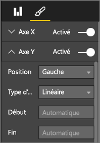
  
  **Figure 48 : Définir les points de début et de fin**
* L’autre raison pour laquelle vous devez définir explicitement les points de début et de fin est que vous comparez plusieurs graphiques sur la même page à l’aide du même champ d’axe Y.  Par exemple, si vous examinez le nombre total d’événements, et que le nombre d’événements varie au Royaume-Uni de 1 à 70 et en Australie de 1 à 12, les deux graphiques en courbes affichent différents axes Y (Figure x). Cela rend difficile la comparaison en un clin d’œil. À la place, définissez les graphiques pour qu’ils utilisent la même plage sur l’axe Y (Figure x).
  
  
  
  **Figure 49 : Graphiques en courbes avec différents axes Y**
  
  
  
  **Figure 50 : Graphiques en courbes avec des axes Y identiques**

Pour plus d’informations, consultez :

* [Personnaliser les axes X et Y](power-bi-visualization-customize-x-axis-and-y-axis.md)
* [Graphiques en courbes et intervalles irréguliers](http://www.perceptualedge.com/articles/visual_business_intelligence/line_graphs_and_irregular_intervals.pdf)
* [Graphiques en courbes 101](http://www.columnfivemedia.com/data-visualization-101-line-charts)

### Graphiques à barres/histogrammes

Si les graphiques en courbes sont la norme pour consulter les données sur une période écoulée, les graphiques à barres sont la norme pour la recherche d’une valeur spécifique dans différentes catégories.  Si vous triez les barres en fonction du nombre, vous voyez immédiatement les premières valeurs et la distribution.  Les graphiques à barres horizontales fonctionnent bien avec les étiquettes longues.  

**Figure 51 : Graphique à barres horizontales**

#### Meilleures pratiques
* Affichez les étiquettes de données pour les valeurs.  Cela permet d’identifier plus facilement des valeurs spécifiques. Pour ce faire, ouvrez le volet Mise en forme et définissez **Étiquettes de données** sur Activé.
  
  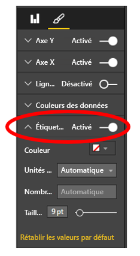
  
  **Figure 52 : Activer les étiquettes de données**
* Le graphique à barres ci-dessus est vraiment utile pour comparer une mesure par rapport à d’autres **à un point unique dans le temps**.  Alors que le graphique en courbes ci-dessus affichait la tendance au fil du temps, le graphique à barres nous montre la tendance d’une catégorie à un moment précis dans le temps.  En un clin d’œil, notre graphique à barres indique que l’Espagne a l’un des pires taux de chômage au monde, soit 25 %.
* Lorsqu’un graphique à barres/histogramme ne rentre pas dans l’espace alloué, Power BI ajoute des barres de défilement. Lorsque cela est possible, et si c’est judicieux, structurez le visuel et le rapport pour qu’ils affichent l’ensemble du graphique afin que le lecteur ait une vue d’ensemble de la distribution tout entière.  Malheureusement, cela n’est pas possible dans notre exemple, étant donné le nombre important de pays dans le monde.
  
  Pour limiter les valeurs incluses, il est possible d’utiliser un filtre. Par exemple, ajoutez un filtre au niveau du visuel qui indique le pays uniquement si le taux de chômage est supérieur à 20 %.
* Les graphiques à barres/histogrammes peuvent faire l’objet d’une exploration détaillée (et sauvegardés à nouveau).  C’est un excellent moyen de regrouper plus d’informations dans un visuel sans occuper davantage de place.  L’exemple ci-dessous possède une hiérarchie Régions > Pays.  Double-cliquez sur une barre représentant une région pour explorer en détail les pays qui la composent.  Pour plus d’informations sur l’exploration, consultez [Explorer une visualisation](power-bi-visualization-drill-down.md).
  
  
  
  **Figure 53 : Explorer**

Pour plus d’informations sur les graphiques à barres et les histogrammes :

* [Graphiques à barres 101](http://blog.newscred.com/article/data-visualization-101-bar-charts/3c53044d4add7c31e79a3f80128771f4?page=thankyou)
* [Catalogue de visualisation de données : graphique à barres](http://www.datavizcatalogue.com/methods/bar_chart.html#.VYV-hY3bLJw)
* [Catalogue de visualisation de données : graphique à barres multijeu](http://www.datavizcatalogue.com/methods/multiset_barchart.html#.VYV_gI3bLJw)

### Graphiques à barres empilées et histogrammes

Ajoutez une autre dimension à vos graphiques à barres/histogrammes en empilant différentes catégories dans la barre ou la colonne.  Le graphique véhicule maintenant des informations sur une tendance générale (basée sur la hauteur/longueur), et affiche également l’influence des catégories sur cette tendance. Le tableau ci-dessous montre la croissance globale du chiffre d’affaires des meilleures équipes de football au-dessus de 6 milliards en 2014.

**Figure 54 : Histogramme empilé**

Cet histogramme empilé nous montre que le chiffre d’affaires total augmente au fil du temps et que les catégories Commercial et Broadcasting augmentent régulièrement au fil du temps, ce qui contribue à l’augmentation globale du chiffre d’affaires.  Malgré tout, ce graphique ne permet pas de comparer facilement l’impact de chacune des 3 catégories entre elles. Par exemple, en quoi la croissance de la catégorie Commercial est-elle comparable à la croissance de la catégorie Broadcasting ou Match Day ?  Pour ces données, un graphique en courbes constitue un meilleur choix ou un visuel complémentaire.  

**Figure 55 : Convertir en graphique en courbes**

Dans ce graphique en courbes, il est plus facile de voir que le chiffre d’affaires de la catégorie Commercial a augmenté le plus, suivi par celui de Broadcast et Match Day.

#### Meilleures pratiques
* Comme avec les barres/colonnes, vous avez la possibilité de choisir un affichage horizontal ou vertical.   L’affichage horizontal est un meilleur choix si vous avez de longues étiquettes et l’affichage vertical est idéal pour les données de séries chronologiques.  
* Évitez d’utiliser des graphiques à barres/histogrammes empilés si vous souhaitez afficher les tendances et d’autres modèles de changement au fil du temps.  D’autres graphiques, tels que les graphiques en courbes, sont beaucoup plus efficaces.
* Vous pouvez également baser la distribution sur le volume total ou comme pourcentage du total.  
* Comme l’a indiqué Stephen Few, *il est difficile de comparer les segments d’un graphique à barres empilées. Si les segments sont organisés côte à côte et ont tous augmenté à partir de la même ligne de référence, il est facile de comparer leurs hauteurs, mais s’ils sont empilés les uns sur les autres, la tâche devient difficile. De plus, bien qu’il soit assez facile de voir comment (le chiffre d’affaires) a évolué d’un mois à l’autre, il est très difficile de voir comment (le chiffre d’affaires) d’autres (catégories) a changé*.  
* Les graphiques empilés 100 % sont un bon choix lors de l’utilisation de pourcentages dont le total est égal à 100.  Dans l’exemple ci-dessous, nous voyons la distribution de catégorie par équipe.  Les pourcentages sont relatifs et nous permettent de visualiser en un clin d’œil les tendances. Par exemple, le chiffre d’affaires de Everton provient principalement de la catégorie Broadcasting (plus de 70 %) alors que celui de PSG tire seulement 20 % de son chiffre d’affaires de Broadcasting.  Le choix d’un affichage horizontal permet de facilement ajuster les étiquettes d’équipes et de voir l’impact du type de chiffre d’affaires.
  
  
  
  **Figure 56 : Graphique empilé horizontal**

Pour plus d’informations sur les graphiques à barres empilées :

* [Catalogue de visualisation de données : graphiques à barres empilées](http://www.datavizcatalogue.com/methods/stacked_bar_graph.html#top)
* [Dans quels cas les graphiques à barres empilées 100 % sont-ils utiles ?](http://www.perceptualedge.com/blog/?p=2239)

### Graphiques combinés/histogrammes

Dans Power BI, vous pouvez combiner des graphiques en courbes et des histogrammes dans un graphique combiné. Voici les choix disponibles : graphique en courbes et histogramme empilé OU graphique en courbes et histogramme groupé. Gagnez de l’espace sur le canevas en combinant deux visuels en un seul.

Les deux captures d’écran ci-dessous montrent l’avant et l’après.  La première page a deux visuels distincts : un histogramme indiquant la population au fil du temps et un graphique en courbes affichant le PIB au fil du temps. Ces graphiques peuvent être regroupés en un graphique combiné, car ils ont un axe X (année) et des valeurs (de 2002 à 2012) identiques.  Pourquoi ne pas les combiner afin de comparer ces 2 tendances sur un seul visuel ?  Combiner ces deux graphiques vous permet de comparer plus rapidement les données.

La nouvelle page de rapport a un seul visuel constitué d’un histogramme empilé et d’un graphique en courbes. Nous aurions pu tout aussi facilement créer un visuel constitué d’un graphique en courbes et d’un histogramme groupé.  Il est désormais plus facile de rechercher une relation entre les deux tendances.   Nous pouvons voir que jusqu’en 2008, la population et le PIB ont suivi une tendance similaire. Mais à partir de 2009, comme la croissance de la population s’écrasait, le PIB était plus volatil.  

 **Figure 57 : Deux graphiques distincts**

 **Figure 58 : Un unique graphique combiné**

#### Meilleures pratiques
Le graphique combiné fonctionne mieux lorsque les deux visuels ont au moins un axe en commun.

Faites attention aux axes ! Est-ce que votre graphique combiné est facile à lire et à interpréter ?  Ou est-ce qu’il utilise différentes valeurs et plages ? Par exemple, si l’échelle de l’axe X de l’histogramme est beaucoup plus petite que celle de l’axe Y du graphique en courbes, votre graphique combiné ne sera pas pertinent.  Par exemple, notez la troisième ligne (en cyan) tout en bas.

   

   **Figure 59 : Graphique en courbes non pertinent**

Par conséquent, votre graphique combiné n’est pas pertinent si votre histogramme et votre graphique en courbes utilisent 2 mesures différentes et que vous ne créez pas deux axes.  Par exemple, un pour les dollars et un pour les pourcentages. Veillez à inclure deux axes pour que le lecteur puisse comprendre le graphique et envisagez également d’ajouter des étiquettes d’axes.

Pour ce faire, ouvrez le volet Mise en forme, développez **Axe Y** et définissez **Afficher l’élément secondaire** sur Activé (s’il ne l’est pas encore). Ce paramètre est parfois difficile à trouver : développez **Axe Y (colonne)** et faites défiler jusqu’à ce que vous voyiez **Afficher l’élément secondaire**. En outre, définissez le **Titre** de Axe Y (colonne) et le **Titre** de l’Axe Y (ligne) sur Activé.

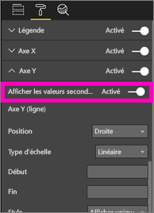

**Figure 60 : Axe Afficher l’élément secondaire**

**Figure 61 : Créer un graphique combiné**

* Tirez parti des axes doubles. C’est un bon moyen de comparer plusieurs mesures avec des plages de valeurs différentes. Et c’est un bon moyen d’illustrer la corrélation entre deux mesures dans le même visuel.

Pour plus d’informations, consultez les rubriques suivantes :

* [Didacticiel : graphique combiné dans Power BI](power-bi-visualization-combo-chart.md)
* [The danger of dual-scaled Axes in visuals](http://www.perceptualedge.com/articles/visual_business_intelligence/dual-scaled_axes.pdf) (Le risque des axes à deux échelles dans les graphiques)

### Nuage de points

Nous avons parfois de nombreuses variables à afficher ensemble et un graphique à nuages de points peut être un moyen très utile d’obtenir une vue d’ensemble.  Les graphiques en nuages de points affichent les relations entre 2 (nuages de point) ou 3 (bulles) mesures quantitatives.  Un nuage de points a toujours deux axes de valeur pour afficher un jeu de données numériques sur l’axe horizontal et un autre jeu de valeurs numériques sur l’axe vertical. Le graphique affiche les points à l’intersection d’une valeur numérique x et y, en associant ces valeurs en points de données uniques. Ces derniers peuvent être distribués uniformément ou non sur l’axe horizontal, en fonction des données.

Un graphique en bulles remplace les points de données par des bulles, la taille de la bulle représentant une dimension supplémentaire des données.

Le graphique en bulles ci-dessous s’intéresse à l’Amérique du Sud et compare le PIB par habitant (axe Y), le PIB total (axe X) et la population par pays d’Amérique du Sud.  La taille des bulles représente la population totale de ce pays. Le Brésil a la population la plus nombreuse (taille de bulle) et la plus grande portion du PIB de l’Amérique du Sud (il est situé le plus loin le long de l’axe X).  Mais notez que le PIB par habitant de l’Uruguay, du Chili et de l’Argentine est supérieur à celui du Brésil (le plus haut sur l’axe Y).

**Figure 62 : PIB et population d’Amérique du Sud dans un graphique en bulles**

Si vous ajoutez un axe de lecture, vous pouvez prétendre être Hans Rosling et raconter l’histoire au fil du temps (https://www.youtube.com/watch?v=PbaDBJWCeD4). Pour ajouter un axe de lecture, faites glisser un champ de date/heure dans la zone **Axe de lecture**.

#### Meilleures pratiques
* Les graphiques en nuages de points et les graphiques à bulles sont un excellent moyen de présenter des informations. Mais ils n’ont pas une grande utilité lorsque vous tentez d’explorer des données.  C’est ce que Stephen Few souligne dans le paragraphe ci-dessous *Cette approche est puissante lorsqu’elle sert à raconter une histoire. Quand Rosling raconte ce qui se passe dans le graphique lorsque les bulles changent de place et de valeur, en nous montrant ce qu’il veut que nous voyons, les informations prennent vie. Toutefois, les graphiques en bulles animés sont bien moins efficaces pour explorer et donner un sens aux données par soi-même. Je ne pense pas que Rosling utilise cette méthode pour découvrir des histoires, mais seulement pour les raconter une fois qu’elles sont connues. Nous ne pouvons pas regarder plusieurs bulles à la fois lorsqu’elles se déplacent. Nous devons donc exécuter l’animation plusieurs fois pour essayer de comprendre ce qui se passe. Nous pouvons ajouter des pistes aux bulles sélectionnées, ce qui permet de voir la trajectoire complète suivie par ces bulles, mais si les pistes sont utilisées pour plus que quelques bulles, le graphique devient rapidement trop encombré. Fondamentalement, ce que je dis, c’est que ce n’est pas la meilleure façon d’afficher ces informations à des fins d’analyse et d’exploration.*
* Ajoutez des étiquettes aux axes X et Y pour aider à raconter l’histoire.  Avec les graphiques en bulles plus particulièrement, il existe de nombreux composants à lire et les étiquettes aident les lecteurs à comprendre le visuel.
* Ajoutez des étiquettes de données pour faciliter l’interprétation du visuel.  Avec les graphiques en bulles plus particulièrement, lorsque vous avez plusieurs éléments dans la légende, il peut être difficile de différencier des couleurs similaires.  Dans le visuel ci-dessus, les couleurs de légende pour Suriname, Columbia et Ecuador sont très similaires.
* Votre nuage de points a-t-il uniquement un point de données qui regroupe toutes les valeurs sur les axes X et Y ? Ou regroupe-t-il toutes les valeurs le long d’une unique ligne horizontale ou verticale ?  Pour résoudre ce problème, ajoutez un champ à la zone **Détails** pour indiquer à Power BI comment regrouper les valeurs. Le champ doit être unique pour chaque point à tracer. Pour obtenir de l’aide, reportez-vous au [didacticiel sur l’utilisation des graphiques en bulles et à nuages de points dans Power BI](power-bi-visualization-scatter.md).

### Arborescences

Les arborescence peuvent être très utiles pour donner une vue d’ensemble de la taille relative de différents composants qui constituent un tout, en particulier lorsque vous pouvez les regrouper par catégories.  Dès que j’essaie de comprendre une nouvelle entreprise, une arborescence des composants principaux peut être très utile pour connaître la distribution globale.

Dans le premier graphique ci-dessous, vous pouvez voir immédiatement que le Brésil génère environ la moitié du PIB de l’Amérique du Sud et que le Venezuela et l’Argentine ont à peu près la même taille.

Si vous souhaitez avoir un contexte plus large tout en ayant une idée de l’impact des pays qui contribuent le plus, vous pouvez créer des hiérarchies de visuels avec les membres de catégorie (pays) imbriqués au sein de régions. La deuxième arborescence nous donne surtout une idée de la taille relative des régions et dans chaque région, nous pouvons voir quels pays contribuent le plus. Nous voyons qu’il existe trois régions immenses (Europe, Asie et Amérique du Nord) au sein desquelles nous pouvons facilement voir les principaux pays/régions.

La principale limitation de l’arborescence est la capacité limitée à comparer les différents rectangles en plus des principaux rectangles.  Ce type de graphique est adapté aux vues d’ensemble, mais les histogrammes et les graphique à barres sont probablement un meilleur choix pour avoir une idée plus précise de la taille relative des différents composants.
 Par exemple, la première arborescence donne une indication générale de l’ordre de grandeur du PIB, mais il est difficile d’identifier les différences spécifiques entre les pays, en particulier les plus petites zones sans étiquette. Pour ces données, dans lesquelles un regroupement unique est comparé, un histogramme ou graphique à barres peut être un meilleur choix.

**Figure 63 : Comparaison du PIB dans les pays d’Amérique du Sud sous forme d’arborescence**

Ici, nous avons ajouté un autre niveau de données, la région, et nous voyons la contribution globale au PIB par régions, ainsi que l’impact relatif dans les régions. Attention : si vous effectuez ceci avec des mesures autres que des sommes (telles que des moyennes), la somme des détails peut ne pas représenter la valeur réelle du niveau d’agrégation.

**Figure 64 : PIB par région et pays sous forme d’arborescence**

Pour plus d’informations sur les arborescences, nous vous invitons à cliquer sur les liens ci-dessous.

* [Vue d’ensemble des arborescences](http://www.perceptualedge.com/articles/b-eye/treemaps.pdf)
* [Catalogue de visualisation de données : arborescences](http://www.datavizcatalogue.com/methods/treemap.html#.VYhylI3bL7Y)

### Autres graphiques
#### Graphique en secteurs ou en anneau

Les graphiques en courbes, à barres et les histogrammes sont l’option idéale dans la plupart des cas. Il est évident que les graphiques en secteurs ou en anneau sont difficiles à interpréter correctement et peuvent souvent déformer les données. Évitez-les autant que possible. Stephen Few raconte très bien l’historique et les dangers dans son article [Save the Pies for Dessert] ([www.percetualedge.com/articles/08-21-07.pdf](http://www.perceptualedge.com/articles/08-21-07.pdf))

Il explique le seul cas de figure où les graphiques en secteurs peuvent être utiles : lors de la comparaison de relations entre les parties et un tout. Mais ce type de graphique est rarement plus adapté par exemple qu’un graphique à barres empilées 100 %.

Un autre article (animation) intéressant(e) sur les graphiques en secteurs est disponible sur le [site de Darkhorse Analytics](http://www.darkhorseanalytics.com/blog/salvaging-the-pie).

Nous vous conseillons également de lire un point de vue opposé dans l’article [Why Tufte is flat-out wrong about pie charts](http://speakingppt.com/2013/03/18/why-tufte-is-flat-out-wrong-about-pie-charts/).

#### Jauges radiales et indicateurs de performance clés

Les jauges radiales sont un bon choix de visuel pour indiquer les performances par rapport à une cible. Elles sont très populaires dans les tableaux de bord des dirigeants. Elles rencontrent toutefois deux principaux inconvénients. Comme avec les graphiques en secteurs, il est difficile d’interpréter l’angle de la zone ombrée par rapport à la ligne cible ou à l’arc à 180 degrés. Elles utilisent également beaucoup d’espace pour afficher une seule mesure.

Comme alternative, nous vous conseillons d’utiliser un simple visuel montrant un indicateur de performance clé.

Les indicateurs de performance clés montrent la valeur, l’état, l’objectif, l’écart par rapport à l’objectif et les tendances dans le même espace. La couleur verte devient rouge si la cible n’est pas remplie et peut être jaune si une cible intermédiaire est atteinte. Ce type de visuel est beaucoup plus simple à lire et à interpréter que la jauge.

Pour plus d’informations, consultez :

* [Didacticiel : jauges radiales dans Power BI](power-bi-visualization-radial-gauge-charts.md)
* [Didacticiel : Indicateurs de performance clés dans Power BI](power-bi-visualization-kpi.md)

## Conclusion
Il est maintenant temps de tester ces meilleures pratiques.  Gardez le contact et partagez les vôtres. Vous n’êtes pas d’accord avec nos recommandations ou vous avez trouvé une bonne raison d’enfreindre les règles ?  Faites-nous part de vos commentaires à ce sujet.  

### Recommandations de livres
Il existe plusieurs bons livres qui peuvent aider les équipes à réviser les techniques de conception de visuels. Nous vous recommandons fortement de lire le livre *Information Dashboard Design* de Stephen Few. Il approfondit le sujet dans deux autres livres : *Show Me the Numbers* et *Now You See It*. Stephen Few et d’autres ont trouvé leur inspiration auprès de Edward R. Tufte, dont le livre *The Visual Display of Quantitative Information* est considéré comme un classique dans le secteur. Tufte a également écrit *Visual Explanations*, *Envisioning Information* et *Beautiful Evidence*. Nous vous recommandons également le nouvel ouvrage de Andy Kirk *Data Visualization: A Handbook for Data Driven Design*. Voici d’autres auteurs recommandés : Lachlan James, William McKnight et Boris Evelson (Forrester), Darkhorse Analytics.

D’autres questions ? [Posez vos questions à la communauté Power BI](http://community.powerbi.com/)

