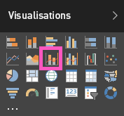

# Graphique combiné dans Power BI (didacticiel)
Dans Power BI, un graphique combiné est une visualisation qui combine un graphique en courbes et un histogramme. Combiner ces deux graphiques en un seul vous permet de comparer plus rapidement les données.

Les graphiques combinés peuvent avoir un ou deux axes Y.

## Quand faut-il utiliser un graphique combiné ?
Les graphiques combinés sont conseillés :

* quand vous avez un graphique en courbes et un histogramme avec le même axe X ;
* pour comparer plusieurs mesures avec des plages de valeurs différentes ;
* pour illustrer la corrélation entre deux mesures dans la même visualisation ;
* pour vérifier si une mesure correspond à la cible qui est définie par une autre mesure ;
* pour utiliser moins d’espace sur le canevas.

## Créer un graphique combiné simple, avec un seul axe
Regardez comment créer un graphique combiné à l’aide de l’exemple Vente et marketing.

<iframe width="560" height="315" src="https://www.youtube.com/embed/lnv66cTZ5ho?list=PL1N57mwBHtN0JFoKSR0n-tBkUJHeMP2cP" frameborder="0" allowfullscreen></iframe>

Pour créer votre propre graphique combiné, connectez-vous à Power BI et sélectionnez **Obtenir des données \> Exemples \> Exemple Analyse de la vente au détail**. 

1. Dans le tableau de bord « Exemple Analyse de la vente au détail », sélectionnez la vignette **Total Stores** (Total magasins) pour ouvrir le rapport « Exemple Analyse de la vente au détail ».
2. Sélectionnez **Modifier le rapport** pour ouvrir le rapport en Mode Edition.
3. [Ajoutez une nouvelle page au rapport](power-bi-report-add-page.md).
4. Créez un histogramme qui affiche les ventes de cette année et la marge brute mensuelle.
   
    a.  Dans le volet Champs, sélectionnez **Sales** \> **This Year Sales** > **Value** (Ventes > Ventes de cette année >Valeur).
   
    b.  Faites glisser **Sales** \> **Gross Margin This Year** (Ventes > Marge brute cette année) vers **Valeur**.
   
    c.  Sélectionnez **Time** \> **FiscalMonth** (Période > Mois fiscal) pour l’ajouter à **Axe**. 
   
    
5. Sélectionnez les points de suspension (...) dans le coin supérieur droit de la visualisation, puis sélectionnez **Trier par MoisFiscal**.
6. Convertissez l’histogramme en graphique combiné. Après avoir sélectionné l’histogramme, ouvrez le volet **Visualisations** et sélectionnez **Graphique en courbes et histogramme groupé**.
   
    
7. À partir du volet **Champs**, faites glisser **Sales** \> **Last Year Sales** (Ventes > Ventes de l’année dernière) vers **Valeurs de ligne**.
   
   
   
   Votre graphique combiné doit ressembler à ceci :
   
   

## Créer un graphique combiné avec deux axes
Dans cette tâche, nous allons comparer les ventes et la marge brute.

1. Créez un graphique en courbes qui affiche le pourcentage de marge brute de l’année précédente par mois.  En janvier, la marge brute était de 35 %. Elle a subi un pic à 45 % en avril, a baissé en juillet et a augmenté à nouveau en août. Verrons-nous un modèle similaire dans les ventes de l’année dernière et de cette année ?
   
   
2. Ajoutez **This Year Sales > Value** (Ventes de l’année > Valeur) et **Last Year Sales** (Ventes de l’année dernière) au graphique en courbes. L’échelle utilisée pour **GM% Last Year** (Pourcentage de marge brute de l’année précédente) est beaucoup plus petite que l’échelle pour **Sales** (Ventes), ce qui rend difficile la comparaison des données.      
   
   
3. Pour faciliter la lecture et l’analyse de la visualisation, convertissez le graphique en courbes en un graphique en courbes et histogramme empilé.
   
   
4. Faites glisser **GM% Last Year** (Pourcentage de marge brute de l’année précédente) de **Valeurs de colonne** vers **Valeurs de ligne**. Power BI crée deux axes, ce qui permet de définir des échelles différentes pour les jeux de données. L’axe de gauche mesure le montant des ventes et l’axe de droite mesure le pourcentage.
   
       

## Ajouter des titres aux axes
1. Ouvrez le volet de mise en forme en sélectionnant l’icône en forme de rouleau .
2. Sélectionnez la flèche déroulante pour développer les options de l’ **axe Y** .
3. Pour l’**axe Y (colonne)**, définissez les valeurs suivantes : **Position** sur **Gauche**, **Titre** sur **Activé**, **Style** sur **Afficher le titre uniquement** et **Afficher** sur **Millions**.
   
   
4. Sous l’**axe Y (colonne)**, assurez-vous également que **Afficher l'élément secondaire** a la valeur **Activé**. Cela affiche les options de mise en forme de la partie graphique en courbes du graphique combiné.
   
   
5. Pour l’**axe Y (ligne)**, laissez **Position** sur **Droite**, définissez **Titre** sur **Activé** et **Style** sur **Afficher le titre uniquement**.
   
   Le graphique combiné affiche maintenant les deux axes, chacun avec un titre.
   
   

À ce stade, vous souhaiterez effectuer les tâches suivantes :

* [Ajoutez le graphique combiné sous forme de vignette de tableau de bord](service-dashboard-tiles.md).
* [Enregistrez le rapport](service-report-save.md).

## Mise en surbrillance et filtrage croisé
Pour plus d’informations sur le volet Filtres, consultez [Ajouter un filtre à un rapport](power-bi-report-add-filter.md).

La mise en surbrillance d’une colonne ou d’une ligne dans un graphique combiné entraîne le filtrage croisé des autres visualisations sur la page du rapport, et vice versa.

## Étapes suivantes
[Ajouter une visualisation à un rapport](power-bi-report-add-visualizations-i.md)

[Visualisations dans des rapports Power BI](power-bi-report-visualizations.md)

[Types de visualisation dans Power BI](power-bi-visualization-types-for-reports-and-q-and-a.md)

[Power BI – Concepts de base](service-basic-concepts.md)

[Essayez-le gratuitement !](https://powerbi.com/)

D’autres questions ? [Posez vos questions à la communauté Power BI](http://community.powerbi.com/)

