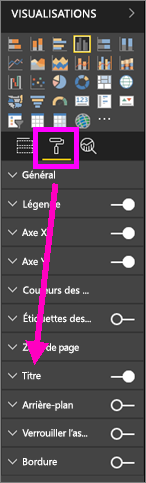
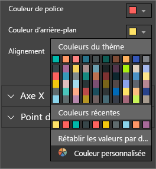
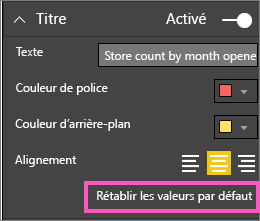
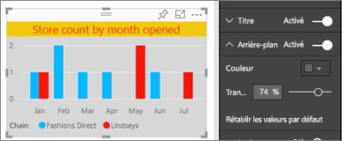
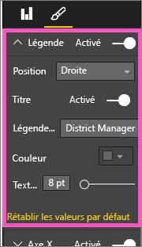
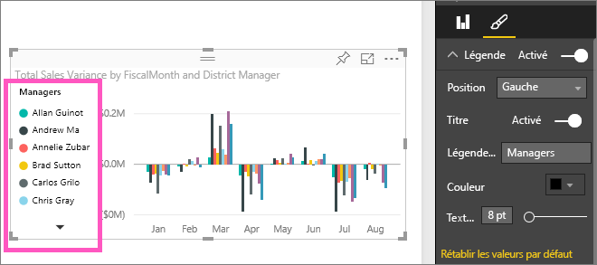

# Personnaliser le titre, la légende et l’arrière-plan d’une visualisation
Ce didacticiel présente quelques façons de personnaliser vos visualisations.   Compte tenu du nombre important d’options de personnalisation pour les visualisations, la meilleure façon de les découvrir toutes consiste à explorer le volet Mise en forme (sélectionnez l’icône Rouleau à peindre).  Pour vous aider à commencer, cet article explique comment personnaliser le titre, la légende et l’arrière-plan d’une visualisation.  

Les visualisations ne peuvent pas toutes être personnalisées. [Consultez la liste complète](#list).  

Regardez Amanda personnaliser des visualisations dans son rapport (à la minute 4:50 dans la vidéo). Suivez ensuite les instructions sous la vidéo pour essayer par vous-même avec vos propres données.

<iframe width="560" height="315" src="https://www.youtube.com/embed/IkJda4O7oGs" frameborder="0" allowfullscreen></iframe>

### Conditions préalables
- Service Power BI ou Power BI Desktop
- Retail Analysis sample

## Personnaliser les titres des visualisations dans les rapports
Pour la suite, connectez-vous au service Power BI (app.powerbi.com), puis ouvrez le rapport [Exemple Analyse de la vente au détail](sample-datasets.md) en [Mode Édition](service-interact-with-a-report-in-editing-view.md).

> [!NOTE]
> Quand vous épinglez une visualisation à un tableau de bord, elle prend la forme d’une vignette de tableau de bord.  Les vignettes peuvent également être personnalisées [en modifiant leurs titres et sous-titres, en leur ajoutant des liens hypertexte et en les redimensionnant](service-dashboard-edit-tile.md).
> 
> 

1. Accédez à la page « New Stores » (Nouveaux magasins) du rapport et sélectionnez l’histogramme « Open Store Count by Open Month... » (Nombre d’ouvertures de magasins pas mois).
2. Dans le volet Visualisations, sélectionnez l’icône Rouleau à peindre pour afficher les options de mise en forme.  Sélectionnez **Titre** pour développer cette section.  
   
   
3. Activez ou désactivez l’affichage du  **Titre** en sélectionnant le curseur Activé ou Désactivé. Pour l’instant, laissez-le sur **Activé**.  
   
   
4. Modifiez le **Texte du titre** en tapant **Store count by month opened** (Nombre d’ouvertures de magasins par mois) dans le champ de texte.  
5. Changez la **Couleur de police** en orange et la **Couleur d’arrière-plan** en jaune.
   
   * Sélectionnez la flèche déroulante et choisissez une couleur dans **Couleurs du thème**, **Couleurs récentes**ou **Couleur personnalisée**.
   * Sélectionnez la flèche déroulante pour fermer la fenêtre des couleurs.  
     
   
   Vous pouvez toujours rétablir les couleurs par défaut en sélectionnant **Rétablir les valeurs par défaut** dans la fenêtre des couleurs.
6. Augmentez la taille du texte à 12.
7. Nous allons effectuer une dernière personnalisation : aligner le titre du graphique au centre de la visualisation. Le titre est aligné à gauche par défaut.  
   
   
    À ce stade du didacticiel, le **titre** de votre histogramme doit ressembler à ceci :  
    
   
    Pour annuler toutes les personnalisations du titre que nous avons faites jusqu’à présent, sélectionnez **Rétablir les valeurs par défaut**en bas du volet de personnalisation **Titre** .  
    

## Personnaliser les arrière-plans des visualisations
En reprenant le même histogramme, développez les options d’arrière-plan.

1. Activez ou désactivez l’affichage de l’arrière-plan en sélectionnant le curseur Activé ou Désactivé. Pour l’instant, laissez-le sur **Activé**.
2. Changez la couleur d’arrière-plan en gris 74 %.
   
   * Sélectionnez la flèche déroulante et choisissez une couleur grise dans **Couleurs du thème**, **Couleurs récentes**ou **Couleur personnalisée**.
   * Définissez la transparence sur 74 %.   
     
   
   Pour annuler toutes les personnalisations apportées à l’arrière-plan du titre jusqu’à présent, sélectionnez **Rétablir les valeurs par défaut**en bas du volet de personnalisation **Arrière-plan** .

## Personnaliser les légendes des visualisations
1. Ouvrez la page de rapport **Présentation** et sélectionnez le graphique « Total Sales Variance par FiscalMonth et directeur régional » (Variance du nombre de ventes totales par MoisFiscal et directeur régional).
2. Dans l’onglet Visualisation, sélectionnez l’icône de pinceau pour ouvrir le volet Mise en forme.  
3. Développez les options de **Légende** .
   
      
4. Activez ou désactivez l’affichage de la légende en sélectionnant le curseur Activé ou Désactivé. Pour l’instant, laissez-le sur **Activé**.
5. Déplacez la légende à gauche de la visualisation.    
6. Ajoutez un titre de légende en basculant **Titre** sur **Activé** et, dans le champ **Nom de la légende** , tapez **Directeurs**.
   
   
   Pour annuler toutes les personnalisations de la légende que nous avons faites jusqu’à présent, sélectionnez **Rétablir les valeurs par défaut**en bas du volet de personnalisation **Légende** .

## Types de visualisations personnalisables
| Visualisation | Titre | Arrière-plan | Légende |
|:--- |:--- |:--- |:--- |
| aires |oui |oui |oui |
| barres |oui |oui |oui |
| carte |oui |oui |n/a |
| carte à plusieurs lignes |oui |oui |n/a |
| colonne |oui |oui |oui |
| combiné |oui |oui |oui |
| anneau |oui |oui |oui |
| Carte choroplèthe |oui |oui |oui |
| entonnoir |oui |oui |n/a |
| jauge |oui |oui |n/a |
| indicateur de performance clé |oui |oui |n/a |
| courbes |oui |oui |oui |
| carte |oui |oui |oui |
| matrice |oui |oui |n/a |
| secteur |oui |oui |oui |
| nuage de points |oui |oui |oui |
| segment |oui |oui |n/a |
| table |oui |oui |n/a |
| zone de texte |Non |oui |n/a |
| treemap |oui |oui |oui |
| cascade |oui |oui |oui |

## Étapes suivantes
[Personnaliser les axes x et y](power-bi-visualization-customize-x-axis-and-y-axis.md)  
[Personnaliser les couleurs et les propriétés des axes](service-getting-started-with-color-formatting-and-axis-properties.md)  
[Power BI – Concepts de base](service-basic-concepts.md)  
D’autres questions ? [Posez vos questions à la communauté Power BI](http://community.powerbi.com/)

