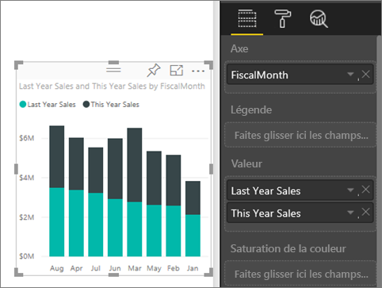
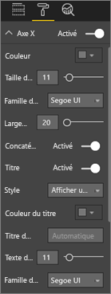
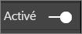
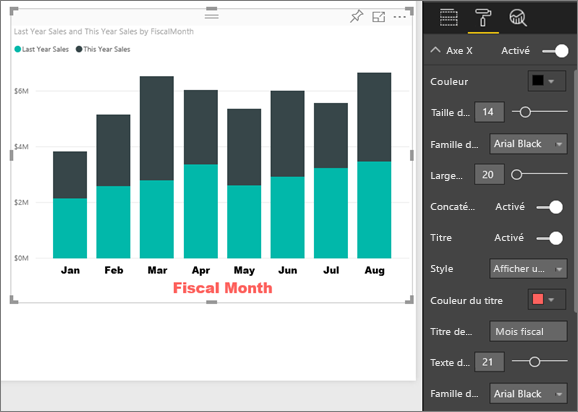
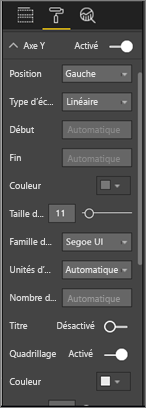
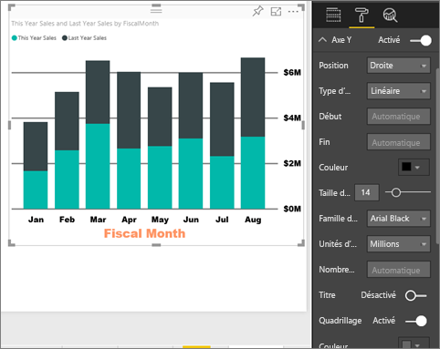
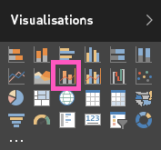
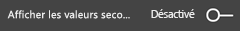
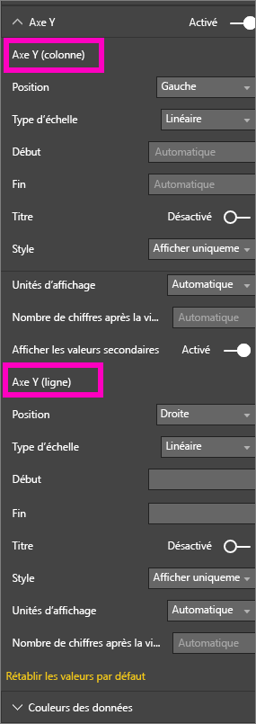
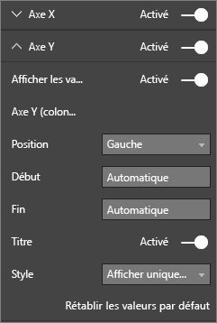

# Personnaliser les propriétés des axes X et Y
Dans ce didacticiel, vous allez découvrir de nombreuses façons de personnaliser les axes X et Y de vos visuels. Les visuels n’ont pas tous des axes et/ou ne sont pas toutes personnalisables. Par exemple, les graphiques en secteurs n’ont pas d’axes. Et les options de personnalisation varient d’un visuel à un autre, il y a trop d’options pour les couvrir dans un seul article. Par conséquent, nous allons examiner certaines des personnalisations d’axes les plus utilisées et vous aidez à vous familiariser avec l’utilisation de l’onglet de mise en forme visuelle dans le canevas de rapport Power BI.  

> [!NOTE]
> Cette page s’applique à la fois au service Power BI et à Power BI Desktop. Ces personnalisations sont disponibles quand l’icône **Format** (représentant un rouleau ) est sélectionnée, ainsi que dans Power BI Desktop.  
>
>

Regardez Amanda personnaliser ses axes X et Y et montrer les différentes façons de contrôler la concaténation quand elle monte ou descend dans la hiérarchie. Suivez ensuite les instructions détaillées sous la vidéo pour essayer par vous-même en utilisant l’exemple Finances.

<iframe width="560" height="315" src="https://www.youtube.com/embed/9DeAKM4SNJM" frameborder="0" allowfullscreen></iframe>

## Personnaliser les axes X des visualisations dans les rapports
## Créer une visualisation de graphique empilé
Connectez-vous au service Power BI et ouvrez le rapport **Exemple Analyse de la vente au détail** en [mode Edition](service-interact-with-a-report-in-editing-view.md). Pour effectuer la procédure, [connectez-vous à l’exemple Analyse de la vente au détail](sample-datasets.md).

1. Créez un histogramme qui affiche les ventes de l’année actuelle et celles de l’année dernière par mois fiscal.
2. Convertissez-le en histogramme empilé.

    

## Personnaliser l’axe X
1. Dans le volet Visualisations et Filtres, sélectionnez **Format** (icône représentant un rouleau ) pour afficher les options de personnalisation.
2. Développez les options de l’axe X.

   
3. Activez ou désactivez l’affichage de l’axe X en sélectionnant le curseur Activé ou Désactivé. Pour l’instant, laissez-le sur **Activé**.  Vous souhaitez peut-être désactiver l’axe X pour gagner de l’espace pour des données supplémentaires.

    
4. Mettez en forme la police, la taille et la couleur du texte. Dans cet exemple, nous avons défini la **couleur** du texte sur Noir, **la taille du texte** sur 14 et la **police** sur Arial Black.  
5. Activez l’affichage du titre Axe X en sélectionnant **Activé** et affichez le nom de l’axe X (ici, **MoisFiscal**).  
6. Mettez en forme la police, la taille et la couleur de texte du titre.  Dans cet exemple, nous avons défini **Couleur de titre** sur Orange, **Titre de l’axe** sur **Mois fiscal** et **Taille du texte du titre** sur 21.
7. Pour trier par FiscalMonth (MoisFiscal), sélectionnez les points de suspension (...) dans le coin supérieur droit du graphique, puis sélectionnez **Trier par MoisFiscal**.

    Après toutes ces personnalisations, votre histogramme doit ressembler à ceci :

     

Pour annuler toutes les personnalisations de l’axe X que vous avez apportées jusqu’à présent, sélectionnez **Rétablir les valeurs par défaut** en bas du volet de personnalisation **Axe X**.

## Personnaliser l’axe Y
1. Développez les options de l’axe Y.

   

2. Activez ou désactivez l’affichage de l’axe Y en sélectionnant le curseur Activé ou Désactivé. Pour l’instant, laissez-le sur **Activé**.  Vous souhaitez peut-être désactiver l’axe Y pour gagner de l’espace pour des données supplémentaires.
   
    
3. Déplacez la **Position** de l’axe Y à droite.
4. Mettez en forme la police, la taille et la couleur du texte. Dans cet exemple, nous avons défini la **couleur** du texte sur Noir, **la taille du texte** sur 14 et la **police** sur Arial Black.  
5. Conservez **Unités d’affichage** sur Millions et **Valeur décimales** sur Zéro.
6. Pour cette visualisation, étant donné que la présence d’un titre pour l’axe Y n’améliore pas le visuel, laissez **Titre** désactivé.  
7. Faisons ressortir les lignes du quadrillage en définissant **Couleur** sur Gris foncé et **Trait** sur 2.

    Après toutes ces personnalisations, votre histogramme doit ressembler à ceci :

     

## Personnalisation des visualisations ayant deux axes Y
Tout d’abord, vous allez créer un graphique combiné qui montre l’impact du nombre de magasins sur les ventes.  C’est le même graphique que celui créé dans le [didacticiel du graphique combiné](power-bi-visualization-combo-chart.md). Vous allez ensuite mettre en forme les deux axes Y.

### Créer un graphique avec deux axes Y
1. Créez un graphique en courbes qui affiche les éléments suivants : **Sales > Gross Margin last year % (Ventes > Pourcentage de marge brute de l’année précédente)** par rapport à **Time > FiscalMonth (Temps > MoisFiscal)**.
2. Triez le visuel par mois en sélectionnant les points de suspension (...), puis **Trier par mois**

    

>[NOTE]: For help sorting by month, see [sorting by other criteria](power-bi-report-change-sort.md#other)
1. En janvier, la marge brute était de 35 %. Elle a subi un pic à 45 % en avril, a baissé en juillet et a augmenté à nouveau en août. Verrons-nous un modèle similaire dans les ventes de l’année dernière et de cette année ?
2. Ajoutez **This Year Sales > Value** (Ventes de l’année > Valeur) et **Last Year Sales** (Ventes de l’année dernière) au graphique en courbes. L’échelle utilisée pour **GM% Last Year** (Pourcentage de marge brute de l’année précédente) (ligne bleue le long du quadrillage 0M%) est beaucoup plus petite que l’échelle pour **Sales** (Ventes), ce qui rend difficile la comparaison des données. Et les pourcentages des étiquettes de l’axe Y sont mal formatés.      

   
5. Pour faciliter la lecture et l’analyse de la visualisation, convertissez le graphique en courbes en un graphique en courbes et histogramme empilé.

   

6. Faites glisser **Gross Margin Last Year %** (Pourcentage de marge brute de l’année précédente) de **Valeurs de colonne** vers **Valeurs de ligne**. Vous avez maintenant l’histogramme empilé créé précédemment, ***ainsi qu’*** un graphique en courbes.  (Le cas échéant, utilisez ce que vous avez appris ci-dessus pour formater la couleur et la taille de police des axes.)
   

   Power BI crée deux axes, ce qui permet de définir des échelles différentes pour les jeux de données. L’axe de gauche mesure le montant des ventes et l’axe de droite mesure le pourcentage.

   

### Mettre en forme l’axe Y secondaire
1. Dans le volet **Visualisations**, sélectionnez l’icône représentant un rouleau pour afficher les options de mise en forme.
2. Développez les options de l’axe Y en sélectionnant la flèche déroulante.
3. Faites défiler la liste jusqu’aux options correspondant à **Afficher l’élément secondaire**. Basculez **Afficher l’élément secondaire** de **Désactivé** à **Activé**.

   

   
4. (Facultatif) Personnalisez les deux axes. Si vous basculez **Position** sur l’axe des colonnes ou l’axe des lignes, les deux axes changent de côté.

   

### Ajouter des titres aux deux axes
Dans une visualisation complexe, il peut être utile d’ajouter des titres pour les axes.  Les titres permettent à vos collègues de mieux comprendre le contenu de votre visualisation.

1. Basculez **Titre** sur **Activé** pour **Axe Y (colonne)** et **Axe Y (ligne)**.
2. Définissez **Style** sur **Afficher le titre uniquement**.

   
3. Le graphique combiné affiche maintenant les deux axes, chacun avec un titre.

   

Pour plus d’informations, consultez [Conseils et astuces pour la mise en forme des couleurs, l’étiquetage et les propriétés des axes](service-tips-and-tricks-for-color-formatting.md).

## Considérations et résolution des problèmes
Si l’axe X est considéré par le propriétaire du rapport comme un type de date, l’option **Type** s’affiche et vous pouvez choisir entre Continu ou Catégorie.

## Étapes suivantes
En savoir plus sur les [visualisations dans les rapports Power BI](power-bi-report-visualizations.md)

[Personnaliser les t](power-bi-visualization-customize-title-background-and-legend.md)[itres, les arrière-plans et les légendes](power-bi-visualization-customize-title-background-and-legend.md)

[Personnaliser les couleurs et les propriétés des axes](service-getting-started-with-color-formatting-and-axis-properties.md)

[Power BI – Concepts de base](service-basic-concepts.md)

D’autres questions ? [Posez vos questions à la communauté Power BI](http://community.powerbi.com/)
