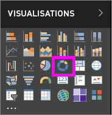
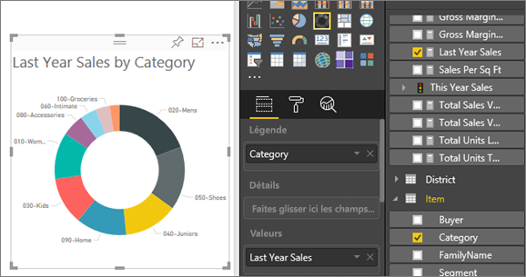

# Graphiques en anneau dans Power BI
Un graphique en anneau est similaire à un graphique en secteurs, car il représente aussi la relation de parties par rapport à un ensemble. La seule différence est que le centre est vide et qu’il y a de la place pour une étiquette ou une icône.

## Créer un graphique en anneau
Ces instructions utilisent l’Exemple Analyse de la vente au détail pour créer un graphique en anneau qui affiche les ventes de cette année par catégorie. Pour effectuer la procédure, [téléchargez l’exemple](sample-datasets.md) pour le service Power BI (app.powerbi.com) ou Power BI Desktop.

1. Démarrez sur une [page de rapport vierge](power-bi-report-add-page.md), puis sélectionnez le champ **SalesStage** \> **Étape de vente**. Si vous utilisez le service Power BI, veillez à ouvrir le rapport en [mode Édition](service-interact-with-a-report-in-editing-view.md).

2. Dans le volet Champs, sélectionnez **Sales** \> **Last Year Sales** (Ventes > Ventes de l’année dernière).  
   
3. Dans le volet Visualisations, sélectionnez l’icône de graphique en anneau  pour convertir votre histogramme en graphique en anneau. Si **Last Year Sales** (Ventes de l’année dernière) ne figure pas dans la zone **Valeurs**, faites-le glisser vers cette zone.
     
   

4. Sélectionnez **Élément** \> **Catégorie** pour l’ajouter à la zone **Légende**. 
     
    

5. Si vous le souhaitez, [ajustez la taille et la couleur du texte du graphique](power-bi-visualization-customize-title-background-and-legend.md). 

## Considérations et résolution des problèmes
* La somme des valeurs du graphique en anneau doit atteindre 100 %.
* L’utilisation d’un trop grand nombre de catégories peut rendre le graphique difficile à lire et à analyser.
* Les graphiques en anneau sont davantage adaptés pour comparer une section spécifique par rapport à l’ensemble que pour comparer des sections individuelles entre elles. 

## Étapes suivantes
[Rapports dans Power BI](service-reports.md)

[Types de visualisation dans Power BI](power-bi-visualization-types-for-reports-and-q-and-a.md)

[Visualisations dans des rapports Power BI](power-bi-report-visualizations.md)

[Power BI – Concepts de base](service-basic-concepts.md)

D’autres questions ? [Posez vos questions à la communauté Power BI](http://community.powerbi.com/)

