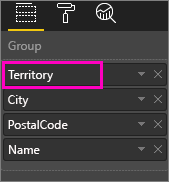
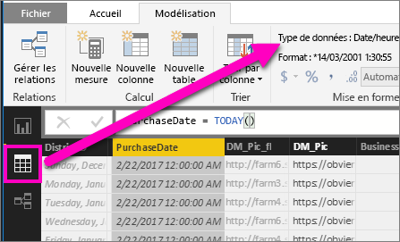

# Explorer une visualisation dans Power BI
## La fonction de descente dans la hiérarchie nécessite une hiérarchie
Quand un visuel a une hiérarchie, vous pouvez l’explorer pour révéler des détails supplémentaires. Par exemple, vous pouvez avoir une visualisation qui examine le nombre de médailles olympiques avec une hiérarchie constituée de sports, disciplines et événements. Par défaut, la visualisation indique le nombre de médailles olympiques par sport (gymnastique, ski, sports aquatiques, etc.). Toutefois, comme elle a une hiérarchie, si vous sélectionnez un élément visuel (par exemple, une barre, une ligne ou une bulle), une image encore plus détaillée s’affiche. Sélectionnez l’élément **aquatics** (sports aquatiques) afin d’afficher les données relatives à la natation, la plongée et le water polo.  Sélectionnez l’élément **diving** (plongée) pour afficher les détails relatifs au plongeoir, à la plateforme et aux événements de plongeon synchronisé.

Vous pouvez ajouter des hiérarchies aux rapports que vous possédez, mais pas à ceux partagés avec vous.
Vous ne savez pas quelles visualisations Power BI contiennent une hiérarchie ?  Passez la souris sur une visualisation. Si vous voyez ces contrôles de descente dans la hiérarchie dans les angles supérieurs, la visualisation a une hiérarchie.

    
   

Les dates sont un type unique de hiérarchie. Quand vous ajoutez un champ de date à une visualisation, Power BI ajoute automatiquement une hiérarchie de temps qui inclut l’année, le trimestre, le mois et le jour. Pour plus d’informations, consultez [Hiérarchies visuelles et comportement d’exploration](guided-learning/visualizations.yml#step-18) ou regardez la vidéo ci-dessous.

  <iframe width="560" height="315" src="https://www.youtube.com/embed/MNAaHw4PxzE?list=PL1N57mwBHtN0JFoKSR0n-tBkUJHeMP2cP" frameborder="0" allowfullscreen></iframe>

> [!NOTE]
> Pour savoir comment créer des hiérarchies à l’aide de Power BI Desktop, regardez la vidéo [Comment créer et ajouter des hiérarchies](https://youtu.be/q8WDUAiTGeU).
> 
> 

## Deux méthodes d’exploration
Il existe deux méthodes pour descendre (et monter) dans la hiérarchie de votre visualisation.  Les deux sont décrites dans cet article. Les deux méthodes permettent d’accomplir la même chose : utilisez celle que vous appréciez le plus.

> [!NOTE]
> Pour suivre la procédure, [ouvrez l’exemple Analyse de la vente au détail](sample-datasets.md) dans le service Power BI et créez un graphique de compartimentage qui examine le **Nombre total d’unités cette année** (Valeurs) par **Secteur**, **Ville**, **Code postal** et **Nom** (groupe).  
> 
> 

## Méthode 1 pour descendre dans la hiérarchie
Cette méthode utilise les icônes de descente dans la hiérarchie qui apparaissent dans les angles supérieurs de la visualisation elle-même.

1. Dans Power BI, ouvrez un rapport en [mode Lecture ou en mode Édition](service-reading-view-and-editing-view.md). Pour pouvoir explorer une visualisation, celle-ci doit comporter une hiérarchie. 
   
   Une hiérarchie vous est présentée dans l’animation ci-dessous.  La visualisation a une hiérarchie constituée de secteurs, de villes, de codes postaux et de noms de ville. Chaque secteur a une ou plusieurs villes, chaque ville a un ou plusieurs codes postaux, etc. Par défaut, la visualisation affiche uniquement les données relatives au secteur, car le *secteur* (Territory) apparaît en premier dans la liste.
   
   
2. Pour activer l’exploration, sélectionnez l’icône de flèche en haut à droite de la visualisation. Une fois que l’icône est sombre, l’exploration est activée. Si vous n’activez pas la descente dans la hiérarchie, la sélection d’un élément visuel (par exemple une barre ou une bulle) effectue un filtrage croisé des autres graphiques sur la page de rapport.    
   
   
3. Pour explorer **un champ à la fois**, sélectionnez un des éléments dans la visualisation. Dans un graphique à barres, vous cliquez sur une des barres. Dans un graphique de compartimentage, vous cliquez sur un des **rectangles**. Notez que le titre change à mesure que vous explorez puis revenez en arrière. Dans cette animation, il passe de « Total Units This Year by Territory » (Nombre total d’unités cette année par secteur) à « Total Units This Year by Territory and City » (Nombre total d’unités cette année par secteur et ville), puis à « Total Units This Year by Territory, City and Postal Code » (Nombre total d’unités cette année par secteur, ville et code postal) à « Total Units This Year by Territory, City, PostalCode, and Name » (Nombre total d’unités cette année par secteur, ville, code postal et nom). Par ailleurs, pour remonter d’un niveau, sélectionnez l’icône **Monter dans la hiérarchie**  en haut à gauche de la visualisation, comme indiqué ci-dessous.
   
   
4. Pour explorer ***tous les champs à la fois***, sélectionnez la flèche double en haut à gauche de la visualisation.
   
   
5. Pour remonter d’un niveau, sélectionnez la flèche vers le haut en haut à gauche de la visualisation.
   
   

## Méthode 2 pour descendre dans la hiérarchie
Cette méthode utilise la liste déroulante **Explorer** dans la barre de menus supérieure de Power BI.

1. Dans Power BI, ouvrez un rapport en [mode Lecture ou en mode Édition](service-reading-view-and-editing-view.md). Pour pouvoir explorer une visualisation, celle-ci doit comporter une hiérarchie. 
   
   Une hiérarchie vous est présentée dans l’image ci-dessous.  La visualisation a une hiérarchie constituée de secteurs, de villes, de codes postaux et de noms de ville. Chaque secteur a une ou plusieurs villes, chaque ville a un ou plusieurs codes postaux, etc. Par défaut, la visualisation affiche uniquement les données relatives au secteur, car le *secteur* (Territory) apparaît en premier dans la liste.
   
   
2. Pour activer la descente dans la hiérarchie, sélectionnez une visualisation pour l’activer, puis dans la barre de menus supérieure de Power BI, sélectionnez **Explorer** > **Descendre dans la hiérarchie**. L’icône de descente dans la hiérarchie en haut à droite de la visualisation a alors un arrière-plan noir.   
   
   
3. Après activation, descendez dans la hiérarchie d’un champ à la fois en sélectionnant l’une des feuilles du graphique de compartimentage. Dans cet exemple, le secteur nommé **NC** est sélectionné pour afficher le nombre total d’unités vendues cette année en Caroline du Nord par ville.
   
   
4. Pour explorer tous les champs à la fois, sélectionnez **Explorer** > **Afficher le niveau suivant**.
   
   
5. Pour remonter dans la hiérarchie, sélectionnez **Explorer** > **Monter dans la hiérarchie**.
   
   

6. Afin d’afficher les données utilisées pour créer le visuel, sélectionnez **Afficher les données**. Les données s’affichent dans un volet sous le visuel. Ce volet reste affiché pendant que vous continuez d’explorer l’élément visuel. Pour plus d’informations, consultez [Afficher les données utilisées pour créer le visuel](service-reports-show-data.md).

## Présentation de l’axe de hiérarchie et du groupe de hiérarchie
Vous pouvez considérer l’axe de hiérarchie et le groupe de hiérarchie comme les mécanismes à utiliser pour augmenter et diminuer la granularité des données à afficher. Toutes les données qui peuvent être organisées en catégories et sous-catégories peuvent avoir une hiérarchie. Cela inclut, bien entendu, les dates et les heures.

Vous pouvez créer une visualisation dans Power BI avec une hiérarchie en sélectionnant un ou plusieurs champs de données à ajouter à la zone **Axe** ou la zone **Groupe**, ainsi que les champs de données à examiner dans la zone **Valeurs**. Vous savez si vos données sont hiérarchiques si les icônes du Mode Exploration s’affichent en haut à droite et à gauche de votre visualisation. 

Fondamentalement, on peut dire qu’il existe deux types de données hiérarchiques :
- Données de date et d’heure : Si vous avez un champ de données avec un type de données DateTime, vous avez déjà des données hiérarchiques. Power BI crée automatiquement une hiérarchie pour tout champ de données dont les valeurs peuvent être analysées dans une structure [DateTime](https://msdn.microsoft.com/library/system.datetime.aspx). Vous devez uniquement ajouter un champ DateTime à la zone **Axe** ou **Groupe**.
- Données catégoriques : Si vos données sont dérivées de collections avec des sous-collections ou avec des lignes de données qui partagent des valeurs communes, vous avez des données hiérarchiques.

Power BI vous permet de développer les données d’un ou de tous les sous-ensembles. Vous pouvez descendre dans la hiérarchie de vos données pour afficher un seul sous-ensemble par niveau ou pour afficher tous les sous-ensembles simultanément par niveau. Par exemple, vous pouvez explorer une année donnée ou afficher tous les résultats de chaque année à mesure que vous descendez dans la hiérarchie. À l’inverse, vous pouvez monter dans la hiérarchie de la même manière.

Les sections suivantes décrivent une descente dans la hiérarchie de la vue la plus élevée à la vue intermédiaire, puis à la vue la plus basse.

### Données hiérarchiques et données temporelles
Pour cet exemple, reprenez [l’exemple Analyse de la vente au détail](sample-datasets.md) et créez une visualisation d’histogramme empilé qui examine le **Mois** (axe) par rapport aux **Ventes totales** (valeurs).  

Même si le champ de données Axe est **Mois**, il crée toujours une catégorie **Année** dans la zone **Axe**. C’est parce que Power BI fournit la structure DateTime complète pour toutes les valeurs qu’il lit. En haut de la hiérarchie se trouvent les données de l’année.

Avec le mode Descendre dans la hiérarchie activé, cliquez sur la barre du graphique pour descendre d’un niveau dans la hiérarchie. Vous voyez trois barres pour les données de trimestre disponibles. Ensuite, à partir des icônes en haut à gauche, choisissez **Développer le niveau inférieur de toute la hiérarchie**. Ensuite, répétez l’opération pour accéder au niveau le plus bas de la hiérarchie, qui présente les résultats de chaque mois.

En plus de la visualisation, nous pouvons voir la hiérarchie reflétée dans les données affichées pour chaque rapport. Le tableau suivant montre les résultats de l’action **Afficher les données** dans un rapport qui descend dans la hiérarchie pour un seul mois ou pour tous les mois. 

Notez que les données sont les mêmes pour les rapports annuels et trimestriels, mais une fois que vous descendez dans la hiérarchie jusqu’au niveau de détail spécifié pour **Valeurs**, vous pouvez observer que le rapport pour un seul mois devient plus spécifique et que le rapport pour tous les mois a plus de données.

|Mode Développer|Year|Quarter|Month|Day|
| ---|:---:|:---:|:---:|---|
|À sens unique|||||
|Toutes|||||

### Données de catégorie hiérarchiques
Les données modélisées à partir de collections et de sous-collections sont hiérarchiques. Un bon exemple de ce type de données sont les données de localisation. Prenons une table dans une source de données avec des colonnes Pays, État, Ville et Code postal. Les données qui partagent les mêmes pays, état et ville sont hiérarchiques.

Pour cet exemple, reprenez [l’exemple Analyse de la vente au détail](sample-datasets.md). Créez une visualisation d’histogramme empilé qui examine le **Total des unités cette année** (valeurs) par **Secteur de vente**, **Ville**, **Code postal** et **Nom** (groupe).  

Avec le mode Descendre dans la hiérarchie activé, à partir des icônes en haut à gauche, choisissez **Développer le niveau inférieur de toute la hiérarchie** trois fois de suite.
Vous devez accéder au niveau le plus bas de la hiérarchie, qui affiche les résultats pour le secteur de vente, la ville et le code postal.

En plus de la visualisation, nous pouvons voir la hiérarchie reflétée dans les données affichées pour chaque rapport. Le tableau suivant montre les résultats de l’action **Afficher les données** dans un rapport qui descend dans la hiérarchie pour un seul secteur de vente ou pour tous les secteurs de vente. Quand vous descendez dans la hiérarchie, vous pouvez observer que le rapport pour un seul secteur de vente devient plus spécifique et que le rapport pour tous les secteurs de vente a plus de données.

| Mode Développer|Territoire|Ville|Code postal|Nom|
| ---|:---:|:---:|:---:|---|
|À sens unique|||||
|Toutes|||||

## Considérations et limitations
* Si l’ajout d’un champ de date à une visualisation ne crée pas de hiérarchie, c’est peut-être que le champ « date » n’est pas bien enregistré en tant que date. Si vous êtes le propriétaire du jeu de données, ouvrez-le dans la vue *Données* dans Power BI Desktop, sélectionnez la colonne qui contient la date, puis sous l’onglet Modélisation, définissez **Type de données** sur **Date** ou **Date/Heure**. Si le rapport a été partagé avec vous, contactez le propriétaire pour lui demander d’effectuer la modification.  
  
  

## Étapes suivantes
[Visualisations dans des rapports Power BI](power-bi-report-visualizations.md)

[Rapports Power BI](service-reports.md)

[Power BI – Concepts de base](service-basic-concepts.md)

D’autres questions ? [Posez vos questions à la communauté Power BI](http://community.powerbi.com/)

