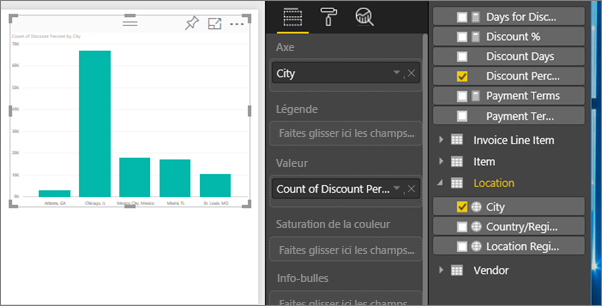
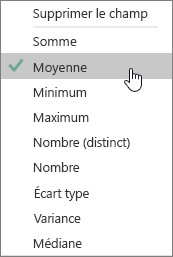
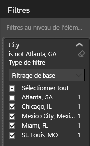
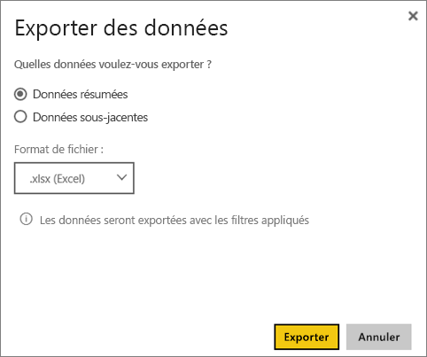

# Exportez des données à partir de visualisations
Si vous souhaitez afficher les données qui sont utilisées pour créer une visualisation, vous pouvez [le faire dans Power BI](service-reports-show-data.md) ou exporter ces données vers Excel sous forme de fichier .xlsx ou .csv.   

Regardez Will pendant qu’il exporte les données à partir d’une des visualisations de son rapport, les enregistre au format .xlsx et ouvre le fichier dans Excel. Suivez ensuite les instructions détaillées sous la vidéo pour essayer vous-même.

<iframe width="560" height="315" src="https://www.youtube.com/embed/KjheMTGjDXw" frameborder="0" allowfullscreen></iframe>

## À partir d’une visualisation dans un tableau de bord Power BI
1. Sélectionnez les ellipses, dans le coin supérieur droit de la visualisation.
   
    
2. Sélectionnez l’icône  **Exporter les données**.
   
    
3. Les données sont exportées dans un fichier .csv. Si l’élément visuel est filtré, les données téléchargées sont aussi filtrées.
4. Votre navigateur vous invite à enregistrer le fichier.  Lorsque c’est fait, ouvrez le fichier .csv dans Excel.
   
    

## À partir d’une visualisation dans un rapport
Pour effectuer cette procédure, ouvrez le [rapport Exemple Analyse de l'approvisionnement](sample-procurement.md) en [mode Édition](service-reading-view-and-editing-view.md). [Ajoutez une nouvelle page de rapport vide](power-bi-report-add-page.md). Puis suivez les étapes ci-dessous pour ajouter un regroupement et un filtre au niveau des visualisations.

1. Créez un histogramme.  Dans le volet Champs, sélectionnez **Location > City** (Emplacement > Ville) et **Invoice > Discount Percent** (Facture > % de remise).  Vous devrez peut-être déplacer **Discount Percent** (% de remise) dans la zone Valeur. 
   
    
2. Définissez l’agrégation **Discount Percent** (% de remise) de **Nombre** à **Moyenne**. Dans la zone Valeur, sélectionnez la flèche à droite de **Discount Percent** (% de remise)(il se peut qu’elle indique **Nombre du pourcentage de remise**), puis choisissez **Moyenne**.
   
    
3. Ajoutez un filtre à **City** (Ville) pour supprimer **Atlanta**.
   
   
   
   Vous êtes maintenant prêt à tester les deux options d’exportation des données.
4. Sélectionnez les ellipses, dans le coin supérieur droit de la visualisation. Choisissez  **Exporter des données**.
   
   
5. Si votre visualisation a un agrégat (par exemple si vous avez défini **Nombre** sur *Moyenne*, **Somme** ou *Minimum*), vous avez deux options : **Données résumées** et **Données sous-jacentes**. Pour comprendre le fonctionnement des agrégats, consultez [Agrégats dans Power BI](service-aggregates.md).
   
    
6. Sélectionnez **Données résumées** > **Exporter** et choisissez .xlsx ou .csv. Power BI exporte les données.  Si vous avez appliqué des filtres à la visualisation, les données sont exportées en étant filtrées. Lorsque vous sélectionnez **Exporter**, votre navigateur vous invite à enregistrer le fichier. Lorsque c’est fait, ouvrez le fichier dans Excel.
   
   **Données résumées** : sélectionnez cette option si vous n’avez pas d’agrégat ou si vous avez un agrégat mais ne souhaitez pas voir la répartition complète. Par exemple, si vous avez un graphique à barres affichant 4 barres, vous obtenez 4 lignes de données. Les données résumées sont disponibles aux formats .xlsx et .csv.
   
   Dans cet exemple, notre exportation Excel affiche un seul total par ville. Étant donné que nous avons filtré et retiré la ville d’Atlanta, celle-ci n’est pas incluse dans les résultats.  La première ligne de la feuille de calcul affiche les filtres qui ont été utilisés lors de l’extraction des données à partir de Power BI.
   
   
7. Essayez maintenant de sélectionner **Données sous-jacentes** > **Exporter** et .xlsx. Power BI exporte les données. Si vous avez appliqué des filtres à la visualisation, les données sont exportées en étant filtrées. Lorsque vous sélectionnez **Exporter**, votre navigateur vous invite à enregistrer le fichier. Lorsque c’est fait, ouvrez le fichier dans Excel.
   
   >[!WARNING]
   >L’exportation de données sous-jacentes permet aux utilisateurs de voir toutes les données détaillées, chaque colonne de données. Les administrateurs de service Power BI peuvent désactiver cette option pour leur organisation. Si vous êtes propriétaire d’un jeu de données, vous pouvez définir des colonnes propriétaires comme étant masquées afin qu’elles n’apparaissent pas dans la liste de champs dans le service Power BI ou dans Power BI Desktop.
   
   
   **Données sous-jacentes** : sélectionnez cette option si votre visualisation n’a pas d’agrégat et que vous voulez voir tous les détails sous-jacents. En fait, le fait de sélectionner *Données sous-jacentes* supprime l’agrégat. Lorsque vous sélectionnez **Exporter**, les données sont exportées dans un fichier .xlsx que votre navigateur vous invite à enregistrer. Lorsque c’est fait, ouvrez le fichier dans Excel.
   
   Dans cet exemple, notre exportation Excel affiche une seule ligne pour chaque ligne unique Ville de notre jeu de données, ainsi que le pourcentage de remise pour cette entrée unique. En d’autres termes, les données sont aplaties et non agrégées. La première ligne de la feuille de calcul affiche les filtres qui ont été utilisés lors de l’extraction des données à partir de Power BI.  
   
   

## Considérations et limitations
* Le nombre maximal de lignes pouvant être exportées de **Power BI Desktop** et du **service Power BI** au format .csv est de 30 000.
* Le nombre maximal de lignes pouvant être exportées au format .xlsx est de 150 000.
* L’exportation à l’aide de *données sous-jacentes* ne fonctionne pas si la source de données est une connexion active Analysis Services, si la version est antérieure à 2016 et si les tables du modèle ne possèdent pas de clé unique.  
* L’exportation à l’aide de *données sous-jacentes* ne fonctionne pas si l’option *Afficher les éléments sans données* est activée pour la visualisation en cours d’exportation.
* Lorsque vous utilisez DirectQuery, la quantité maximale de données pouvant être exportées est de 16 Mo. Cela peut entraîner l’exportation d’un nombre de lignes inférieur au nombre maximal (en particulier en présence de nombreuses colonnes), des données difficiles à compresser et d’autres facteurs qui augmentent la taille du fichier et diminuent le nombre de lignes exportées.
* Power BI prend uniquement en charge l’exportation vers des visuels qui utilisent des agrégats de base. L’exportation n’est pas disponible pour les visuels à l’aide de mesures modèles ou de rapport.
* Les visuels personnalisés et les visuels R ne sont pas actuellement pris en charge.
* Les données d'exportation ne sont pas disponibles pour les utilisateurs externes à votre organisation qui utilisent un tableau de bord partagé avec eux. 
* Si le fichier .csv contient des caractères Unicode, le texte dans Excel peut ne pas s’afficher correctement. Cependant, l’ouverture dans le bloc-notes fonctionnera correctement. Les symboles monétaires et les mots étrangers sont des exemples de caractères Unicode. La solution consiste à importer le fichier csv dans Excel, au lieu d’ouvrir le fichier csv directement. Pour ce faire :
  
  1. Ouvrez Excel
  2. Dans l’onglet **Données**, sélectionnez **Obtenir des données externes** > **À partir du texte**.
* Les administrateurs Power BI ont la possibilité de désactiver l’exportation des données.

## Étapes suivantes
[Tableaux de bord dans Power BI](service-dashboards.md)  
[Rapports dans Power BI](service-reports.md)  
[Power BI – Concepts de base](service-basic-concepts.md)

D’autres questions ? [Essayez d’interroger la communauté Power BI](http://community.powerbi.com/)

