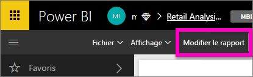
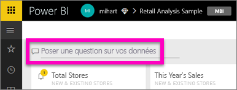
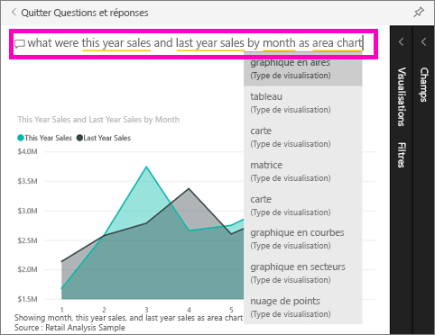

# Bien démarrer avec Questions et réponses Power BI

Il est parfois plus rapide d’obtenir des informations à partir de vos données en posant une question dans un langage naturel.  Dans ce guide de démarrage rapide, nous allons étudier deux façons de créer la même visualisation : en la créant directement dans un rapport et en posant une question à l’aide de Questions et réponses. Nous allons utiliser le service Power BI, mais le processus est presque identique si vous utilisez Power BI Desktop.

Pour effectuer la procédure, vous devez utiliser un rapport que vous pouvez modifier. Nous allons donc utiliser un des exemples disponibles avec Power BI.

## Créer un visuel dans l’éditeur de rapport

1. Dans votre espace de travail Power BI, sélectionnez **Obtenir des données** \> **Exemples** \> **Retail Analysis Sample (Exemple Analyse de la vente au détail)** > **Connexion**.
   
2. Le tableau de bord comporte une vignette du graphique en aires « Last Year Sales and This Year Sales » (Ventes de l’année dernière et de cette année).  Sélectionnez cette vignette. Si cette vignette avait été créée avec Q&R, sa sélection entraînerait l’ouverture de Q&R. Cette vignette ayant été créée dans un rapport, le rapport s’ouvre et affiche la page qui contient cette visualisation.

    

1. Ouvrez le rapport en Mode Edition en sélectionnant **Modifier le rapport**.  Si vous n’êtes pas propriétaire d’un rapport, vous ne pouvez pas ouvrir le rapport en mode Édition.
   
    
4. Sélectionnez le graphique en aires et vérifiez les paramètres dans le volet **Champs** .  Pour générer ce graphique, le créateur du rapport a sélectionné ces trois valeurs (**Time > FiscalMonth**, **Sales > This Year Sales**, **Sales > Last Year Sales**), qu’il a placées dans **Axe** et **Valeurs**.
   
    

## Créer le même visuel avec Q&R

Comment faire pour générer le même graphique en courbes avec Q&R ?

1. Revenez au tableau de bord Exemple Analyse de la vente au détail.
2. Tapez une question en langage naturel dans la zone de question. Par exemple :
   
   **quelles ont été les ventes mensuelles cette année et l’année dernière sous forme de graphique en aires**
   
   Quand vous tapez votre question, Q&R sélectionne la meilleure visualisation pour répondre à la question, et change la visualisation de manière dynamique à mesure que vous complétez la question. De plus, Q&R vous aide à formuler votre question en proposant des suggestions, des correspondances de saisie semi-automatique et des corrections orthographiques.
   
   Après avoir fini de taper votre question, vous obtenez exactement le même graphique que celui créé dans le rapport.  Mais ce mode de création a été beaucoup plus rapide !
   
   
3. Comme pour l’utilisation des rapports, vous avez accès dans Q&R aux volets des visualisations, des filtres et des champs.  Ouvrez ces volets pour explorer et modifier votre élément visuel.
4. Pour épingler le graphique à votre tableau de bord, sélectionnez l’icône d’épingle. .

## Étapes suivantes
[Q&R dans Power BI](consumer/end-user-q-and-a.md)

[Optimiser vos données avec Q&R dans Power BI](service-prepare-data-for-q-and-a.md)

D’autres questions ? [Posez vos questions à la communauté Power BI](http://community.powerbi.com/)

