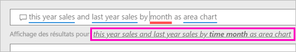

# Créer un élément visuel avec Power BI Q & r

Il est parfois plus rapide d’obtenir des informations à partir de vos données en posant une question dans un langage naturel.  Dans cet article, nous allons examiner deux façons différentes de créer la même visualisation : tout d’abord, poser une question avec Q & r et en second lieu, de la création d’un rapport. Nous utilisons le service Power BI pour créer l’élément visuel dans le rapport, mais le processus est presque identique à l’aide de Power BI Desktop.

Pour effectuer la procédure, vous devez utiliser un rapport que vous pouvez modifier. Nous allons donc utiliser un des exemples disponibles avec Power BI.

## Créer un élément visuel avec Q & r

Comment faire pour créer ce graphique en courbes avec Q & R ?

1. Dans votre espace de travail Power BI, sélectionnez **Obtenir des données** \> **Exemples** \> **Retail Analysis Sample (Exemple Analyse de la vente au détail)**  > **Connexion**.

1. Ouvrez le tableau de bord exemple analyse de la vente au détail et placez votre curseur dans la zone Q & R, **poser une question sur vos données**.

    

2. Dans la zone Q & R, tapez quelque chose comme cette question :
   
    **ventes de cette année et de ventes de l’année dernière par mois sous forme de graphique en aires**
   
    Quand vous tapez votre question, Q&R sélectionne la meilleure visualisation pour répondre à la question, et change la visualisation de manière dynamique à mesure que vous complétez la question. De plus, Q&R vous aide à formuler votre question en proposant des suggestions, des correspondances de saisie semi-automatique et des corrections orthographiques. Q & r recommande une modification du libellé small : « ventes de cette année et l’année dernière par *mois horaire* en tant que graphique en aires ».  

    

4. Sélectionnez la phrase pour accepter la suggestion. 
   
   Lorsque vous terminez de taper votre question, le résultat est le même graphique que vous voyez dans le tableau de bord.
   
   

4. Pour épingler le graphique à votre tableau de bord, sélectionnez l’icône d’épingle.  dans le coin supérieur droit.

## Créer un visuel dans l’éditeur de rapport

1. Revenez au tableau de bord Exemple Analyse de la vente au détail.
   
2. Le tableau de bord contient la vignette d’histogramme zone même pour « Last Year Sales et les ventes de cette année. »  Sélectionnez cette vignette. Ne sélectionnez pas la vignette que vous avez créé avec Q & r. Sélectionnant ouvre Q & r. La vignette d’histogramme zone d’origine a été créée dans un rapport, le rapport s’ouvre à la page qui contient cette visualisation.

    

1. Ouvrez le rapport en Mode Edition en sélectionnant **Modifier le rapport**.  Si vous n’êtes pas propriétaire d’un rapport, vous ne pouvez pas ouvrir le rapport en mode Édition.
   
    
4. Sélectionnez le graphique en aires et vérifiez les paramètres dans le volet **Champs** .  Le créateur du rapport générer ce graphique, en sélectionnant ces trois valeurs (**Last Year Sales** et **ventes de cette année > valeur** à partir de la **Sales** table, et  **FiscalMonth** à partir de la **temps** table) et les organiser dans le **axe** et **valeurs** wells.
   
    

    Vous voyez qu’ils terminé avec le même élément visuel. Ce mode de création n’a pas été trop compliqué. Mais sa création avec Q & r a été plus facile !

## Étapes suivantes

- [Utiliser Q & r dans les tableaux de bord et rapports](power-bi-tutorial-q-and-a.md)  
- [Questions et réponses pour les consommateurs](consumer/end-user-q-and-a.md)
- [Optimiser vos données avec Q&R dans Power BI](service-prepare-data-for-q-and-a.md)

D’autres questions ? [Posez vos questions à la communauté Power BI](http://community.powerbi.com/)

