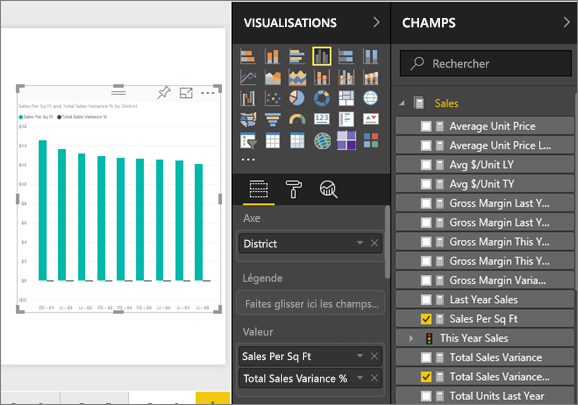
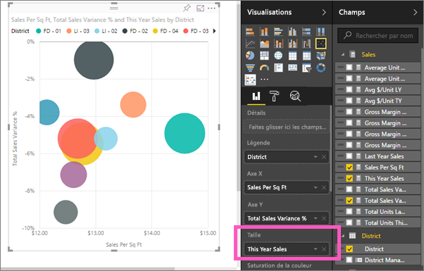
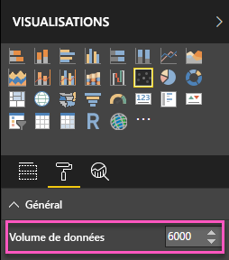
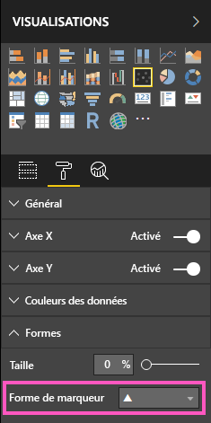

# Nuages de points et graphiques en bulles dans Power BI (didacticiel)
Un nuage de points a toujours deux axes de valeur pour afficher un jeu de données numériques sur l’axe horizontal et un autre jeu de valeurs numériques sur l’axe vertical. Le graphique affiche les points à l’intersection d’une valeur numérique x et y, en associant ces valeurs en points de données uniques. Ces derniers peuvent être distribués uniformément ou non sur l’axe horizontal, en fonction des données.

Un graphique en bulles remplace les points de données par des bulles, la *taille* de la bulle représentant une dimension supplémentaire des données.

Vous pouvez définir le nombre de points de données  

## Choix de l’utilisation d’un nuage de points ou d’un graphique en bulles
### Les nuages de points sont conseillés dans les cas suivants :
* Pour afficher les relations entre 2 (nuage de points) ou 3 (bulles) valeurs **numériques** .
* Pour tracer les deux groupes de nombres sous la forme d’une série de coordonnées xy.
* À la place d’un graphique en courbes lorsque vous souhaitez modifier l’échelle de l’axe horizontal.    
* Pour transformer l’axe horizontal en échelle logarithmique.
* Pour afficher les données de feuille de calcul qui incluent des paires ou des jeux groupés de valeurs. Dans un nuage de points, vous pouvez ajuster les échelles indépendantes des axes pour afficher plus d’informations sur les valeurs groupées.
* Pour afficher des modèles dans de grands jeux de données, par exemple en affichant des valeurs hors norme, des clusters et des tendances linéaires ou non linéaires.
* Pour comparer un grand nombre de points de données sans distinction de temps.  Plus vous incluez de données dans un nuage de points, meilleures sont les comparaisons possibles.

### Les graphiques en bulles sont conseillés dans les cas suivants :
* Si vos données ont 3 séries de données qui contiennent chacune un jeu de valeurs.
* Pour présenter des données financières.  Différentes tailles de bulles sont utiles pour souligner visuellement des valeurs spécifiques.
* Pour utiliser avec des quadrants.

## Créer un nuage de points
Regardez cette vidéo dans laquelle Will crée un graphique à nuages de points, puis suivez les étapes ci-dessous pour en créer un vous-même.

<iframe width="560" height="315" src="https://www.youtube.com/embed/PVcfPoVE3Ys?list=PL1N57mwBHtN0JFoKSR0n-tBkUJHeMP2cP" frameborder="0" allowfullscreen></iframe>

Ces instructions s’appliquent à l’exemple Analyse de la vente au détail. Pour effectuer la procédure, [téléchargez l’exemple](sample-datasets.md) pour le service Power BI (app.powerbi.com) ou Power BI Desktop.   

1. Commencez sur une [page de rapport vide](power-bi-report-add-page.md), puis sélectionnez les champs **Sales (Ventes)** \> **Sales Per Sq Ft (Ventes par mètre carré)** et **Sales (Ventes)** > **Total Sales Variance % (Pourcentage d’écart des ventes totales)**. Si vous utilisez le service Power BI, veillez à ouvrir le rapport en [mode Édition](service-interact-with-a-report-in-editing-view.md).
 
2. Dans le volet Champs, sélectionnez **District > District**.
   
    
4. Effectuez la conversion en nuage de points. Dans le volet Visualisation, sélectionnez l’icône de nuage de points.
   .
5. Faites glisser **District** depuis **Détails** vers **Légende**.
   
    

Nous disposons désormais d’un nuage de points qui trace le pourcentage d’écart des ventes totales sur l’axe Y et les ventes par mètre carré sur l’axe X.  Les couleurs de points de données représentent des districts.  Ajoutons à présent une troisième dimension.

## Créer un graphique en bulles
1. Dans le volet Champs, faites glisser **Ventes** > **Ventes de cette année** > **Valeur** vers la zone **Taille**. 
   
   
2. Pointez sur une bulle.  La taille de la bulle reflète la valeur de la zone **Ventes de cette année**.
   
    
3. Si vous le souhaitez, [mettez en forme les couleurs, étiquettes, titres, arrière-plan, etc. de la visualisation](service-getting-started-with-color-formatting-and-axis-properties.md).

   Vous pouvez également modifier la forme de marqueur et la définir sur un losange, triangle ou carré :

   

4. Si vous le souhaitez, pour définir le nombre de points de données à afficher dans votre graphique à bulles, dans la section **Format** du volet **Visualisations**, développez la carte **Général** et ajustez le **Volume de données**. La valeur par défaut est 3 500. 
 
     

   > [!NOTE]
   > Étant donné que davantage de points de données peut entraîner un temps de chargement plus long, si vous choisissez de publier des rapports avec des limites à l’extrémité supérieure de l’échelle, veillez à tester vos rapports sur le web et les appareils mobiles pour vous assurer que les performances correspondent aux attentes de vos utilisateurs.

5.   Si vous le souhaitez, pour sélectionner la forme de marqueur, développez la carte **Formes**, puis sélectionnez une forme de marqueur.

      

## Considérations et résolution des problèmes
### **Votre nuage de points a un seul point de données**
Votre nuage de points a-t-il uniquement un point de données qui regroupe toutes les valeurs sur les axes X et Y ?  Ou regroupe-t-il toutes les valeurs le long d’une unique ligne horizontale ou verticale ?

Ajoutez un champ à la zone **Détails** pour indiquer à Power BI comment regrouper les valeurs. Le champ doit être unique pour chaque point à tracer.  
Comme un simple numéro de ligne ou un champ ID :

Ou, si vous n’en avez pas dans vos données, créez un champ qui concatène les valeurs X et Y pour les convertir en élément unique par point :

Pour créer un champ, [utilisez l’éditeur de requête Power BI Desktop pour ajouter une colonne d’index](desktop-add-custom-column.md) à votre jeu de données.  Ajoutez ensuite cette colonne à la zone **Détails** de la visualisation.

## Étapes suivantes
 [Types de visualisation dans Power BI](power-bi-visualization-types-for-reports-and-q-and-a.md)

[Essayez-le gratuitement !](https://powerbi.com/)  

D’autres questions ? [Posez vos questions à la communauté Power BI](http://community.powerbi.com/)

