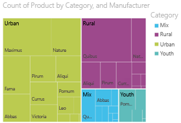
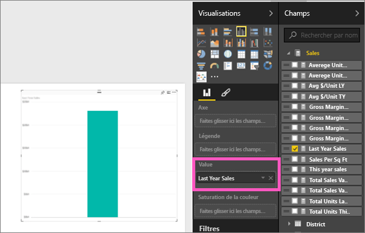
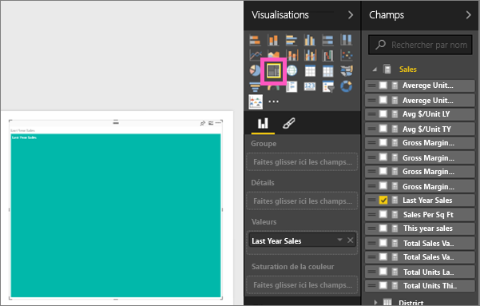
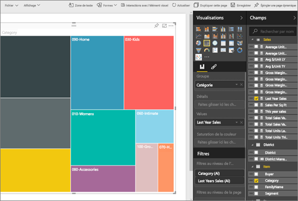
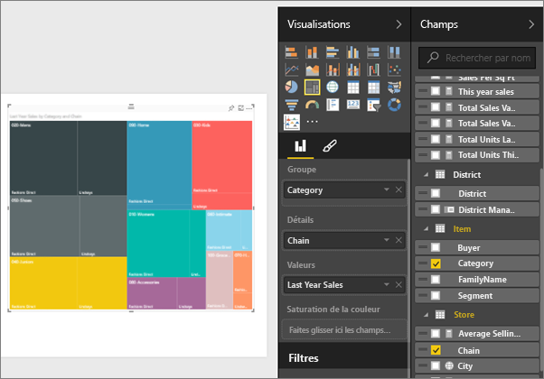
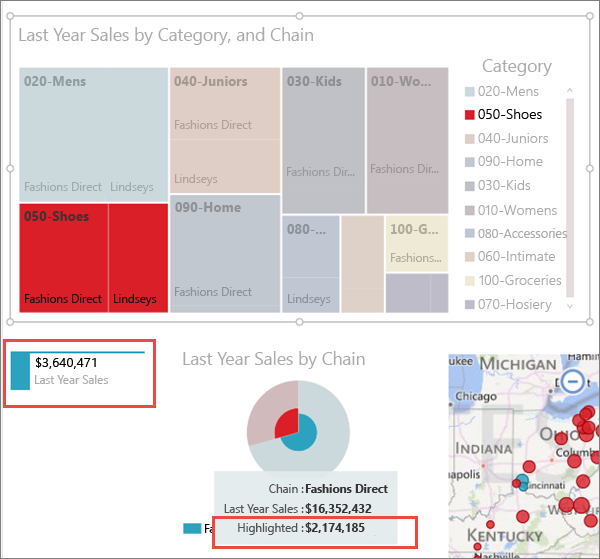

# Graphiques de compartimentage dans Power BI
Les treemaps utilisent des rectangles imbriqués pour présenter des données sous forme hiérarchique.  Chaque niveau de la hiérarchie est représenté par un rectangle de couleur (généralement appelé « branche ») qui contient d’autres rectangles (les « feuilles »).  L’espace à l’intérieur de chaque rectangle est attribué en fonction de la valeur quantitative mesurée. Les rectangles sont disposés par taille, avec le plus grand en haut à gauche et le plus petit en bas à droite.

Imaginons que j’utilise ce graphique pour analyser mes ventes. Les grands rectangles (les branches) correspondent aux catégories de vêtements **Urban**, **Rural**, **Youth** et **Mix**.  Ces rectangles de catégorie contiennent plusieurs rectangles plus petits (les feuilles) représentant les fabricants de vêtements de la catégorie en question. La taille et l’ombrage de ces petits rectangles sont déterminés en fonction du nombre d’articles vendus.  Pour la branche **Urban**, les ventes de vêtements Maximus ont été très élevées, les ventes Natura et Fama un peu moins élevées, et les ventes Leo très faibles.  Cela explique que la branche **Urban** de mon treemap affiche les ventes Maximus dans le plus grand rectangle (tout en haut à gauche), les ventes Natura et Fama dans des rectangles un peu plus petits, les ventes Leo dans un tout petit rectangle et toutes les autres ventes dans plusieurs rectangles de diverses tailles intermédiaires.  Je peux ainsi comparer le nombre d’articles vendus dans les autres catégories de vêtements d’après la taille et l’ombrage de chaque nœud feuille : plus le rectangle est grand et plus il est sombre, plus les ventes sont élevées.

## Quand faut-il utiliser un treemap ?
Les treemaps sont conseillés :

* pour afficher de grandes quantités de données sous forme hiérarchique ;
* quand un graphique à barres ne peut pas afficher correctement toutes les valeurs ;
* pour montrer la proportion de chaque partie par rapport à l’ensemble ;
* pour montrer le modèle de distribution de la mesure entre chaque niveau de catégories dans la hiérarchie ;
* pour représenter les attributs selon un codage par taille et couleur ;
* pour repérer les modèles, les valeurs inhabituelles, les principaux contributeurs et les exceptions.

### Conditions préalables
 - Service Power BI ou Power BI Desktop
 - Retail Analysis sample

## Créer un treemap simple
Vous souhaitez d’abord regarder une personne créer un treemap ?  Accédez à la position 2:10 de cette vidéo pour voir comment Amanda crée un graphique de compartimentage.

<iframe width="560" height="315" src="https://www.youtube.com/embed/IkJda4O7oGs" frameborder="0" allowfullscreen></iframe>

Ou bien, créez votre propre treemap. Ces instructions s’appliquent à l’exemple Analyse de la vente au détail. Pour la suite, connectez-vous au service Power BI (pas à la version Desktop) et sélectionnez **Obtenir des données \> Exemples \> Exemple Analyse de la vente au détail \> Se connecter \> Accéder au tableau de bord**. Pour créer des visualisations dans un rapport, il est nécessaire de disposer d’autorisations de modification du jeu de données et du rapport. Par chance, les exemples Power BI sont modifiables. Toutefois, si quelqu'un partage un rapport avec vous, vous ne pourrez pas ajouter de nouvelles visualisations.

1. Sélectionnez la vignette Nombre total de magasins pour ouvrir le rapport de l’exemple Analyse de la vente au détail.    
2. Ouvrez le [Mode Édition](service-interact-with-a-report-in-editing-view.md), puis sélectionnez la mesure **Ventes** > **Ventes de l’année dernière**.   
      
3. Convertissez le graphique en treemap.  
      
4. Faites glisser **Élément** > **Catégorie** vers **Groupe**. Power BI crée un graphique de compartimentage dont les rectangles ont une taille proportionnelle au total des ventes et une couleur distincte pour chaque catégorie représentée.  Pour résumer, vous avez créé une hiérarchie qui représente visuellement la quantité relative du total des ventes par catégorie.  La catégorie **Mens** enregistre les meilleures ventes, alors que la catégorie **Hosiery** enregistre les plus basses.   
      
5. Faites glisser **Magasin** > **Chaîne** vers **Détails** pour terminer votre treemap. Vous pouvez à présent comparer les ventes de l’année dernière par catégorie et par chaîne.   
   
   
   > [!NOTE]
   > Les détails et la saturation des couleurs ne peuvent pas être utilisés en même temps.
   > 
   > 
5. Pointez sur une zone **Chaîne** pour afficher l’info-bulle correspondant à cette portion de la **Catégorie**.  Par exemple, si vous placez le curseur sur **Lindseys** dans le rectangle **040-Juniors** , vous affichez l’info-bulle pour le sous-ensemble Lindsey de la catégorie Juniors.  
   
6. [Ajoutez le treemap sous forme de vignette de tableau de bord (épinglez l’élément visuel)](service-dashboard-tiles.md). 
7. [Enregistrez le rapport](service-report-save.md).

## Mise en surbrillance et filtrage croisé
Pour plus d’informations sur le volet Filtres, consultez [Ajouter un filtre à un rapport](power-bi-report-add-filter.md).

La mise en surbrillance d’une catégorie ou de détails dans un treemap entraîne la mise en surbrillance et le filtrage croisés des autres visualisations sur la page du rapport, et vice versa. Pour suivre la procédure, ajoutez certains éléments visuels à la même page ou copiez/collez le Treemap vers une page de rapport qui dispose déjà d’autres éléments visuels.

1. Dans le treemap, sélectionnez une catégorie ou une chaîne au sein d’une catégorie.  Cela met en surbrillance croisée les autres visualisations sur la page. Sélectionnez la catégorie **050-Shoes**, par exemple, pour afficher le montant des ventes de chaussures l’année dernière (3 640 471 $) et la part de ces ventes réalisée par Fashions Direct (2 174 185 $).  
   

2. Dans le graphique en secteurs **Ventes de l’année dernière par chaîne**, sélectionnez le secteur **Fashions Direct** pour filtrer le graphique de compartimentage.  
       

3. Pour gérer la mise en surbrillance croisée et le filtrage croisé des tableaux entre eux, consultez [Interactions de visualisation dans un rapport Power BI](service-reports-visual-interactions.md).

## Étapes suivantes
[Épingler une visualisation à un tableau de bord](service-dashboard-pin-tile-from-report.md)  
[Power BI – Concepts de base](service-basic-concepts.md)  

D’autres questions ? [Posez vos questions à la communauté Power BI](http://community.powerbi.com/)  

