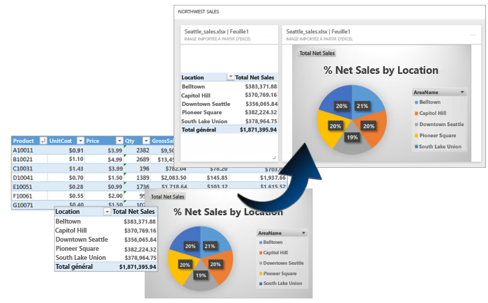
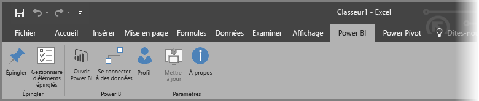
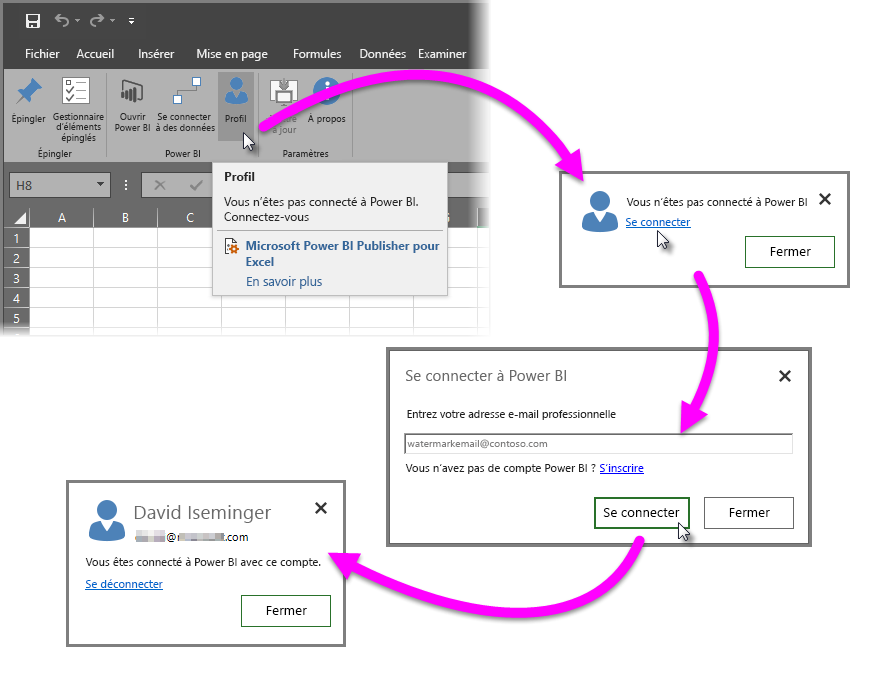
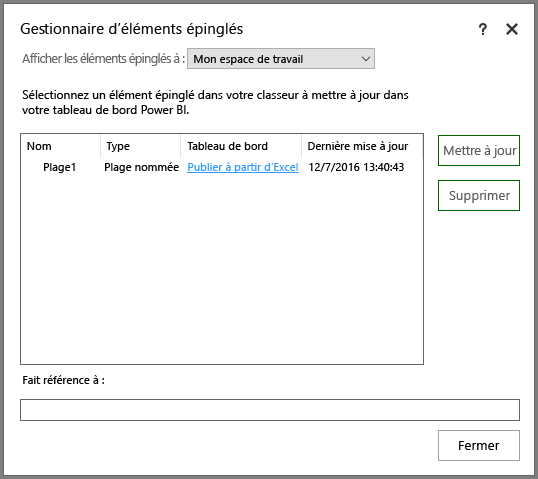
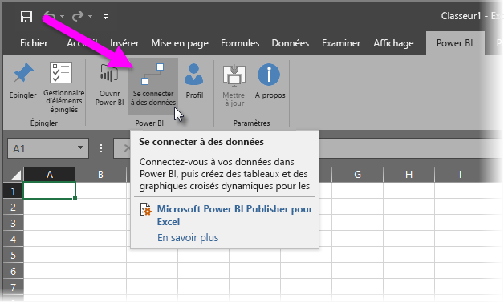
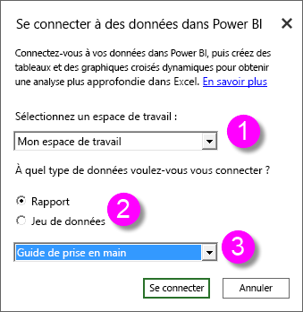
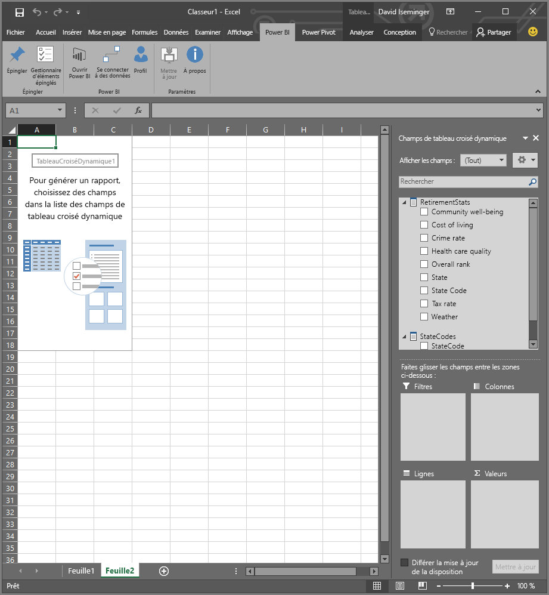
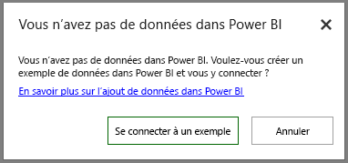

# Éditeur Power BI pour Excel
Microsoft **Power BI Publisher pour Excel** vous permet de prendre des instantanés de vos informations clés dans Excel, comme des tableaux croisés dynamiques, des graphiques et des plages, puis de les épingler à des tableaux de bord dans Power BI.

Que pouvez-vous épingler ? Pratiquement tout ce qui se trouve dans une feuille de calcul Excel. Vous pouvez sélectionner une plage de cellules à partir d’une feuille ou d’une table simple, un tableau croisé dynamique, un graphique croisé dynamique, des illustrations, des images et du texte.

En revanche, vous ne pouvez pas épingler de cartes ou de visualisations 3D dans des feuilles Power View. Il est aussi possible d’épingler certains éléments, comme un filtre Segment ou Chronologie, mais cela ne présente guère d’utilité.

Quand vous épinglez un élément à partir d’Excel, une nouvelle vignette est ajoutée à un tableau de bord, nouveau ou existant, dans Power BI. La nouvelle vignette étant un instantané, elle n’est pas dynamique. Toutefois, vous pouvez la mettre à jour. Par exemple, si vous apportez une modification à un tableau croisé dynamique ou à un graphique que vous avez déjà épinglé, la vignette du tableau de bord dans Power BI n’est pas mise à jour automatiquement, mais vous pouvez mettre à jour vos éléments épinglés à l’aide du **Gestionnaire d’éléments épinglés**. Le **Gestionnaire d’éléments épinglés** est décrit plus en détail dans les sections suivantes.

## Télécharger et installer
L’éditeur Power BI pour Excel est un complément que vous pouvez télécharger et installer sur les versions de bureau de Microsoft Excel 2007 (et versions ultérieures).

[Télécharger Power BI Publisher for Excel](http://go.microsoft.com/fwlink/?LinkId=715729)

Une fois l’éditeur installé, un nouveau ruban **Power BI** apparaît dans Excel. Celui-ci vous permet de vous connecter à Power BI (ou de vous en déconnecter), d’épingler des éléments à des tableaux de bord et de gérer les éléments que vous avez déjà épinglés.

Le complément **Power BI Publisher pour Excel** est activé par défaut. Si, pour une raison ou une autre, vous ne voyez pas l’onglet de ruban Power BI dans Excel, vous devez l’activer. Cliquez sur **Fichier** > **Options** > **Compléments** > **Compléments COM**. Sélectionnez **Microsoft Power BI Publisher pour Excel**.

## Épingler une plage à un tableau de bord
Vous pouvez sélectionner n’importe quelle plage de cellules dans votre feuille de calcul et épingler un instantané de cette plage à un tableau de bord existant ou nouveau dans Power BI. Vous pouvez également épingler le même instantané à plusieurs tableaux de bord.

Pour commencer, vous devez vérifier que vous êtes connecté à Power BI.

1. Dans Excel, sélectionnez **Profil** dans l’onglet de ruban **Power BI**. Si vous êtes déjà connecté à Power BI, vous pouvez voir une boîte de dialogue qui indique le compte auquel vous êtes actuellement connecté. Si c’est le compte que vous souhaitez utiliser, c’est parfait. Passez aux étapes suivantes pour épingler votre plage. Si vous souhaitez utiliser un autre compte Power BI, sélectionnez *Se déconnecter*. Si vous n’êtes pas connecté, passez à l’étape suivante (étape 2).
   
   
2. Si vous n’êtes pas connecté, sélectionnez le lien **Se connecter** qui s’affiche quand vous sélectionnez **Profil** dans l’onglet de ruban **Power BI** d’Excel. Dans la boîte de dialogue **Se connecter à Power BI**, tapez l’adresse de messagerie du compte Power BI que vous souhaitez utiliser, puis sélectionnez **Se connecter**.
   
   

Une fois que vous êtes connecté, procédez comme suit pour épingler une plage à un tableau de bord :

1. Dans Excel, sélectionnez l’onglet de ruban **Power BI** pour voir le bouton du ruban **Épingler**.
2. Sélectionnez une plage dans votre classeur Excel.
3. Cliquez sur le bouton **Épingler** dans le ruban **Power BI** pour afficher la boîte de dialogue **Épingler au tableau de bord**. Si vous n’êtes pas déjà connecté à Power BI, vous êtes invité à le faire. Sélectionnez un espace de travail dans la liste déroulante **Espace de travail**. Si vous souhaitez épingler un élément sur votre propre tableau de bord, vérifiez que **Mon espace de travail** est activé. Si vous souhaitez épingler un élément sur le tableau de bord d’un espace de travail de groupe, sélectionnez le groupe dans la liste déroulante.
4. Indiquez si vous souhaitez épingler un *tableau de bord existant* ou *créer un tableau de bord*.
5. Cliquez sur **OK** pour épingler votre sélection à un tableau de bord.
6. Dans la boîte de dialogue **Épingler au tableau de bord**, sélectionnez un tableau de bord existant dans l’espace de travail ou créez-en un, puis cliquez sur **OK**.
   
   

## Épingler un graphique à un tableau de bord
Cliquez simplement sur le graphique, puis sur Épingler .

## Gérer les éléments épinglés
Le **Gestionnaire d’éléments épinglés** vous permet de mettre à jour (actualiser) la vignette associée à un élément épinglé dans Power BI. Vous pouvez également désépingler un élément déjà épinglé à des tableaux de bord dans Power BI.

Pour mettre à jour les vignettes de votre tableau de bord, sélectionnez un ou plusieurs éléments dans le **Gestionnaire d’éléments épinglés**, puis sélectionnez **Mettre à jour**.

Pour supprimer le mappage entre un élément épinglé dans Excel et la vignette associée d’un tableau de bord, cliquez sur **Supprimer**. Quand vous sélectionnez **Supprimer**, vous ne supprimez *pas* l’élément de votre feuille de calcul Excel, ni la vignette associée du tableau de bord. Vous supprimez uniquement l’épingle, ou *mappage*, entre les deux. L’élément supprimé n’apparaît plus dans le **Gestionnaire d’éléments épinglés**. Si vous épinglez à nouveau l’élément, il apparaît sous forme d’une nouvelle vignette.

Pour supprimer un élément épinglé (une vignette) d’un tableau de bord, vous devez vous rendre dans Power BI. Dans la vignette à supprimer, sélectionnez l’icône **Ouvrir le menu** , puis **Supprimer la vignette**   .

## Se connecter à des données dans Power BI
À partir de la version de juillet 2016 de **Power BI Publisher pour Excel** (y compris la version actuelle, liée à ce qui précède), vous pouvez vous connecter directement aux données dans le service Power BI, puis analyser ces données dans Excel à l’aide de tableaux croisés dynamiques et de graphiques croisés dynamiques. Cette fonctionnalité facilite l’utilisation conjointe des données Power BI et d’Excel pour analyser les données qui vous intéressent.

Les améliorations sont les suivantes :

* Tous les pilotes requis pour se connecter aux données Power BI sont automatiquement mis à jour avec chaque version. Vous n’avez pas besoin d’installer ou de gérer ces pilotes vous-même.
* Vous n’avez plus besoin de télécharger des fichiers .odc pour créer les connexions. **Power BI Publisher pour Excel** crée automatiquement les connexions quand vous sélectionnez le rapport ou le jeu de données à utiliser.
* Vous pouvez désormais créer plusieurs connexions et tableaux croisés dynamiques dans le même classeur.
* Les erreurs sont améliorées et propres à **Power BI Publisher pour Excel**, plutôt que rapportées à l’aide des messages Excel par défaut.

### Se connecter aux données Power BI dans Excel
Pour vous connecter aux données Power BI à l’aide de **Power BI Publisher pour Excel**, suivez ces étapes simples :

1. Vérifiez que vous êtes connecté à Power BI. Les instructions de connexion (ou de connexion à un autre compte) sont fournies plus haut dans cet article.
2. Une fois que vous êtes connecté à Power BI avec le compte que vous souhaitez utiliser, sélectionnez **Se connecter aux données** dans l’onglet de ruban **Power BI** d’Excel.
   
   
3. Excel se connecte à Power BI à l’aide d’une connexion HTTPS et affiche la boîte de dialogue **Connectez-vous à des données dans Power BI**. Celle-ci vous permet de sélectionner l’*espace de travail* dans lequel vous souhaitez sélectionner vos données (1, dans l’image ci-dessous), le *type de données* auquel vous souhaitez vous connecter (un **rapport** ou un **jeu de données**, 2) et une liste déroulante (3), dans laquelle vous sélectionnez le *rapport ou jeu de données disponible* auquel vous souhaitez vous connecter.
   
   
4. Quand vous sélectionnez **Connectez-vous** après avoir fait vos sélections dans la boîte de dialogue **Connectez-vous à des données dans Power BI**, Excel prépare un tableau croisé dynamique et affiche le volet **Champs de tableau croisé dynamique**. Celui-ci vous permet de sélectionner les champs à partir des données Power BI auxquelles vous êtes connecté et de créer des tables ou des graphiques pour vous aider à analyser les données.
   
   

Si vous n’avez aucune donnée dans Power BI, Excel le détecte et propose de créer des exemples de données auxquels vous pouvez vous connecter pour essayer.

Vous devez prendre un certain nombre d’éléments en compte dans cette version de **Power BI Publisher pour Excel** :

* **Données partagées** : données qui ont été partagées avec vous, mais qui ne sont pas directement visibles dans Power BI, ni disponibles en sélectionnant **Se connecter aux données**.
* **Instance SSAS locale** : si le jeu de données que vous sélectionnez provient d’une instance SSAS (SQL Server Analysis Services) locale et que le jeu de données de Power BI utilise DirectQuery pour accéder aux données, **Power BI Publisher pour Excel** se connecte à ces données via la connexion réseau locale *plutôt que* via Power BI. Par conséquent, tout utilisateur qui tente de se connecter à ces jeux de données doit être connecté au réseau local et est authentifié pour l’accès à ces données à l’aide de la méthode d’authentification employée par l’instance Analysis Services dans laquelle sont stockées les données.
* **Pilotes requis** -  **: Power BI Publisher pour Excel** installe automatiquement tous les pilotes nécessaires au fonctionnement de cette fonctionnalité. Le pilote OLE DB Excel pour Analysis Services compte parmi ces pilotes automatiquement installés. Si l’utilisateur le supprime (pour quelque raison que ce soit), la connexion aux données Power BI ne fonctionne pas.
* **Un jeu de données doit avoir des mesures**: le jeu de données doit comporter des mesures modèles définies de façon à ce qu’Excel puisse traiter celles-ci en tant que valeurs dans les tableaux croisés dynamiques et analyser correctement les données. En savoir plus sur les [mesures](desktop-measures.md).
* **Prise en charge des groupes** - Les jeux de données partagés avec des personnes en dehors du groupe spécifié ne sont pas pris en charge et il est impossible de s’y connecter.
* **Abonnements Gratuit et Pro** - Les activités associées aux groupes ne sont pas prises en charge pour les utilisateurs gratuits de Power BI. Par conséquent, ces derniers ne peuvent pas voir les jeux de données ou rapports partagés avec un groupe dans leur propre espace de travail.
* **Rapports ou jeux de données partagés** - Vous ne pouvez pas vous connecter aux jeux de données ou rapports qui ont été partagés avec vous.
* **Utilisation de tables au lieu de modèles de données** - Les jeux de données et rapports créés par l’importation uniquement de tables à partir d’Excel (sans modèle de données) ne sont pas pris en charge pour l’instant et il est impossible de s’y connecter.

Une fois que vous avez créé des graphiques ou d’autres éléments visuels tels qu’une plage de données, vous pouvez facilement les épingler à un tableau de bord dans Power BI, comme indiqué plus haut dans cet article.

## Articles connexes
Il existe de nombreuses façons d’utiliser Excel et Power BI ensemble et d’en tirer parti. Pour plus d’informations, consultez les articles suivants :

* [Analyser dans Excel](service-analyze-in-excel.md)
* [Résolution des problèmes de la fonctionnalité Analyser dans Excel](desktop-troubleshooting-analyze-in-excel.md)

