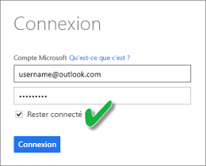

# Actualiser un jeu de données créé à partir d’un fichier CSV sur OneDrive ou SharePoint Online
## Quels sont les avantages ?
Lorsque vous vous connectez à un fichier .csv sur OneDrive ou SharePoint Online, un jeu de données est créé dans Power BI. Les données du fichier .csv sont alors importées dans le jeu de données dans Power BI. Power BI se connecte ensuite automatiquement au fichier et actualise toutes les modifications à l’aide du jeu de données dans Power BI. Si vous modifiez le fichier .csv dans OneDrive ou SharePoint Online, quand vous enregistrez, ces modifications apparaissent dans Power BI, généralement après environ une heure. Les visualisations dans Power BI basées sur le jeu de données sont également mises à jour automatiquement.

Si vos fichiers figurent dans un dossier partagé sur OneDrive Entreprise ou SharePoint Online, d’autres utilisateurs peuvent travailler sur le même fichier. Une fois enregistrées, toutes les modifications apportées sont automatiquement mises à jour dans Power BI, généralement dans l’heure.

De nombreuses organisations exécutent des processus qui interrogent automatiquement des bases de données pour trouver des données qui sont ensuite enregistrées dans un fichier .csv quotidiennement. Si le fichier est stocké sur OneDrive ou SharePoint Online, et remplacé quotidiennement, par opposition à un nouveau fichier créé chaque jour sous un nom différent, vous pouvez vous connecter à ce fichier dans Power BI. Votre jeu de données qui se connecte au fichier est synchronisé peu après la mise à jour du fichier sur OneDrive ou SharePoint Online. Les visualisations basées sur le jeu de données sont également mises à jour automatiquement.

## Qu’est-ce qui est pris en charge ?
Les fichiers de valeurs séparées par des virgules étant de simples fichiers texte, les connexions à des sources de données et des rapports externes ne sont pas prises en charge. Vous ne pouvez pas planifier l’actualisation d’un jeu de données créé à partir d’un fichier de valeurs séparées par des virgules. Toutefois, quand le fichier est sur OneDrive ou SharePoint Online, Power BI synchronise automatiquement toutes les modifications apportées au fichier avec le jeu de données toutes les heures.

## OneDrive ou OneDrive Entreprise. Quelle est la différence ?
Si vous avez un compte OneDrive personnel et OneDrive Entreprise, il est recommandé de conserver sur OneDrive Entreprise tous les fichiers auxquels vous souhaitez vous connecter dans Power BI. Voici pourquoi : vous utilisez probablement deux comptes différents pour vous connecter à ces OneDrive.

La connexion à OneDrive Entreprise dans Power BI est généralement transparente, car le compte que vous utilisez pour vous connecter à Power BI est souvent le même que celui que vous utilisez pour vous connecter à OneDrive Entreprise. En revanche, avec un OneDrive personnel, il est probable que vous vous connectiez avec un autre [compte Microsoft](https://account.microsoft.com).

Lorsque vous vous connectez à votre compte Microsoft, veillez à activer l’option Maintenir la connexion. Power BI peut ensuite synchroniser les mises à jour avec des jeux de données dans Power BI

Si vous apportez à votre fichier .csv des modifications qui ne peuvent pas être synchronisées avec le jeu de données dans Power BI parce que les informations d’identification de votre compte Microsoft pourraient avoir changé, vous devez vous connecter au fichier et l’importer à nouveau à partir de votre OneDrive personnel.

## Quand des problèmes apparaissent
Si des données du fichier .csv sur OneDrive changent et si ces modifications ne sont pas reflétées dans Power BI, la cause la plus probable est que Power BI ne peut pas se connecter à votre OneDrive. Essayez de vous connecter au fichier, puis de l’importer à nouveau. Si vous êtes invité à vous connecter, veillez à activer l’option **Maintenir la connexion**.

## Étapes suivantes
[Outils de résolution des problèmes liés à l’actualisation](service-gateway-onprem-tshoot.md)
[Scénarios de résolution de problèmes liés à l’actualisation](refresh-troubleshooting-refresh-scenarios.md)

D’autres questions ? [Essayez d’interroger la communauté Power BI](https://community.powerbi.com/)

