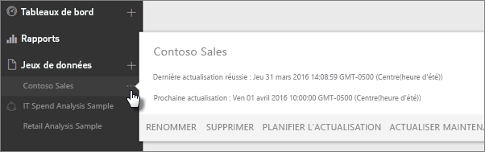
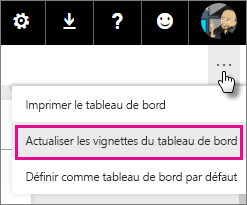
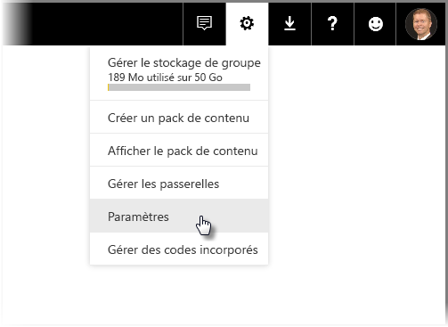
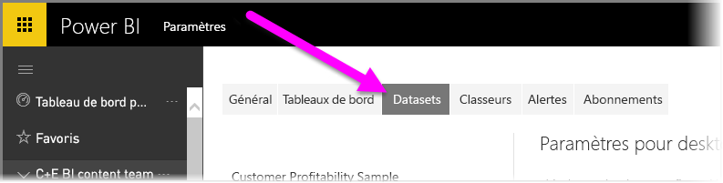
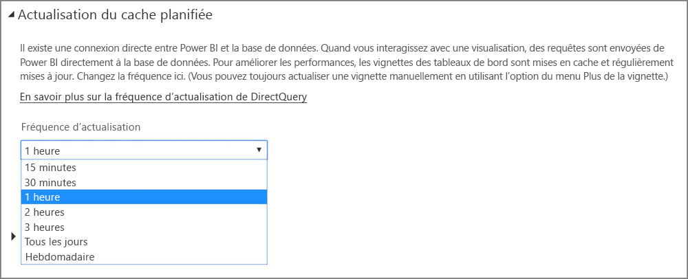

# Actualisation des données dans Power BI
L’obtention des données les plus récentes constitue souvent un facteur essentiel à la prise de décisions informées. Vous avez sans doute déjà utilisé la fonctionnalité Obtenir des données de Power BI pour vous connecter à des données et les charger, voire générer des rapports et un tableau de bord. Avant d’aller plus loin, vous devez vous assurer que les données que vous utilisez sont vraiment les plus récentes.

Dans de nombreux cas, aucune intervention de votre part n’est requise. Certaines données, comme celles provenant d’un pack de contenu Salesforce ou Marketo, sont automatiquement actualisées pour vous. Si votre connexion utilise une connexion active ou DirectQuery, les données sont actualisées à la date du jour. Mais dans d’autres cas, par exemple lors de l’utilisation d’un classeur Excel ou d’un fichier Power BI Desktop qui se connecte à une source de données locale ou en ligne externe, vous devez actualiser manuellement les données ou configurer une planification d’actualisation pour que Power BI puisse actualiser les données dans vos rapports et tableaux de bord.

Cet article fait partie d’une série destinée à vous aider à comprendre le fonctionnement de l’actualisation des données dans Power BI, la nécessité ou non de configurer une planification d’actualisation, ainsi que les éléments à mettre en œuvre pour actualiser correctement vos données.

## Présentation de l’actualisation des données
Avant de configurer l’actualisation, il est important que vous déterminiez la nature des données à actualiser et leur provenance.

Les données que vous explorez dans vos rapports et tableaux de bord proviennent d’une *source de données*. Par exemple, un service en ligne comme Google Analytics ou QuickBooks, une base de données dans le cloud comme Azure SQL Database ou une base de données ou un fichier sur un ordinateur ou serveur local dans votre propre organisation. Un service en ligne tel que Google Analytics ou QuickBooks, une base de données dans le cloud comme Azure SQL Database, ou encore une base de données ou un fichier sur un ordinateur local ou un serveur de votre organisation sont des exemples de sources de données. Le type de source de données détermine la façon dont les données sont actualisées. La section « Quelles sont les données qui peuvent être actualisées ? [, un peu plus loin dans cet article, aborde l’actualisation de chaque type de source de données](#what-can-be-refreshed).

Un *jeu de données* est automatiquement créé dans Power BI quand vous utilisez la fonctionnalité Obtenir des données pour vous connecter à des données et les charger à partir d’un pack de contenu ou d’un fichier, ou quand vous vous connectez à une source de données active. Dans Power BI Desktop et Excel 2016, vous pouvez également publier votre fichier directement sur le service Power BI, ce qui revient au même que d’utiliser la fonctionnalité Obtenir des données.

Dans les deux cas, un jeu de données est créé, qui apparaît dans les conteneurs Mon espace de travail, ou Groupe, dans le service Power BI. Quand vous sélectionnez les **points de suspension (...)** pour un jeu de données, vous pouvez explorer les données dans un rapport, modifier les paramètres et configurer l’actualisation.

Les données d’un jeu de données peuvent provenir d’une ou plusieurs sources. Par exemple, vous pouvez utiliser Power BI Desktop pour obtenir des données d’une base de données SQL Database de votre organisation et d’autres données d’un flux OData en ligne. Quand vous publiez le fichier dans Power BI, un seul jeu de données est créé, mais celui-ci possède deux sources de données : SQL Database et le flux OData.

Un jeu de données contient des informations sur les sources de données, les informations d’identification associées et, dans la plupart des cas, un sous-ensemble de données copié à partir de la source de données. Quand vous créez des visualisations dans des rapports et des tableaux de bord, les données qui vous sont présentées proviennent du jeu de données. Dans le cas d’une connexion active comme Azure SQL Database, le jeu de données définit les données affichées à partir de la source de données. Pour une connexion active à Analysis Services, la définition du jeu de données provient directement d’Analysis Services.

> *Lorsque vous actualisez des données, vous les mettez à jour à partir de votre source de données dans le jeu de données stocké dans Power BI. Cette actualisation est complète et non incrémentielle.*
> 
> 

Chaque fois que vous actualisez des données dans un jeu de données, que ce soit en recourant à la fonctionnalité Actualiser maintenant ou en configurant une planification d’actualisation, Power BI utilise les informations contenues dans le jeu de données pour se connecter aux sources de données définies et lancer une requête sur les données mises à jour qu’il charge ensuite dans le jeu de données. Toute visualisation dans vos rapports ou tableaux de bord qui est basée sur les données est automatiquement mise à jour.

Avant d’aller plus loin, il est très important de comprendre autre chose :

> *Quelle que soit la fréquence à laquelle vous actualisez le jeu de données, ou celle à laquelle vous examinez des données actives, ce sont les données de la source de données qui doivent être mises à jour en priorité.*
> 
> 

La plupart des organisations traitent leurs données une fois par jour, en général le soir. Si vous planifiez l’actualisation d’un jeu de données créé à partir d’un fichier Power BI Desktop qui se connecte à une base de données locale et que votre service informatique effectue le traitement de cette base de données SQL chaque soir, il vous suffit de planifier l’actualisation une fois par jour. Par exemple, vous pouvez la planifier après le traitement de la base de données et avant votre arrivée au bureau. Bien entendu, ce n’est pas toujours le possible. Power BI vous permet de vous connecter aux sources de données mises à jour fréquemment ou en temps réel de plusieurs façons.

## Types d’actualisations
Quatre types principaux d’actualisations se produisent dans Power BI. Il s’agit de l’actualisation du package, de l’actualisation du modèle/des données, de l’actualisation des vignettes et de l’actualisation du conteneur visuel.

### Actualisation du package
Cette opération synchronise votre fichier Power BI Desktop ou Excel, entre le service Power BI et OneDrive ou SharePoint Online. Elle n’extrait pas les données de la source de données d’origine. Le jeu de données dans Power BI est uniquement mis à jour avec le contenu du fichier dans OneDrive ou SharePoint Online.

### Actualisation du modèle/des données
Il s’agit de l’actualisation du jeu de données, au sein du service Power BI, avec les données de la source de données d’origine. Cette opération est effectuée à l’aide des fonctionnalités Planifier l’actualisation ou Actualiser maintenant. Elle requiert une passerelle pour les sources de données locales.

### Actualisation des vignettes
Cette opération met à jour le cache des visuels de vignettes sur le tableau de bord suite à un changement de données. Elle se produit toutes les quinze minutes. Vous pouvez également forcer une actualisation des vignettes en sélectionnant les **points de suspension (...)** dans l’angle supérieur droit d’un tableau de bord, puis l’option **Actualiser les vignettes du tableau de bord**.

Pour plus d’informations sur les erreurs courantes d’actualisation des vignettes, consultez [Résolution des erreurs de vignette](refresh-troubleshooting-tile-errors.md).

### Actualisation du conteneur visuel
Cette opération met à jour les visuels de rapport mis en cache, à l’intérieur d’un rapport, suite à un changement de données.

## Quelles sont les données qui peuvent être actualisées ?
Dans Power BI, vous utilisez généralement la fonctionnalité Obtenir des données pour importer les données d’un fichier situé sur un lecteur local, OneDrive ou SharePoint Online, publier un rapport à partir de Power BI Desktop, ou vous connecter directement à une base de données dans le cloud de votre organisation. Bien que vous puissiez actualiser pratiquement n’importe quel type de données dans Power BI, la nécessité ou non de les actualiser dépend de la manière dont votre jeu de données a été créé, et des sources de données auxquelles il se connecte. Nous allons examiner comment les données sont actualisées dans chaque cas de figure.

Mais avant toute chose, voici quelques définitions importantes à retenir :

**Actualisation automatique**  : cela signifie qu’aucune configuration n’est requise de la part de l’utilisateur pour actualiser régulièrement le groupe de données. Power BI configure pour vous les paramètres d’actualisation des données. Pour les fournisseurs de service en ligne, les données sont actualisées généralement une fois par jour. Pour les fichiers chargés à partir de OneDrive, les données qui ne proviennent pas d’une source de données externe sont actualisées automatiquement environ toutes les heures. Bien que vous puissiez configurer différents paramètres de planification d’actualisation et procéder manuellement à l’actualisation, cela n’est probablement pas nécessaire.

**Actualisation manuelle ou planifiée configurée par l’utilisateur** : cela signifie que vous pouvez soit actualiser manuellement un jeu de données à l’aide de la fonctionnalité Actualiser maintenant, soit configurer une planification d’actualisation à l’aide de l’option Planifier l’actualisation dans les paramètres d’un jeu de données. Ce type d’actualisation est nécessaire pour les fichiers Power BI Desktop et les classeurs Excel qui se connectent à des sources de données locales et en ligne externes.

> [!NOTE]
> Lorsque vous configurez une heure d’actualisation planifiée, un délai pouvant atteindre une heure peut s’écouler avant le début de l’opération.
> 
> 

**Active/DirectQuery** : cela signifie qu’une connexion active est établie entre Power BI et la source de données. Pour des sources de données locales, les administrateurs doivent avoir une source de données configurée à l’intérieur d’une passerelle d’entreprise, mais une interaction de l’utilisateur n’est pas forcément nécessaire.

> [!NOTE]
> Pour améliorer les performances, les tableaux de bord avec des données connectées utilisant DirectQuery sont automatiquement mis à jour. Vous pouvez également actualiser manuellement une vignette à tout moment à l’aide du menu **Plus** sur la vignette.
> 
> 

## Fichiers locaux et fichiers sur OneDrive ou SharePoint Online
L’actualisation des données est prise en charge pour les fichiers Power BI Desktop et les classeurs Excel qui se connectent à des sources de données locales ou en ligne externes. Cette opération actualise uniquement les données du jeu de données au sein du service Power BI. Elle ne met pas à jour votre fichier local.

La possibilité de conserver vos fichiers sur OneDrive ou SharePoint Online, ainsi que de vous y connecter à partir de Power BI, offre une grande flexibilité. Le revers de la médaille, c’est que ce type d’actualisation est l’un des plus complexes. L’actualisation planifiée de fichiers stockés sur OneDrive ou SharePoint Online diffèrent de l’actualisation de package. Pour plus d’informations, consultez la section [Types d’actualisations](#types-of-refresh).

### Aide sur Power BI Desktop
| **Source de données** | **Actualisation automatique** | **Actualisation manuelle ou planifiée configurée par l’utilisateur** | **Passerelle obligatoire** |
| --- | --- | --- | --- |
| La fonctionnalité Obtenir des données (située sur le ruban) permet de se connecter aux données de n’importe quelle source de données en ligne répertoriée et de les interroger. |Non |Oui |Non (voir ci-dessous) |
| La fonctionnalité Obtenir des données permet de se connecter à une base de données Analysis Services active, et de l’explorer. |Oui |Non |Oui |
| La fonctionnalité Obtenir des données permet de se connecter à une source de données DirectQuery locale prise en charge, et de l’explorer. |Oui |Non |Oui |
| La fonctionnalité Obtenir des données permet de se connecter aux données provenant de sources Azure SQL Database, Azure SQL Data Warehouse et Azure HDInsight Spark, et de les interroger. |Oui |Oui |Non |
| La fonctionnalité Obtenir des données permet de se connecter aux données de toute source de données locale répertoriée, à l’exception de HDFS (Hadoop Distributed File System) et de Microsoft Exchange, et de les interroger. |Non |Oui |Oui |

> [!NOTE]
> Si vous utilisez la fonction [**Web.Page**](https://msdn.microsoft.com/library/mt260924.aspx), vous avez besoin d’une passerelle si vous avez republié le jeu de données ou votre rapport après le 18 novembre 2016.
> 
> 

Pour plus de détails, consultez [Actualiser un jeu de données créé à partir d’un fichier Power BI Desktop sur OneDrive](refresh-desktop-file-onedrive.md).

### Classeur Excel
| **Source de données** | **Actualisation automatique** | **Actualisation manuelle ou planifiée configurée par l’utilisateur** | **Passerelle obligatoire** |
| --- | --- | --- | --- |
| Les tables de données d’une feuille de calcul ne sont pas chargées dans le modèle de données Excel. |Oui, toutes les heures *(OneDrive/SharePoint Online uniquement)* |Manuel uniquement *(OneDrive/SharePoint Online uniquement)* |Non |
| Les tables de données d’une feuille de calcul sont liées à une table dans le modèle de données Excel (tables liées). |Oui, toutes les heures *(OneDrive/SharePoint Online uniquement)* |Manuel uniquement *(OneDrive/SharePoint Online uniquement)* |Non |
| Power Query* permet de se connecter aux données de n’importe quelle source de données en ligne répertoriée, de les interroger et de les charger dans le modèle de données Excel. |Non |Oui |Non |
| Power Query* permet de se connecter aux données de n’importe quelle source de données locale répertoriée et d’effectuer des requêtes sur ces données, excepté pour HDFS (Hadoop Distributed File System) et Microsoft Exchange, et de charger des données dans le modèle de données Excel. |Non |Oui |Oui |
| Power Pivot permet de se connecter aux données de n’importe quelle source de données en ligne répertoriée, de les interroger et de les charger dans le modèle de données Excel. |Non |Oui |Non |
| Power Pivot permet de se connecter aux données de n’importe quelle source de données locale répertoriée, de les interroger et de les charger dans le modèle de données Excel. |Non |Oui |Oui |

*\*Dans Excel 2016, la fonctionnalité Obtenir et transformer des données désigne Power Query.*

Pour plus d’informations, consultez [Actualiser un jeu de données créé à partir d’un classeur Excel sur OneDrive](refresh-excel-file-onedrive.md).

### Fichier de valeurs séparées par des virgules (.csv) sur OneDrive ou SharePoint Online
| **Source de données** | **Actualisation automatique** | **Actualisation manuelle ou planifiée configurée par l’utilisateur** | **Passerelle obligatoire** |
| --- | --- | --- | --- |
| Valeur séparée par une virgule simple |Oui, toutes les heures |Manuelle uniquement |Non |

Pour plus d’informations, consultez [Actualiser un jeu de données créé à partir d’un fichier de valeurs séparées par des virgules (.csv) sur OneDrive](refresh-csv-file-onedrive.md).

## Packs de contenu
Il existe deux types de packs de contenu dans Power BI :

**Packs de contenu provenant de services en ligne** : comme Adobe Analytics, SalesForce et Dynamics CRM Online. Les jeux de données créés à partir de services en ligne sont actualisés automatiquement une fois par jour. Bien que cela soit probablement inutile, vous pouvez actualiser manuellement le jeu de données ou configurer une planification d’actualisation. Du fait que les services en ligne se trouvent dans le cloud, une passerelle n’est pas obligatoire.

**Packs de contenu d’organisation** : créés et partagés par les utilisateurs de votre organisation. Les consommateurs d’un pack de contenu ne peuvent ni actualiser manuellement les jeux de données ni configurer une planification d’actualisation. Seul le créateur d’un pack de contenu est autorisé à configurer l’actualisation des jeux de données figurant dans le pack de contenu. Les paramètres d’actualisation sont hérités avec le jeu de données.

### Packs de contenu provenant de services en ligne
| **Source de données** | **Actualisation automatique** | **Actualisation manuelle ou planifiée configurée par l’utilisateur** | **Passerelle obligatoire** |
| --- | --- | --- | --- |
| Services en ligne dans Obtenir des données &gt; Services |Oui |Oui |Non |

### Packs de contenu d’organisation
Les capacités d’actualisation d’un jeu de données inclus dans un pack de contenu d’organisation dépendent du jeu de données. Voir les informations ci-dessus concernant les fichiers locaux, OneDrive ou SharePoint Online.

Pour plus d’informations, consultez [Introduction aux packs de contenu d’organisation](service-organizational-content-pack-introduction.md).

## Connexions actives et DirectQuery à des sources de données locales
Avec la passerelle de données locale, vous pouvez émettre des requêtes de Power BI à vos sources de données locales. Quand vous interagissez avec une visualisation, les requêtes sont envoyées directement à la base de données à partir de Power BI. Les données mises à jour sont ensuite retournées, et les visualisations sont mises à jour. En raison de la connexion directe entre Power BI et la base de données, toute actualisation planifiée est inutile.

Lors de la connexion à une source de données SSAS (SQL Service Analysis Services) à l’aide d’une connexion active, contrairement à DirectQuery, la connexion active à une source SSAS peut s’exécuter sur le cache, même lors du chargement d’un rapport. Ce comportement améliore les performances de chargement du rapport. Vous pouvez demander les données les plus récentes à partir de la source de données SSAS à l’aide du bouton **Actualiser**. Les propriétaires de sources de données SSAS peuvent configurer la fréquence d’actualisation planifiée du cache pour le jeu de données afin de s’assurer que les rapports sont à jour comme attendu. 

Quand il s’agit de configurer une source de données avec la passerelle de données locale, vous pouvez utiliser cette source de données comme option d’actualisation planifiée. Cela constitue une alternative à l’utilisation de la passerelle personnelle.

> [!NOTE]
> Si votre jeu de données est configuré pour une connexion active ou DirectQuery, les jeux de données sont actualisés environ toutes les heures ou suite à une interaction avec les données. Vous pouvez ajuster manuellement la *fréquence d’actualisation* à l’aide de l’option *Actualisation du cache planifiée* dans le Service Power BI.
> 
> 

| **Source de données** | **Active/DirectQuery** | **Actualisation manuelle ou planifiée configurée par l’utilisateur** | **Passerelle obligatoire** |
| --- | --- | --- | --- |
| Analysis Services (tabulaire) |Oui |Oui |Oui |
| Analysis Services (multidimensionnelle) |Oui |Oui |Oui |
| SQL Server |Oui |Oui |Oui |
| SAP HANA |Oui |Oui |Oui |
| Oracle |Oui |Oui |Oui |
| Teradata |Oui |Oui |Oui |

Pour plus d’informations, consultez [Passerelle de données locale](service-gateway-onprem.md).

## Bases de données dans le cloud
Avec DirectQuery, une connexion active est établie entre Power BI et la base de données dans le cloud. Quand vous interagissez avec une visualisation, les requêtes sont envoyées directement à la base de données à partir de Power BI. Les données mises à jour sont ensuite retournées, et les visualisations sont mises à jour. Par ailleurs, étant donné que le service Power BI et la source de données se trouvent dans le cloud, il est inutile de recourir à Personal Gateway.

Si une visualisation n’offre aucune possibilité d’interaction de l’utilisateur, les données sont actualisées automatiquement toutes les heures. Vous pouvez modifier cette fréquence d’actualisation à l’aide de l’option *Actualisation du cache planifiée*.

Pour définir la fréquence, sélectionnez l’icône d’**engrenage** dans l’angle supérieur droit du Service Power BI, puis sélectionnez **Paramètres**.

La page **Paramètres** s’affiche, dans laquelle vous pouvez sélectionner le jeu de données pour lequel vous souhaitez définir la fréquence d’actualisation. Dans cette page, sélectionnez l’onglet **Jeux de données** en haut.

Sélectionnez le jeu de données. Le volet droit affiche une collection d’options pour ce jeu de données. Pour la connexion DirectQuery/active, vous pouvez modifier la fréquence d’actualisation de 15 minutes en hebdomadaire, via le menu déroulant associé, comme illustré dans l’image suivante.

| **Source de données** | **Active/DirectQuery** | **Actualisation manuelle ou planifiée configurée par l’utilisateur** | **Passerelle obligatoire** |
| --- | --- | --- | --- |
| Azure SQL Data Warehouse |Oui |Oui |Non |
| Spark sur HDInsight |Oui |Oui |Non |

Pour en savoir plus, consultez [Azure et Power BI](service-azure-and-power-bi.md).

## Tableaux de bord en temps réel
Les tableaux de bord en temps réel font appel à l’API REST Microsoft Power BI ou à Microsoft Stream Analytics pour vérifier que les données sont à jour. Dans la mesure où les tableaux de bord en temps réel n’obligent pas les utilisateurs à configurer l’actualisation, ils n’entrent pas le cadre de cet article.

| **Source de données** | **Automatique** | **Actualisation manuelle ou planifiée configurée par l’utilisateur** | **Passerelle obligatoire** |
| --- | --- | --- | --- |
| Applications personnalisées développées avec l’API REST de Power BI ou Microsoft Stream Analytics |Oui, diffusion en continu |Non |Non |

Pour plus d’informations, consultez [Créer un tableau de bord en temps réel dans Power BI](https://msdn.microsoft.com/library/mt267603.aspx).

## Configurer une actualisation planifiée
Pour plus d’informations sur la configuration d’une actualisation planifiée, consultez [Configurer une actualisation planifiée](refresh-scheduled-refresh.md)

## Scénarios courants d’actualisation des données
Bien souvent, le meilleur moyen de se familiariser avec l’actualisation des données dans Power BI consiste à étudier des exemples. Voici quelques-uns des scénarios d’actualisation des données les plus courants :

### Classeur Excel avec des tables de données
Vous disposez d’un classeur Excel contenant plusieurs tables de données, mais aucune d’entre elles n’est chargée dans le modèle de données Excel. Vous utilisez la fonctionnalité Obtenir des données pour charger le fichier de classeur de votre disque local dans Power BI, puis vous créez un tableau de bord. Après avoir modifié quelques tables du classeur sur votre disque local, vous souhaitez mettre à jour votre tableau de bord dans Power BI avec les nouvelles données.

Malheureusement, ce scénario ne prend pas en charge l’actualisation. Pour actualiser le jeu de données de votre tableau de bord, vous devez charger à nouveau le classeur. Il existe cependant une solution brillante qui consiste à placer votre fichier de classeur sur OneDrive ou SharePoint Online.

Quand vous vous connectez à un fichier sur OneDrive ou SharePoint Online, vos rapports et tableaux de bord affichent les données telles qu’elles apparaissent dans le fichier (dans le cas présent, un classeur Excel). Toutes les heures, Power BI examine automatiquement le fichier pour voir s’il a été mis à jour. Ainsi, si vous modifiez le classeur (stocké dans OneDrive ou SharePoint Online), les modifications sont reflétées dans votre tableau de bord et vos rapports dans l’heure qui suit. Il n’est en aucune façon nécessaire de configurer l’actualisation. Toutefois, si vous souhaitez examiner immédiatement vos mises à jour dans Power BI, vous pouvez actualiser manuellement le jeu de données à l’aide de la fonctionnalité Actualiser maintenant.

Pour en savoir plus, consultez [Données Excel dans Power BI](service-excel-workbook-files.md) ou [Actualiser un jeu de données créé à partir d’un classeur Excel sur OneDrive](refresh-excel-file-onedrive.md).

### Classeur Excel se connectant à une base de données SQL dans votre entreprise
Admettons que vous possédiez un classeur Excel nommé SalesReport.xlsx sur votre ordinateur local. Vous utilisez Power Query dans Excel pour vous connecter à une base de données SQL située sur un serveur de votre entreprise et lancer une requête sur les données de ventes pour les charger dans le modèle de données. Chaque matin, vous ouvrez le classeur et appuyez sur Actualiser pour mettre à jour vos tableaux croisés dynamiques.

Vous souhaitez à présent explorer vos données de ventes dans Power BI. Pour cela, vous utilisez la fonctionnalité Obtenir des données pour vous connecter au classeur SalesReport.xlsx sur votre disque local et le charger.

Dans cet exemple, vous pouvez actualiser manuellement les données dans le jeu de données SalesReport.xlsx ou configurer une planification d’actualisation. Étant donné que les données proviennent réellement de la base de données SQL de votre entreprise, vous devez télécharger et installer une passerelle. Une fois la passerelle installée et configurée, vous devez accéder aux paramètres du jeu de données SalesReport et vous connecter à la source de données (il vous suffit de le faire une fois). Vous pouvez ensuite configurer une planification d’actualisation pour que Power BI se connecte automatiquement à la base de données SQL et obtienne les données mises à jour. Vos rapports et tableaux de bord sont également mis à jour automatiquement.

> [!NOTE]
> Cela a uniquement pour effet de mettre à jour les données du jeu de données dans le service Power BI. Votre fichier local n’est pas mis à jour dans le cadre de l’actualisation.
> 
> 

Pour plus d’informations, consultez [Données Excel dans Power BI](service-excel-workbook-files.md), [Power BI Gateway - Personal](personal-gateway.md), [Passerelle de données locale](service-gateway-onprem.md) et [Actualiser un jeu de données créé à partir d’un classeur Excel sur un lecteur local](refresh-excel-file-local-drive.md).

### Fichier Power BI Desktop contenant des données provenant d’un flux OData
Ici, vous utilisez la fonctionnalité Obtenir des données de Power BI Desktop pour vous connecter aux données de recensement d’un flux OData et les importer.  Vous créez plusieurs rapports dans Power BI Desktop, vous nommez le fichier WACensus, puis vous enregistrez ce fichier sur un partage de votre entreprise. Vous publiez ensuite le fichier sur le service Power BI.

Dans ce cas, vous pouvez actualiser manuellement les données dans le jeu de données WACensus ou configurer une planification d’actualisation. Étant donné que les données de la source de données proviennent d’un flux OData en ligne, il est inutile d’installer une passerelle. Toutefois, vous devez accéder aux paramètres du jeu de données WACensus et vous connecter à la source de données OData. Vous pouvez ensuite configurer une planification d’actualisation pour que Power BI se connecte automatiquement au flux OData et obtienne les données mises à jour. Vos rapports et tableaux de bord sont également mis à jour automatiquement.

Pour plus d’informations, consultez [Publier à partir de Power BI Desktop](desktop-upload-desktop-files.md), [Actualiser un jeu de données créé à partir d’un fichier Power BI Desktop sur un lecteur local](refresh-desktop-file-local-drive.md) et [Actualiser un jeu de données créé à partir d’un fichier Power BI Desktop sur OneDrive](refresh-desktop-file-onedrive.md).

### Pack de contenu partagé provenant d’un autre utilisateur de votre organisation
Vous êtes connecté à un pack de contenu d’organisation. Celui-ci comprend un tableau de bord, plusieurs rapports et un jeu de données.

Dans ce scénario, vous ne pouvez pas configurer l’actualisation du jeu de données. C’est à l’analyste de données qui a créé le pack de contenu qu’appartient la responsabilité d’actualiser le jeu de données, en fonction des sources de données utilisées.

Si vos tableaux de bord et rapports du pack de contenu ne se mettent pas à jour, contactez l’analyste de données qui a créé le pack de contenu.

Pour plus d’informations, consultez [Introduction aux packs de contenu d’organisation](service-organizational-content-pack-introduction.md) et [Utilisation de packs de contenu d’organisation](service-organizational-content-pack-copy-refresh-access.md).

### Pack de contenu provenant d’un fournisseur de services en ligne tel que Salesforce
Dans Power BI, vous avez utilisé l’option Obtenir des données pour vous connecter à vos données à partir d’un fournisseur de services en ligne tel que Salesforce, ainsi que pour les importer. Dans ce cas, il n’y a pas grand-chose à faire. Votre jeu de données Salesforce est actualisé automatiquement une fois par jour. 

Comme la plupart des fournisseurs de services en ligne, Salesforce met à jour les données une fois par jour (en général la nuit). Vous pouvez actualiser manuellement votre jeu de données Salesforce ou configurer une planification d’actualisation. Cela n’est cependant pas nécessaire, car Power BI actualise automatiquement le jeu de données, ce qui entraîne la mise à jour de vos rapports et tableaux de bord.

Pour plus d’informations, consultez [Pack de contenu Salesforce pour Power BI](service-connect-to-salesforce.md).

## Résolution des problèmes
Quand des problèmes apparaissent, ceux-ci sont souvent dus au fait que Power BI ne parvient pas à se connecter aux sources de données ou que le jeu de données se connecte à une source de données locale alors que la passerelle est hors connexion. Veuillez donc vous assurer que Power BI peut se connecter aux sources de données. Si vous modifiez le mot de passe que vous utilisez pour vous connecter à une source de données ou que Power BI est déconnecté d’une source de données, essayez de vous reconnecter à vos sources de données dans Informations d’identification de la source de données.

Pour plus d’informations sur la résolution des problèmes, consultez [Outils de résolution des problèmes d’actualisation](service-gateway-onprem-tshoot.md) et [Résolution des problèmes liés aux scénarios d’actualisation](refresh-troubleshooting-refresh-scenarios.md).

## Étapes suivantes
[Outils de résolution des problèmes liés à l’actualisation](service-gateway-onprem-tshoot.md)  
[Scénarios de résolution de problèmes liés à l’actualisation](refresh-troubleshooting-refresh-scenarios.md)  
[Power BI Gateway - Personal](personal-gateway.md)  
[Passerelle de données locale](service-gateway-onprem.md)  

D’autres questions ? [Essayez d’interroger la communauté Power BI](http://community.powerbi.com/)

